# 📚 02. Pruning

Lecture 2는 **Pruning (Part I)**, 즉 “신경망에서 필요 없는 weight나 neuron을 잘라서 모델을 작고 빠르게 만드는 방법”을 배우는 강의야. 핵심 목표는 **pruning의 개념**, **어떤 단위로 자를지**, **무엇을 기준으로 자를지**를 이해하는 거야. Lecture 2의 overview에서도 pruning을 통해 storage와 computation 요구량을 줄이고, fine-grained / pattern-based / channel-level pruning, magnitude-based / scaling-based pruning을 배운다고 정리돼 있어. 

---

## 2-1. Pruning이 왜 필요한가?

딥러닝 모델은 parameter가 많아.
parameter가 많으면 메모리를 많이 쓰고, 연산량도 많아져.

그런데 Lecture 2에서 강조하는 중요한 점은:

> 연산 자체보다 메모리 접근이 더 비쌀 수 있다.

즉 GPU나 CPU가 계산하는 것도 비용이지만, weight를 메모리에서 가져오는 것도 큰 비용이야.
그래서 weight 수를 줄이면 메모리 사용량도 줄고, 잘 구현되면 계산도 빨라질 수 있어.

Pruning은 이런 생각에서 출발해.

> “모델 안에 사실상 별로 중요하지 않은 weight나 neuron이 있지 않을까? 그걸 없애도 성능이 유지되지 않을까?”

---

## 2-2. Pruning의 기본 개념

Pruning은 신경망을 작게 만드는 방법이야.

쉽게 말하면:

> 학습된 neural network에서 중요하지 않은 연결이나 neuron을 제거하는 것

이야.

예를 들어 fully connected layer에서 모든 neuron이 서로 연결되어 있다면, pruning 후에는 일부 connection이 사라져서 sparse한 구조가 돼.

슬라이드에서는 pruning을 두 가지 관점으로 보여줘.

1. **Synapse pruning**
   weight connection을 제거하는 것
   즉, 특정 weight를 0으로 만드는 것

2. **Neuron pruning**
   neuron 자체를 제거하는 것
   해당 neuron과 연결된 weight들이 통째로 사라짐

---

## 3. Pruning 후에는 보통 fine-tuning을 한다

Pruning을 하면 당연히 모델 일부를 잘라냈으니까 성능이 떨어질 수 있어.

그래서 일반적인 흐름은:

$
\text{Train} \rightarrow \text{Prune} \rightarrow \text{Fine-tune}
$

이야.

처음에는 full model을 학습하고, 그다음 중요하지 않은 weight를 자르고, 마지막으로 남은 weight들을 다시 조금 학습해서 accuracy를 회복시키는 방식이야.

너가 과제에서 했던 pruning도 이 흐름이랑 거의 같아.
먼저 original model이 있고, weight 중요도를 기준으로 mask를 만들고, pruning 후 다시 몇 epoch fine-tuning해서 성능을 회복시키는 식이었지.

---

## 2-3. Pruning problem formulation

Pruning을 수식으로 보면 이런 문제야.

$
\min_{W_p} L(x; W_p)
$

subject to

$
|W_p|_0 \leq N
$

여기서:

* $W$: 원래 weight
* $W_p$: pruning된 weight
* $L$: loss function
* $|W_p|_0$: 0이 아닌 weight 개수
* $N$: 남기고 싶은 weight 개수

즉 의미는 이거야.

> weight 개수를 $N$개 이하로 제한하면서, loss가 최대한 작아지도록 pruning된 weight를 찾자.

쉽게 말해서:

> “적은 weight만 남기고도 성능이 좋은 모델을 찾자.”

---

## 2-4. Pruning에서 결정해야 하는 것들

Lecture 2에서는 pruning을 할 때 크게 세 가지를 결정해야 한다고 보면 돼.

첫째, **Pruning granularity**
어떤 단위로 자를 것인가?

둘째, **Pruning criterion**
무엇을 기준으로 자를 것인가?

셋째, **Pruning ratio**
얼마나 자를 것인가?

Lecture 2에서는 주로 앞의 두 개, 즉 **granularity**와 **criterion**을 다뤄.

---

## 2-5. Pruning Granularity: 어떤 단위로 자를 것인가?

Pruning granularity는 “weight를 어떤 모양으로 제거할 것인가?”야.

대표적으로 세 가지가 나와.

### 2-5-1. Fine-grained / Unstructured pruning

가장 자유롭게 weight 하나하나를 보고 자르는 방식이야.

예를 들어 weight matrix가 이렇게 있다고 하면:

$
W =
\begin{bmatrix}
0.2 & -0.01 & 1.4 \\
0.03 & 0.8 & -0.02 \\
1.1 & 0.04 & -0.7
\end{bmatrix}
$

작은 weight들을 0으로 만들어서:

$
W_p =
\begin{bmatrix}
0.2 & 0 & 1.4 \\
0 & 0.8 & 0 \\
1.1 & 0 & -0.7
\end{bmatrix}
$

이런 식으로 만드는 거야.

장점은 **성능을 잘 유지하면서 많이 자를 수 있다**는 거야.
왜냐하면 weight 하나하나를 매우 세밀하게 골라서 제거하니까.

단점은 **실제로 빨라지기 어렵다**는 거야.

왜냐하면 weight가 불규칙하게 듬성듬성 남아 있어서 hardware가 효율적으로 계산하기 어렵거든.
이걸 **unstructured sparsity**라고 해.

과제에서 global pruning으로 weight를 0으로 만드는 방식은 대부분 이쪽에 가까워.

---

### 2-5-2. Pattern-based pruning

Fine-grained pruning은 너무 불규칙해서 hardware acceleration이 어렵다.
그래서 어느 정도 정해진 pattern 안에서만 pruning하는 방식이 나와.

예를 들어 3×3 convolution kernel에서 아무 weight나 자르는 게 아니라, 미리 정해진 몇 가지 sparse pattern 중 하나를 선택하는 식이야.

장점은 fine-grained보다 구조가 있어서 hardware가 조금 더 다루기 쉽다는 점이야.
단점은 완전히 자유롭게 자르는 것보다는 pruning 선택지가 줄어든다는 거야.

즉 중간 형태야.

> Fine-grained보다 규칙적이고, channel pruning보다는 세밀하다.

---

### 2-5-3. Channel-level pruning

Channel-level pruning은 아예 channel 단위로 제거하는 방식이야.

CNN에서 feature map이 여러 channel을 갖잖아.

예를 들어 어떤 layer의 출력이:

$
C \times H \times W
$

형태라면, 여기서 특정 channel 전체를 제거하는 거야.

예를 들어 64개의 output channel이 있으면 그중 20개를 제거해서 44개만 남기는 식이야.

장점은 **실제로 속도 향상이 잘 된다**는 거야.
왜냐하면 channel 자체가 줄어들면 다음 layer의 입력 channel 수도 줄어들고, matrix/tensor 크기가 실제로 작아지기 때문이야.

단점은 **성능 손실이 더 클 수 있다**는 거야.
weight 하나만 제거하는 게 아니라 channel 전체를 날리니까 정보 손실이 더 크지.

정리하면:

| 방식            | 자르는 단위             | 장점                          | 단점             |
| ------------- | ------------------ | --------------------------- | -------------- |
| Fine-grained  | weight 하나하나        | 성능 유지 좋음, sparsity 높게 가능    | 실제 가속 어려움      |
| Pattern-based | 정해진 sparse pattern | fine-grained보다 hardware 친화적 | 자유도 제한         |
| Channel-level | channel 전체         | 실제 속도 향상 쉬움                 | accuracy 손실 가능 |

---

## 2-6. Pruning Criterion: 무엇을 기준으로 자를 것인가?

이제 “어떤 weight/channel을 자를지”를 정해야 해.

Lecture 2에서는 대표적으로 **magnitude-based pruning**과 **scaling-based pruning**을 다뤄.

---

### 2-6-1. Magnitude-based pruning

가장 직관적인 방법이야.

> 절댓값이 작은 weight는 덜 중요할 것이다.

라고 가정하는 방식이야.

즉 weight (w)에 대해 (|w|)가 작으면 pruning한다.

예를 들어:

$
[0.9,\\ 0.01,\\ -0.8,\\ 0.03,\\ 1.2]
$

이 있으면 $|0.01|$, $|0.03|$ 같은 작은 weight를 제거하는 거야.

왜 이게 말이 되냐면, 어떤 weight가 거의 0에 가깝다면 input에 곱해져도 output에 주는 영향이 작을 가능성이 크기 때문이야.

예를 들어:

$
y = w x
$

에서 $w$가 0.001이면, $x$가 보통 크기일 때 $y$에 미치는 영향이 작겠지.

하지만 한계도 있어.

> weight가 작아도 input activation이 매우 크면 영향이 클 수 있다.

예를 들어:

$
w_1 = 0.01,\quad x_1 = 1000
$

이면

$
w_1x_1 = 10
$

이 돼.
반면

$
w_2 = 1,\quad x_2 = 0.01
$

이면

$
w_2x_2 = 0.01
$

이야.

그러면 weight 크기만 보면 $w_1$이 작아서 잘라야 할 것 같지만, 실제 output 영향은 $w_1x_1$이 훨씬 클 수 있어.

이 한계는 Lecture 4의 Wanda에서도 다시 중요하게 나와.

---

### 2-6-2. Global pruning vs layer-wise pruning

Magnitude-based pruning을 할 때도 threshold를 어떻게 잡느냐에 따라 두 가지 방식이 있어.

### Layer-wise pruning

각 layer마다 따로 threshold를 잡는 방식이야.

예를 들어:

* conv1에서 작은 weight 30% 제거
* conv2에서 작은 weight 30% 제거
* fc에서 작은 weight 30% 제거

이렇게 layer별로 같은 비율을 자를 수 있어.

장점은 각 layer에 최소한 일정 비율의 weight가 남는다는 거야.
단점은 layer마다 중요도가 다른데 똑같이 자르면 비효율적일 수 있어.

### Global pruning

모델 전체 weight를 한 번에 모아서 threshold를 잡는 방식이야.

예를 들어 모델 전체 weight 중 가장 작은 90%를 제거하는 식이야.

장점은 덜 중요한 layer에서 더 많이 자르고, 중요한 layer는 덜 자를 수 있어.
단점은 어떤 layer가 너무 많이 잘릴 위험도 있어.

너가 과제에서 global pruning으로 성능이 잘 나왔던 이유도 이거야.
모든 layer에 똑같은 sparsity를 강제하지 않고, 모델 전체에서 작은 weight를 골랐기 때문에 더 자연스럽게 pruning된 거야.

---

### **2-6-3. Scaling-based pruning**

Scaling-based pruning은 BatchNorm의 scaling factor 같은 값을 이용해서 channel 중요도를 판단하는 방식이야.

BatchNorm에는 보통 $\gamma$라는 scale parameter가 있어.

$
y = \gamma \hat{x} + \beta
$

여기서 $\gamma$가 작으면 해당 channel의 activation이 거의 죽어 있다고 볼 수 있어.

그래서:

> $\gamma$가 작은 channel은 중요도가 낮다.

라고 보고 channel pruning을 할 수 있어.

이 방식은 channel-level pruning과 잘 연결돼.

예를 들어 CNN에서 각 channel마다 BatchNorm scale $\gamma$가 있다면, $|\gamma|$가 작은 channel을 제거하는 식이야.

---

## 2-7. Pruning의 효과와 주의점

Pruning을 잘하면 parameter 수를 크게 줄일 수 있어.
Lecture 2에서는 pruning이 parameter count를 90% 이상 줄일 수 있는 널리 쓰이는 기법이라고 설명해. 

하지만 중요한 점이 있어.

> parameter가 줄었다고 무조건 latency가 줄어드는 것은 아니다.

특히 fine-grained pruning처럼 weight가 불규칙하게 0이 되면, 이론상 FLOPs는 줄어도 실제 hardware에서는 빨라지지 않을 수 있어.

실제 속도 향상을 원하면 channel pruning처럼 구조적으로 줄어드는 방식이 더 유리해.

---

## 2-8. Lecture 2 핵심 정리

Lecture 2를 한 문장으로 정리하면:

> Pruning은 학습된 신경망에서 중요하지 않은 weight나 neuron을 제거해서 모델을 작게 만드는 기법이고, 이때 “어떤 단위로 자를지”와 “무엇을 기준으로 자를지”가 핵심이다.

시험/과제 관점에서 꼭 기억할 건 이거야.

| 개념                      | 핵심                                     |   |                |
| ----------------------- | -------------------------------------- | - | -------------- |
| Pruning                 | 필요 없는 weight/neuron 제거                 |   |                |
| 목적                      | storage 감소, computation 감소             |   |                |
| Fine-grained pruning    | weight 하나하나 제거, sparse하지만 가속 어려움       |   |                |
| Pattern-based pruning   | 정해진 pattern으로 제거                       |   |                |
| Channel-level pruning   | channel 전체 제거, 실제 속도 향상 쉬움             |   |                |
| Magnitude-based pruning | (                                      | w | ) 작은 weight 제거 |
| Scaling-based pruning   | BatchNorm scale (\gamma) 작은 channel 제거 |   |                |
| Fine-tuning             | pruning 후 성능 회복을 위해 재학습                |   |                |

특히 너 과제랑 연결해서 보면, 네가 했던 건 주로 **magnitude-based fine-grained pruning**이고, global threshold를 써서 전체 weight 중 작은 애들을 제거한 방식이라고 보면 돼.

# 📚 03. Pruning (Part II)

Lecture 3는 **Pruning (Part II)**야.
Lecture 2에서 pruning의 기본 개념, granularity, criterion을 배웠다면, Lecture 3에서는 그다음 단계인 **얼마나 자를 것인가**, 그리고 **pruning 후 모델 성능을 어떻게 회복할 것인가**를 다뤄. 강의 목표도 “pruning ratio를 어떻게 선택하고, pruned neural network를 어떻게 fine-tune/train할지 논의하며, Lottery Ticket Hypothesis를 이해하는 것”이라고 되어 있어. 

---

## 03-1. Lecture 3의 핵심 질문

Lecture 2까지는 이런 걸 배웠어.

> 어떤 weight/neuron을 자를까?

즉 pruning criterion 문제였지.

Lecture 3에서는 질문이 바뀌어.

> 각 layer에서 몇 %를 자를까?
> pruning 후 accuracy가 떨어지면 어떻게 복구할까?
> 작은 subnet도 처음부터 잘 학습될 수 있을까?

그래서 Lecture 3의 큰 흐름은 이거야.

$$
\text{Pruning Ratio 결정}
\rightarrow
\text{Fine-tuning / Retraining}
\rightarrow
\text{Lottery Ticket Hypothesis}
$$

---

## 03-2. Pruning 문제 다시 보기

Pruning은 수식으로 보면 다음 문제야.

$$
\min_{W_p} L(x; W_p)
$$

subject to

$$
|W_p|_0 \leq N
$$

여기서 $W_p$는 pruning된 weight이고, $|W_p|_0$는 0이 아닌 weight 개수야.
즉 의미는:

> 남길 weight 개수를 $N$개 이하로 제한하면서 loss가 최소가 되도록 하자.

Lecture 3는 여기서 특히 $N$, 즉 **얼마나 남길 것인가 / 얼마나 자를 것인가**를 고민하는 강의야. 

---

## 03-3. Uniform pruning은 왜 별로인가?

가장 단순한 방법은 모든 layer를 똑같은 비율로 pruning하는 거야.

예를 들어 모든 layer에서 30%씩 자르는 방식.

$$
\text{Layer 1: 30\% pruning}
$$

$$
\text{Layer 2: 30\% pruning}
$$

$$
\text{Layer 3: 30\% pruning}
$$

이걸 **uniform pruning** 또는 **uniform shrinking**이라고 볼 수 있어.

하지만 문제는 layer마다 중요도가 다르다는 거야.

어떤 layer는 많이 잘라도 accuracy가 거의 안 떨어지고, 어떤 layer는 조금만 잘라도 accuracy가 크게 떨어질 수 있어.

그래서 Lecture 3에서는 **non-uniform pruning이 uniform shrinking보다 좋다**고 설명해. 즉 layer마다 pruning ratio를 다르게 주는 게 더 좋다는 뜻이야. 

---

## 03-4. Layer sensitivity analysis

그럼 layer마다 얼마나 자를지 어떻게 정할까?

Lecture 3의 핵심 방법이 **sensitivity analysis**야.

Sensitivity analysis는 말 그대로:

> 각 layer가 pruning에 얼마나 민감한지 실험해보는 것

이야.

방법은 이렇다.

1. 하나의 layer $L_i$를 고른다.
2. 그 layer만 pruning ratio를 바꿔가며 자른다.
3. 나머지 layer는 그대로 둔다.
4. accuracy가 얼마나 떨어지는지 본다.
5. 모든 layer에 대해 반복한다.

예를 들어 어떤 layer에 대해 pruning ratio를 이렇게 바꿔보는 거야.

$$
r \in {0.1, 0.2, 0.3, \dots, 0.9}
$$

그리고 각 ratio에서 accuracy를 측정해.

---

## 03-5. 그래프 해석법

Lecture 3의 VGG-11 / CIFAR-10 예시 그래프를 보면 pruning ratio가 커질수록 accuracy가 떨어지는 곡선이 나와. 그래프에서 x축은 **Pruning Rate**, y축은 **Accuracy**야. 

여기서 중요한 해석은 이거야.

### 덜 민감한 layer

어떤 layer는 pruning rate를 70%, 80%까지 올려도 accuracy가 별로 안 떨어져.

이런 layer는:

> 많이 잘라도 괜찮은 layer

야.

즉 pruning ratio를 크게 줘도 돼.

### 민감한 layer

반대로 어떤 layer는 pruning rate가 조금만 올라가도 accuracy가 급격히 떨어져.

이런 layer는:

> 중요한 layer
> 많이 자르면 안 되는 layer

야.

그래서 pruning ratio를 작게 줘야 해.

---

## 03-6. Target accuracy 기준으로 pruning ratio 정하기

예를 들어 목표 accuracy가 80%라고 해보자.

각 layer별 sensitivity curve를 보고, accuracy가 80% 이상 유지되는 최대 pruning ratio를 고를 수 있어.

예를 들어:

| Layer   | 80% accuracy 유지 가능한 최대 pruning ratio |
| ------- | ------------------------------------ |
| Layer 0 | 50%                                  |
| Layer 1 | 70%                                  |
| Layer 2 | 80%                                  |
| Layer 3 | 90%                                  |

그러면 layer별 pruning ratio를 다르게 설정할 수 있어.

$$
r_0 = 0.5,\quad r_1 = 0.7,\quad r_2 = 0.8,\quad r_3 = 0.9
$$

이게 **non-uniform pruning ratio selection**이야.

---

## 03-7. 그런데 sensitivity analysis의 한계

여기서 중요한 함정이 있어.

Sensitivity analysis는 보통 **한 번에 하나의 layer만 pruning**해서 accuracy drop을 본다.

즉 Layer 1을 실험할 때는 Layer 1만 자르고, 나머지는 그대로 둬.

하지만 실제 pruning에서는 여러 layer를 동시에 자르잖아.

그러면 layer들 사이에 interaction이 생겨.

예를 들어 Layer 1만 70% 잘랐을 때는 괜찮고, Layer 2만 80% 잘랐을 때도 괜찮았는데, 둘을 동시에 자르면 accuracy가 훨씬 더 크게 떨어질 수 있어.

그래서 Lecture 3에서는 이 방식이 완전히 optimal하지 않을 수 있다고 설명해. 이유는 **layer 간 interaction을 고려하지 않기 때문**이야. 

즉 정리하면:

> sensitivity analysis는 좋은 출발점이지만, 실제 최종 accuracy를 정확히 보장하지는 않는다.

그래서 실전에서는 target accuracy를 조금 높게 잡거나, pruning 후 fine-tuning을 반드시 해줘야 해.

---

## 03-8. Pruning 후 fine-tuning이 필요한 이유

Pruning은 weight를 0으로 만들거나 neuron/channel을 제거하는 작업이야.

그러면 모델 입장에서는 갑자기 구조가 바뀐 거야.
당연히 output이 변하고, loss가 증가할 수 있어.

그래서 pruning 후에는 보통 fine-tuning을 해.

흐름은 다음과 같아.

$$
\text{Train dense model}
\rightarrow
\text{Prune}
\rightarrow
\text{Fine-tune remaining weights}
$$

fine-tuning은 pruning으로 망가진 모델을 다시 적응시키는 과정이야.

쉽게 말하면:

> 잘려나간 weight 없이도 남은 weight들이 다시 역할을 나눠 갖게 만드는 과정

이야.

---

## 9. One-shot pruning vs Iterative pruning

Pruning을 한 번에 많이 할 수도 있고, 조금씩 반복해서 할 수도 있어.

### One-shot pruning

한 번에 목표 sparsity까지 자르는 방식이야.

예를 들어 바로 90% pruning.

$$
0% \rightarrow 90%
$$

장점은 빠르다는 거야.
단점은 accuracy가 크게 떨어질 수 있어.

### Iterative pruning

조금씩 자르고 fine-tuning하고, 또 자르고 fine-tuning하는 방식이야.

$$
0\% \rightarrow 30\%
\rightarrow \text{fine-tune}
\rightarrow 50\%
\rightarrow \text{fine-tune}
\rightarrow 70\%
\rightarrow \text{fine-tune}
$$

이 방식은 시간이 오래 걸리지만 성능을 더 잘 유지할 수 있어.

---

## 03-9. Fine-tuning할 때 중요한 점

Pruning 후 fine-tuning에서는 보통 **pruned weight는 계속 0으로 유지**해야 해.

즉 mask를 씌워서 pruning된 weight가 다시 살아나지 않게 해야 해.

예를 들어 weight가 있고 mask가 있다고 하자.

$$
W =
\begin{bmatrix}
0.2 & -0.1 \\
0.5 & 0.03
\end{bmatrix}
$$

mask가:

$$
M =
\begin{bmatrix}
1 & 0 \\
1 & 0
\end{bmatrix}
$$

이면 실제 사용하는 weight는:

$$
W_p = W \odot M
$$

$$
W_p =
\begin{bmatrix}
0.2 & 0 \\
0.5 & 0
\end{bmatrix}
$$

여기서 $\odot$는 element-wise multiplication이야.

fine-tuning 중에도 gradient update 후 다시 mask를 적용해서 0인 weight가 계속 0이 되도록 해야 해.

---

## 03-10. Lottery Ticket Hypothesis

Lecture 3의 또 다른 중요한 주제가 **Lottery Ticket Hypothesis**야.

핵심 주장은 이거야.

> 큰 neural network 안에는, 적절한 초기값을 가진 작은 subnetwork가 존재하고, 이 subnetwork만 학습해도 원래 큰 모델과 비슷한 성능을 낼 수 있다.

이 작은 subnetwork를 **winning ticket**이라고 불러.

복권 비유로 보면:

* 큰 모델 = 복권을 많이 산 상태
* 그 안에 운 좋게 좋은 초기값과 구조를 가진 작은 subnet이 있음
* 그 subnet이 winning ticket

즉 pruning 후 남은 작은 network가 단순히 “학습된 큰 모델의 일부”가 아니라, 처음부터 좋은 초기값을 갖고 있었다면 독립적으로도 잘 학습될 수 있다는 가설이야.

---

## 03-11. Lottery Ticket 실험 흐름

Lottery Ticket Hypothesis의 대표적인 실험 과정은 보통 이렇게 이해하면 돼.

1. Dense network를 random initialization으로 시작한다.
2. 모델을 학습한다.
3. magnitude pruning으로 중요한 weight만 남긴다.
4. 남은 mask를 저장한다.
5. weight 값을 학습 후 값이 아니라, 처음 random initialization 값으로 되돌린다.
6. 그 mask를 가진 sparse network를 다시 학습한다.
7. 이 작은 network가 dense model과 비슷한 성능을 내는지 확인한다.

중요한 포인트는 이거야.

> pruning된 구조만 중요한 게 아니라, 초기값도 중요하다.

즉 같은 sparse 구조라도 초기값이 다르면 성능이 달라질 수 있어.

## 03-13. 시험/정리용 핵심 요약

| 개념                        | 핵심                                          |
| ------------------------- | ------------------------------------------- |
| Pruning ratio             | 각 layer에서 얼마나 자를지                           |
| Uniform pruning           | 모든 layer를 같은 비율로 자름                         |
| Non-uniform pruning       | layer별로 다른 비율로 자름                           |
| Sensitivity analysis      | layer 하나씩 pruning해 accuracy drop 확인         |
| Sensitive layer           | 조금만 잘라도 accuracy가 크게 떨어지는 layer             |
| Less sensitive layer      | 많이 잘라도 accuracy가 별로 안 떨어지는 layer            |
| Fine-tuning               | pruning 후 남은 weight를 다시 학습해 성능 회복           |
| Iterative pruning         | 조금씩 자르고 fine-tuning 반복                      |
| Lottery Ticket Hypothesis | 큰 모델 안에는 잘 학습되는 작은 winning subnetwork가 존재한다 |

---

한 문장으로 정리하면:

> Lecture 3는 pruning에서 “무엇을 자를까” 다음 단계인 “얼마나 자를까”와 “자른 뒤 어떻게 성능을 회복할까”를 다루며, layer별 sensitivity analysis와 fine-tuning, 그리고 Lottery Ticket Hypothesis가 핵심이다.

# 📚 04. Pruning and Sparsity for LLMs

Lecture 2, 3이 일반적인 neural network pruning을 다뤘다면, Lecture 4는 그걸 **LLM에 적용할 때 무엇이 달라지는지**, 그리고 **LLM inference를 효율적으로 만들기 위해 sparsity를 시스템이 어떻게 지원하는지**를 다뤄. 강의 목표도 “efficient LLM inference를 위해 system이 sparsity를 어떻게 지원하는지 이해하는 것”이고, 내용은 **Weight Sparsity, Activation Sparsity, Attention Sparsity**로 나뉘어 있어. 

---

## 4-1. Lecture 4 전체 구조

Lecture 4의 큰 주제는 세 가지야.

| 구분                  | 핵심 내용                        |
| ------------------- | ---------------------------- |
| Weight Sparsity     | Wanda, M:N Sparsity, EIE     |
| Activation Sparsity | MoE, DeepSeekMoE             |
| Attention Sparsity  | SpAtten, Quest, DuoAttention |

즉 단순히 weight만 자르는 게 아니라, LLM에서 생기는 sparsity를 여러 위치에서 활용하려는 강의야.

---

## 4-2. 일반 magnitude pruning의 한계

기존 pruning **magnitude pruning**: weight의 절댓값이 작은 것을 제거하는 방식이야.

$$
|w_1| < |w_2| \Rightarrow w_1 \text{을 pruning}
$$

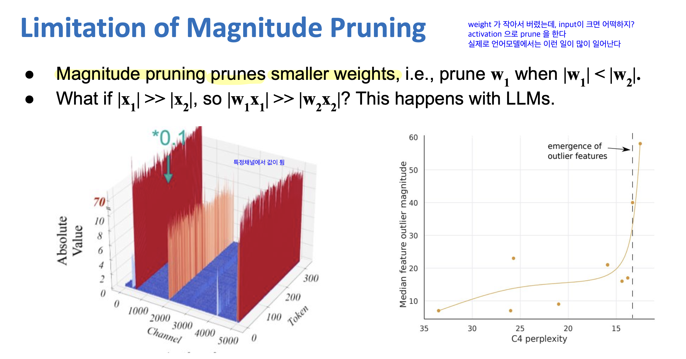

그런데 LLM에서는 이게 잘 안 맞을 수 있다

왜냐하면 실제 linear layer의 영향은 weight만이 아니라 **input activation**과 같이 결정되기 때문이다.

특히 activation에 **outlier channel**, 즉 특정 channel 값이 유난히 크게 튀는 현상이 생길 수 있다.

(activation 값이 엄청 커서 다른 것보다 weight 은 작은데 둘을 곱했을 땐 다른 것보다 커지는 경우)

---

## 4-3. Wanda: Weights and Activations-Aware Pruning

이 문제를 해결하려는 방법이 **Wanda**야.

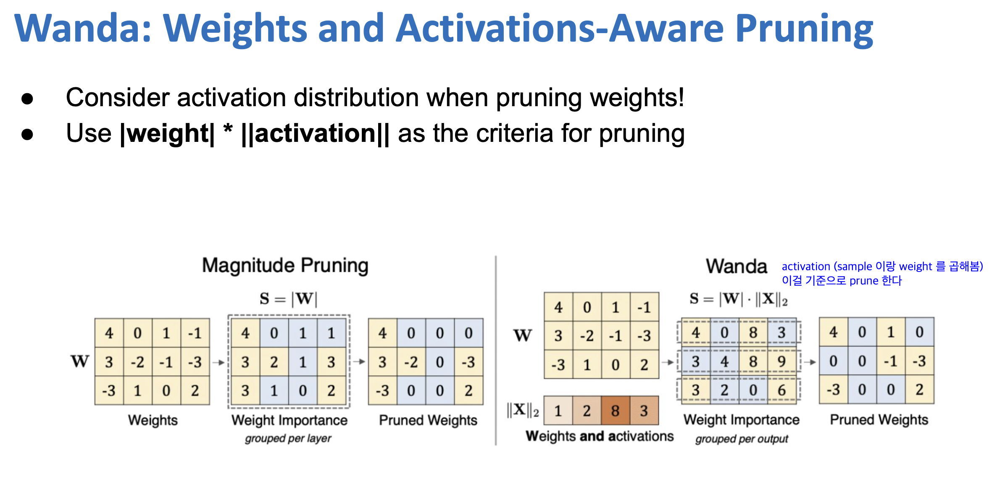

Wanda의 핵심 아이디어는:

> weight 크기만 보지 말고, activation 크기도 같이 보자.

그래서 pruning importance score를 이렇게 잡아.

$$
S = |W| \cdot |X|
$$

즉 각 weight의 중요도를 단순히 $|W|$로 보는 게 아니라,

$$
\text{importance} = |\text{weight}| \times |\text{activation}|
$$

으로 보는 거야.

쉽게 말하면:

> weight가 작더라도 그 weight가 곱해지는 activation이 크면 중요할 수 있다.

---

## 4-4. M:N Sparsity

다음은 **M:N Sparsity**야.

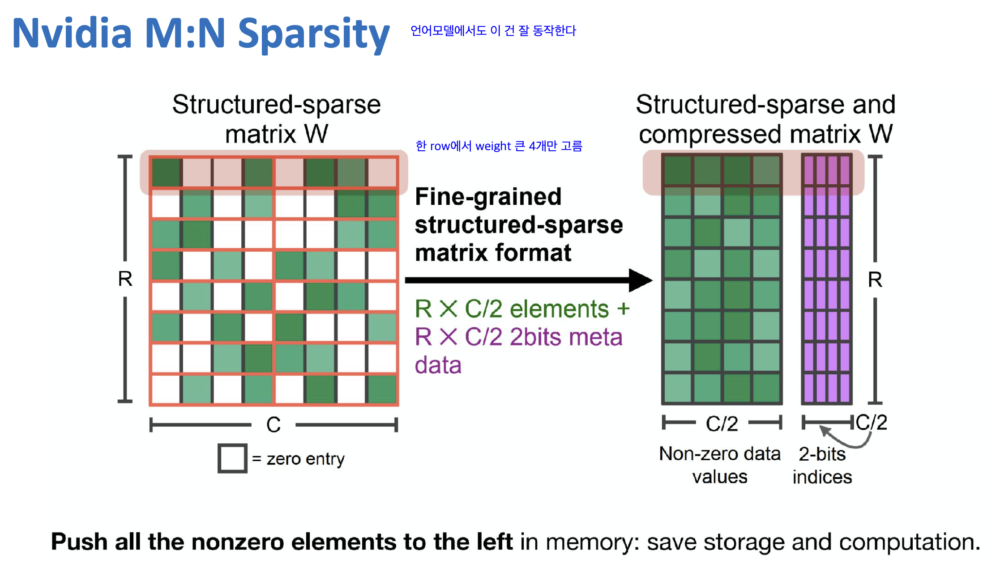

이건 완전히 자유롭게 weight를 자르는 fine-grained pruning과 다르게, **정해진 block 안에서 일정 개수만 남기는 structured sparsity**야.

대표적인 예가 NVIDIA의 **2:4 sparsity**야.

의미는:

> weight 4개 중 2개만 non-zero로 남기고, 나머지 2개는 0으로 만든다.

일반화하면 M:N sparsity는:

> N개 중 M개만 남긴다.

예를 들어:

$$
2:4 \text{ sparsity}
$$

는 4개 중 2개만 남기는 거야.

---

## 4-1. 왜 M:N sparsity를 쓰는가?

Fine-grained pruning은 weight를 아무 위치나 자를 수 있어.

장점은 성능 유지가 좋을 수 있다는 것.
하지만 단점은 weight가 불규칙하게 남아서 hardware가 빠르게 계산하기 어렵다는 것.

반면 M:N sparsity는 규칙이 있어.

예를 들어 매 4개 weight마다 2개만 남긴다고 정해져 있으면, hardware가 이 패턴을 알고 빠르게 계산할 수 있어.

Lecture 4에서도 M:N sparsity는 nonzero element를 메모리의 왼쪽으로 모으고, index metadata를 저장해서 storage와 computation을 줄이는 구조로 설명돼. 

---

## 4-2. M:N sparsity에는 hardware 지원이 필요함

M:N sparsity가 실제로 빨라지려면 hardware가 이 sparse pattern을 이해해야 해.

예를 들어 2:4 sparsity에서는 4개 중 2개만 곱셈하면 돼.

$$
4 \text{ multiplications} \rightarrow 2 \text{ multiplications}
$$

하지만 문제는 남은 2개가 원래 input의 어느 위치와 곱해져야 하는지 알아야 한다는 거야.

그래서 index 또는 metadata가 필요해.

Lecture 4에서는 NVIDIA Tensor Core가 M:N sparse matrix를 처리할 수 있도록, nonzero value와 index metadata를 함께 사용한다고 설명해. 즉 input의 어느 position을 mask할지 hardware logic이 필요하다는 거야. 

---

## 4-5. EIE: Efficient Inference Engine (덜 중요)

EIE는 **Efficient Inference Engine**의 약자야.

fine-grained pruning은 임의의 weight가 제거되기 때문에 acceleration이 어렵고, memory access도 불규칙해질 수 있다

-> EIE는 "fine-grained pruning으로 생긴 sparse weight를 효율적으로 처리하려는 hardware accelerator"이다

현재 LLM 관점에서는 M:N sparsity처럼 더 hardware-friendly한 구조가 더 강조되는 느낌이야.

> 요지는 fine-grained pruning 을 해도 특별한 HW 구조를 만들면 acceleration 이 된다

---

## 4-6. Activation Sparsity: MoE

### 4-6-1. 배경
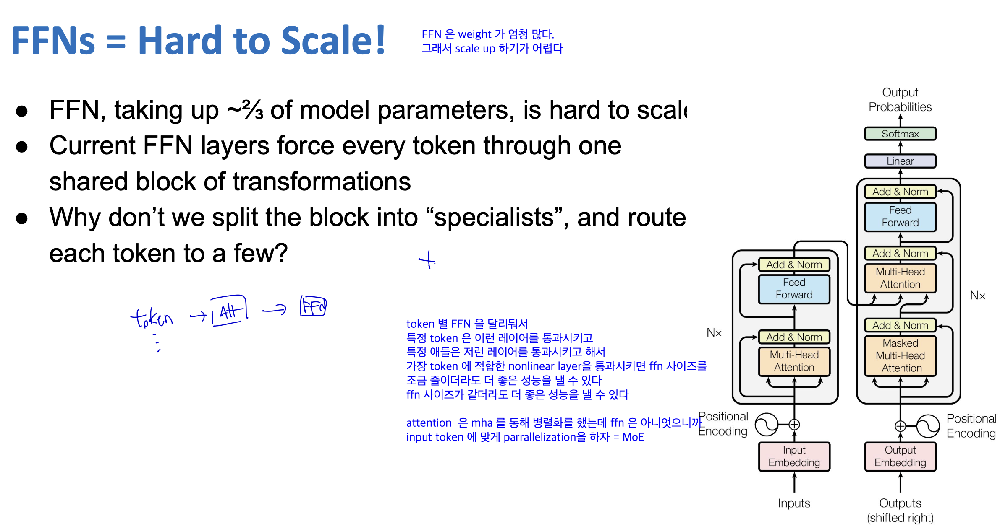
- FFN 은 weight 가 많아서 scale up 하기 어렵다
- input token 에 맞는 FFN parallelization 을 하자 = MoE

### 4-6-2. MoE
이제 weight sparsity가 아니라 **activation sparsity**로 넘어가.

대표적인 방법이 **MoE**, 즉 **Mixture of Experts**야.

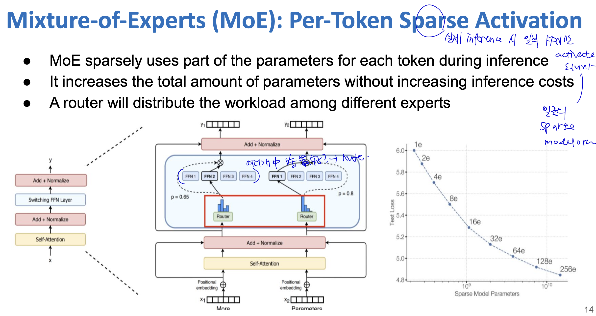

MoE는 모델 안에 여러 expert network를 두고, 입력 token마다 일부 expert만 선택해서 사용해.

예를 들어 expert가 8개 있다고 해보자.

$$
E_1, E_2, \dots, E_8
$$

일반 dense model이면 모든 parameter를 매번 사용하지만, MoE는 token마다 top-$k$ expert만 사용해.

예를 들어 top-$2$ routing이면:

$$
\text{token} \rightarrow E_3, E_7
$$

이렇게 일부 expert만 활성화돼.

### 4-6-3. Routing Capacity

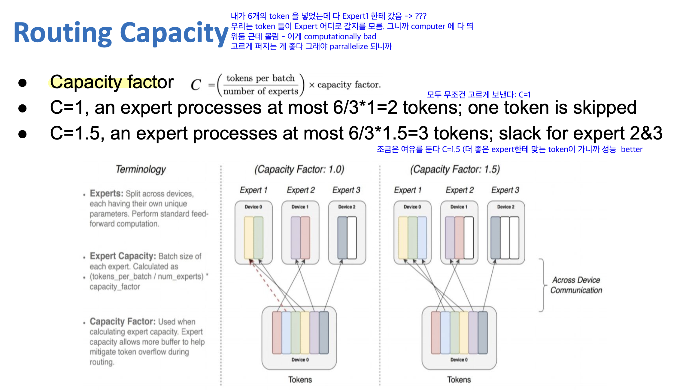

**MoE(Mixture of Experts)**에서 token들을 expert들에게 보낼 때, **각 expert가 한 batch에서 최대 몇 개 token까지 처리할 수 있는지**를 설명하는 거야.

> MoE에서는 모든 token이 모든 expert를 거치는 게 아니라, router가 token마다 적절한 expert를 골라 보낸다.
> 그런데 token이 특정 expert에게 너무 몰리면 병렬성이 깨지고 load imbalance가 생긴다.
> 그래서 expert마다 처리 가능한 최대 token 수, 즉 **capacity**를 정해둔다.

- token이 총 6개 있고, expert가 3개 있어.
- 평균적으로는 expert 하나당 token이 2개 가는 게 이상적이야.

**Capacity factor**

$$
C =
\left(
\frac{\text{tokens per batch}}{\text{number of experts}}
\right)
\times
\text{capacity factor}
$$

여기서 $C$는 **expert 하나가 처리할 수 있는 최대 token 수**야.

즉 capacity factor는 expert마다 평균보다 얼마나 여유 공간을 더 줄지 정하는 값이야.

- Capacity factor = 1일 때
  - token 6개, expert 3개, capacity factor가 1이면:
  - $C = \frac{6}{3} \times 1 = 2$
  - expert 하나는 최대 2개 token만 처리할 수 있어.
  - 그런데 router가 token들을 보냈는데, 만약 Expert 1에게 token이 3개 몰렸다고 해보자.
  - Expert 1의 capacity는 2니까, 3개 중 2개만 처리하고 나머지 1개는 처리할 수 없어.
  - C=1, an expert processes at most $6/3 \times 1 = 2$ tokens; one token is skipped
  - 즉 **expert가 꽉 차서 overflow된 token 하나가 skip/drop된다**는 뜻이야.

- Capacity factor = 1.5일 때
  - $C = \frac{6}{3} \times 1.5 = 3$
  - 즉 expert 하나가 최대 3개 token까지 처리할 수 있어.
  - 그러면 Expert 1에게 token이 3개 몰려도 처리 가능해.
  - if C=1.5, an expert processes at most $6/3 \times 1.5 = 3$ tokens; slack for expert 2&3
  - 즉 Expert 1은 3개를 처리할 수 있고, Expert 2와 Expert 3은 capacity가 3인데 실제로 2개, 1개만 받을 수도 있으니까 빈 공간이 생겨.
  - 이 빈 공간을 **slack**이라고 해.

capacity factor와 성능:

- capacity factor가 너무 작으면 좋은 expert가 있어도 token을 못 보냄
- 예를 들어 어떤 token에게는 Expert 1이 가장 적합한데, Expert 1이 이미 꽉 찼으면 그 token은 skip되거나 덜 적합한 expert로 가야 해.
- 그러면 모델 성능이 떨어질 수 있어.
- capacity factor를 키우면 expert마다 여유 공간이 생겨서, token이 원래 가야 할 expert로 갈 가능성이 커져.
- 그래서 성능은 좋아질 수 있어.
- 반대로 capacity factor를 너무 크게 하면 단점도 있어.
- 각 expert가 더 많은 token을 받을 수 있도록 buffer를 크게 잡아야 하니까 메모리와 계산 여유분이 늘어나.
- 또 expert가 여러 device에 나뉘어 있으면, token을 expert가 있는 device로 보내야 하고 token 을 다른 device 로 옮기는 communication cost (**Across Device Communication**) 발생

### 4-6-4. Routing Policy
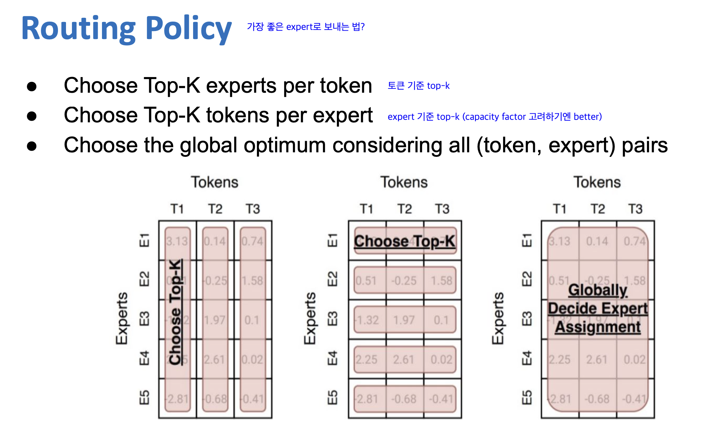

### 4-6-5. MoE가 sparse한 이유

MoE는 parameter 전체는 엄청 클 수 있어.

하지만 한 token이 지나갈 때는 모든 expert를 쓰지 않고 일부 expert만 써.

즉 전체 parameter 수는 크지만, 실제 token당 계산량은 제한돼.

이걸 sparse activation이라고 볼 수 있어.

> 많은 expert 중 일부만 activate되기 때문.

그래서 MoE의 장점은:

> 모델 capacity는 키우면서, token당 computation은 덜 늘릴 수 있다.

LLM에서 큰 모델을 만들 때 매우 중요한 아이디어야.

### 4-6-6. MoE의 어려움

MoE는 좋아 보이지만 시스템적으로 어렵다.

왜냐하면 token마다 선택되는 expert가 다를 수 있기 때문이야.

예를 들어 batch 안의 token들이 각각 다른 expert로 가면, 계산이 불규칙해지고 load balancing 문제가 생겨.

어떤 expert는 token이 몰려서 바쁘고, 어떤 expert는 거의 안 쓰일 수 있어.

그래서 MoE 시스템에서는 routing, load balancing, expert parallelism 같은 문제가 중요해.

---

## 4-7. DeepSeekMoE
Lecture 4에서는 activation sparsity의 예시로 **DeepSeekMoE**도 들어가.

### 4-7-1. A few large experts 구조의 문제

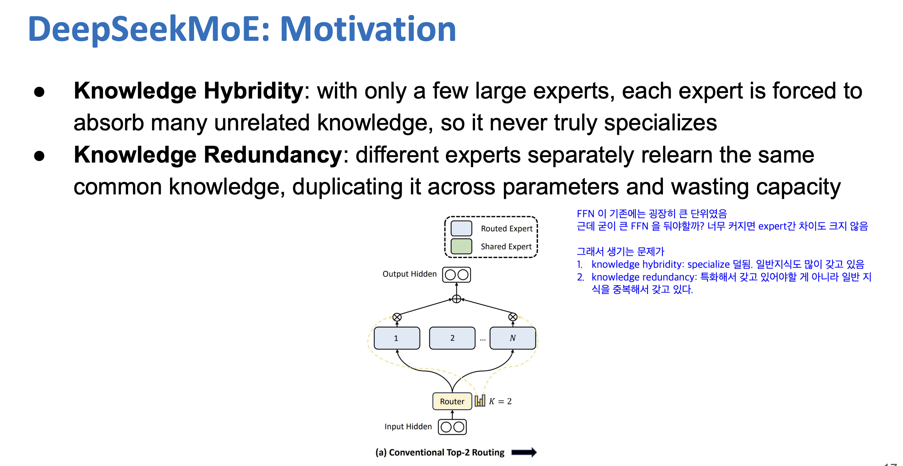

- Knowledge Hybrity: expert 가 상관없는 지식도 갖고 있음 
- Knowledge Redundancy: 특화된 지식이 아니라 일반적 지식을 중복해서 갖고 있다. 

### 4-7-2. DeepSeekMoE는 두 가지 방법 사용

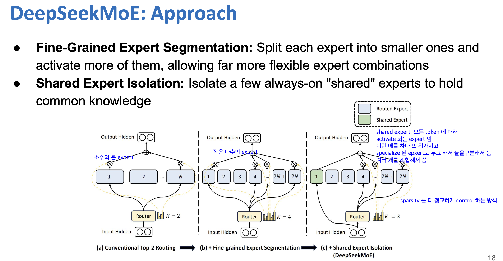

1. Fine Grained Expert Segmentation: 작은 expert 들은 둔다
2. Shared Expert Isolation: 몇 개의 common knowledge 를 가진 shared expert 도 둔다
3. 그리고 이런 여러 expert 들을 조합해서 쓴다

---

## 4-8. Attention Sparsity

Transformer에서 attention은 매우 비싼 연산이야.

Self-attention의 기본 복잡도는 sequence length를 $n$이라고 하면:

$$
O(n^2)
$$

왜냐하면 모든 token이 모든 token을 보기 때문이야.

sequence가 길어질수록 attention 계산량과 memory가 급격히 증가해.

그래서 attention에서도 sparsity를 활용하려는 방법들이 나온다.

예시는:

* SpAtten
* Quest
* DuoAttention

이야. 

---

## 4-9. SpAtten

SpAtten은 attention에서 중요하지 않은 부분을 줄이는 방식이야.

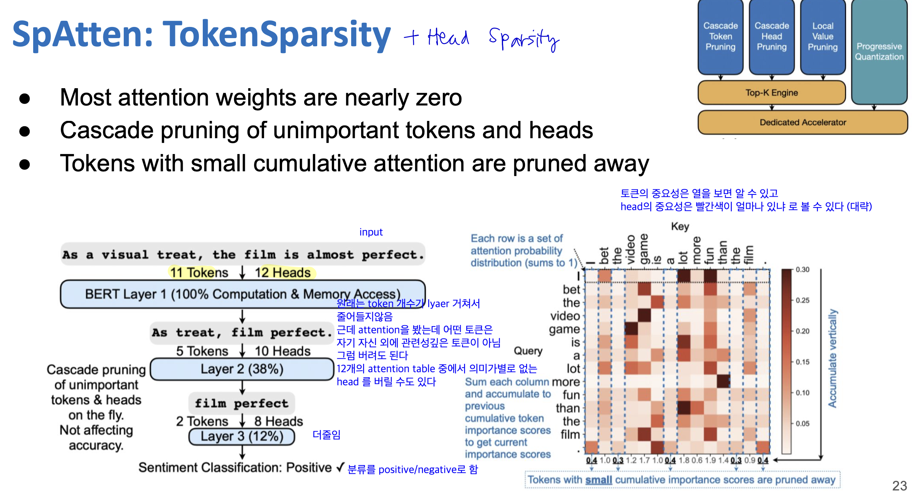

기본 아이디어는:

> 모든 token pair를 다 보지 말고, 중요한 attention만 남기자.

즉 attention score나 head/token importance를 보고 덜 중요한 부분을 pruning해서 attention computation을 줄이려는 방법이야.

Transformer attention은 많은 token 간 관계를 계산하지만, 실제로는 모든 관계가 똑같이 중요한 건 아니야.

어떤 token은 거의 참고되지 않을 수도 있고, 어떤 attention head는 덜 중요할 수도 있어.

SpAtten은 이런 sparsity를 이용해 attention computation과 memory cost를 줄이려는 방법으로 이해하면 돼.

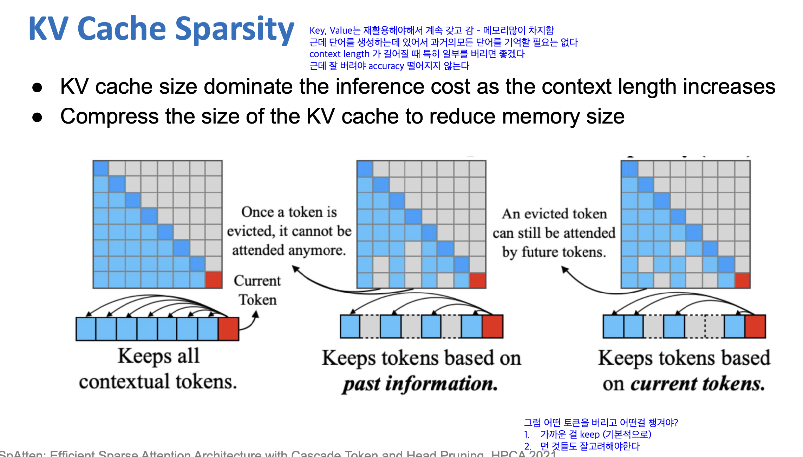

근데 문제는 그냥 이렇게 고정적으로 특정 attention 을 버리면 나중에 혹시 필요하게 됐을 때 (다른 Q가 왔을 때) 참고할 수 없음

---

## 4-10. Quest

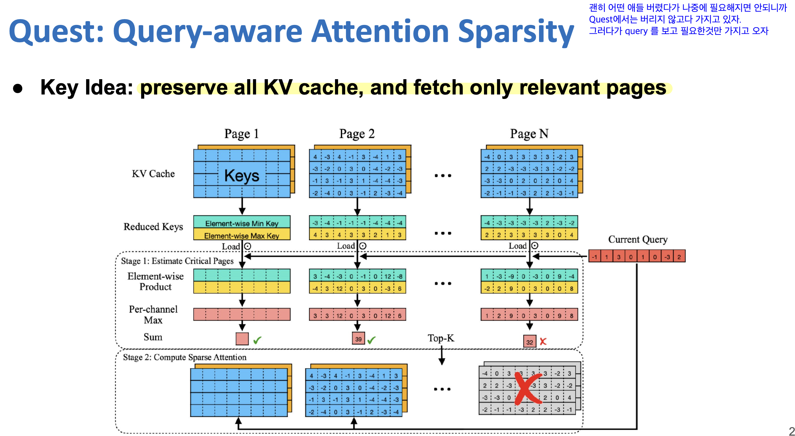

Quest도 long-context LLM에서 attention cost를 줄이려는 방법으로 보면 돼.

긴 context에서는 모든 token을 다 보는 것이 너무 비싸기 때문에, query와 관련 있는 key/value만 골라서 attention을 수행하려는 방향이야.

즉 기본 아이디어는:

> 현재 query에 중요한 token만 찾아서 attention하자.

이렇게 하면 attention이 dense한 $n \times n$ 계산이 아니라, 필요한 일부 token에 대해서만 수행될 수 있어.

---

## 4-11. DuoAttention

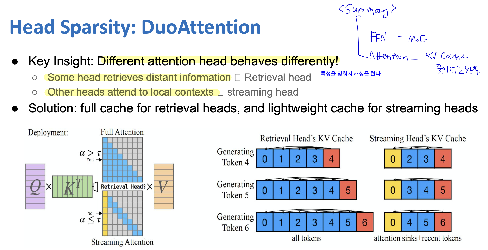

DuoAttention은 attention의 역할을 나누어 효율화하는 방법으로 볼 수 있어.

LLM attention에서는 모든 head가 같은 방식으로 long context 전체를 봐야 하는 것은 아닐 수 있어.

어떤 head는 global context를 봐야 하고, 어떤 head는 local context만 봐도 충분할 수 있어.

DuoAttention은 이런 차이를 이용해서 attention computation과 KV cache 사용량을 줄이려는 방법으로 이해하면 돼.

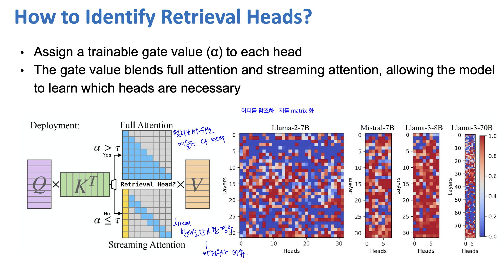

장점:
- KV memory 와 decoding latency 가 줄어든다
- long-context accuracy 유지

## 4-15. 시험/과제용으로 외울 핵심

Lecture 4에서 꼭 기억해야 할 건 이거야.

1. **LLM에서는 magnitude pruning만으로 부족하다.**
   weight가 작아도 activation이 크면 실제 영향이 클 수 있다.

2. **Wanda는 weight와 activation을 같이 본다.**

   $$
   S = |W| \times |X|
   $$

3. **M:N sparsity는 hardware-friendly structured sparsity다.**
   예: $2:4$ sparsity는 4개 중 2개만 남긴다.

4. **Sparse하다고 무조건 빨라지는 건 아니다.**
   system / hardware support가 있어야 실제 speedup이 나온다.

5. **LLM sparsity는 weight만이 아니라 activation, attention에도 있다.**

6. **MoE는 activation sparsity의 대표 예시다.**
   많은 expert 중 일부만 활성화한다.

7. **Attention sparsity는 long context에서 중요하다.**
   attention은 기본적으로 $O(n^2)$라서 sequence가 길어질수록 부담이 커진다.

---

# 📚 05. Quantization (Part I)

quantization은 **숫자를 더 적은 bit로 표현해서 memory와 연산 비용을 줄이는 방법**이야. Lecture 5의 목표도 neural network quantization의 기본 개념과 대표적인 quantization 방법을 이해하는 것이고, 내용은 **data type 복습 → quantization 기본 → K-means quantization → linear quantization → binary/ternary quantization** 순서로 구성돼 있어. 

---

## 5-1. Quantization이 왜 필요한가?

딥러닝 모델은 weight와 activation을 보통 floating-point로 저장하고 계산해.

예를 들어 일반적으로 많이 쓰는 형식은:

* FP32
* FP16
* BF16
* INT8

같은 것들이야.

문제는 **큰 bit-width를 쓰면 memory access와 연산 비용이 크다**는 거야.

---

## 5-2. Quantization의 기본 개념

Quantization은 연속적이거나 큰 값의 집합을 **더 작은 discrete set으로 제한하는 과정**이야. Lecture 5에서도 quantization을 “continuous or large set of values를 discrete set으로 제한하는 과정”이라고 정의해. 

쉽게 말하면:

> 원래는 다양한 실수 값을 가질 수 있었는데, 이제 몇 개의 대표값으로만 표현하자.

예를 들어 원래 weight가 이렇게 있다고 해보자.

$$
2.09,\quad -0.98,\quad 1.48,\quad 0.09
$$

이 값들을 전부 비슷한 대표값으로 바꾸면 저장이 쉬워져.

예를 들어 아주 거칠게:

$$
2.09,\ 2.12,\ 1.92,\ 1.87 \rightarrow 2.0
$$

처럼 만들 수 있어.

물론 이렇게 하면 원래 값과 바뀐 값 사이에 차이가 생겨.
이 차이를 **quantization error**라고 해.

$$\text{quantization error} = \text{original value} - \text{quantized value}$$

---

## 5-3. Data type 복습

Quantization을 이해하려면 숫자를 컴퓨터가 어떻게 표현하는지 알아야 해.

Lecture 5에서는 integer, fixed-point, floating-point를 복습해.

---

### 5-3-1. Integer

Integer는 정수 표현이야.

### Unsigned integer - 설명 생략

### Signed integer

부호가 있는 정수야.

일반적으로 2’s complement를 사용하면 $n$-bit signed integer의 범위는:

$$
-2^{n-1} \sim 2^{n-1}-1
$$

예를 들어 8-bit signed integer면:

$$
-128 \sim 127
$$

---

### 5-3-2. Fixed-point number

Fixed-point는 소수점 위치가 고정된 표현이야.

예를 들어 어떤 bit들은 정수부, 어떤 bit들은 소수부로 정해놓고 해석해.

장점은 integer 연산처럼 비교적 단순하게 처리할 수 있다는 것.
단점은 표현 가능한 range와 precision이 고정되어 있어서 유연성이 떨어질 수 있다는 것.

---

### 5-3-3. Floating-point number

Floating-point는 부동소수점 표현이야.

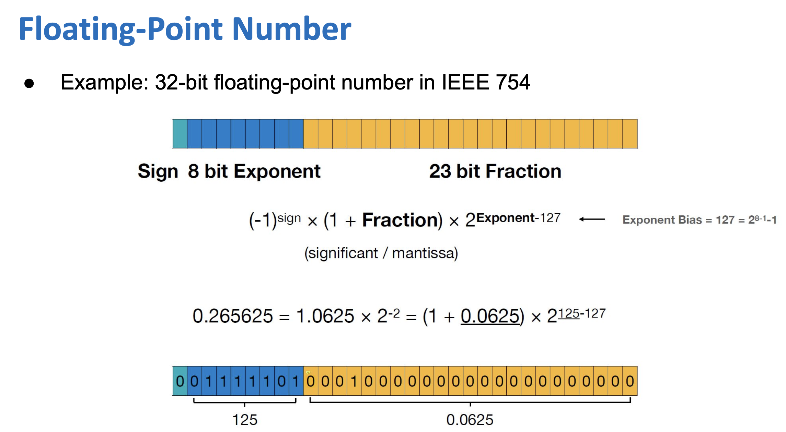

$$
(-1)^{\text{sign}}
\times
(1+\text{fraction})
\times
2^{\text{exponent}-\text{bias}}
$$

여기서 중요한 건:

* exponent bit 수가 크면 **표현 범위 range**가 커진다.
* fraction bit 수가 크면 **정밀도 precision**이 좋아진다.

---

## 5-4. Floating-point 형식 비교

Lecture 5에서는 FP32, FP16, BF16 같은 형식을 비교해.

| Type | Exponent | Fraction | Total |
| ---- | -------: | -------: | ----: |
| FP32 |        8 |       23 |    32 |
| FP16 |        5 |       10 |    16 |
| BF16 |        8 |        7 |    16 |

여기서 BF16이 중요한 이유는 FP16과 같은 16-bit지만 exponent가 8bit라서 FP32와 range가 비슷해.

즉 BF16은 precision은 FP32보다 낮지만, 큰 값이나 작은 값을 표현하는 range는 비교적 넓어.

---

## 5-5. Quantization의 큰 분류

Lecture 5에서 다루는 대표적인 quantization 방법은 크게 두 가지야.

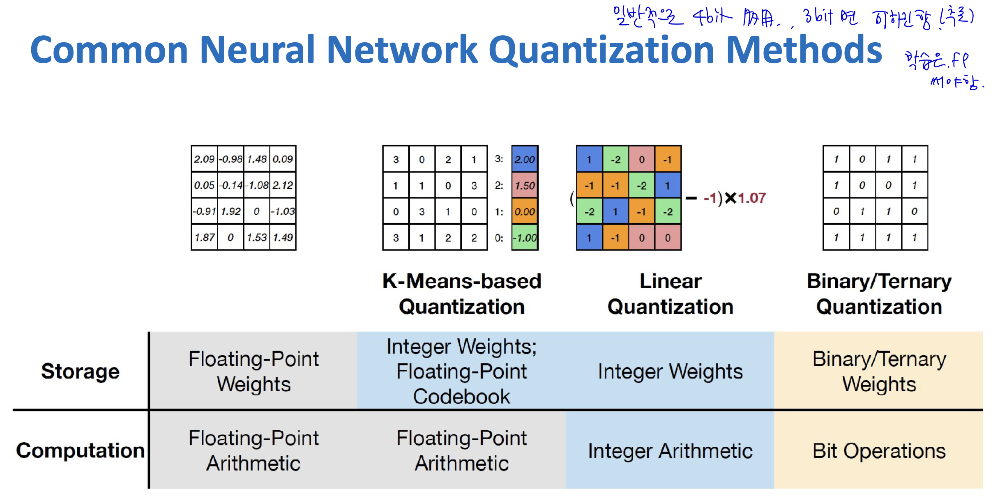

1. **K-means-based quantization**
2. **Linear quantization**

그리고 마지막에 아주 극단적인 형태인 **binary / ternary quantization**을 다뤄.

---

## 5-6. K-means-based weight quantization

K-means quantization은 weight 값들을 clustering해서, 각 weight를 cluster centroid로 대체하는 방식이야.

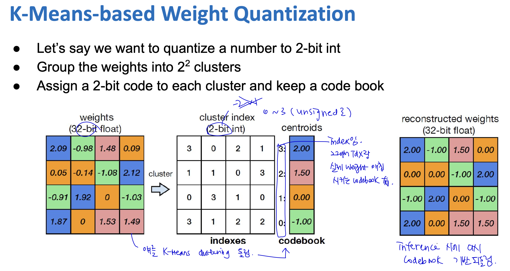

weight들을 $k$개의 cluster로 나눠.

예를 들어 $k=4$이면 centroid가 4개 생겨.

$$
c_1,\ c_2,\ c_3,\ c_4
$$

각 weight는 자기와 가장 가까운 centroid로 대체돼.

---

### 5-6-1. 저장 방식

K-means quantization에서는 실제 weight 값을 전부 저장하지 않아.

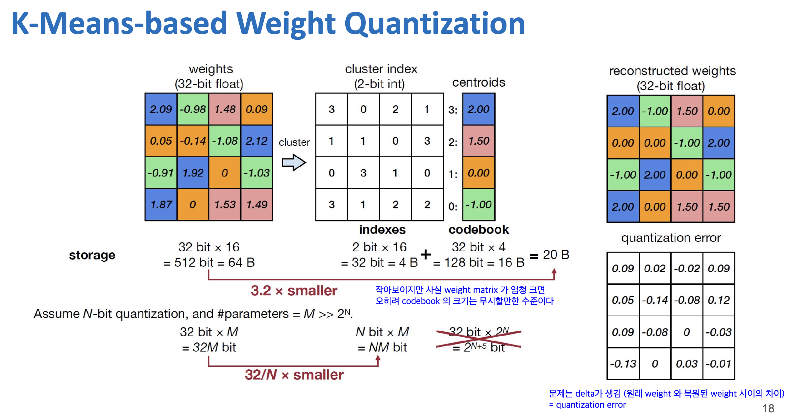

대신 두 가지를 저장해.

1. **Codebook**: centroid 값들
2. **Index**: 각 weight가 어떤 centroid를 사용하는지

예를 들어 centroid가 4개면 index는 2bit면 충분해.

$$
4 = 2^2
$$

즉 원래 FP32 weight 하나를 32bit로 저장했다면, 이제는 각 weight마다 2bit index만 저장하면 돼.
centroid 값들은 따로 codebook에 저장하고.

Lecture 5의 K-means quantization 예시에서도 weights를 cluster index와 centroid codebook으로 나누어 저장해서 storage를 줄이는 구조를 보여줘. 

### 5-6-2. 장점과 단점

**장점:** 

   weight 분포에 맞춰 centroid를 학습한다 - 더 세밀하게 쪼개야할 부분을 더 세밀하게 쪼갤 수 있다

**단점:**

   실제 연산할 때 index를 보고 codebook에서 값을 lookup해야 해서 **실수로 연산해야한다** hardware에서 바로 integer 연산으로 처리하는 게 아님.

그래서 **memory는 줄일 수 있지만, 실제 latency가 꼭 줄어드는 건 아니야.**

---

## 5-7. Linear quantization

Linear quantization은 실수 값을 일정한 간격의 integer grid에 mapping하는 방식이야.

핵심 식은 이거야.

$$
r = S(q - Z)
$$

여기서:

| 기호  | 의미                      |
| --- | ----------------------- |
| $r$ | real value, 원래 실수 값     |
| $q$ | quantized integer value |
| $S$ | scale                   |
| $Z$ | zero-point              |

즉 integer $q$를 scale $S$와 zero-point $Z$를 이용해 실수 $r$로 복원하는 방식이야.

반대로 실수 $r$을 integer로 quantize할 때는 대략 이렇게 생각할 수 있어.

$$
q = \text{round}\left(\frac{r}{S} + Z\right)
$$

그리고 실제 integer 범위를 넘어가면 clipping을 해.

$$
q = \text{clip}
\left(
\text{round}\left(\frac{r}{S} + Z\right),
q_{\min},
q_{\max}
\right)
$$

### 5-7-1. Scale $S$

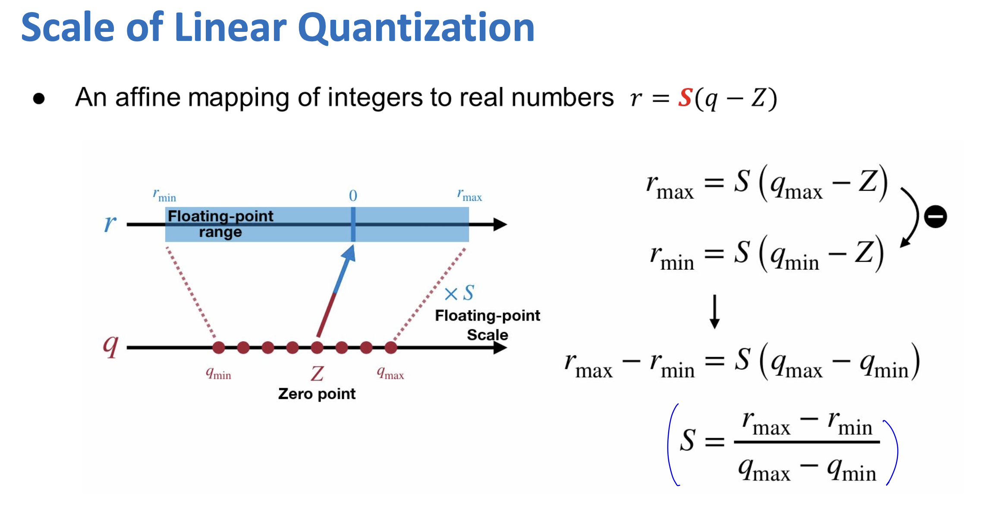
Scale은 integer 한 칸이 real value에서 얼마나 큰 간격을 의미하는지 나타내.

$$
S = \frac{r_{max} - r_{min}}{q_{max} - q_{min}}
$$

예를 들어 $S=0.1$이면 integer가 1 증가할 때 real value는 0.1 증가해.

$$
q = 3 \Rightarrow r = 0.3
$$

$$
q = 4 \Rightarrow r = 0.4
$$

물론 zero-point가 있으면 그만큼 이동해.

### 5-7-2. Zero-point $Z$

Zero-point는 real value 0이 integer 상에서 어디에 해당하는지 나타내는 값이야.

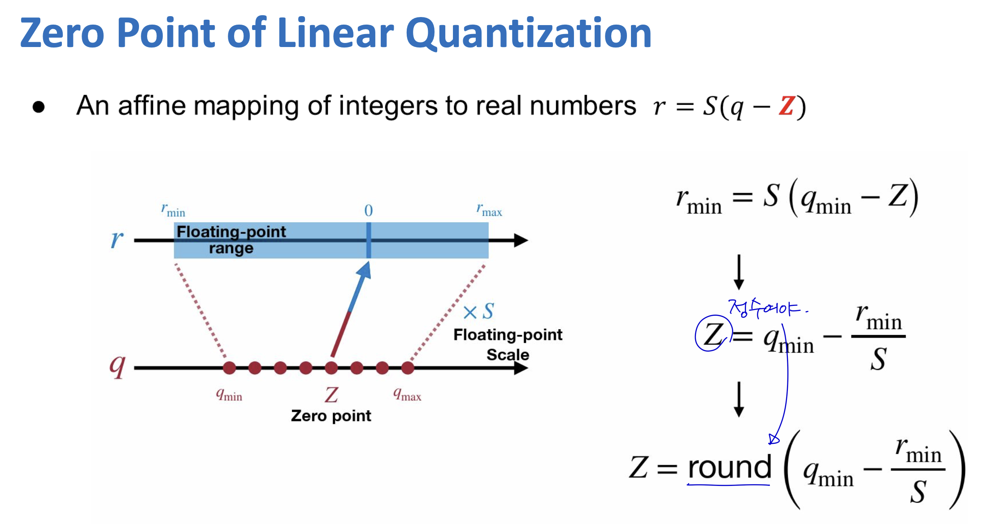

즉 $r=0$이 되려면:

$$
0 = S(q - Z)
$$

따라서:

$$
q = Z
$$

그래서 $Z$는 integer domain에서 real zero의 위치야.

이게 중요한 이유는 neural network에서 0이 정확히 표현되어야 하는 경우가 많기 때문이야.

### 5-7-3. Linearly Quantized Matrix Multiplication

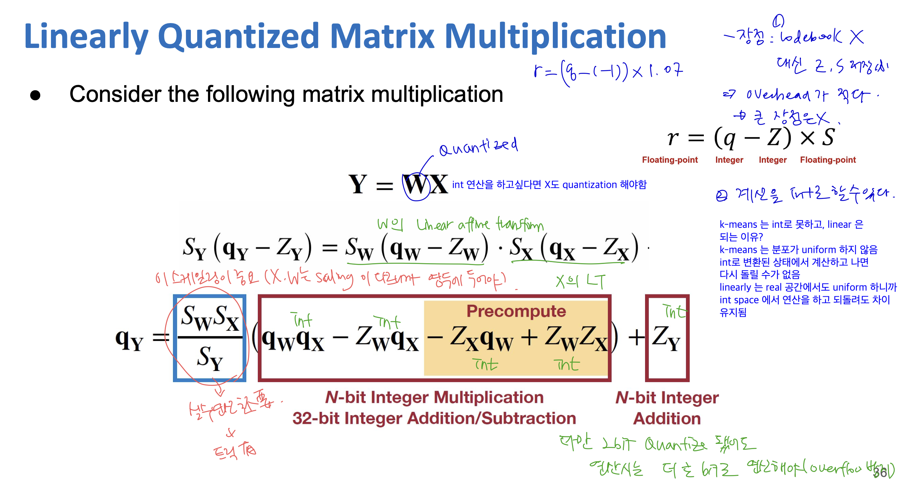
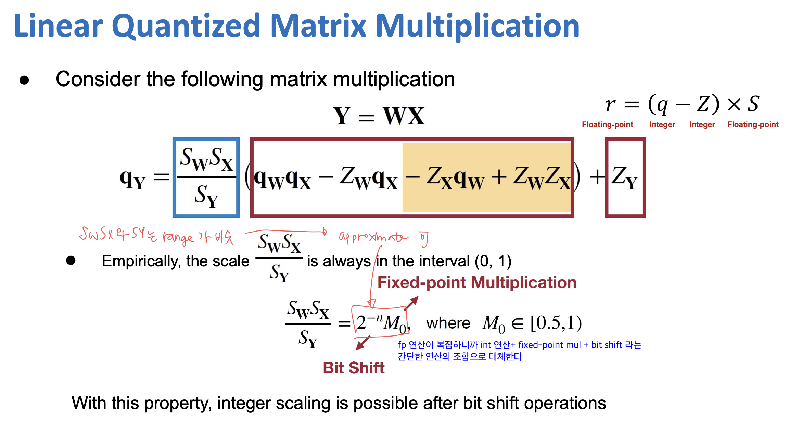

Linear Quantization 의 장점:
1. Codebook 없어도 됨, S랑 z만 저장하면 됨 -> overhead 가 적다
2. 계산을 int로 할 수 있다 - linear transform 이라서 linear space 에서 연산 후 되돌려도 동일함

W에 Linear Quantization을 했으니 $W$, $X$, $Y$ 각각을 linear quantization 형태로 표현할 수 있다

그리고 이 식에 유일한 fp 인 Scale 은 int연산 + fixed-point multiplication + bit shift 이라는 간단한 연산의 조합으로 대체한다.

주의사항: 연산 시는 overflow 방지를 위해 qunatization bit 수보다 큰 data type 으로 연산해야한다

---

## 5-8. Symmetric vs Asymmetric quantization

Linear quantization은 보통 symmetric과 asymmetric으로 나눌 수 있어.

### 5-8-1. Symmetric quantization

Symmetric quantization은 0을 중심으로 양쪽 범위를 대칭으로 잡는 방식이야.

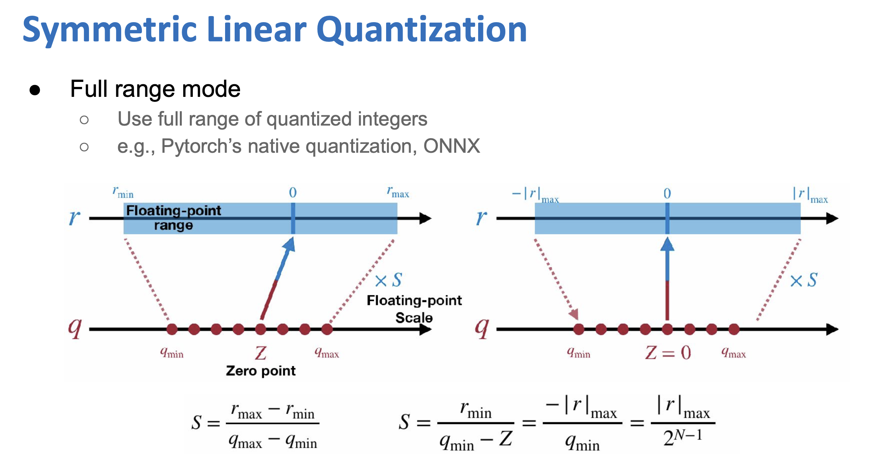

보통 zero-point를 0으로 둬. 그럼 식이 간단해짐.

$Z = 0$ ---> $r = S q$

반대 개념은 assymetric quantization 이고 처음 나온 방식이 그거다.

Symmetric Linear Quantization 의 특징
- 장점은 계산이 간단하다는 것.
- 단점은 실제 값의 분포가 대칭이 아니면 range를 낭비할 수 있다는 것.

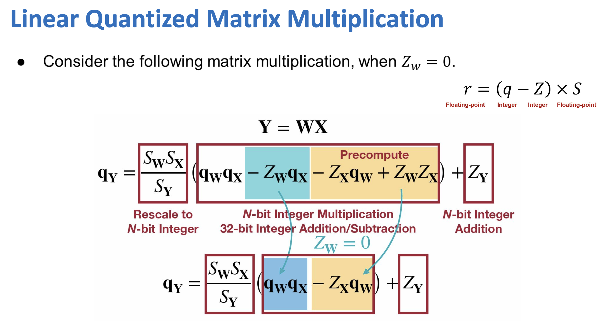

$Z_W$ 가 0이면 Matrix Multiplication 식은 더 간단해진다.

뭐 bias 가 있어도 역시 quantize 해서 식에 녹아낼 수 있다.

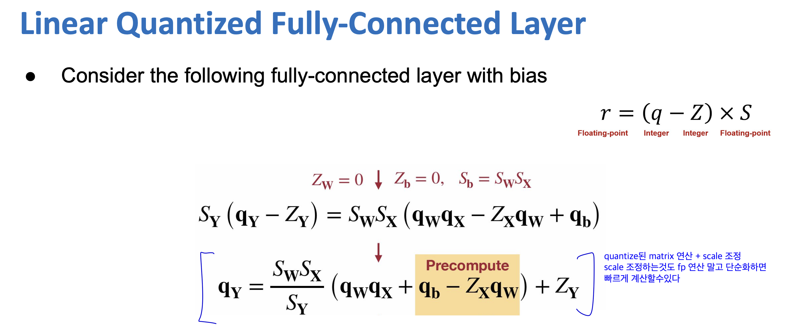

### 5-8-3. Linear Quantized Convolution Layer
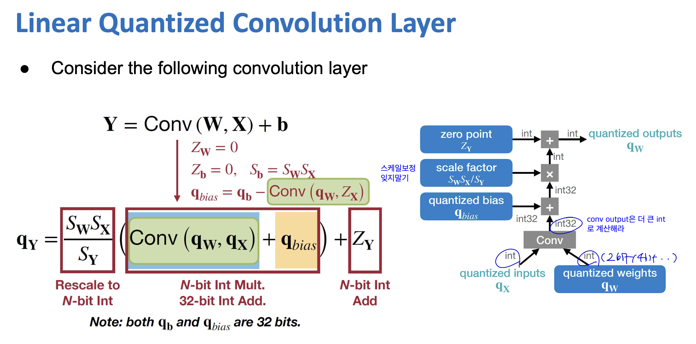

quantization을 적용하면:

$$
Y = \operatorname{Conv}(W, X) + b
$$

가

$$
q_Y = \frac{S_WS_X}{S_Y} (\operatorname{Conv}(q_W, q_X) + q_{bias}) * Z_Y
$$

같은 형태가 돼.

여기서 $\operatorname{Conv}(q_W, q_X)$는 **quantized weight와 quantized activation으로 하는 integer convolution**이야. 내부적으로는 계속 이런 연산을 반복해.

Bias는 왜 따로 나오나?

Convolution layer는 보통

$$
Y = \operatorname{Conv}(W, X) + b
$$

처럼 bias가 있어.

그런데 $\operatorname{Conv}(W,X)$의 scale은 $S_WS_X$가 돼. 왜냐하면

$$
W = S_W(q_W - Z_W), \quad X = S_X(q_X - Z_X)
$$

이니까 곱하면 scale이 $S_WS_X$가 되기 때문이야.

그래서 bias도 더하려면 같은 scale 기준으로 맞춰줘야 해.

$$
S_b = S_WS_X
$$

그래서 bias는 보통 8-bit가 아니라 **32-bit integer**로 저장/누적해. Lecture 5 page 49에도 $q_b$와 $q_{bias}$가 둘 다 32-bit라고 적혀 있어. 

## 5-9. Binary quantization

Binary quantization은 weight를 두 값만으로 표현하는 극단적인 방법이야.

보통 이런 식이야.

$$
w \in {-1, +1}
$$

또는 scale을 붙이면:

$$
w \approx \alpha \cdot \text{sign}(w)
$$

여기서 $\alpha$는 scale factor야.

장점은 엄청나게 작고 빠를 수 있다는 거야.
곱셈도 거의 sign operation처럼 바꿀 수 있어.

단점은 표현력이 너무 줄어들어서 accuracy가 크게 떨어질 수 있어.

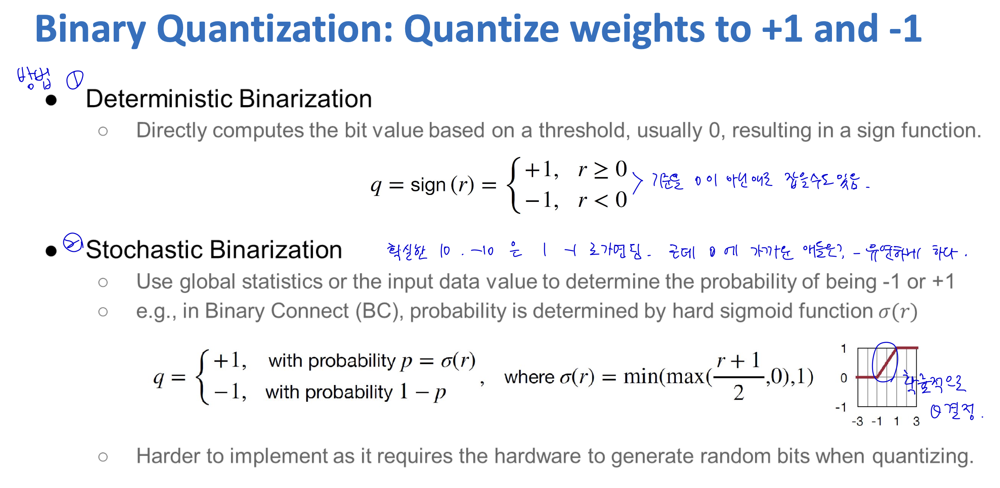

방법 1. **Deterministic Binarization**: 단순 0 이상 1 / 0 미만 -1

방법 2. **Stochastic Binarization**
- 확실한 10 / -10 은 1 / -1 로 치환
- 0에 가까운 애들은 유연하게 확률적으로 결정한다

---

## 5-10. Ternary quantization

Ternary quantization은 세 값만 사용하는 방식이야.

$$
w \in {-1, 0, +1}
$$

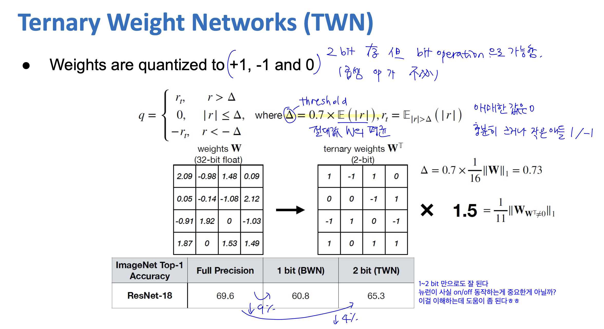

Binary보다 좋은 점은 0을 표현할 수 있다는 거야.

0 은 모든 weight 의 평균 * threshold 값 이내의 값으로 해서 sparsity 를 키울수도 있다. 

---

## 5-11. 요약

### K-means quantization vs Linear quantization

둘을 비교하면 이렇게 볼 수 있어.

| 구분    | K-means quantization | Linear quantization        |
| ----- | -------------------- | -------------------------- |
| 대표값   | cluster centroid     | 일정 간격 grid                 |
| 저장    | index + codebook     | integer + scale/zero-point |
| 장점    | weight 분포에 잘 맞출 수 있음 | hardware 친화적               |
| 단점    | lookup 필요, 연산 복잡     | 분포에 따라 error 커질 수 있음       |
| 실제 가속 | 어려울 수 있음             | INT8 연산 등으로 가속 쉬움          |

실전 inference에서는 보통 linear quantization이 hardware에서 지원되기 쉬워서 많이 쓰여.

### 핵심 흐름

Lecture 5를 하나의 흐름으로 보면 이거야.

1. 딥러닝은 memory와 연산 비용이 크다.
2. bit-width를 줄이면 memory와 energy를 줄일 수 있다.
3. Quantization은 실수 값을 작은 discrete set으로 바꾸는 것이다.
4. 이때 원래 값과 quantized 값의 차이가 quantization error다.
5. K-means quantization은 centroid와 index로 weight를 표현한다.
6. Linear quantization은 scale과 zero-point로 integer와 real value를 mapping한다.
7. Binary/Ternary quantization은 아주 낮은 bit-width의 극단적 형태다.

### 시험/과제용 핵심 정리

| 개념                      | 핵심                                   |
| ----------------------- | ------------------------------------ |
| Quantization            | continuous value를 discrete value로 제한 |
| Quantization error      | 원래 값과 quantized 값의 차이                |
| 목적                      | memory 감소, energy 감소, low-bit 연산 활용  |
| K-means quantization    | weight를 cluster centroid로 대체         |
| Codebook                | centroid 값 저장                        |
| Index                   | 각 weight가 어떤 centroid를 쓰는지 저장        |
| Linear quantization     | $r = S(q - Z)$                       |
| Scale $S$               | integer 간격이 real value에서 의미하는 크기     |
| Zero-point $Z$          | real zero가 integer에서 대응되는 위치         |
| Symmetric quantization  | $Z=0$, 0 중심 대칭                       |
| Asymmetric quantization | min/max range에 맞춰 zero-point 사용      |
| Binary quantization     | weight를 ${-1,+1}$로 제한                |
| Ternary quantization    | weight를 ${-1,0,+1}$로 제한              |

