# 📚 06. Quantization Part II

Lecture 6은 **Quantization Part II**이고, 핵심은 “이미 배운 quantization을 실제 모델에 어떻게 적용할 것인가”야. 크게 보면 **quantization granularity**, **activation quantization**, **QAT**, **mixed-precision quantization**을 다룬다. 슬라이드의 objective도 PTQ와 세 가지 quantization granularity, QAT와 fake quantization을 이해하는 것으로 되어 있어. 

## 6-2. Quantization Granularity

**Granularity**는 quantization할 때 **scale factor와 zero point를 어느 단위로 둘 것인가**를 의미한다. 슬라이드에서는 per-tensor, per-channel, group/per-vector quantization을 비교한다. 

### **Per-tensor quantization**

하나의 tensor 전체에 scale factor 하나를 쓰는 방식이다.

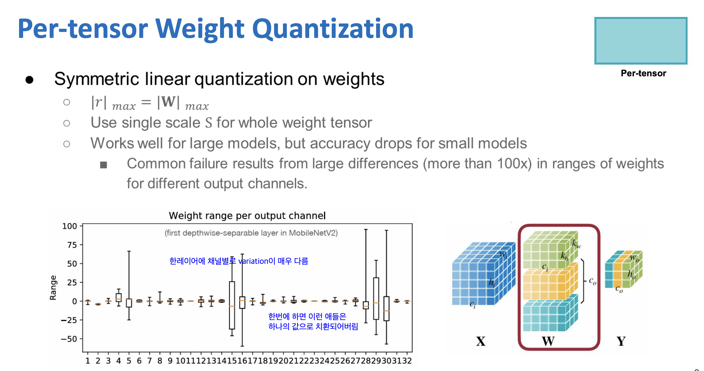

예를 들어 weight matrix 전체에 대해 하나의 $S$를 정하고,

$$
r = S(q - Z)
$$

처럼 복원한다.

- 장점은 단순하고 scale 저장 overhead가 작다는 것.
- 단점은 tensor 안의 channel별 값 범위가 많이 다르면 문제가 생긴다는 것.

예를 들어 어떤 channel은 값 범위가 $[-2, 2]$인데, 어떤 channel은 $[-100, 100]$이라면, 전체 tensor에 하나의 scale을 쓰면 작은 범위의 channel은 거의 뭉개질 수 있다. 슬라이드에서도 per-tensor는 whole weight tensor에 single scale을 사용하고, output channel마다 weight range 차이가 크면 문제가 생긴다고 설명한다. 

### **Per-channel quantization**

Per-channel은 channel마다 scale factor를 따로 둔다.

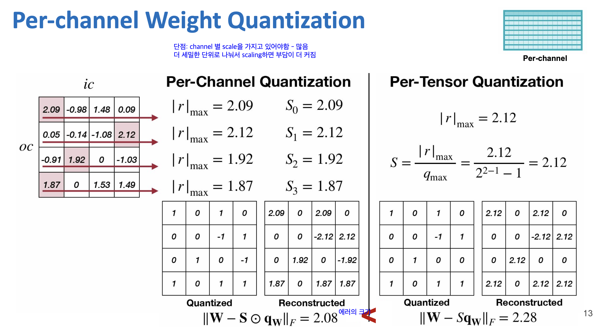

즉 각 output channel마다

$$
S_0, S_1, S_2, \dots
$$

를 따로 둔다.

그래서 **channel마다 값 범위가 달라도 더 정확하게 표현할 수 있다.** 슬라이드 예시에서도 per-channel은 각 row/channel의 max 값을 따로 잡아서 quantization error를 줄이는 방향으로 설명된다. 

다만 **단점은 scale factor를 channel마다 저장해야 하므로 overhead가 늘어난다는 것이다.** 더 세밀하게 나눌수록 accuracy는 좋아질 수 있지만, 저장해야 하는 scale이 많아진다.

### **Per-vector quantization**

Per-tensor는 너무 거칠고, per-channel은 더 정확하지만 scale overhead가 있다. 그래서 중간 방식으로 **group quantization** 또는 **per-vector quantization**이 나온다.


예를 들어 16개 weight마다 scale을 하나 둔다면, 4-bit quantization에 4-bit scale을 16개마다 하나 추가하는 식이 된다. 슬라이드에서는 이 경우 effective bit width가

$$
4 + \frac{4}{16} = 4.25 \text{ bits}
$$

- $\gamma$ 사이즈: 4 bit - 이건 16개 vector가 한 개 공유함 = 4/16 bit
- $S_q$ 사이즈: 4 bit 

가 된다고 설명한다. 

즉 실제 weight는 4bit지만, scale 저장 overhead까지 포함하면 평균적으로 4.25bit 정도가 되는 것이다.

핵심은 이것이다.

> 더 작은 group 단위로 scale을 잡으면 quantization error는 줄어들지만, scale 저장 overhead가 커진다.

### Group Quantization (Multi-level scaling)


* **L0 scale**: 작은 group 안의 weight들을 위한 scale
* **L1 scale**: 여러 L0 scale들을 다시 묶는 상위 scale

실제 weight는 **작은 정수 $q$**로 저장하고, 복원할 때 **L0 scale과 L1 scale을 둘 다 곱한다**.

# ⭐️ 시험

**<표의 VSQ 행 설명>**

* weight $q$는 INT4로 저장
* 16개 weight마다 L0 scale이 하나 있음
* 그런데 L0 scale도 FP16이 아니라 UINT4로 저장
* 이 UINT4 scale들을 해석하기 위한 상위 scale, 즉 L1 scale은 channel마다 FP16으로 하나 저장

단, 표에서는 L1 scale인 FP16도 per-channel로 저장되는데, channel이 충분히 크면 weight 하나당 overhead가 작아서 계산에서 생략하거나 작게 보는 거야.

**<MX4, MX6, MX9는 뭐야?>**

MX는 **shared micro-exponent** 계열의 data type이야.

> 여러 개의 숫자가 하나의 exponent를 공유하고, 각 숫자는 작은 mantissa/sign만 따로 가진다.

일반 floating point는 각 숫자가 자기만의 sign, exponent, mantissa를 가진다.

예를 들어 FP16은 대략:

```text
sign + exponent + mantissa
```

를 각 숫자마다 가진다.

그런데 MX 방식은 group 안에서 exponent를 공유한다.

```text
group shared exponent + 각 원소의 sign/mantissa
```

이렇게 하면 scale을 따로 많이 저장하지 않으면서도, 정수 quantization보다 조금 더 floating point스럽게 표현할 수 있다.

<**MX4**>

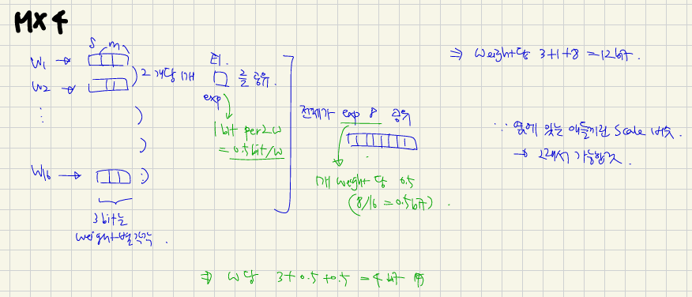

$$
3 + \frac{1}{2} + \frac{8}{16} = 4
$$

이 행은 data type이 $S1M2$라고 되어 있어.

* $S1$: sign 1bit
* $M2$: mantissa 2bit

그래서 각 weight가 기본적으로 $3$bit를 쓴다.

그런데 추가적으로 shared exponent 또는 scale 관련 overhead가 붙는다.

* $\frac{1}{2}$: L0 group size가 2라서, 1bit짜리 정보를 2개 원소가 공유하는 식의 overhead
* $\frac{8}{16}$: L1 scale이 8bit이고, 16개 단위로 공유

그래서 총 effective bit width가 4bit가 된다.

<**MX6**>

$$
5 + \frac{1}{2} + \frac{8}{16} = 6
$$

여기서는 data type이 $S1M4$라서:

* sign 1bit
* mantissa 4bit

기본 weight 표현이 5bit.

나머지 overhead를 더해서 6bit가 된다.

<**MX9**>

$$
8 + \frac{1}{2} + \frac{8}{16} = 9
$$

여기서는 data type이 $S1M7$라서:

* sign 1bit
* mantissa 7bit

기본 weight 표현이 8bit.

overhead를 더하면 9bit.

### 비교


### NVFP4


NVFP4는 **4-bit floating point 형식**으로, 값 하나를 대략 sign 1bit + exponent 2bit + mantissa 1bit로 표현한다.

그런데 4bit만 쓰면 표현 범위가 너무 좁아서, **16개 값마다 FP8 scale factor**를 하나 붙인다.

추가로 tensor 전체에 대해 **FP32 scale factor**를 한 번 더 곱한다.

즉 복원은 대략 $r = q_{\text{NVFP4}} \times s_{\text{block}} \times s_{\text{tensor}}$ 느낌이다.

핵심은 **값은 4bit로 작게 저장하되, block scale + tensor scale로 정확도를 보완하는 방식**이다.

---

## 6-3. Activation Quantization

Weight quantization은 상대적으로 쉽다. 왜냐하면 weight는 학습이 끝나면 고정되어 있기 때문이다. 하지만 activation은 input마다 달라진다.

슬라이드에서도 activation은 weight와 달리 range가 input에 따라 바뀌고, deployment 전에 activation statistics를 모아야 한다고 설명한다. 

즉 activation quantization의 문제는 이것이다.

> Runtime input이 들어오기 전에는 activation의 $r_{\min}$, $r_{\max}$를 정확히 모른다.

그런데 linear quantization을 하려면 floating-point range가 필요하다.

$$
S = \frac{r_{\max} - r_{\min}}{q_{\max} - q_{\min}}
$$

이런 식으로 scale을 정해야 하기 때문이다.

그래서 activation range를 추정하는 방법이 필요하다.

### 방법 1: Training 중 EMA 사용

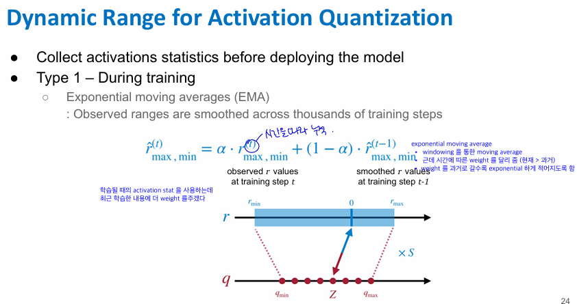

학습 중에는 forward를 계속 하므로 activation 값들을 볼 수 있다. 이때 observed min/max를 그대로 쓰지 않고 **EMA**, 즉 exponential moving average를 사용한다.

슬라이드에서는 observed range를 수천 training step 동안 smoothing한다고 되어 있다. 식으로는 대략 이런 느낌이다.

$$
r_{\max}^{(t)} = \alpha r_{\max}^{(t)} + (1-\alpha) r_{\max}^{(t-1)}
$$

정확히 말하면 현재 step에서 관찰한 range와 이전까지 smooth된 range를 섞는다. 최근 값에 더 가중치를 주고, 과거 값은 점점 작게 반영하는 방식이다.

### 방법 2: Calibration batch 사용

이미 학습된 FP32 model이 있을 때는, 몇 개의 sample batch를 넣어서 activation 통계를 구한다. 이것을 **calibration**이라고 한다.

예를 들어 deployment 전에 대표 입력 몇 batch를 넣어보고 activation min/max를 관찰한 뒤, 그 값을 기반으로 quantization range를 정한다.

여기서 중요한 점은 outlier다. activation에 아주 큰 outlier가 있으면 range를 너무 넓게 잡게 된다. 그러면 대부분의 일반적인 값들이 좁은 quantization bin에 몰려서 표현력이 떨어진다. 슬라이드에서도 outlier에 dynamic range를 많이 써버리면 representation ability가 나빠진다고 설명한다. 

그래서 단순히 max를 쓰지 않고, 다음 같은 기준을 사용할 수 있다.

첫 번째는 min/max 평균을 쓰는 방식. 여러 sample batch의 min/max를 구하고 평균을 낸다.

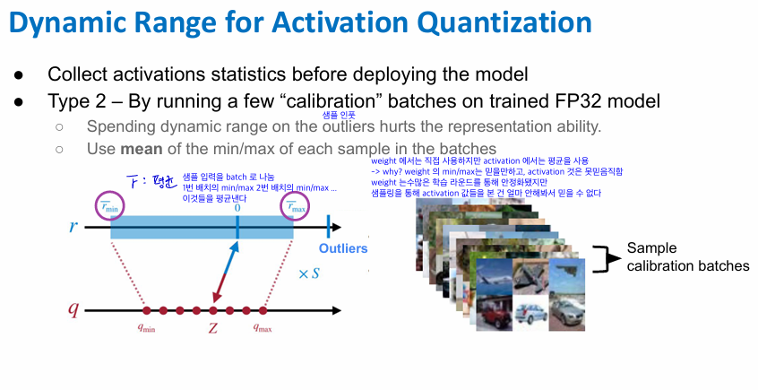

두 번째는 KL divergence를 최소화하는 방식. quantize 전 distribution과 quantize 후 distribution이 최대한 비슷해지도록 clipping range를 고른다.

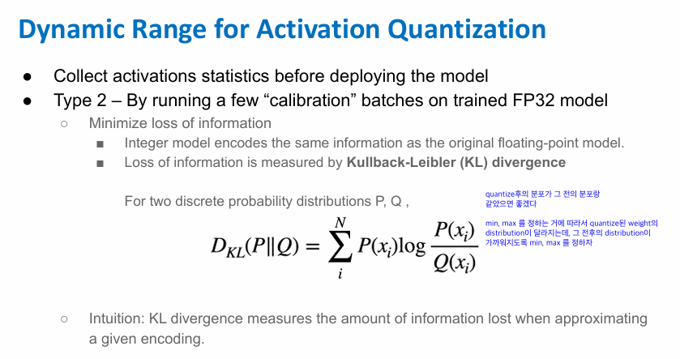

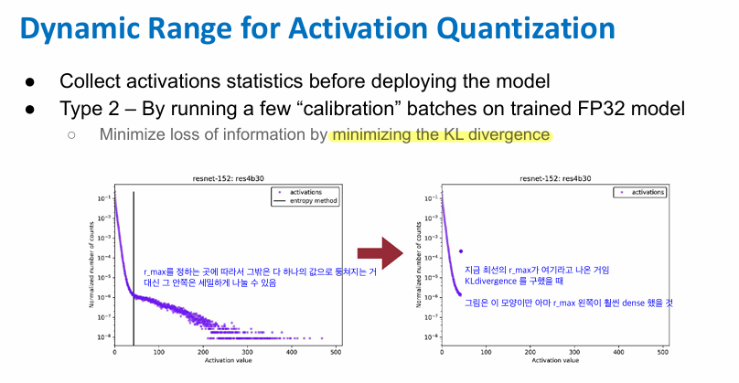

세 번째는 MSE를 최소화하는 방식. 원래 activation과 quantized activation 사이의 mean-square-error가 작아지도록 clipping threshold를 찾는다.


---

## 6-4. PTQ와 그 한계

지금까지 설명한 방식은 대부분 **PTQ**, 즉 Post-Training Quantization이다.

PTQ는 이미 학습된 FP32 model을 가져와서, 추가 학습 없이 또는 아주 적은 calibration만으로 quantization하는 방식이다.

장점은 빠르고 간단하다.
단점은 작은 모델에서는 성능이 크게 떨어질 수 있다.

슬라이드에서도 smaller models는 representational capacity가 작아서 PTQ에 잘 대응하지 못할 수 있다고 설명한다. 

그래서 등장하는 것이 QAT다.

---

## 6-5. Quantization-Aware Training, QAT

QAT는 말 그대로 **quantization을 고려하면서 학습하는 것**이다.

PTQ는 학습이 끝난 후에 “이제 int8로 바꿔보자”에 가깝다.
QAT는 학습 중부터 “어차피 inference 때 quantized weight/activation을 쓸 거니까, 학습할 때도 그 상황을 흉내 내자”에 가깝다.

슬라이드에서는 QAT를 “train the model taking quantization into consideration”이라고 설명하고, quantization 후 accuracy loss를 줄이기 위해 quantized model을 fine-tuning한다고 설명한다. 

핵심 구조는 이렇다.

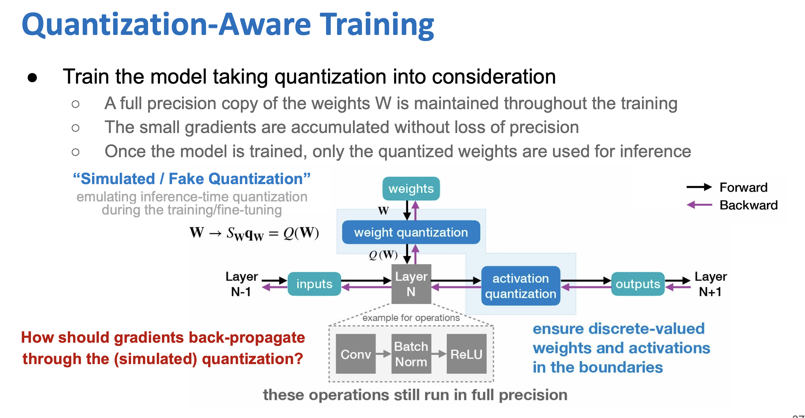

- **학습 중에는 full precision weight $W$를 유지한다.**

- **Forward pass에서는 quantized weight $Q(W)$를 사용한 것처럼 계산한다.**

- **Backward pass에서는 gradient를 full precision weight $W$에 누적한다.**

- **Inference 때는 quantized weight만 사용한다.**

즉 학습은 실수 기반으로 안정적으로 하고, forward에서는 quantization error를 일부러 경험하게 한다.

이것을 **fake quantization** 또는 **simulated quantization**이라고 한다.

---

## 6-6. Fake Quantization과 STE

문제는 quantization 함수가 discrete operation이라는 점이다.

예를 들어 어떤 실수 값을 round해서 integer로 만들면, 대부분의 구간에서 derivative가 0이다. 그러면 backpropagation할 때 gradient가 흐르지 않는다.

즉 그냥 quantization을 넣으면

$$
\frac{\partial Q(x)}{\partial x} = 0
$$

처럼 되어 학습이 잘 안 된다.

그래서 사용하는 것이 **STE**, Straight-Through Estimator다.

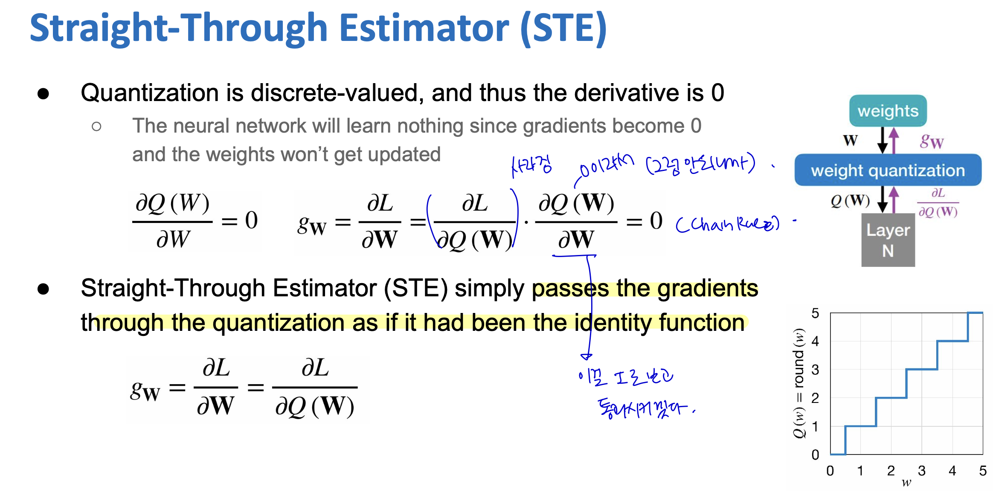

- Forward에서는 quantization을 한다.

- Backward에서는 quantization을 identity function처럼 취급해서 gradient를 그냥 통과시킨다.

즉 실제 forward는

$$
y = Q(x)
$$

인데, backward에서는 대충

$$
\frac{\partial Q(x)}{\partial x} \approx 1
$$

로 보는 것이다.

그래서 gradient가 0이 되어버리는 문제를 피한다. 슬라이드에서도 STE는 quantization을 identity function처럼 보고 gradient를 통과시킨다고 설명한다. 

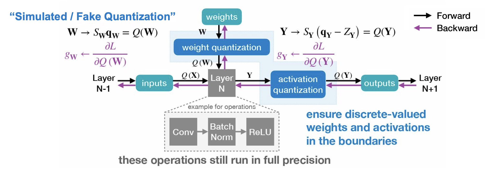

---

## 6-7. Modern QAT: Quantizer Parameter도 학습

기본 QAT에서는 scale factor나 clipping range를 calibration으로 정하거나 고정한다. 그런데 modern QAT에서는 이것도 학습할 수 있다.

예를 들어 activation clipping threshold $\alpha$, step size/scale $s$, offset 등을 weight와 함께 학습한다.

즉 단순히 weight만 학습하는 것이 아니라,

$$
W, s, \alpha, Z
$$

같은 quantizer configuration까지 같이 최적화하는 방향이다.

슬라이드에서는 PACT, LSQ, LSQ+ 같은 예시가 나온다. 이들은 clipping threshold나 scale, offset을 learnable parameter로 두는 방식이다.

---

## 6-8. Mixed-Precision Quantization

마지막 주제는 **mixed-precision quantization**이다.

일반적인 uniform quantization은 모든 layer를 똑같이 8bit, 8bit처럼 quantize한다. 예를 들어 모든 layer의 weight와 activation을 8bit로 맞춘다.

하지만 모든 layer가 quantization에 똑같이 민감한 것은 아니다.

어떤 layer는 4bit로 줄여도 accuracy가 거의 안 떨어지고, 어떤 layer는 4bit로 줄이면 성능이 크게 떨어질 수 있다.

그래서 mixed-precision quantization은 layer마다 bit-width를 다르게 정한다.

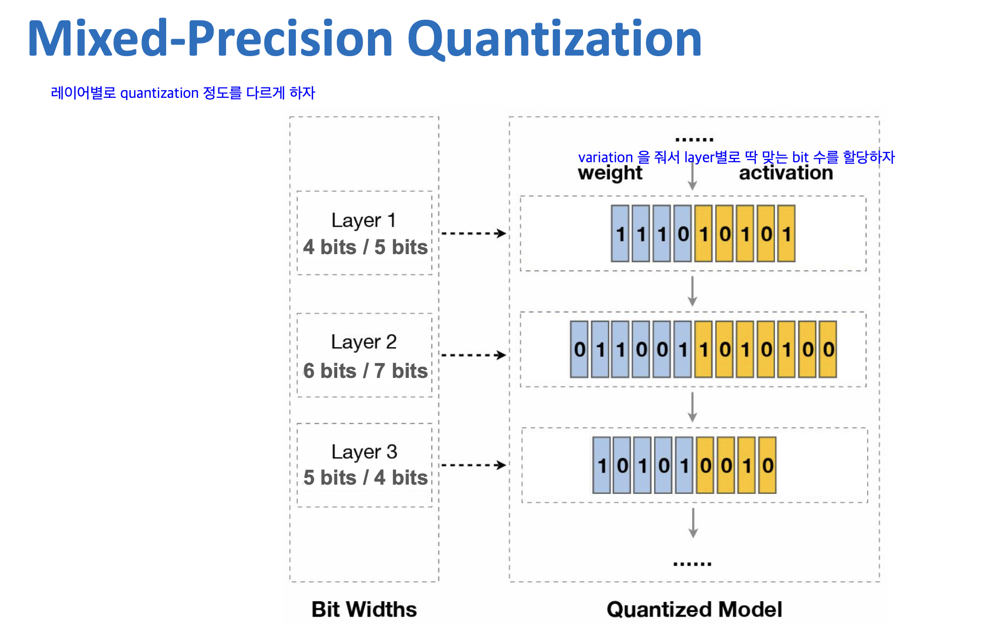

예를 들면,

$$
\text{Layer 1: W4A5}
$$

$$
\text{Layer 2: W6A7}
$$

$$
\text{Layer 3: W5A4}
$$

처럼 layer별로 weight bit와 activation bit를 다르게 둔다.

🟢 장점은 accuracy와 efficiency 사이의 trade-off를 더 잘 맞출 수 있다는 것이다.

🔴 단점은 design space가 엄청 커진다는 것이다. 슬라이드에서는 layer마다 weight bit와 activation bit 선택지가 있으면, 각 layer당 choices가 $8 \times 8 = 64$이고, layer가 $n$개면 design space가 $64^n$이 된다고 설명한다. 

그래서 HAQ 같은 방법은 reinforcement learning 등을 사용해서 hardware-aware하게 bit-width policy를 찾는다.

---

## 6-9. 시험/과제 관점 핵심 정리

Lecture 6에서 꼭 잡아야 하는 건 다음이야.

**Quantization granularity**는 scale factor를 어느 단위로 둘지의 문제다. Per-tensor는 간단하지만 error가 클 수 있고, per-channel은 정확하지만 scale overhead가 있다. Group/per-vector는 그 중간이다.

**Activation quantization**은 weight보다 어렵다. Weight는 고정되어 있지만 activation은 input마다 바뀌기 때문이다. 그래서 training 중 EMA를 쓰거나, calibration batch를 넣어서 activation range를 추정한다.

**Clipping range**를 잘 정해야 한다. 너무 넓게 잡으면 대부분 값의 resolution이 떨어지고, 너무 좁게 잡으면 outlier가 많이 잘린다. KL divergence나 MSE를 기준으로 range를 고를 수 있다.

**QAT**는 quantization을 고려해서 fine-tuning하는 방법이다. Forward에서는 quantized value를 쓰는 것처럼 하고, backward에서는 full precision weight에 gradient를 누적한다.

**STE**는 quantization의 gradient가 0이 되는 문제를 피하기 위해, backward에서 quantization을 identity처럼 취급하는 방법이다.

**Mixed precision**은 모든 layer에 같은 bit를 쓰지 않고 layer별로 다른 bit-width를 주는 방식이다. 효율은 좋아질 수 있지만 search space가 커져서 자동화 기법이 필요하다.

<div style="page-break-after: always;"></div>

# 📚 07. Quantization for LLMs

 Lecture 7은 **LLM에서는 왜 quantization이 더 어렵고, 그걸 어떻게 해결하는가**가 핵심이야. 강의 구성은 W8A8 SmoothQuant, W4A16 GPTQ/AWQ, rotation-based quantization, 4bit 이하 quantization, KV cache quantization, hardware trend로 되어 있어. 

## 7-1. LLM Quantization이 어려운 이유

CNN에서는 **W8A8 quantization**이 꽤 표준처럼 쓰인다.
여기서 W8A8은 weight도 8bit, activation도 8bit로 quantize한다는 뜻이야.

그런데 LLM에서는 이게 잘 안 된다. 이유는 **activation outlier** 때문이다. LLM이 커질수록 특정 channel에서 activation 값이 비정상적으로 크게 튀는 현상이 생긴다. 슬라이드에서는 6.7B 이상 모델부터 activation에 systematic outlier가 나타나고, 기존 CNN식 W8A8 quantization을 그대로 적용하면 accuracy가 크게 떨어진다고 설명한다. 

문제는 이런 거야.

Activation 대부분은 작은 값인데, 특정 channel에 엄청 큰 값이 있으면 quantization range를 그 outlier까지 포함해서 잡아야 한다. 그러면 대부분의 평범한 값들은 좁은 bin에 몰려서 정밀하게 표현되지 못한다.

즉 LLM quantization의 첫 번째 핵심 문제는:

> weight보다 activation이 더 어렵고, 그 이유는 activation outlier 때문이다.

---

## 7-2. SmoothQuant: W8A8을 가능하게 만들기

SmoothQuant의 아이디어는 **activation의 quantization 어려움을 weight 쪽으로 옮기는 것**이다.

LLM에서는 weight는 상대적으로 quantize하기 쉽고, activation은 outlier 때문에 어렵다. SmoothQuant는 activation의 큰 값을 줄이고, 대신 weight를 반대로 키워서 전체 linear layer의 출력은 그대로 유지한다. 슬라이드에서도 “**activation을 smoothing해서 quantization error를 줄이고, activation의 어려움을 weight로 옮겨 둘 다 quantize하기 쉽게 만든다**”고 설명한다. 

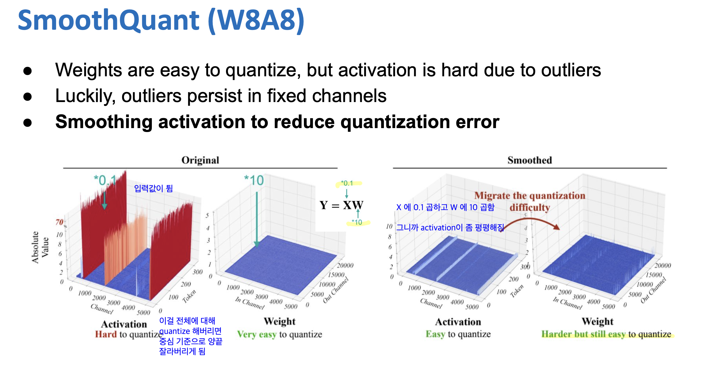

Linear layer가 다음처럼 있다고 하자.

$$
Y = XW
$$

SmoothQuant는 channel별 scale $s$를 사용해서 다음처럼 바꾼다.

$$
Y = (X \operatorname{diag}(s)^{-1})(\operatorname{diag}(s)W)
$$

즉,

$$
\hat{X} = X \operatorname{diag}(s)^{-1}
$$

$$
\hat{W} = \operatorname{diag}(s)W
$$

로 두면,

$$
Y = \hat{X}\hat{W}
$$

가 된다.

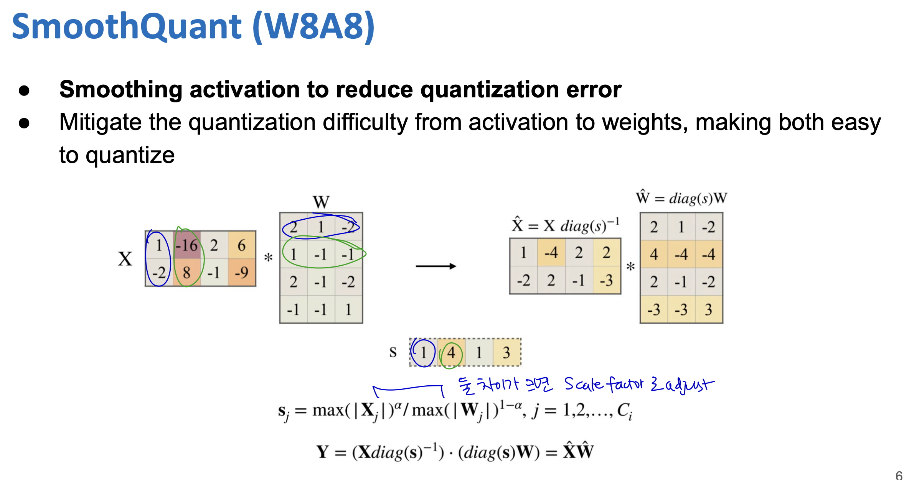

쉽게 말하면 activation 쪽에 튀는 channel이 있으면 그 activation을 작게 만들고, 대신 해당 weight를 크게 만든다. 결과값은 같지만 activation의 range가 덜 튀게 되므로 activation quantization이 쉬워진다.

예를 들어 activation에 10배 큰 channel이 있으면,

$$
X \leftarrow 0.1X
$$

$$
W \leftarrow 10W
$$

처럼 조정하는 느낌이다.

🟢 SmoothQuant는 fine-tuning 없이도 accuracy를 잘 유지하고, inference를 빠르게 하면서 memory footprint도 줄일 수 있다고 설명된다. 특히 MT-NLG 530B 같은 큰 모델에서도 GPU 수를 절반으로 줄이면서 비슷한 latency를 유지할 수 있다고 나온다. 

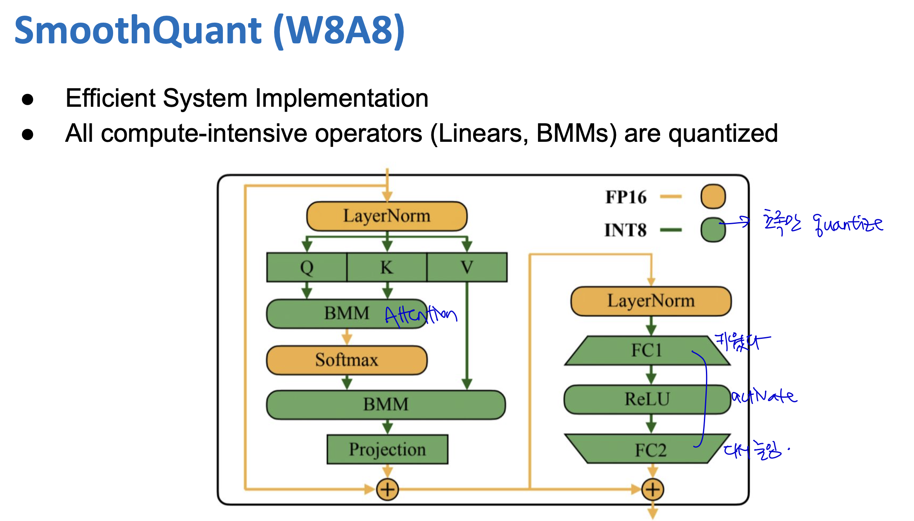

---

## 7-3. W8A8 vs W4A16: 언제 weight-only가 필요한가?

W8A8은 batch decoding에는 좋다. 예를 들어 batch size가 크면 weight를 한 번 읽어와서 여러 query에 대해 많이 계산하므로, 연산량 자체가 중요해진다.

그런데 local LLM처럼 **single-query inference**를 하면 상황이 다르다. Batch가 작으면 GPU가 연산으로 꽉 차기보다, 매 token마다 weight를 메모리에서 읽어오는 비용이 bottleneck이 된다.

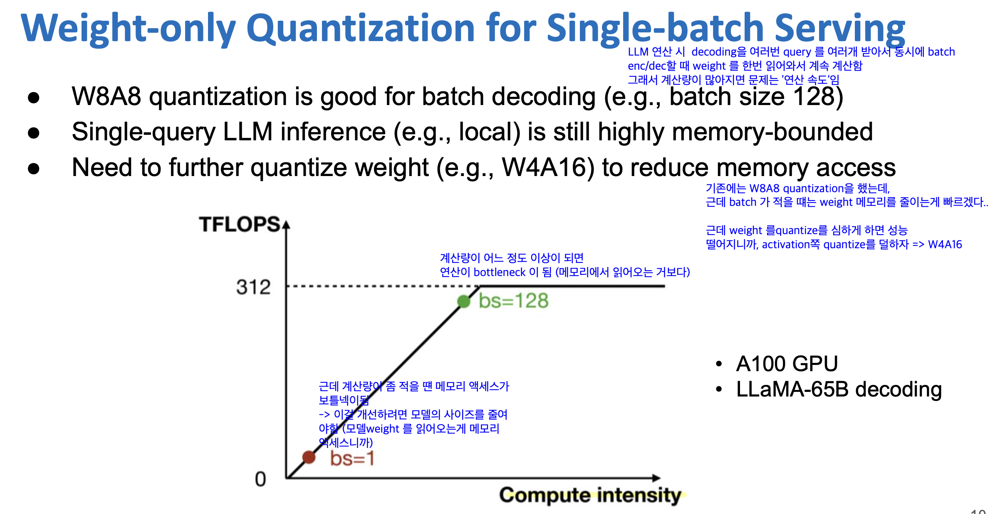

그래서 이때는 activation까지 8bit로 낮추는 것보다, **weight를 더 낮은 bit로 줄여서 memory access를 줄이는 것**이 중요하다.

이게 W4A16이다.

$$
\text{W4A16} = \text{Weight 4bit, Activation 16bit}
$$

즉 weight만 4bit로 세게 줄이고, activation은 FP16으로 둔다.

정리하면:

| 상황                          | 좋은 방식                | 이유                               |
| --------------------------- | -------------------- | -------------------------------- |
| Batch가 큼                    | W8A8                 | 연산량이 많아서 compute 효율 중요           |
| Batch가 작음 / local inference | W4A16                | weight memory access가 bottleneck |
| Activation outlier가 심함      | W4A16 또는 SmoothQuant | activation quantization이 어려움     |

---

## 7-4. GPTQ: quantization error를 보상하면서 weight-only quantization

GPTQ는 **post-training weight-only quantization** 방법이다.
핵심 아이디어는 그냥 weight를 반올림해서 quantize하지 않고, quantization하면서 생기는 error를 이후 weight들에 보상하는 것이다.

일반적인 Round-To-Nearest, RTN은 단순히 가장 가까운 quantized value로 보낸다.

$$
w_q = \operatorname{round}(w)
$$

하지만 이렇게 하면 weight 하나하나의 error가 누적되어 출력이 많이 달라질 수 있다.

### OBQ

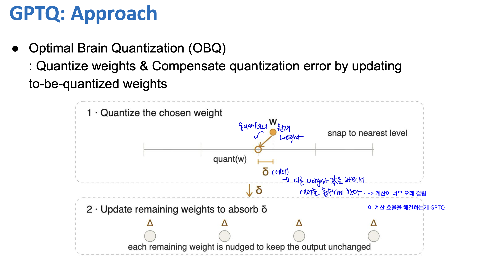

GPTQ는 Optimal Brain Quantization, OBQ 계열 아이디어에서 출발한다. 어떤 weight를 quantize해서 error가 생기면, 아직 quantize하지 않은 weight들을 조금 수정해서 그 error를 흡수하게 한다. 

슬라이드에서도 GPTQ는 “**quantize weights and compensate quantization error by updating to-be-quantized weights**”라고 설명한다. 

다만 OBQ를 그대로 하면 계산량이 너무 크다.
그래서 GPTQ는 시스템적으로 다음 최적화를 사용한다.

1. Column-wise fixed order
   - row마다 quantize 순서를 따로 찾지 않고, column 순서로 고정한다.
2. Hessian inverse reuse
   - 순서가 고정되어 있으니 같은 Hessian inverse 정보를 여러 row에서 재사용한다.
3. Lazy batch update
   - weight 하나 quantize할 때마다 바로 update하지 않고, 여러 개를 block으로 묶어서 한 번에 update한다.

즉 GPTQ는 한 줄로 말하면:

> weight를 낮은 bit로 바꾸되, quantization error가 출력에 주는 영향을 줄이도록 나머지 weight를 보정하는 PTQ 방법이다.

---

## 7-5. AWQ: Activation-aware Weight Quantization

AWQ는 이름 그대로 **activation-aware weight-only quantization**이다.

GPTQ가 second-order/Hessian 기반으로 error를 보정하는 느낌이라면, AWQ는 “어떤 weight channel이 중요한지 activation을 보고 찾자”는 쪽이다.

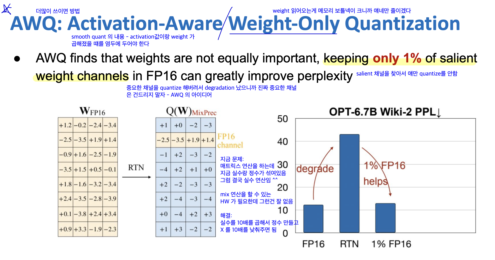

AWQ의 관찰은 이거야.

> 모든 weight가 똑같이 중요한 게 아니다. 아주 일부 salient weight channel만 잘 보존해도 perplexity가 크게 좋아진다.

슬라이드에서는 중요한 1% salient weight channel을 FP16으로 유지하면 perplexity가 크게 좋아질 수 있다고 설명한다. 그런데 실제로 FP16과 INT4를 섞으면 hardware에서 효율적으로 처리하기 어렵다. 실수와 정수가 섞이면 결국 실수 연산처럼 되어버릴 수 있기 때문이다. 

그래서 AWQ는 중요한 channel을 진짜 FP16으로 남기는 대신, **scaling**을 사용한다.

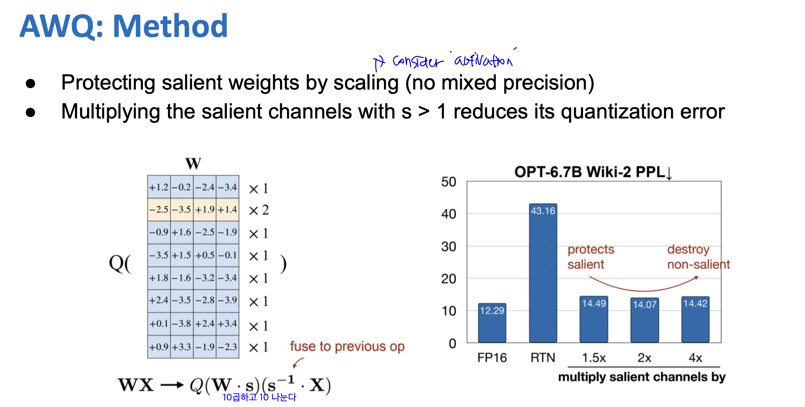

중요한 channel에 scale $s > 1$을 곱한다.

$$
W' = sW
$$

그리고 activation 쪽은 반대로 조정해서 전체 출력은 유지한다.

왜 이게 도움이 되냐면, quantization error가 상대적으로 줄어들기 때문이다. 슬라이드에서는 scaling을 하면 Round에서 생기는 error가 $s$에 의해 줄어드는 효과가 있고, group의 maximum value가 크게 변하지 않으면 $\Delta$도 크게 변하지 않는다고 설명한다. 

쉽게 말하면:

> W 에 10 곱해서 크게 만들고 quantize 하면 소수점 덜 떨어지니까 중요 채널의 weight 를 잘 보존하고 대신에 X 에 10으로 나눠서 activation 값을 맞춰줌

AWQ에서 중요한 점은 salient channel을 weight magnitude만 보고 고르지 않는다는 것이다. 슬라이드에서도 “weight magnitude가 아니라 activation distribution을 봐야 한다”고 강조한다. 

---

## 7-6. Rotation-based Quantization: QuaRot, SpinQuant

SmoothQuant와 AWQ는 outlier를 scale 조정으로 다루었다.
Rotation-based quantization은 outlier를 **orthogonal rotation**으로 퍼뜨리는 방식이다.

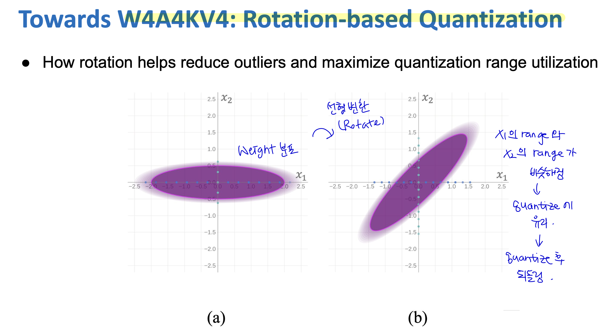

핵심 아이디어는 이거야.

어떤 vector에 값이 한 channel에만 너무 몰려 있으면 quantization이 어렵다.
그런데 orthogonal rotation을 적용하면 전체 정보량은 유지하면서 값들이 여러 dimension으로 더 고르게 퍼질 수 있다.

즉 outlier를 한 channel에 몰아두지 않고 분산시켜서 quantization range를 더 잘 활용하게 만든다.

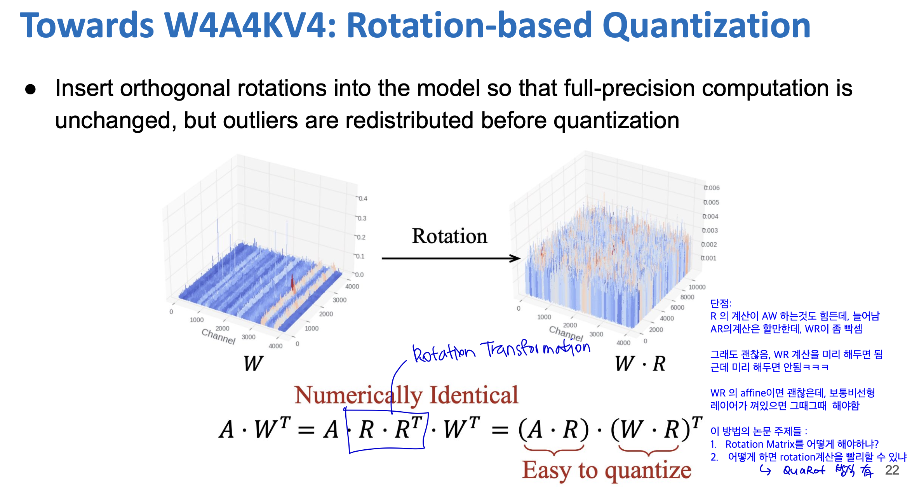

수식으로 보면, 어떤 orthogonal matrix $R$에 대해

$$
RR^T = I
$$

이므로, 적절히 삽입하면 full-precision 계산 결과는 유지하면서 내부 표현만 바꿀 수 있다.

### QuaRot

QuaRot은 rotation을 사용해서 W4A4KV4, 즉 weight, activation, KV cache까지 4bit로 가는 방향의 방법이다.

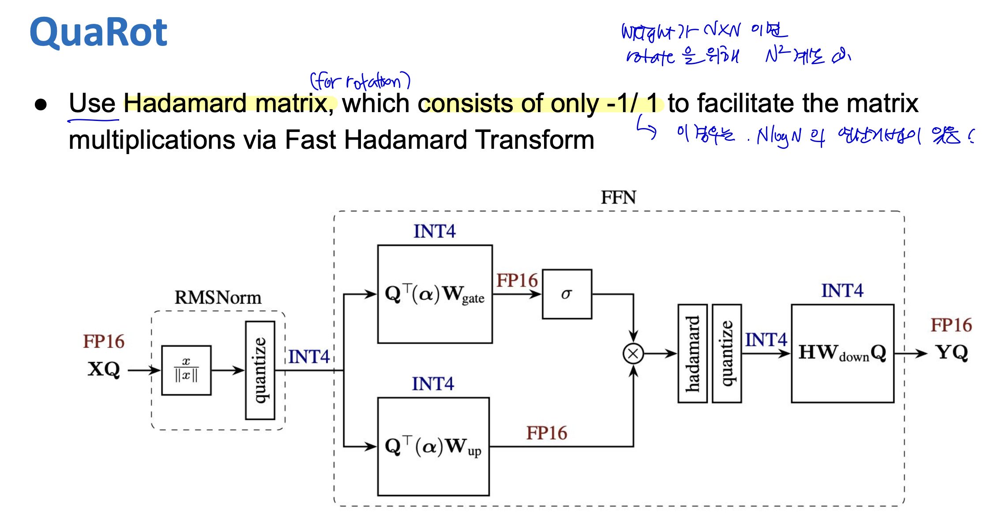

슬라이드에서는 orthogonal rotation을 모델에 삽입해서 full-precision computation은 유지하면서 quantization 전에 outlier를 재분배한다고 설명한다. 또한 Hadamard matrix를 사용한다. **Hadamard matrix는 원소가 $-1$ 또는 $+1$이라서 Fast Hadamard Transform으로 빠르게 계산할 수 있다.**
- $O(N^2)$ -> $O(N log N)$

단점은 rotation 연산 자체도 비용이 든다는 것이다.
$RW$ 같은 weight 쪽 rotation은 offline으로 미리 계산할 수 있으면 괜찮지만, nonlinear layer가 끼어 있으면 동적으로 계산해야 해서 부담이 생긴다.

### SpinQuant

SpinQuant는 “rotation matrix를 그냥 random하게 쓰지 말고, **더 좋은 rotation을 학습하자”는 방법**이다.

슬라이드에서는 random rotation은 variance가 크고, random Hadamard rotation이 조금 낫고, learned rotation이 가장 높은 accuracy와 가장 작은 variance를 달성한다고 설명한다. 

즉 QuaRot은 빠른 Hadamard 기반 rotation, SpinQuant는 learned rotation이라는 느낌으로 보면 된다.

---

## 7-7. Beyond 4bit: QuIP#, AQLM, BitNet

4bit보다 더 줄이려면 일반 scalar quantization만으로는 어렵다. 그래서 두 가지 방향이 나온다.

### Vector Quantization

Vector quantization은 weight 하나하나를 따로 quantize하는 게 아니라, 여러 weight를 묶은 vector를 codebook의 대표 vector에 매핑한다.

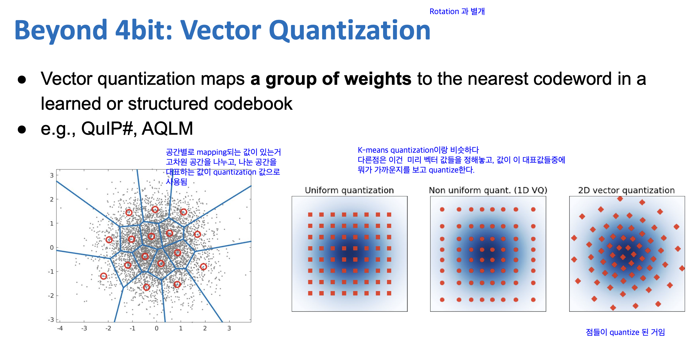

즉 어떤 weight group $w$가 있으면,

$$
w \rightarrow c_i
$$

여기서 $c_i$는 codebook 안의 대표 vector다.

K-means quantization과 비슷한 느낌인데, scalar 값이 아니라 vector 단위로 가까운 codeword를 찾는다는 점이 다르다. 슬라이드에서는 QuIP#, AQLM이 이런 방향의 예시로 나온다. 

### BitNet

BitNet은 아예 low-bit로 처음부터 학습하는 방향이다.

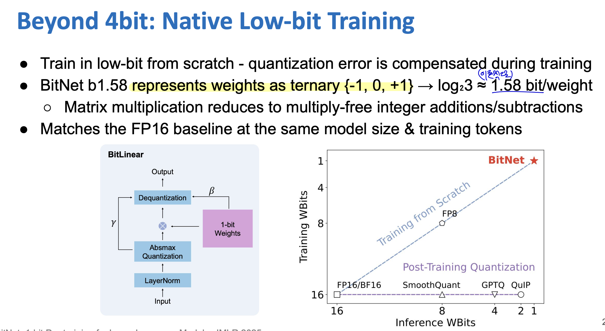

BitNet b1.58은 weight를 ternary value로 표현한다.

$$
W \in {-1, 0, +1}
$$

가능한 값이 3개라서 필요한 bit 수는

$$
\log_2 3 \approx 1.58
$$

이다.

장점은 matrix multiplication이 곱셈 없이 integer addition/subtraction 중심으로 바뀔 수 있다는 것이다. 슬라이드에서는 같은 model size와 training token 조건에서 FP16 baseline과 비슷한 성능을 낼 수 있다고 설명한다. 

---

## 7-8. KV Cache Quantization

앞에서는 weight와 activation을 quantize했다.
그런데 LLM serving에서는 또 하나의 큰 메모리 문제가 있다. 바로 **KV cache**다.

Autoregressive decoding에서는 이전 token들의 Key, Value를 계속 저장한다. Sequence length가 길어지고 batch size가 커질수록 KV cache는 선형적으로 커진다. 슬라이드에서도 KV cache가 batch size와 sequence length에 따라 linearly grow하고, long-context/high-throughput serving에서는 KV cache memory traffic이 inference latency를 지배할 수 있다고 설명한다. 

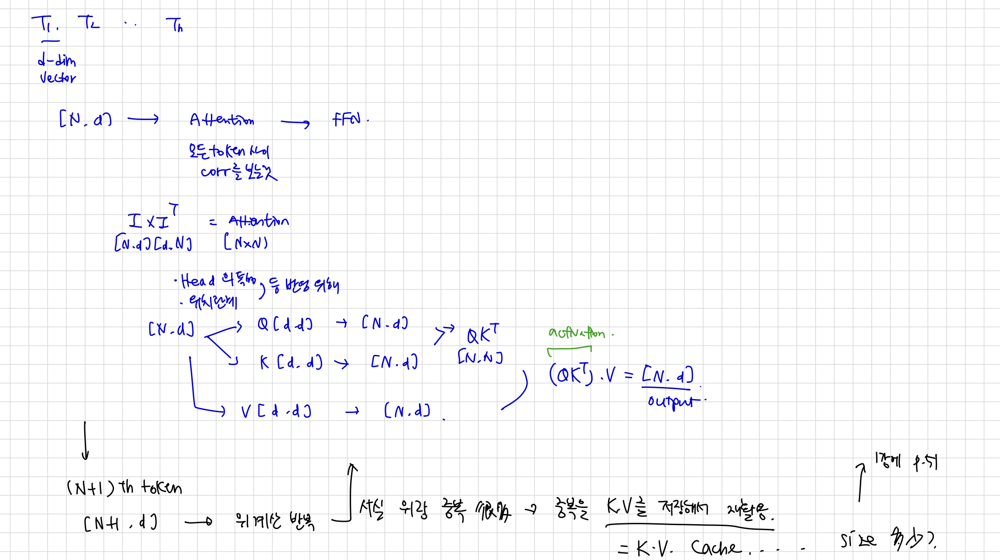

그래서 KV cache도 quantize해야 한다.

### KIVI

KIVI는 KV cache의 분포 특성을 보고 Key와 Value를 다르게 quantize한다.

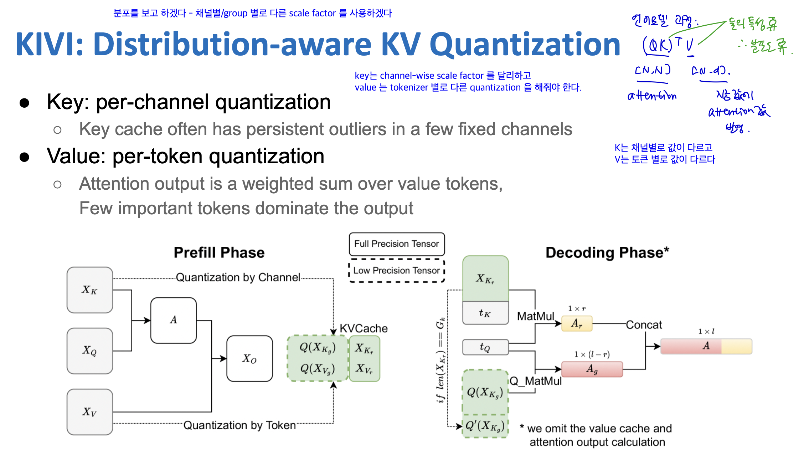

Key cache는 특정 fixed channel에 persistent outlier가 있는 경우가 많다. 그래서 Key는 **per-channel quantization**을 한다.

Value는 attention output이 value token들의 weighted sum이고, 몇몇 중요한 token이 output을 지배할 수 있다. 그래서 Value는 **per-token quantization**을 한다.

정리하면:

$$
K: \text{per-channel quantization}
$$

$$
V: \text{per-token quantization}
$$

슬라이드에서도 Key는 fixed channel outlier 때문에 per-channel, Value는 token별 중요도 때문에 per-token이라고 설명한다. 

### TurboQuant

TurboQuant는 KV vector 자체를 잘 복원하는 것만이 목표가 아니라, **attention score**, 즉 inner product를 잘 보존해야 한다고 본다.

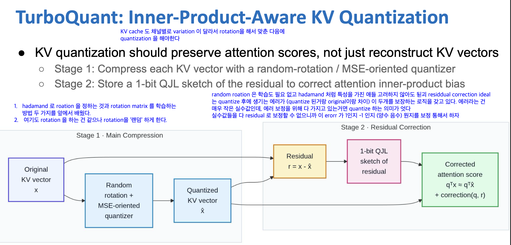

Attention에서는 결국

$$
QK^T
$$

가 중요하다. 따라서 KV quantization은 단순히 $K$, $V$의 MSE를 줄이는 것보다, attention score가 안 망가지게 하는 것이 중요하다.

TurboQuant는 두 단계로 설명된다.

첫째, random rotation과 MSE-oriented quantizer로 각 KV vector를 압축한다.

둘째, residual을 1-bit QJL sketch로 저장해서 attention inner-product bias를 보정한다.

즉 quantization 후 생기는 오차를 전부 float으로 저장하면 quantization 의미가 없으니, 오차의 방향성 같은 최소한의 정보를 1bit로 저장해 보정하는 방식이다. 

---

## 7-9. 전체 비교

| 방법           | 대상                | 핵심 아이디어                                |
| ------------ | ----------------- | -------------------------------------- |
| SmoothQuant  | W8A8              | activation outlier를 weight 쪽으로 옮김      |
| GPTQ         | W4A16 weight-only | quantization error를 남은 weight에 보상      |
| AWQ          | W4A16 weight-only | activation을 보고 중요한 weight channel 보호   |
| QuaRot       | W4A4KV4           | rotation으로 outlier를 분산                 |
| SpinQuant    | W4A4              | 좋은 rotation matrix를 학습                 |
| QuIP# / AQLM | 4bit 이하           | vector를 codebook으로 quantize            |
| BitNet       | 1.58bit weight    | 처음부터 ternary weight로 학습                |
| KIVI         | KV cache          | Key는 per-channel, Value는 per-token     |
| TurboQuant   | KV cache          | inner product 보존 + residual correction |

---

## 7-10. 시험/과제 관점 핵심 정리

Lecture 7에서 가장 중요한 문장은 이거야.

> LLM quantization은 activation outlier와 KV cache 때문에 일반 CNN quantization보다 어렵다.

SmoothQuant는 activation outlier를 weight 쪽으로 옮겨서 W8A8을 가능하게 한다.

GPTQ는 weight-only quantization에서 quantization error를 보상한다.

AWQ는 activation distribution을 보고 중요한 weight channel을 보호한다.

Rotation-based quantization은 outlier를 rotation으로 분산시켜 W4A4 같은 더 aggressive한 quantization을 가능하게 한다.

KV cache quantization은 long-context serving에서 중요하고, KIVI는 Key와 Value의 분포 차이에 맞춰 서로 다른 granularity를 사용한다.

한 줄 요약하면:

> Lecture 7은 “LLM에서는 activation outlier와 KV cache가 문제라서, SmoothQuant, GPTQ, AWQ, rotation, KV quantization 같은 LLM 전용 quantization 기법이 필요하다”는 내용이다.

<div style="page-break-after: always;"></div>

# 📚 08. Knowledge Distillation

Lecture 8은 **Knowledge Distillation, 지식 증류**야. 핵심은 **큰 teacher model이 가진 지식을 작은 student model이 배우도록 loss를 추가하는 방법**이다. 강의 전체 agenda도 “무엇을 match할 것인가”, “KD의 종류”, “task별 distillation”, “network augmentation”으로 구성되어 있어. 

## 8-1. 왜 Knowledge Distillation이 필요한가?

작은 edge device에서는 메모리와 연산 자원이 부족해서 큰 모델을 그대로 쓰기 어렵다. 슬라이드에서는 Cloud AI는 ResNet, ViT-Large 같은 큰 모델을 쓸 수 있지만, Tiny AI는 MCUNet, MobileNetV2-Tiny처럼 작은 모델을 써야 한다고 설명한다. 

문제는 작은 모델은 학습이 어렵고 성능이 낮기 쉽다는 것이다. 슬라이드에서도 tiny model은 큰 dataset에서 underfit하기 쉽다고 설명한다. 

그래서 아이디어는 이거야.

> 이미 잘 학습된 큰 모델이 있으면, 작은 모델이 그 큰 모델의 “푸는 방식”을 따라 배우게 하자.

여기서 큰 모델이 **teacher**, 작은 모델이 **student**다.

---

## 8-2. Knowledge Distillation의 기본 개념

일반적인 학습은 정답 label만 보고 학습한다.

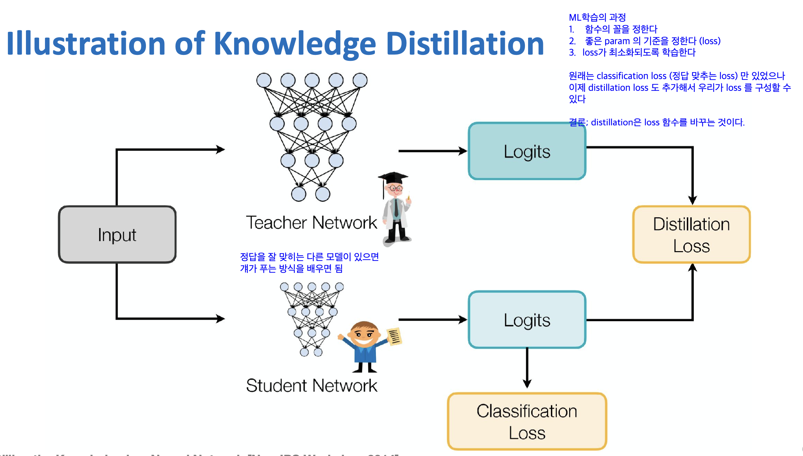

예를 들어 고양이 사진이면 label은 “cat”이다. 그러면 student는 cat을 맞히도록 cross entropy loss로 학습한다.

하지만 KD에서는 teacher의 출력도 같이 본다.

즉 student의 loss는 보통 이런 구조가 된다.

<div>
$$
L = L_{CE}(y, p_s) + \lambda L_{KD}(p_t, p_s)
$$
</div>

여기서

* $y$: 정답 label
* $p_s$: student prediction
* $p_t$: teacher prediction
* $L_{CE}$: 정답을 맞히는 loss
* $L_{KD}$: teacher와 student를 비슷하게 만드는 loss

슬라이드에도 원래는 classification loss만 있었지만, 이제 distillation loss를 추가해서 loss를 구성한다고 설명되어 있어. 즉 KD는 결국 **loss 함수를 바꾸는 것**이라고 보면 된다. 

---

## 8-3. Output Logits / Probability를 맞추는 기본 KD

가장 기본적인 KD는 teacher와 student의 **output probability distribution**을 맞추는 것이다. 슬라이드에서도 teacher와 student의 prediction probabilities를 match하는 것이 기본 intuition이라고 나온다. 

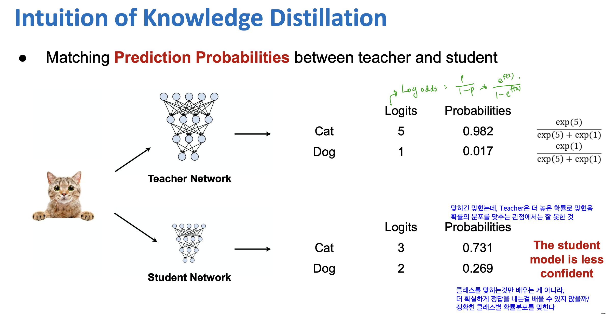

예를 들어 teacher가 이렇게 예측했다고 하자.

$$
p_t(\text{cat}) = 0.982
$$

$$
p_t(\text{dog}) = 0.017
$$

student는 이렇게 예측했다.

$$
p_s(\text{cat}) = 0.731
$$

$$
p_s(\text{dog}) = 0.269
$$

둘 다 cat을 맞혔으니까 classification만 보면 둘 다 맞은 것이다.
하지만 teacher는 훨씬 확신 있게 cat이라고 말하고, student는 덜 확신한다.

KD는 단순히 정답 class만 배우는 것이 아니라,

> teacher가 각 class를 얼마나 그럴듯하게 보는지까지 배운다.

이걸 **soft label**이라고 보면 된다.

---

## 8-4. Temperature

KD에서 중요한 개념이 **temperature**다. Temperature는 softmax를 부드럽게 만드는 값이다. 슬라이드에서도 temperature는 output probability distribution을 smooth하게 만든다고 설명한다. 

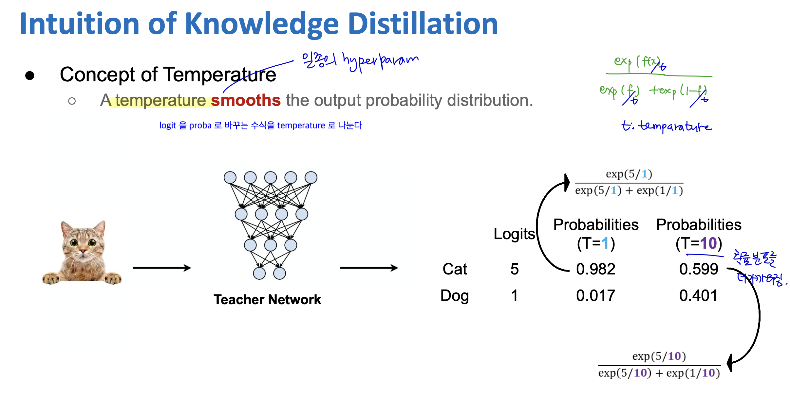

일반 softmax는

$$
p_i = \frac{\exp(z_i)}{\sum_j \exp(z_j)}
$$

인데, temperature $T$를 넣으면

$$
p_i(T) = \frac{\exp(z_i / T)}{\sum_j \exp(z_j / T)}
$$

가 된다.

$T=1$이면 일반 softmax고, $T$가 커지면 확률분포가 더 부드러워진다.

예를 들어 teacher logit이 cat $5$, dog $1$이면 $T=1$에서는 cat 확률이 거의 $0.982$로 매우 크다. 그런데 $T=10$을 쓰면 cat $0.599$, dog $0.401$처럼 더 부드러운 분포가 된다. 슬라이드에도 이 예시가 나온다. 

왜 부드럽게 만들까?

정답이 cat이라고 해도 dog가 얼마나 비슷한 후보인지, bird는 얼마나 아닌지 같은 **class 간 관계 정보**가 더 잘 드러나기 때문이다.

---

## 8-5. 무엇을 Match할 것인가?

Lecture 8의 핵심은 “teacher의 무엇을 student가 따라 할 것인가?”야. 슬라이드에서는 output logits, intermediate weights, intermediate features, gradients, sparsity patterns, relational information을 다룬다. 

### 8-5-1. Output Logits

가장 기본은 teacher와 student의 최종 logits/probabilities를 맞추는 것이다.

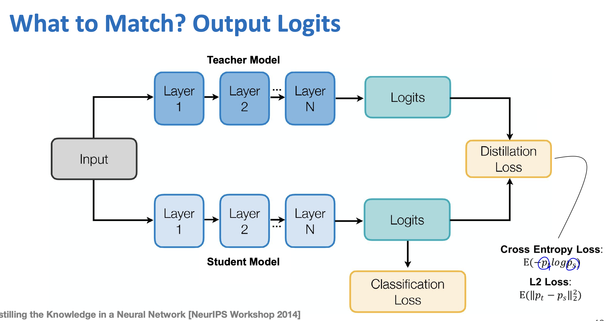

$$
L_{KD} = D(p_t, p_s)
$$

여기서 $D$는 KL divergence, cross entropy, MSE 등이 될 수 있다.

이 방식은 간단하지만, teacher의 중간 reasoning 과정은 직접 배우지 않는다.

---

### 8-5-2. Intermediate Weights / Hidden Layers

두 번째는 중간 layer의 표현을 맞추는 것이다.

Teacher와 student는 구조가 다를 수 있다. 예를 들어 teacher는 20층, student는 5층이면 layer를 1:1로 맞추기 어렵다. 그래서 중간 layer를 선택하고, 필요하면 linear transformation을 붙여 dimension을 맞춘다. 슬라이드에서도 intermediate hidden layer 사이에 L2 loss를 추가하고, dimensionality를 맞추기 위해 linear transformation을 적용한다고 설명한다. 

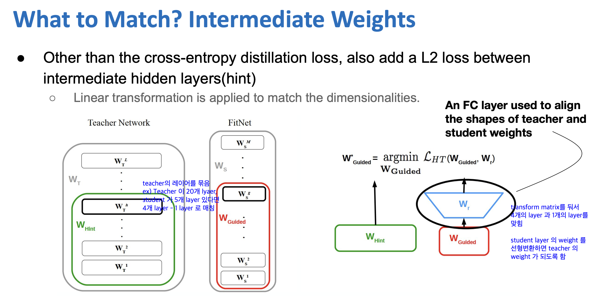

예를 들어 teacher feature가 $h_t$, student feature가 $h_s$라면,

$$
L_{hint} = | h_t - g(h_s) |_2^2
$$

처럼 쓸 수 있다.

여기서 $g$는 student feature의 dimension을 teacher에 맞추는 projection layer다.

---

### 8-5-3. Intermediate Features

Intermediate feature distillation은 teacher와 student가 최종 output뿐 아니라 **중간 feature map의 분포**도 비슷하게 만들자는 것이다. 슬라이드에서도 “teacher와 student는 output probability뿐 아니라 feature distribution도 비슷해야 한다”고 설명한다. 

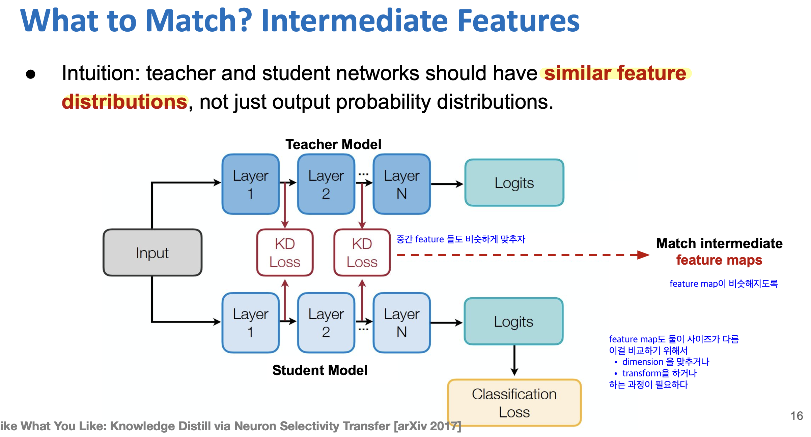

CNN으로 보면 teacher가 어떤 layer에서 edge, texture, object part 등을 어떻게 표현하는지 student도 비슷하게 배우게 하는 것이다.

이때도 feature map 크기나 channel 수가 다를 수 있어서 resize나 projection이 필요하다.

---

### 8-5-4. Gradients / Attention Map

Teacher가 “어디를 보고 판단했는지”를 student가 따라 하게 만들 수도 있다.

슬라이드에서는 CNN feature map $x$에 대한 attention을

$$
\frac{\partial L}{\partial x}
$$

로 정의한다. 만약 어떤 위치 $(i,j)$에서 gradient가 크면, 그 위치를 조금만 바꿔도 output이 크게 바뀐다는 뜻이다. 즉 모델이 그 위치에 attention을 많이 두고 있다는 의미다. 

그래서 student의 attention map이 teacher의 attention map과 비슷해지도록 loss를 추가할 수 있다.

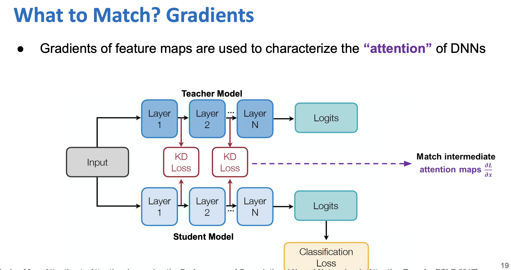

이건 네가 전에 과제에서 봤던 **Attention Transfer**랑 연결되는 부분이야.

---

### 8-5-5. Sparsity Patterns

ReLU 이후에는 activation이 0이 되는 위치와 살아남는 위치가 생긴다.

Teacher와 student가 정확한 activation 값을 맞추기는 어려울 수 있지만,

> 어떤 neuron/channel이 켜지고 꺼지는지의 pattern은 비슷하게 만들 수 있지 않을까?

라는 아이디어가 sparsity pattern distillation이다.

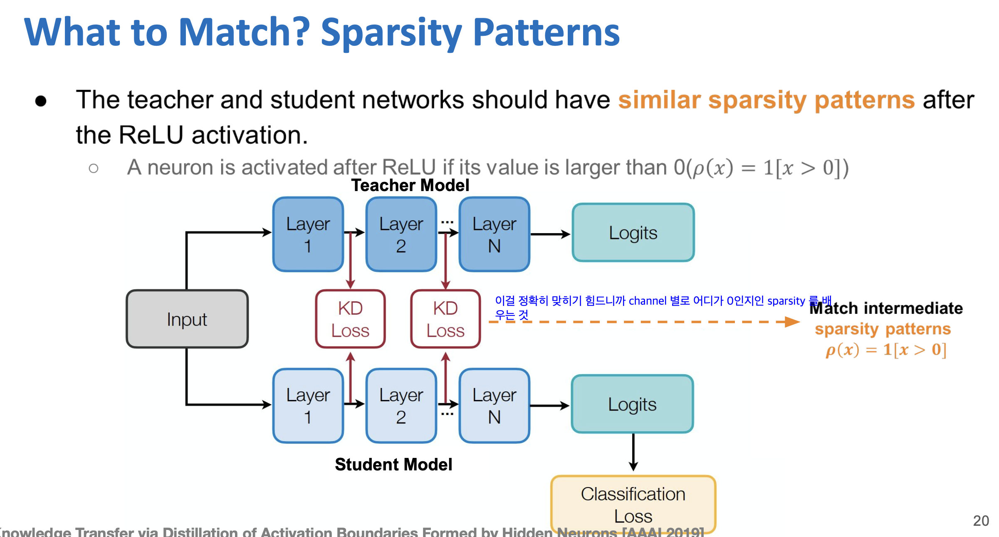

슬라이드에서도 teacher와 student는 ReLU activation 이후 비슷한 sparsity pattern을 가져야 한다고 설명한다. 

즉 값 자체보다는

$$
\rho(x) = 1[x > 0]
$$

같은 activation boundary를 맞추는 것이다.

---

### 8-5-6. Relational Information

마지막은 teacher와 student의 개별 output을 point-to-point로 맞추는 것이 아니라, **관계**를 맞추는 것이다.

두 가지 관계가 나온다.

첫 번째는 **layer 간 관계**다. Teacher의 여러 layer 사이 feature 변화 관계를 student도 비슷하게 가지도록 한다. 슬라이드에서는 FSP matrix를 이용해 layer 간 relational information을 추출한다고 설명한다. 
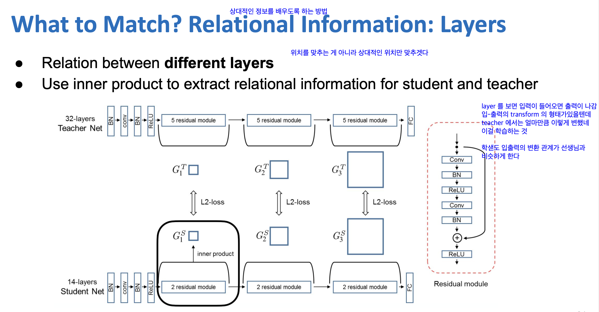

두 번째는 **sample 간 관계**다. 예를 들어 teacher가 sample 1, 2, 3을 feature space에서 어떤 거리 관계로 배치하는지를 student도 비슷하게 유지하도록 한다. 슬라이드에서도 Relational KD는 여러 input의 intermediate feature 사이 관계를 본다고 설명한다. 
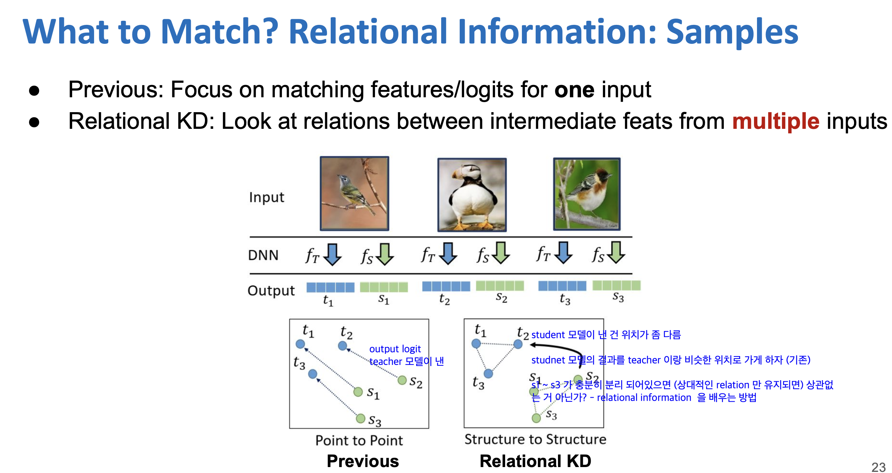

즉 기존 KD가

> student output이 teacher output과 같은 위치로 가야 한다

였다면, relational KD는

> sample들 사이의 상대적인 거리나 구조가 teacher와 비슷하면 된다

에 가깝다.

---

## 8-6. KD의 종류

슬라이드 agenda에는 Self Distillation, Online Distillation, Combined Distillation이 나온다. 

**Vanilla KD**는 이미 학습된 teacher가 있고, student가 그 teacher를 따라 배운다.

**Self Distillation**은 teacher와 student가 같은 모델이거나 같은 network 안에서 이루어진다. 예를 들어 깊은 layer의 출력을 shallow layer가 따라 배우게 할 수 있다.

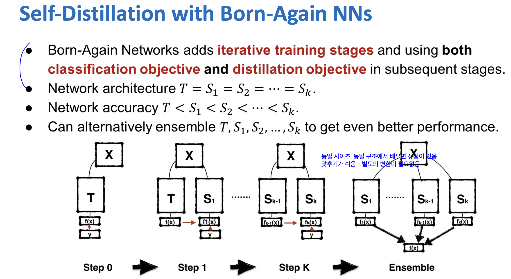

**Online Distillation**은 teacher가 미리 고정되어 있지 않고, 여러 student가 동시에 학습하면서 서로를 teacher처럼 활용하는 방식이다.

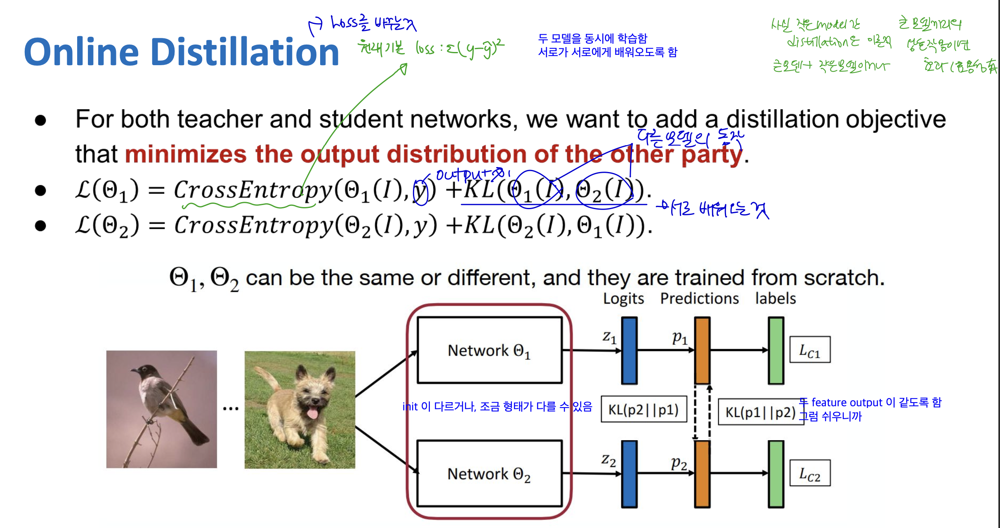

**Combined Distillation**은 여러 distillation signal을 함께 쓰는 것이다. 예를 들어 output logits도 맞추고, feature map도 맞추고, attention map도 맞추는 식이다.

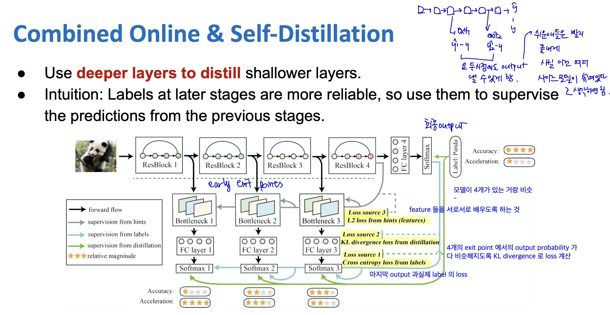

---

## 8-7. 전체 loss는 어떻게 생기나?

가장 기본적인 KD loss는 이런 식으로 생각하면 된다.

<div>
$$
L =
(1-\alpha)L_{CE}(y, p_s)
+ \alpha T^2 L_{KD}(p_t(T), p_s(T))
$$
</div>

여기서

* $L_{CE}$: student가 정답 label을 맞히는 loss
* $L_{KD}$: teacher와 student의 soft probability를 맞추는 loss
* $T$: temperature
* $\alpha$: 정답 loss와 distillation loss의 비율

중간 feature까지 맞추면 여기에 항이 더 추가된다.

<div>
$$
L = L_{CE} + \lambda_1 L_{logit} + \lambda_2 L_{feature} + \lambda_3 L_{attention}
$$
</div>

결국 KD는 “teacher에게서 어떤 정보를 배울지 정하고, 그 정보를 loss로 추가하는 것”이라고 보면 된다.

## 8-8. Distillation for Different Tasks

“KD가 classification에만 쓰이는 게 아니라, task별로 맞춰야 하는 output/loss가 달라진다”는 내용이야. 슬라이드에서도 KD for Object Detection, Semantic Segmentation, GAN, Transformers, LLMs가 따로 나온다. 

### 8-8-1. Object Detection에서의 KD

Object detection은 단순 classification이 아니라,

$$
\text{Object Detection} = \text{Classification} + \text{Bounding Box Regression}
$$

이야.

즉 “이 물체가 고양이냐?”뿐 아니라 “고양이가 어디에 있냐?”까지 맞춰야 한다.

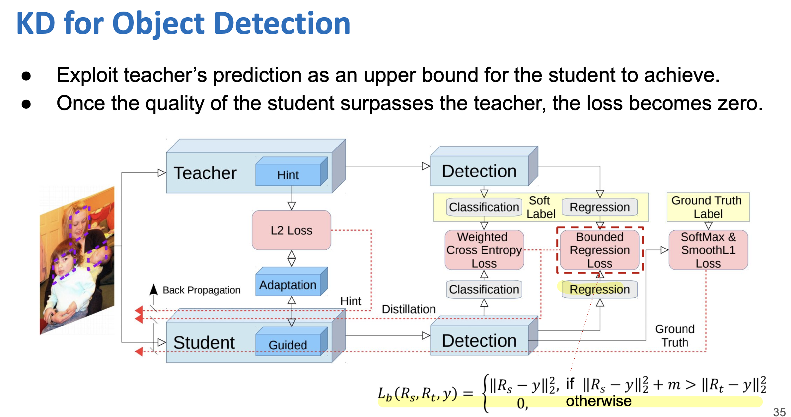

그래서 teacher와 student를 맞출 때도 두 가지를 본다.

첫째, class prediction을 맞춘다.
둘째, bounding box prediction을 맞춘다.

그런데 teacher와 student의 feature map shape이 다를 수 있으니까, 중간에 **$1 \times 1$ convolution**을 붙여서 shape을 맞춘다. 그리고 object detection은 background가 훨씬 많고 foreground object는 적기 때문에, foreground/background class imbalance를 고려해서 loss weight를 다르게 준다.

또 슬라이드에 나오는 특이한 아이디어는 teacher prediction을 student가 도달해야 할 **upper bound**처럼 쓰는 것이다. Student가 teacher보다 못하면 loss를 주고, student가 teacher보다 좋아지면 더 이상 teacher를 따라가게 하지 않고 loss를 0으로 만든다.

---

### 8-8-2. Semantic Segmentation에서의 KD

Semantic segmentation은 이미지 전체를 하나의 class로 분류하는 게 아니라, **pixel마다 classification**하는 문제야.

즉 각 pixel에 대해

$$
\text{pixel} \rightarrow \text{class}
$$

를 예측한다.

그래서 기본적으로는 classification KD와 비슷하지만, output이 이미지처럼 공간 구조를 가진다. 따라서 teacher와 student의 feature map을 맞추는 **feature imitation**을 쓸 수 있고, 더 나아가 segmentation map의 구조가 자연스러운지 보기 위해 **discriminator network**를 추가해서 adversarial loss를 줄 수도 있다.

쉽게 말하면:

> teacher가 만든 segmentation map처럼 student도 pixel-level 구조를 잘 따라 하게 만든다.

---

### 8-8-3. GAN에서의 KD

GAN에서는 teacher/student가 보통 **generator** 쪽에 적용된다고 보면 돼.

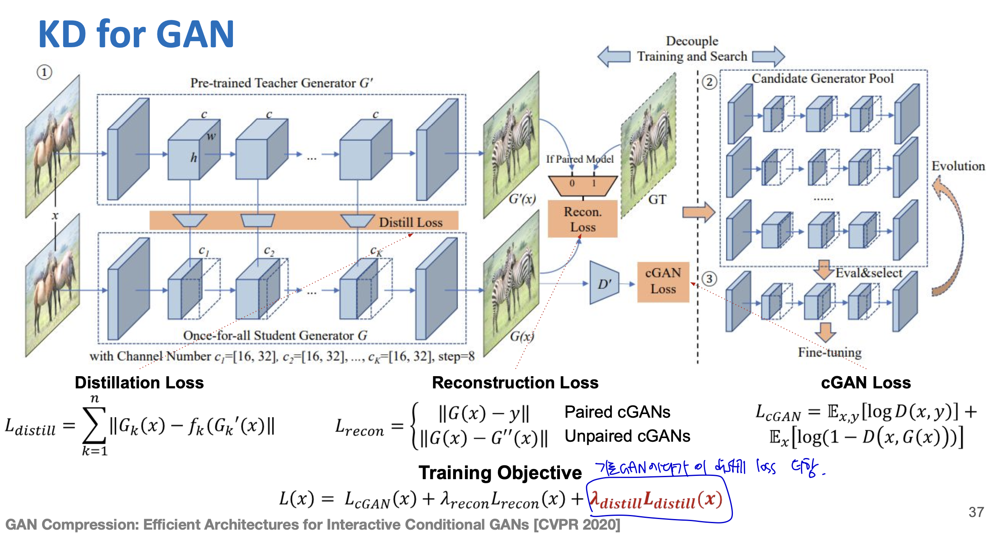

Teacher generator는 큰 모델이라 고품질 이미지를 만들고, student generator는 작은 모델이라 빠르지만 품질이 떨어질 수 있다. 그래서 student generator가 teacher generator의 출력을 따라 하도록 학습한다.

GAN KD에서는 여러 loss가 같이 쓰인다.

<div>
$$
L = L_{distill} + L_{reconstruction} + L_{cGAN}
$$
</div>

각각 의미는 이렇다.

- $L_{distill}$은 teacher generator와 student generator의 출력을 비슷하게 만드는 loss다.

- $L_{reconstruction}$은 생성 결과가 target image와 비슷해지도록 하는 loss다.

- $L_{cGAN}$은 GAN 원래의 adversarial loss로, discriminator를 속일 만큼 realistic한 이미지를 만들도록 하는 loss다.

즉 GAN에서는 단순히 label probability를 맞추는 게 아니라,

> teacher가 만드는 이미지 품질과 GAN의 realism을 동시에 따라가게 만든다.

---

### 8-8-4. Transformer에서의 KD

Transformer에서는 CNN의 attention transfer와 다르게, **self-attention map**을 맞추는 것이 중요하다.

CNN attention은 보통 “이미지의 어느 공간 위치를 봤는가”에 가깝다.
Transformer attention은 “어떤 token이 어떤 token을 얼마나 참고했는가”에 가깝다.

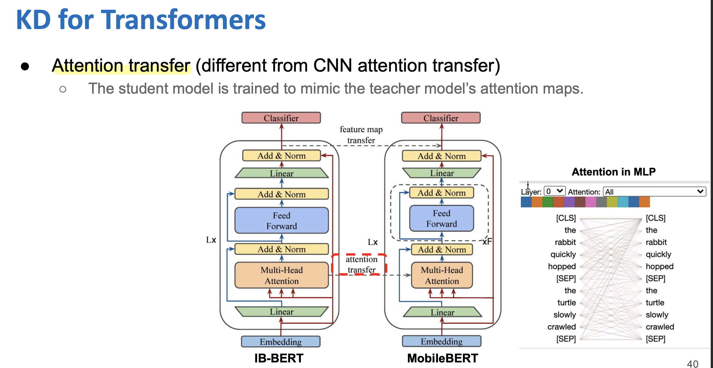

예를 들어 teacher의 attention matrix가

$$
A_t \in \mathbb{R}^{n \times n}
$$

이고 student의 attention matrix가

$$
A_s \in \mathbb{R}^{n \times n}
$$

라면, student가 teacher의 token-to-token attention pattern을 따라가도록 만든다.

$$
L_{attn} = |A_t - A_s|^2
$$

이런 느낌이야.

슬라이드에서는 MobileBERT 같은 예시가 나오고, student model이 teacher model의 attention map을 mimic하도록 학습한다고 설명한다. 

---

### 8-8-5. LLM에서의 KD

LLM에서는 단순히 next token probability만 맞추는 것보다, **reasoning trace**를 distill하는 게 중요해진다.

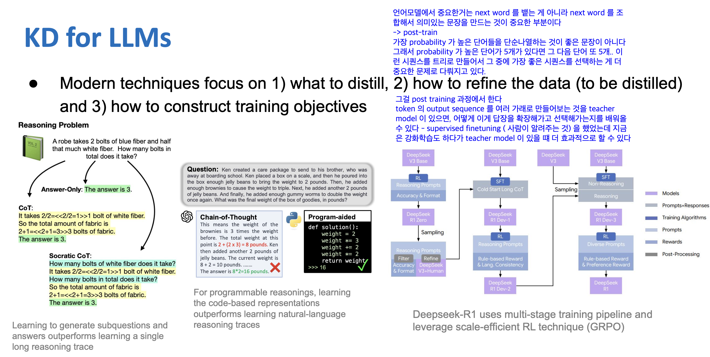

즉 teacher LLM이 답만 주는 게 아니라,

```text
문제 이해 → 중간 추론 → 답
```

같은 reasoning 과정을 보여주면, 작은 student LLM이 그 reasoning 과정을 따라 배우게 한다.

이걸 **Reasoning Distillation**이라고 보면 돼.

슬라이드에서는 teacher의 reasoning traces를 additional supervision으로 사용한다고 설명하고, 작은 Qwen/Gemma 모델들이 큰 모델의 trace로 학습되는 예시를 언급한다. 

최근 LLM KD에서는 세 가지가 중요하다고 나온다.

첫째, **무엇을 distill할 것인가**
예: 답만? reasoning trace? subquestion? code?

둘째, **distill할 데이터를 어떻게 refine할 것인가**
Teacher가 만든 답 중 좋은 것만 고르거나, 여러 reasoning path 중 좋은 것을 고른다.

셋째, **training objective를 어떻게 만들 것인가**
단순 SFT처럼 따라 쓰게 할지, preference/RL 계열 objective를 섞을지 정한다.

슬라이드에서는 긴 reasoning trace 하나를 배우는 것보다 **subquestion과 answer를 생성하는 방식**이 더 좋을 수 있고, programmable reasoning에서는 자연어 CoT보다 **code-based representation**을 배우는 것이 더 좋을 수 있다고 설명한다. 


## 8-9. Network Augmentation 

overfit 해결 방안들: data augmentation, dropout 등

-> 근데 이걸 작은 모델에 쓰면 오히려 성능이 악화될 수 있다

-> 그래서 Network Augmentation 을 쓴다

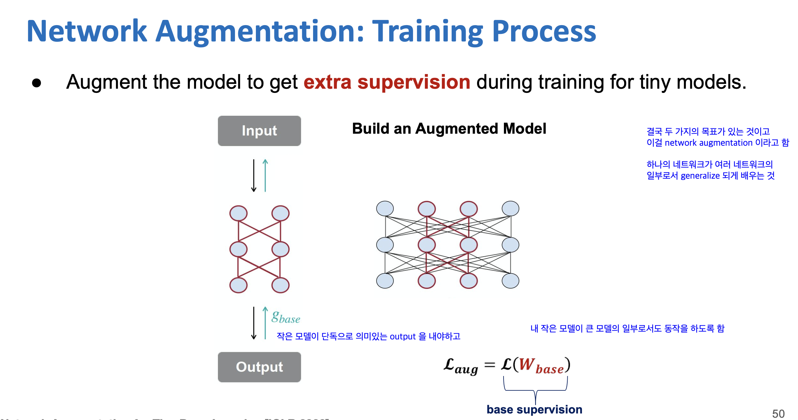

**Network Augmentation**은 KD랑 비슷하게 “작은 모델 학습을 도와주는 방법”인데, teacher 모델의 output을 따라 하는 것보다는 **학습할 때만 모델을 임시로 크게 만들어서 더 많은 supervision을 주는 방식**이야.

> Tiny model은 capacity가 작아서 학습이 잘 안 되니까, training 중에만 auxiliary branch/module을 붙여서 더 풍부한 학습 신호를 주고, inference 때는 그걸 제거한다.

즉 원래 tiny model이 있으면 학습 중에는 이렇게 만든다.

$$
\text{Tiny Model} + \text{Auxiliary Modules}
$$

그리고 loss도 main output에서만 주는 게 아니라, 중간 auxiliary output에도 준다.

<div>
$$
L = L_{base} + \lambda L_{aux}
$$
</div>

슬라이드에서도 tiny model을 위해 training 중 extra supervision을 얻도록 model을 augment한다고 설명한다. 

중요한 점은 **inference 때는 auxiliary part를 버린다**는 거야. 그래서 최종 deployed model은 여전히 작은 tiny model이다.

그래서 KD와 비교하면:

| 구분          | Knowledge Distillation      | Network Augmentation                 |
| ----------- | --------------------------- | ------------------------------------ |
| 도움 주는 방식    | 큰 teacher의 예측/feature를 따라 함 | 학습 중 임시 branch를 붙여 extra supervision |
| 필요 요소       | teacher model               | auxiliary modules                    |
| inference 때 | student만 사용                 | tiny base model만 사용                  |
| 목적          | teacher 지식 전달               | tiny model 학습 자체를 쉽게 만듦              |

또 슬라이드에서는 NetAug가 tiny NN에서는 training accuracy와 validation accuracy를 모두 개선하지만, 큰 NN에서는 training accuracy는 올려도 validation accuracy를 해칠 수 있다고 설명한다. 즉 **작은 모델 underfitting을 완화하는 데 특히 유용한 방법**이라고 보면 돼. 


---

## 8-10. 시험/과제 관점 핵심 정리

Lecture 8에서 제일 중요한 건 이거야.

> Knowledge Distillation은 큰 teacher model의 지식을 작은 student model에 전달하기 위해, 기존 classification loss에 distillation loss를 추가하는 방법이다.

꼭 알아야 할 포인트는 다음이야.

Teacher와 student의 **output probability distribution**을 맞추는 것이 가장 기본적인 KD다.

Temperature $T$는 softmax 분포를 부드럽게 만들어 class 간 관계 정보를 더 잘 전달한다.

KD에서 match할 수 있는 대상은 logits뿐만 아니라 intermediate features, hidden weights, gradients/attention maps, sparsity patterns, relational information까지 다양하다.

Teacher와 student는 구조가 다를 수 있으므로, 중간 feature를 맞출 때는 projection, resize, linear transform이 필요할 수 있다.

Relational KD는 각 sample의 output을 직접 맞추기보다, sample들 사이의 상대적 거리나 구조를 맞추는 방식이다.

한 줄 요약하면:

> Lecture 8은 “작은 모델이 큰 모델을 따라 배우도록, teacher의 logits, feature, attention, sparsity, 관계 정보를 loss로 추가하는 방법”을 다루는 강의다.


<script type="text/x-mathjax-config">
  MathJax.Hub.Config({
    tex2jax: {
      inlineMath: [['$','$'], ['\\(','\\)']],
      processEscapes: true
    },
    "HTML-CSS": { linebreaks: { automatic: true } }
  });
</script>
<script type="text/javascript" src="https://cdnjs.cloudflare.com/ajax/libs/mathjax/2.7.7/MathJax.js?config=TeX-AMS-MML_HTMLorMML"></script>

