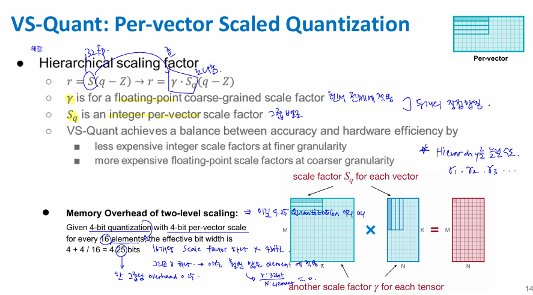
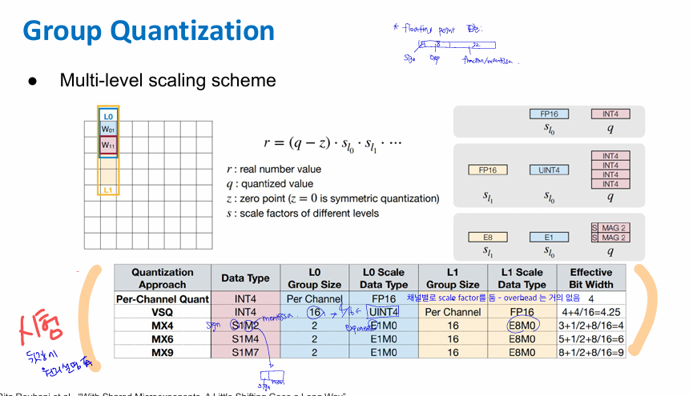
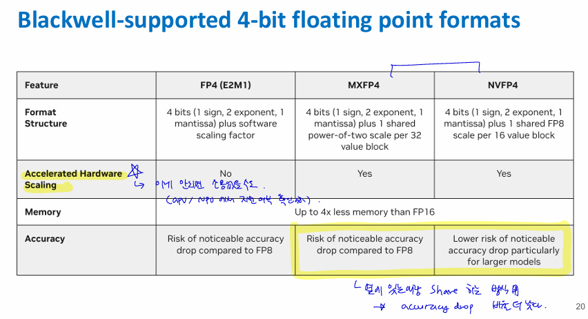
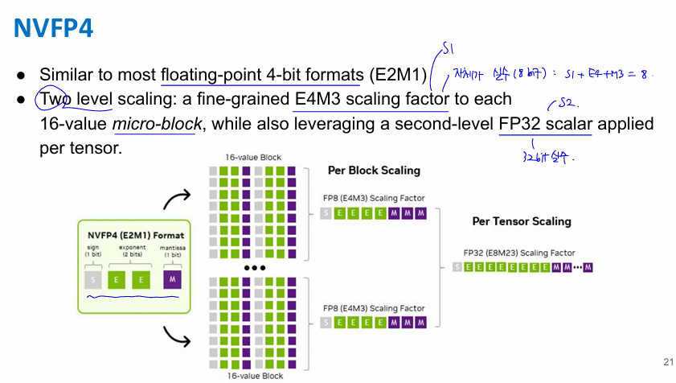
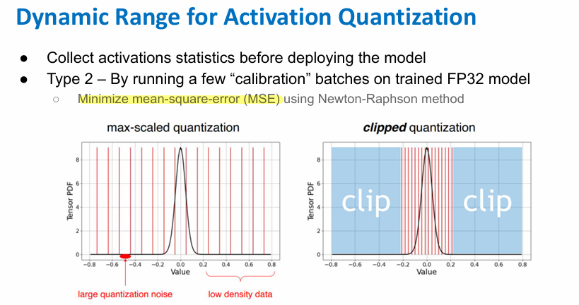

# 06. Quantization Part II

Lecture 6은 **Quantization Part II**이고, 핵심은 “이미 배운 quantization을 실제 모델에 어떻게 적용할 것인가”야. 크게 보면 **quantization granularity**, **activation quantization**, **QAT**, **mixed-precision quantization**을 다룬다. 슬라이드의 objective도 PTQ와 세 가지 quantization granularity, QAT와 fake quantization을 이해하는 것으로 되어 있어. 

## 1. 전체 흐름

Lecture 5에서는 quantization의 기본 개념, K-means quantization, linear quantization 등을 배웠고, Lecture 6에서는 더 실전적인 문제가 나온다.

즉 질문이 이렇게 바뀐다.

“float32 weight를 int8 같은 작은 bit로 바꾸는 건 알겠는데, **scale factor를 어느 단위로 잡을 것인가?**”

“weight는 고정되어 있는데, activation은 input마다 달라지는데 **activation range는 어떻게 미리 정할 것인가?**”

“PTQ만 하면 성능이 떨어질 수 있는데, **quantization을 고려하면서 학습할 수는 없을까?**”

“모든 layer를 똑같이 8bit로 할 필요가 있을까? **중요한 layer는 더 높은 bit, 덜 중요한 layer는 낮은 bit를 쓰면 안 될까?**”

이 질문들에 대한 답이 Lecture 6의 내용이다.

---

## 2. Quantization Granularity

**Granularity**는 quantization할 때 **scale factor와 zero point를 어느 단위로 둘 것인가**를 의미한다. 슬라이드에서는 per-tensor, per-channel, group/per-vector quantization을 비교한다. 

### Per-tensor quantization

하나의 tensor 전체에 scale factor 하나를 쓰는 방식이다.

예를 들어 weight matrix 전체에 대해 하나의 $S$를 정하고,

$$
r = S(q - Z)
$$

처럼 복원한다.

장점은 단순하고 scale 저장 overhead가 작다는 것.
단점은 tensor 안의 channel별 값 범위가 많이 다르면 문제가 생긴다는 것.

예를 들어 어떤 channel은 값 범위가 $[-2, 2]$인데, 어떤 channel은 $[-100, 100]$이라면, 전체 tensor에 하나의 scale을 쓰면 작은 범위의 channel은 거의 뭉개질 수 있다. 슬라이드에서도 per-tensor는 whole weight tensor에 single scale을 사용하고, output channel마다 weight range 차이가 크면 문제가 생긴다고 설명한다. 

### Per-channel quantization

Per-channel은 channel마다 scale factor를 따로 둔다.

즉 각 output channel마다

$$
S_0, S_1, S_2, \dots
$$

를 따로 둔다.

그래서 channel마다 값 범위가 달라도 더 정확하게 표현할 수 있다. 슬라이드 예시에서도 per-channel은 각 row/channel의 max 값을 따로 잡아서 quantization error를 줄이는 방향으로 설명된다. 

다만 단점은 scale factor를 channel마다 저장해야 하므로 overhead가 늘어난다는 것이다. 더 세밀하게 나눌수록 accuracy는 좋아질 수 있지만, 저장해야 하는 scale이 많아진다.

### Per-vector quantization

Per-tensor는 너무 거칠고, per-channel은 더 정확하지만 scale overhead가 있다. 그래서 중간 방식으로 **group quantization** 또는 **per-vector quantization**이 나온다.



예를 들어 16개 weight마다 scale을 하나 둔다면, 4-bit quantization에 4-bit scale을 16개마다 하나 추가하는 식이 된다. 슬라이드에서는 이 경우 effective bit width가

$$
4 + \frac{4}{16} = 4.25 \text{ bits}
$$

- $\gamma$ 사이즈: 4 bit - 이건 16개 vector가 한 개 공유함 = 4/16 bit
- $S_q$ 사이즈: 4 bit 

가 된다고 설명한다. 

즉 실제 weight는 4bit지만, scale 저장 overhead까지 포함하면 평균적으로 4.25bit 정도가 되는 것이다.

핵심은 이것이다.

> 더 작은 group 단위로 scale을 잡으면 quantization error는 줄어들지만, scale 저장 overhead가 커진다.

### Group Quantization (Multi-level scaling)



* **L0 scale**: 작은 group 안의 weight들을 위한 scale
* **L1 scale**: 여러 L0 scale들을 다시 묶는 상위 scale

실제 weight는 **작은 정수 $q$**로 저장하고, 복원할 때 **L0 scale과 L1 scale을 둘 다 곱한다**.

**<표의 VSQ 행 설명>**

* weight $q$는 INT4로 저장
* 16개 weight마다 L0 scale이 하나 있음
* 그런데 L0 scale도 FP16이 아니라 UINT4로 저장
* 이 UINT4 scale들을 해석하기 위한 상위 scale, 즉 L1 scale은 channel마다 FP16으로 하나 저장

단, 표에서는 L1 scale인 FP16도 per-channel로 저장되는데, channel이 충분히 크면 weight 하나당 overhead가 작아서 계산에서 생략하거나 작게 보는 거야.

**<MX4, MX6, MX9는 뭐야?>**

MX는 **shared micro-exponent** 계열의 data type이야.

> 여러 개의 숫자가 하나의 exponent를 공유하고, 각 숫자는 작은 mantissa/sign만 따로 가진다.

일반 floating point는 각 숫자가 자기만의 sign, exponent, mantissa를 가진다.

예를 들어 FP16은 대략:

```text
sign + exponent + mantissa
```

를 각 숫자마다 가진다.

그런데 MX 방식은 group 안에서 exponent를 공유한다.

```text
group shared exponent + 각 원소의 sign/mantissa
```

이렇게 하면 scale을 따로 많이 저장하지 않으면서도, 정수 quantization보다 조금 더 floating point스럽게 표현할 수 있다.

<**MX4**>


$$
3 + \frac{1}{2} + \frac{8}{16} = 4
$$

이 행은 data type이 $S1M2$라고 되어 있어.

* $S1$: sign 1bit
* $M2$: mantissa 2bit

그래서 각 weight가 기본적으로 $3$bit를 쓴다.

그런데 추가적으로 shared exponent 또는 scale 관련 overhead가 붙는다.

* $\frac{1}{2}$: L0 group size가 2라서, 1bit짜리 정보를 2개 원소가 공유하는 식의 overhead
* $\frac{8}{16}$: L1 scale이 8bit이고, 16개 단위로 공유

그래서 총 effective bit width가 4bit가 된다.

<**MX6**>

$$
5 + \frac{1}{2} + \frac{8}{16} = 6
$$

여기서는 data type이 $S1M4$라서:

* sign 1bit
* mantissa 4bit

기본 weight 표현이 5bit.

나머지 overhead를 더해서 6bit가 된다.

<**MX9**>

$$
8 + \frac{1}{2} + \frac{8}{16} = 9
$$

여기서는 data type이 $S1M7$라서:

* sign 1bit
* mantissa 7bit

기본 weight 표현이 8bit.

overhead를 더하면 9bit.

### 비교



### NVFP4



NVFP4는 **4-bit floating point 형식**으로, 값 하나를 대략 sign 1bit + exponent 2bit + mantissa 1bit로 표현한다.

그런데 4bit만 쓰면 표현 범위가 너무 좁아서, **16개 값마다 FP8 scale factor**를 하나 붙인다.

추가로 tensor 전체에 대해 **FP32 scale factor**를 한 번 더 곱한다.

즉 복원은 대략 $r = q_{\text{NVFP4}} \times s_{\text{block}} \times s_{\text{tensor}}$ 느낌이다.

핵심은 **값은 4bit로 작게 저장하되, block scale + tensor scale로 정확도를 보완하는 방식**이다.

---

## 3. Activation Quantization

Weight quantization은 상대적으로 쉽다. 왜냐하면 weight는 학습이 끝나면 고정되어 있기 때문이다. 하지만 activation은 input마다 달라진다.

슬라이드에서도 activation은 weight와 달리 range가 input에 따라 바뀌고, deployment 전에 activation statistics를 모아야 한다고 설명한다. 

즉 activation quantization의 문제는 이것이다.

> Runtime input이 들어오기 전에는 activation의 $r_{\min}$, $r_{\max}$를 정확히 모른다.

그런데 linear quantization을 하려면 floating-point range가 필요하다.

$$
S = \frac{r_{\max} - r_{\min}}{q_{\max} - q_{\min}}
$$

이런 식으로 scale을 정해야 하기 때문이다.

그래서 activation range를 추정하는 방법이 필요하다.

### 방법 1: Training 중 EMA 사용


학습 중에는 forward를 계속 하므로 activation 값들을 볼 수 있다. 이때 observed min/max를 그대로 쓰지 않고 **EMA**, 즉 exponential moving average를 사용한다.

슬라이드에서는 observed range를 수천 training step 동안 smoothing한다고 되어 있다. 식으로는 대략 이런 느낌이다.

$$
r_{\max}^{(t)} = \alpha r_{\max}^{(t)} + (1-\alpha) r_{\max}^{(t-1)}
$$

정확히 말하면 현재 step에서 관찰한 range와 이전까지 smooth된 range를 섞는다. 최근 값에 더 가중치를 주고, 과거 값은 점점 작게 반영하는 방식이다.

### 방법 2: Calibration batch 사용


이미 학습된 FP32 model이 있을 때는, 몇 개의 sample batch를 넣어서 activation 통계를 구한다. 이것을 **calibration**이라고 한다.

예를 들어 deployment 전에 대표 입력 몇 batch를 넣어보고 activation min/max를 관찰한 뒤, 그 값을 기반으로 quantization range를 정한다.

여기서 중요한 점은 outlier다. activation에 아주 큰 outlier가 있으면 range를 너무 넓게 잡게 된다. 그러면 대부분의 일반적인 값들이 좁은 quantization bin에 몰려서 표현력이 떨어진다. 슬라이드에서도 outlier에 dynamic range를 많이 써버리면 representation ability가 나빠진다고 설명한다. 

그래서 단순히 max를 쓰지 않고, 다음 같은 기준을 사용할 수 있다.


첫 번째는 min/max 평균을 쓰는 방식. 여러 sample batch의 min/max를 구하고 평균을 낸다.


두 번째는 KL divergence를 최소화하는 방식. quantize 전 distribution과 quantize 후 distribution이 최대한 비슷해지도록 clipping range를 고른다.


세 번째는 MSE를 최소화하는 방식. 원래 activation과 quantized activation 사이의 mean-square-error가 작아지도록 clipping threshold를 찾는다.

---

## 4. PTQ와 그 한계

지금까지 설명한 방식은 대부분 **PTQ**, 즉 Post-Training Quantization이다.

PTQ는 이미 학습된 FP32 model을 가져와서, 추가 학습 없이 또는 아주 적은 calibration만으로 quantization하는 방식이다.

장점은 빠르고 간단하다.
단점은 작은 모델에서는 성능이 크게 떨어질 수 있다.

슬라이드에서도 smaller models는 representational capacity가 작아서 PTQ에 잘 대응하지 못할 수 있다고 설명한다. 

그래서 등장하는 것이 QAT다.

---

## 5. Quantization-Aware Training, QAT

QAT는 말 그대로 **quantization을 고려하면서 학습하는 것**이다.

PTQ는 학습이 끝난 후에 “이제 int8로 바꿔보자”에 가깝다.
QAT는 학습 중부터 “어차피 inference 때 quantized weight/activation을 쓸 거니까, 학습할 때도 그 상황을 흉내 내자”에 가깝다.

슬라이드에서는 QAT를 “train the model taking quantization into consideration”이라고 설명하고, quantization 후 accuracy loss를 줄이기 위해 quantized model을 fine-tuning한다고 설명한다. 

핵심 구조는 이렇다.

학습 중에는 full precision weight $W$를 유지한다.

Forward pass에서는 quantized weight $Q(W)$를 사용한 것처럼 계산한다.

Backward pass에서는 gradient를 full precision weight $W$에 누적한다.

Inference 때는 quantized weight만 사용한다.

즉 학습은 실수 기반으로 안정적으로 하고, forward에서는 quantization error를 일부러 경험하게 한다.

이것을 **fake quantization** 또는 **simulated quantization**이라고 한다.

---

## 6. Fake Quantization과 STE

문제는 quantization 함수가 discrete operation이라는 점이다.

예를 들어 어떤 실수 값을 round해서 integer로 만들면, 대부분의 구간에서 derivative가 0이다. 그러면 backpropagation할 때 gradient가 흐르지 않는다.

즉 그냥 quantization을 넣으면

$$
\frac{\partial Q(x)}{\partial x} = 0
$$

처럼 되어 학습이 잘 안 된다.

그래서 사용하는 것이 **STE**, Straight-Through Estimator다.

아이디어는 단순하다.

Forward에서는 quantization을 한다.

Backward에서는 quantization을 identity function처럼 취급해서 gradient를 그냥 통과시킨다.

즉 실제 forward는

$$
y = Q(x)
$$

인데, backward에서는 대충

$$
\frac{\partial Q(x)}{\partial x} \approx 1
$$

로 보는 것이다.

그래서 gradient가 0이 되어버리는 문제를 피한다. 슬라이드에서도 STE는 quantization을 identity function처럼 보고 gradient를 통과시킨다고 설명한다. 

---

## 7. Modern QAT: Quantizer Parameter도 학습

기본 QAT에서는 scale factor나 clipping range를 calibration으로 정하거나 고정한다. 그런데 modern QAT에서는 이것도 학습할 수 있다.

예를 들어 activation clipping threshold $\alpha$, step size/scale $s$, offset 등을 weight와 함께 학습한다.

즉 단순히 weight만 학습하는 것이 아니라,

$$
W, s, \alpha, Z
$$

같은 quantizer configuration까지 같이 최적화하는 방향이다.

슬라이드에서는 PACT, LSQ, LSQ+ 같은 예시가 나온다. 이들은 clipping threshold나 scale, offset을 learnable parameter로 두는 방식이다.

---

## 8. Mixed-Precision Quantization

마지막 주제는 **mixed-precision quantization**이다.

일반적인 uniform quantization은 모든 layer를 똑같이 8bit, 8bit처럼 quantize한다. 예를 들어 모든 layer의 weight와 activation을 8bit로 맞춘다.

하지만 모든 layer가 quantization에 똑같이 민감한 것은 아니다.

어떤 layer는 4bit로 줄여도 accuracy가 거의 안 떨어지고, 어떤 layer는 4bit로 줄이면 성능이 크게 떨어질 수 있다.

그래서 mixed-precision quantization은 layer마다 bit-width를 다르게 정한다.

예를 들면,

$$
\text{Layer 1: W4A5}
$$

$$
\text{Layer 2: W6A7}
$$

$$
\text{Layer 3: W5A4}
$$

처럼 layer별로 weight bit와 activation bit를 다르게 둔다.

장점은 accuracy와 efficiency 사이의 trade-off를 더 잘 맞출 수 있다는 것이다.

단점은 design space가 엄청 커진다는 것이다. 슬라이드에서는 layer마다 weight bit와 activation bit 선택지가 있으면, 각 layer당 choices가 $8 \times 8 = 64$이고, layer가 $n$개면 design space가 $64^n$이 된다고 설명한다. 

그래서 HAQ 같은 방법은 reinforcement learning 등을 사용해서 hardware-aware하게 bit-width policy를 찾는다.

---

## 9. 시험/과제 관점 핵심 정리

Lecture 6에서 꼭 잡아야 하는 건 다음이야.

**Quantization granularity**는 scale factor를 어느 단위로 둘지의 문제다. Per-tensor는 간단하지만 error가 클 수 있고, per-channel은 정확하지만 scale overhead가 있다. Group/per-vector는 그 중간이다.

**Activation quantization**은 weight보다 어렵다. Weight는 고정되어 있지만 activation은 input마다 바뀌기 때문이다. 그래서 training 중 EMA를 쓰거나, calibration batch를 넣어서 activation range를 추정한다.

**Clipping range**를 잘 정해야 한다. 너무 넓게 잡으면 대부분 값의 resolution이 떨어지고, 너무 좁게 잡으면 outlier가 많이 잘린다. KL divergence나 MSE를 기준으로 range를 고를 수 있다.

**QAT**는 quantization을 고려해서 fine-tuning하는 방법이다. Forward에서는 quantized value를 쓰는 것처럼 하고, backward에서는 full precision weight에 gradient를 누적한다.

**STE**는 quantization의 gradient가 0이 되는 문제를 피하기 위해, backward에서 quantization을 identity처럼 취급하는 방법이다.

**Mixed precision**은 모든 layer에 같은 bit를 쓰지 않고 layer별로 다른 bit-width를 주는 방식이다. 효율은 좋아질 수 있지만 search space가 커져서 자동화 기법이 필요하다.

한 줄로 요약하면:

> Lecture 6은 “quantization을 실제 모델에 적용할 때 scale을 어디에 둘지, activation range를 어떻게 잡을지, 성능 저하를 QAT로 어떻게 줄일지, layer별 bit-width를 어떻게 다르게 줄지”를 다루는 강의다.
