# 09. Neural Architecture Search, NAS

한마디로 말하면, 사람이 직접 모델 구조를 설계하는 대신 **좋은 neural network architecture를 자동으로 찾는 방법**을 다룬다. 강의 목표도 NAS의 기본 개념, search space, search strategy, accuracy estimation, 그리고 hardware-aware NAS를 이해하는 것이다. 

## 9-1. NAS가 왜 필요한가?

딥러닝 모델을 만들 때 사람이 직접 정해야 하는 게 너무 많다.

예를 들면 CNN이면

* layer 개수
* channel 수
* kernel size
* connection 구조
* input resolution
* skip connection 여부

같은 것들을 정해야 한다.

문제는 가능한 조합이 너무 많아서 사람이 하나씩 실험하기 어렵다는 거야. 그래서 Lecture 9에서는 **manual architecture search**에서 **automatic architecture search**로 넘어가야 한다고 설명한다. 즉, 모델 구조 자체를 하나의 탐색 문제로 본다. 

NAS의 목표는 다음처럼 볼 수 있어.

$$
A^* = \arg\max_{A \in \mathcal{A}} \text{Objective}(A)
$$

여기서 $\mathcal{A}$는 가능한 architecture들의 집합, $A$는 하나의 후보 모델 구조야. Objective는 accuracy일 수도 있고, latency, energy, memory 같은 efficiency일 수도 있다.

즉,

> 가능한 모델 구조들 중에서 accuracy나 efficiency가 가장 좋은 구조를 찾는 문제

라고 보면 된다.

---

## 9-2. NAS의 3가지 핵심 구성요소

Lecture 9에서는 NAS를 크게 세 부분으로 나눈다.

### 9-1) Search Space

**어떤 architecture 후보들을 고려할 것인가?**

Search space는 candidate neural network architecture들의 집합이다. 각 layer가 어떤 operator로 구성되는지, layer들이 어떻게 연결되는지까지 포함한다. 

예를 들어 이런 선택지가 있을 수 있다.

$$
\text{kernel size} \in {3 \times 3, 5 \times 5, 7 \times 7}
$$

$$
\text{depth} \in {2, 3, 4}
$$

$$
\text{width} \in {64, 128, 256}
$$

이 조합 전체가 search space가 된다.

### 9-2) Search Strategy

**그 search space를 어떻게 탐색할 것인가?**

Lecture에서는 grid search, random search, reinforcement learning, gradient descent, evolutionary search 같은 방법들이 나온다. 

쉽게 말하면,

> 후보 모델이 너무 많으니까, 어떤 순서로 어떤 후보를 테스트할지 정하는 방법

이다.

### 9-3) Performance Estimation Strategy

**후보 모델의 성능을 어떻게 빠르게 평가할 것인가?**

가장 단순한 방법은 후보 모델을 하나 골라서 처음부터 끝까지 train하고 validation accuracy를 보는 거야. 그런데 이건 너무 오래 걸린다. Lecture에서도 basic strategy는 candidate architecture를 학습시키고 target device에서 돌려보는 것이지만, scale이 안 된다고 설명한다. 

그래서 ENAS, weight sharing, proxy task 같은 방법이 등장한다.

---

## 9-3. Search Space: Cell-level vs Network-level

Lecture 9에서 search space는 크게 두 가지로 나온다.

## 9-3-1. Cell-level Search Space

Cell-level search는 전체 네트워크를 직접 찾는 게 아니라, **반복해서 사용할 작은 block, 즉 cell 구조를 찾는 방식**이다.

Classifier에는 보통 두 종류의 cell이 있다.

* **Normal Cell**: stride = 1, feature map 크기 유지
* **Reduction Cell**: stride > 1, feature map 크기 줄임

Lecture의 NASNet 예시에서는 normal cell과 reduction cell을 먼저 찾고, 이 cell들을 여러 번 쌓아서 CIFAR-10이나 ImageNet용 architecture를 만든다. 

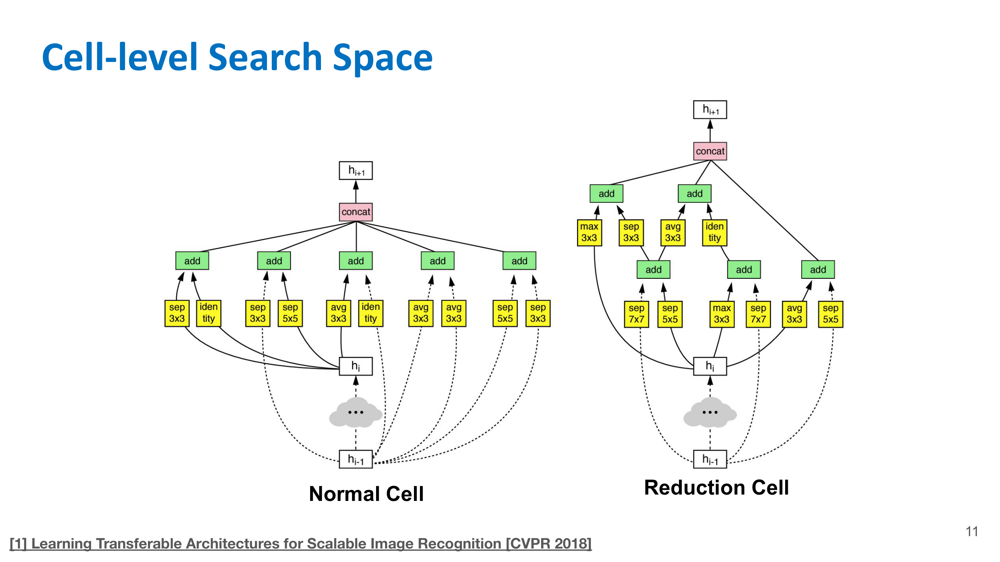

cell 내부에서는 다음을 선택한다.

1. 어떤 두 input을 받을지
2. 각 input에 어떤 operation을 적용할지
   예: convolution, pooling, identity
3. 결과를 어떻게 combine할지
   예: add, concat
4. 이 과정을 여러 block에 대해 반복

즉, cell-level search는

> 좋은 작은 building block을 찾고, 그 block을 반복해서 큰 네트워크를 만드는 방식

이라고 보면 된다.

---

## 9-3-2. Network-level Search Space

Network-level search는 cell보다 더 큰 단위에서 전체 네트워크의 구조를 바꾸는 방식이다.

Lecture에서는 fixed topology 안에서 다음 dimension들을 조절한다.

### Depth Dimension

몇 개의 block을 사용할지 정한다.

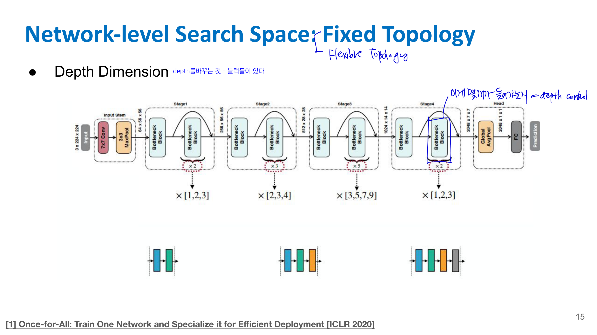

깊이를 늘리면 모델 capacity는 커질 수 있지만, latency와 memory 사용량도 증가한다.

### Resolution Dimension

입력 이미지 해상도를 정한다.

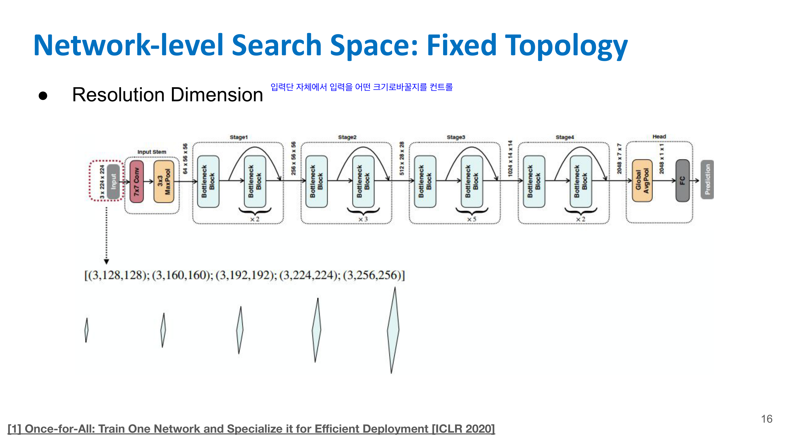

예를 들어

$$
128 \times 128,\quad 160 \times 160,\quad 224 \times 224
$$

중 무엇을 쓸지 선택하는 식이다.

해상도가 크면 정보는 많지만 계산량이 커진다.

### Width Dimension

각 layer의 channel 수를 정한다.

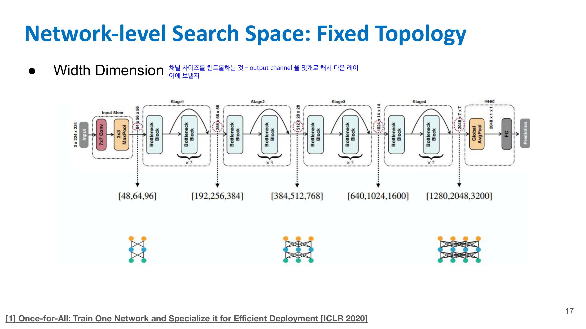

예를 들어 output channel을 64로 할지, 128로 할지, 256으로 할지 정하는 것이다.

### Kernel Size Dimension

Convolution kernel size를 정한다.

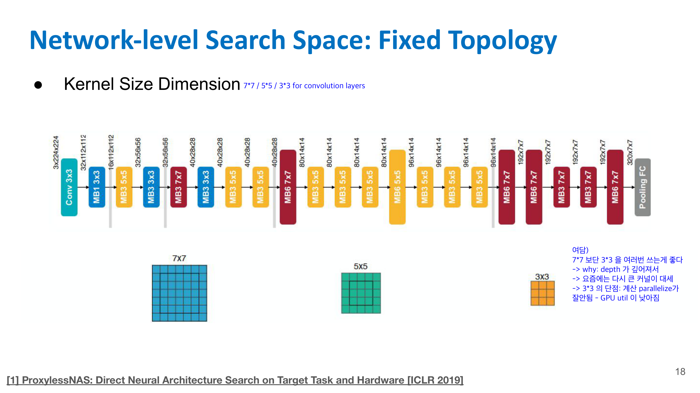

예를 들어

$$
3 \times 3,\quad 5 \times 5,\quad 7 \times 7
$$

중 선택한다.

Lecture에서는 예전에는 $3 \times 3$을 여러 번 쌓는 방식이 많았지만, 최근에는 큰 kernel도 다시 중요해지고 있다고 설명한다.

---

## 9-4. Design Strategy for Tiny Models

Tiny Model 은 memory constraint가 중요하다
=> FLOPs based search sapce optimization이 좋다

## 9-5. Search Strategy

Search strategy는 search space를 탐색하는 방법이다.

## 9-5-1. Grid Search

정해진 후보들을 격자처럼 전부 시도하는 방식이다.

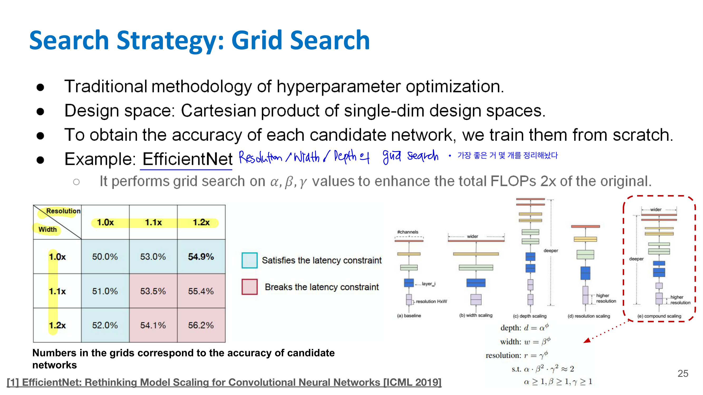

예를 들어 depth, width, resolution 후보가 각각 3개씩 있으면

$$
3 \times 3 \times 3 = 27
$$

개의 조합을 다 해보는 방식이다.

장점은 단순하지만, dimension이 많아지면 후보 수가 폭발한다.

## 9-5-2. Random Search

후보를 랜덤하게 뽑아서 실험하는 방식이다.

Grid search보다 단순해 보이지만, 실제로는 중요한 hyperparameter가 일부일 때 random search가 더 효율적일 수 있다. Lecture에서도 random search는 search space가 적절한지 sanity check용으로 자주 쓰인다고 나온다. 

## 9-5-3. Reinforcement Learning 기반 Search

Architecture 설계를 sequential decision-making 문제로 본다.

예를 들어 RNN controller가 순서대로 이런 결정을 한다.

1. 어떤 input을 선택할지
2. 어떤 operation을 적용할지
3. 어떻게 combine할지

그 결과 architecture 하나가 만들어지고, 그 architecture의 validation accuracy를 reward로 사용한다.

즉,

> 좋은 architecture를 만들면 reward가 높고, controller는 그 방향으로 학습된다

라고 보면 된다.

## 9-5-4. Gradient-based Search

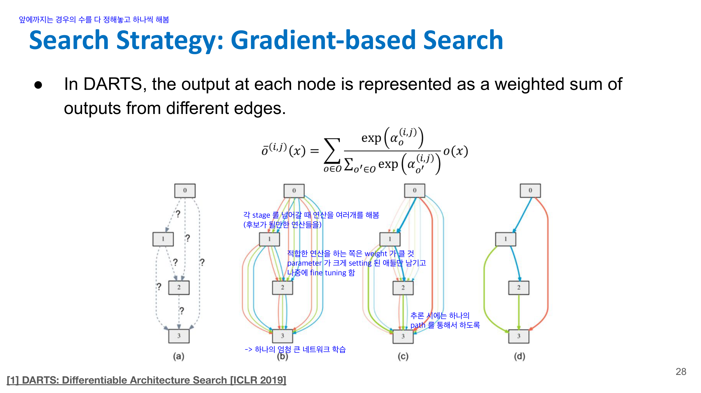
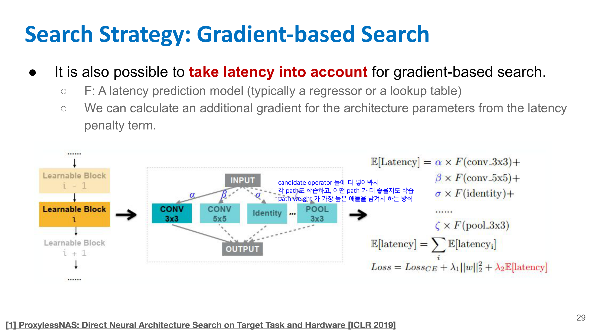


기존 NAS는 architecture 선택이 이산적이야. 예를 들어 어떤 layer에서 operation을 고른다고 하면:

$$
\text{operation} \in {3 \times 3 \text{ conv}, 5 \times 5 \text{ conv}, \text{max pooling}, \text{skip connection}}
$$

원래는 이 중 하나를 딱 골라야 해. 그런데 “딱 고르는 선택”은 미분이 안 돼서 gradient descent로 최적화하기 어렵다.

그래서 gradient-based NAS는 이 선택을 **연속적인 가중치 선택 문제**로 바꾼다.

예를 들어 여러 operation을 동시에 두고, 각 operation에 architecture parameter $\alpha$를 붙인다.

$$
o(x) = \sum_i \frac{\exp(\alpha_i)}{\sum_j \exp(\alpha_j)} o_i(x)
$$

즉, 하나의 operation만 고르는 게 아니라 처음에는 여러 operation을 섞어서 쓴다.

예를 들면:

$$
0.6 \cdot \text{Conv}_{3 \times 3}(x)

* 0.3 \cdot \text{Conv}_{5 \times 5}(x)
* 0.1 \cdot \text{Skip}(x)
  $$

처럼 계산하는 거야.

여기서 $\alpha$는 neural network weight처럼 gradient descent로 학습할 수 있다.

Gradient-based search는

> “모델 구조 선택도 weight처럼 미분 가능하게 만들어서 gradient descent로 찾자”

는 방법이야.

RL-based NAS나 evolutionary search는 후보 architecture를 여러 개 만들어보고 평가하는 방식이라 느릴 수 있는데, gradient-based search는 하나의 큰 supernet 안에서 architecture parameter를 학습하므로 상대적으로 효율적이다.


## 9-5-4. Evolutionary Search

여러 architecture 후보를 population처럼 두고, 좋은 후보를 선택한 뒤 변형하거나 섞어서 새로운 후보를 만드는 방식이다.

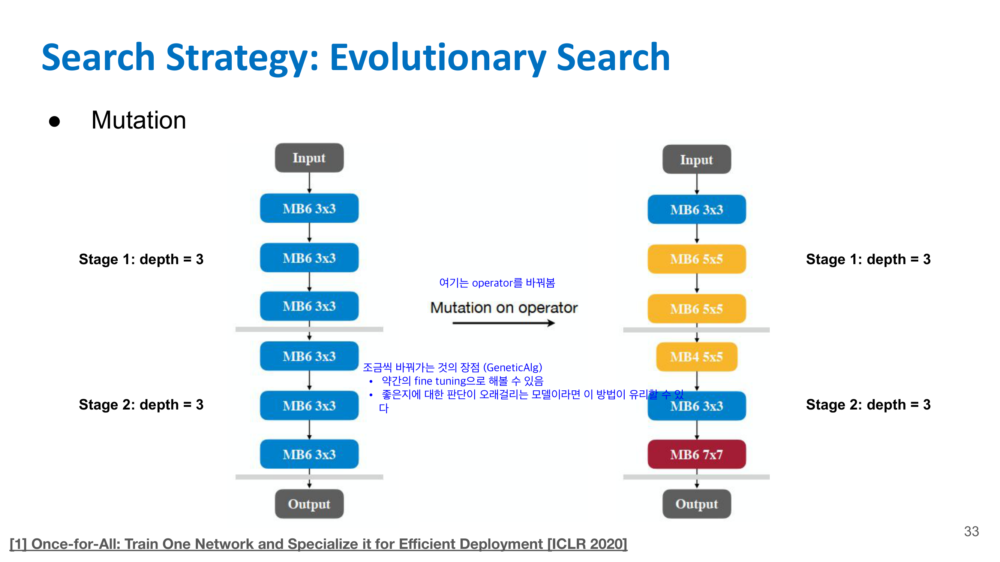

Evolutionary search는 진화 알고리즘처럼 architecture 후보들을 다루는 방식이야.

핵심 흐름은 이거야.

- 여러 개의 architecture 후보를 만든다.
- 각각을 평가한다.
- 예: accuracy, latency, FLOPs, memory 등
- 성능이 좋은 후보를 선택한다.
- 선택된 후보를 조금 변형한다.
- 새 후보를 다시 평가한다.
- 이 과정을 반복한다.

> 좋은 architecture를 살아남게 하고, 그 architecture를 조금씩 변형하면서 더 좋은 구조를 찾는 방법

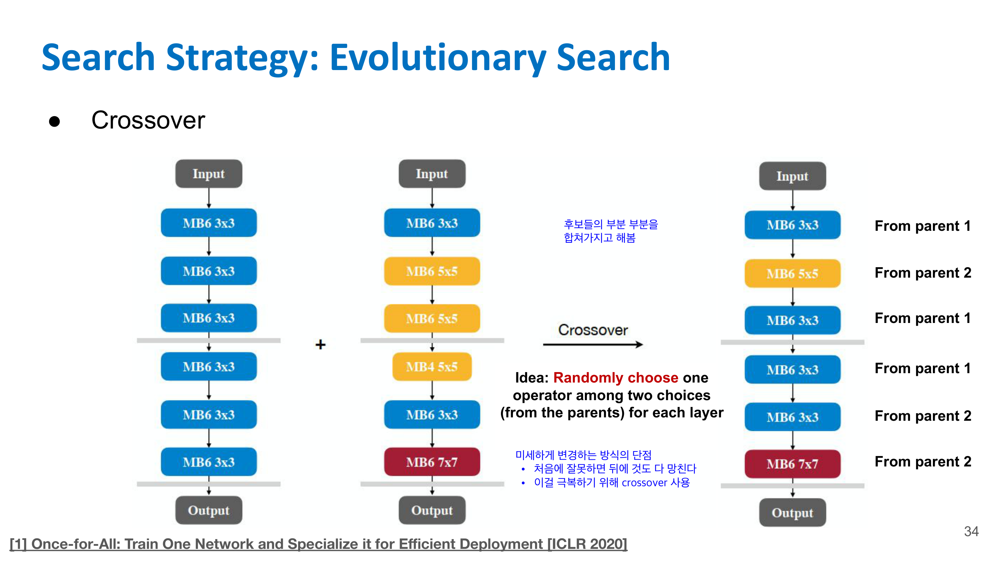

Lecture에서는 crossover도 나온다. 부모 architecture 두 개에서 layer별 operation을 일부씩 가져와서 새로운 architecture를 만드는 식이다. 

---

## 9-7. Accuracy Estimation Strategy

**1. Train from scratch**
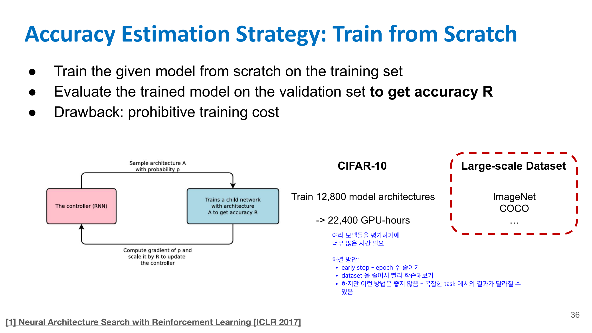

- 가장 기본 방법
- 후보 모델을 매번 처음부터 학습시키고 accuracy 측정
- 너무 느림, 현실적 불가능

**2. Weight inheritance/Weight sharing**
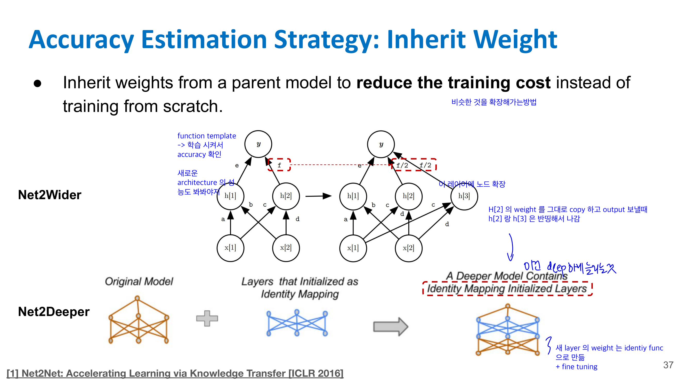
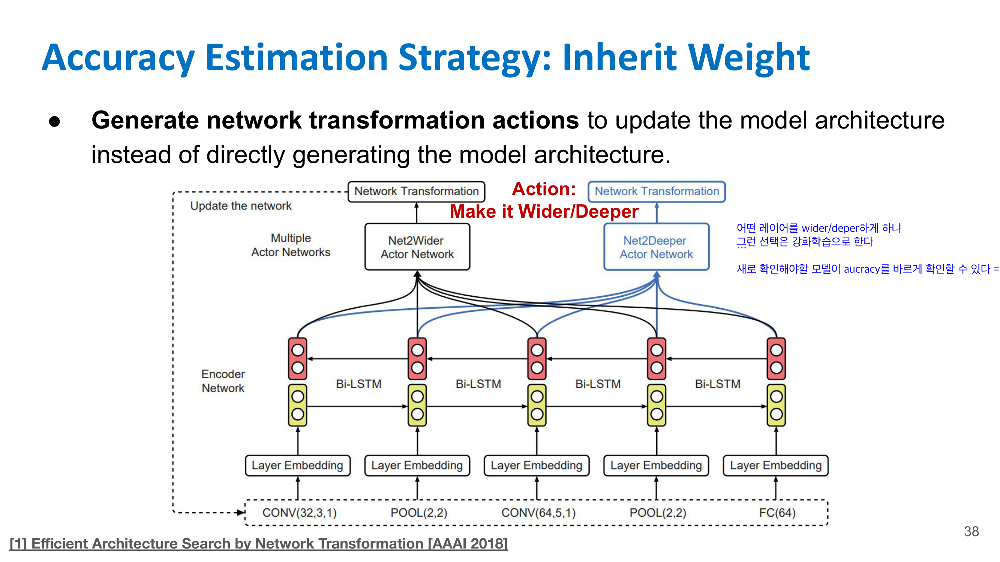

- 하나의 큰 network나 이전에 학습한 weight를 물려받음
- 후보 architecture들은 큰 supernet의 subnet

## 9-8. Accuracy Estimation: ENAS

NAS의 가장 큰 문제는 후보 모델 하나하나를 전부 학습시키면 너무 오래 걸린다는 것이다.

ENAS는 이 문제를 해결하기 위해 **parameter sharing**을 사용한다.

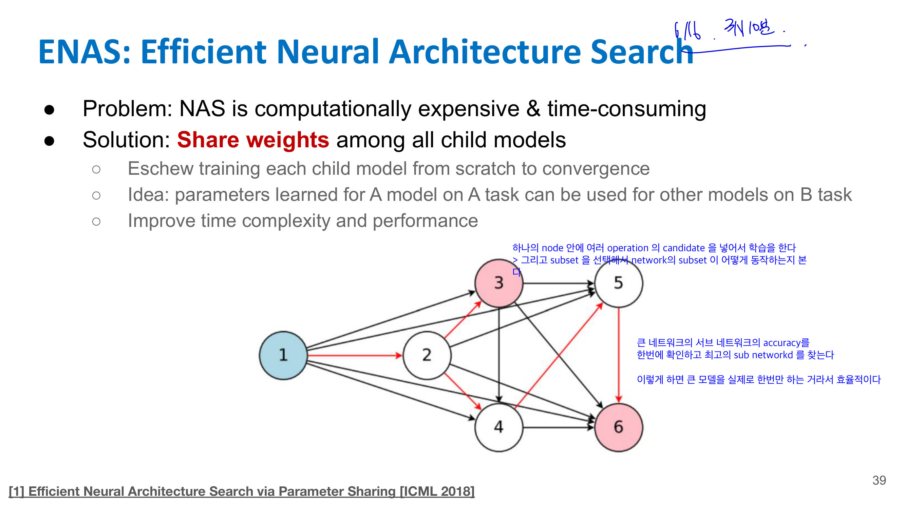

일반 NAS에서는 architecture 후보마다 weight를 따로 학습한다.

$$
A_1 \rightarrow W_1
$$

$$
A_2 \rightarrow W_2
$$

$$
A_3 \rightarrow W_3
$$

이러면 후보가 많을수록 학습 비용이 엄청 커진다.

ENAS에서는 큰 super network를 하나 만들고, 각 architecture 후보는 그 안의 subgraph로 본다.

$$
A_i \subset \text{SuperNet}
$$

그래서 여러 architecture가 weight를 공유한다.

즉,

> 후보 모델을 매번 처음부터 학습하지 않고, 이미 학습된 shared weight를 재사용해서 빠르게 성능을 추정하는 방식

이다.

이게 accuracy estimation strategy의 핵심이다.

---

## 9-9. Hypernet

NAS에서 어떤 architecture $A$가 있을 때, 원래는 그 architecture의 weight $W_A$를 직접 학습해야 해.

$$
A \rightarrow \text{train} \rightarrow W_A \rightarrow \text{accuracy 평가}
$$

근데 이러면 후보 architecture마다 학습해야 해서 너무 느리잖아.

**Hypernetwork**는 이걸 바꿔서,

> architecture 정보를 입력으로 받아서, 그 architecture에 쓸 weight를 생성하거나 예측하는 network

를 따로 둔다.

즉,

$$
W_A = H(A)
$$

여기서 $H$가 hypernetwork야.

### 직관적으로 말하면

일반 network는 이렇게 해:

```text
input image → network → prediction
```

Hypernetwork는 이렇게 해:

```text
architecture 정보 → hypernetwork → 그 architecture의 weight
```

즉, hypernetwork는 **정답을 예측하는 모델**이 아니라, **다른 모델의 weight를 만들어주는 모델**이야.

### NAS에서 왜 쓰냐?

후보 architecture $A_1, A_2, A_3$가 있을 때, 각각을 처음부터 학습하면 너무 오래 걸려.

```text
A1 train
A2 train
A3 train
...
```

Hypernetwork를 쓰면 architecture 정보를 넣어서 weight를 빠르게 얻고, 그 weight로 성능을 대략 평가할 수 있다.

```text
A1 → H(A1) → W1 생성 → 평가
A2 → H(A2) → W2 생성 → 평가
A3 → H(A3) → W3 생성 → 평가
```

그래서 **candidate architecture의 accuracy를 빠르게 estimate**하는 데 사용된다.

---

## ENAS랑 차이

둘 다 후보 architecture를 처음부터 fully train하지 않으려는 방법이지만, 방식이 달라.

| 구분           | ENAS / Weight Sharing                    | Hypernetwork                    |
| ------------ | ---------------------------------------- | ------------------------------- |
| 핵심           | 하나의 supernet weight를 여러 architecture가 공유 | architecture를 넣으면 weight를 생성/예측 |
| weight 위치    | supernet 안에 이미 있음                        | hypernetwork가 만들어줌              |
| candidate 평가 | shared weight를 가져와서 평가                   | 생성된 weight로 평가                  |
| 느낌           | “큰 모델 안의 일부 경로를 빌려 씀”                    | “architecture에 맞는 weight를 만들어줌” |

---

### 한 줄 정리

**Hypernetwork는 architecture $A$를 입력으로 받아 그 architecture의 weight $W_A$를 생성/예측해서, 후보 모델을 처음부터 학습하지 않고 빠르게 accuracy를 추정하는 NAS accuracy estimation 방법이다.** 


## 9-10. ZenNAS

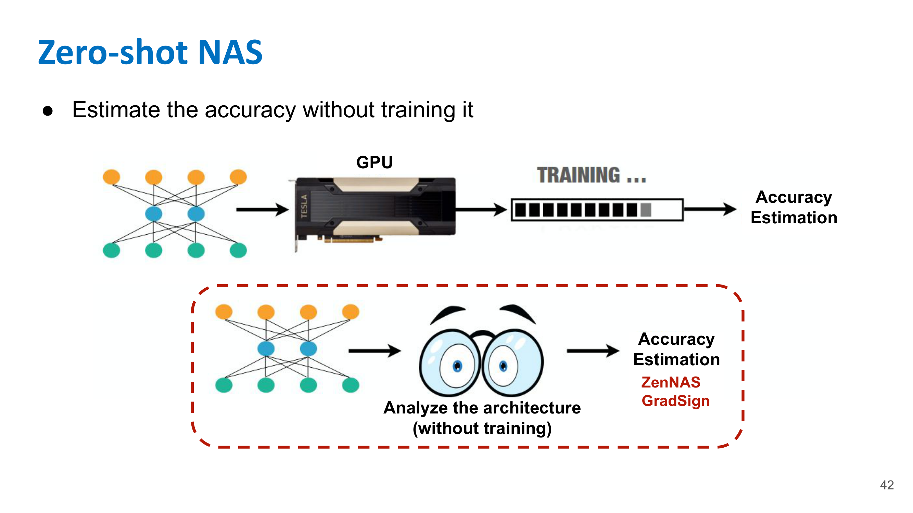
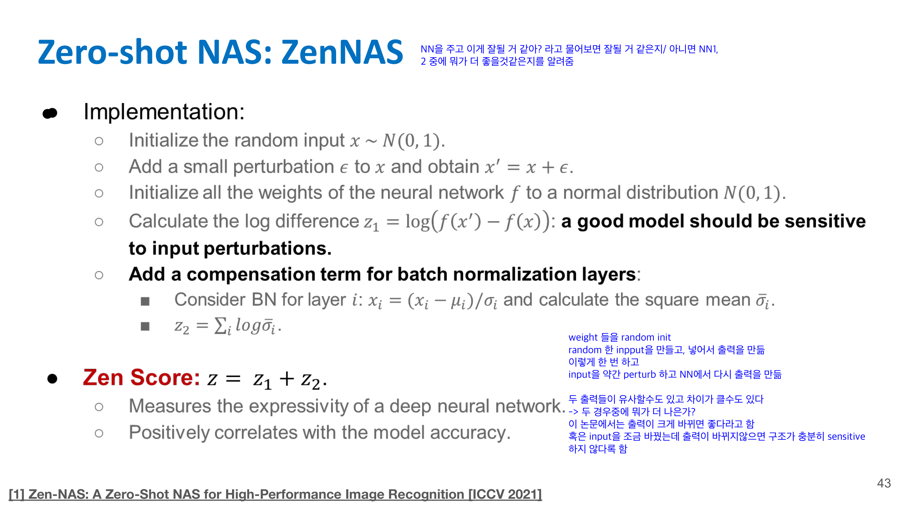

ZenNAS는 **Zero-shot NAS** 계열이야.

```text
Architecture A 선택
→ 학습하지 않음
→ architecture 구조만 분석
→ 성능이 좋을지 점수로 추정
```

하는 방식이야.

즉, 목적은:

> candidate architecture를 실제로 학습시키지 않고도, 이 모델이 학습 후 좋은 accuracy를 낼 가능성이 있는지 빠르게 판단하는 것

- 장점: 속도가 빠르다

### 직관적 이해

좋은 architecture는 학습 전에도 어느 정도 “좋은 신호 흐름”을 가질 가능성이 있어.

예를 들어 너무 깊거나 연결이 안 좋으면 gradient가 잘 안 흐를 수 있고, activation이 너무 죽거나 폭발할 수 있어. 그러면 학습을 해도 성능이 안 좋을 가능성이 크다.

ZenNAS는 이런 관점에서 architecture를 실제 학습시키지 않고도, 구조가 괜찮은지 점수화해서 좋은 후보를 빠르게 고르려는 방법이야.

### 방법론
- Weight 들을 random init
- random input으로 output을 얻음
- input 에 perturb 주고 다시 모델에 넣어서 output 얻음
- output1이랑 output2 의 차이가 크면 좋은 모델 (더 sensitive 한 네트워크니까)

## 9-11. OFA (Once-for-All) Network

OFA는 하나의 큰 network를 학습시켜 놓고, 그 안에서 다양한 child network를 뽑아 쓰는 방식이다. Lecture에서도 OFA network는 많은 child network를 포함하고, 그 child network들이 sparse하게 activation된다고 설명한다. 

즉, 매번 hardware마다 모델을 새로 학습하는 게 아니라,

> 큰 supernet 하나를 train하고, device 조건에 맞는 subnet을 선택한다

는 방식이다.

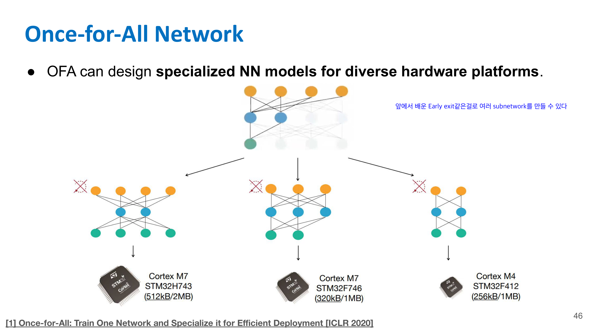

OFA는 다양한 hardware platform에 맞는 specialized NN model을 설계할 수 있다. 

OFA에서 조절하는 대표적인 dimension은 다음과 같다.
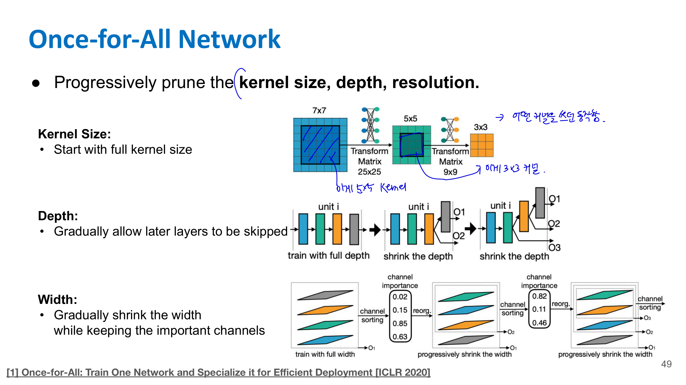

* kernel size
* depth
* resolution
* width
    - 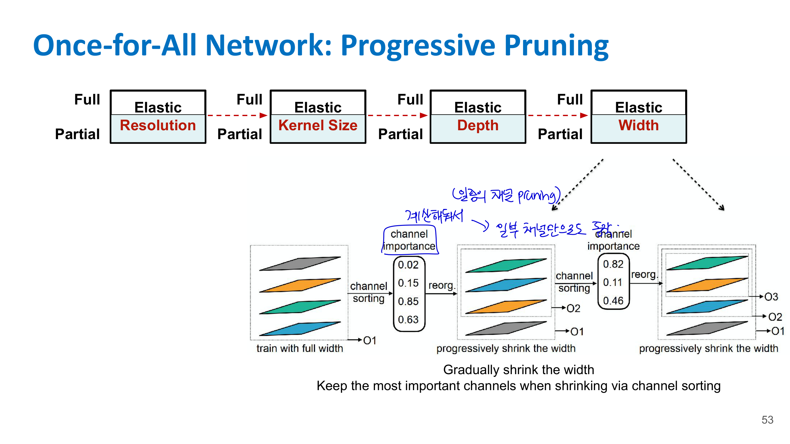

Lecture에서는 OFA가 kernel size, depth, resolution 등을 progressively prune한다고 설명한다. 

예를 들어 처음에는 큰 kernel로 시작하고, 점점 작은 kernel도 사용할 수 있게 만들고, width도 줄이며, depth도 일부 layer를 skip할 수 있게 한다. 

---

## 9-12. Lecture 9 핵심 흐름 요약

전체 흐름을 아주 짧게 정리하면 이거야.

NAS는 사람이 직접 정하던 neural network 구조를 자동으로 찾는 방법이다. 이를 위해 먼저 가능한 architecture 후보 집합인 **search space**를 정의하고, 그 공간을 탐색하는 **search strategy**를 정한다. 하지만 후보 모델을 매번 다 학습하면 너무 느리기 때문에 ENAS처럼 weight sharing을 이용해 성능을 빠르게 추정한다. 마지막으로 실제 배포에서는 accuracy뿐 아니라 latency, memory, energy도 중요하므로 ProxylessNAS나 Once-for-All처럼 **hardware-aware NAS**가 필요하다.
