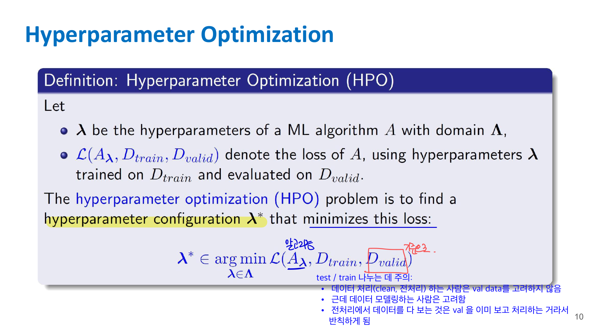
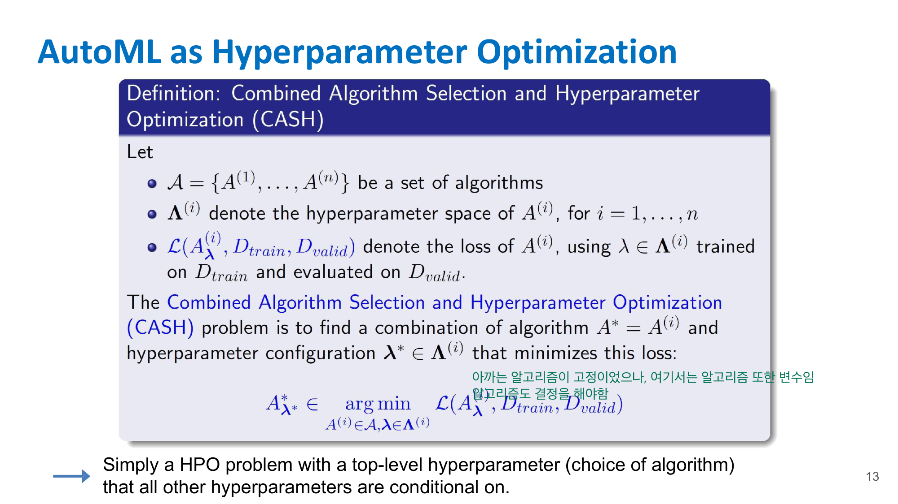
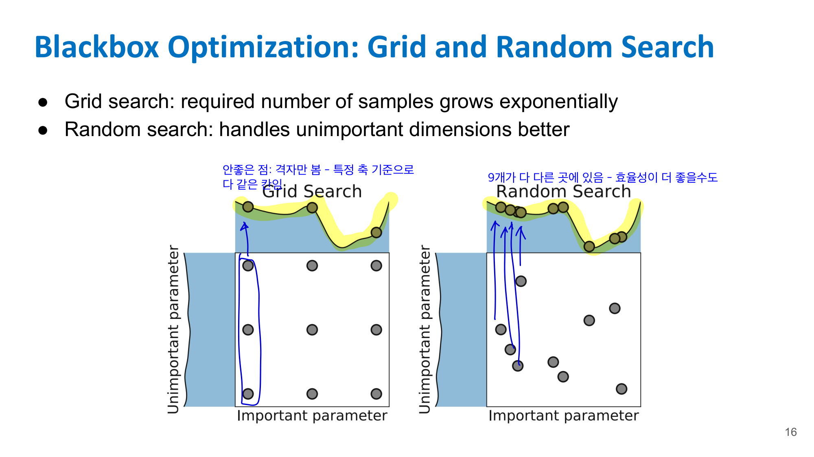
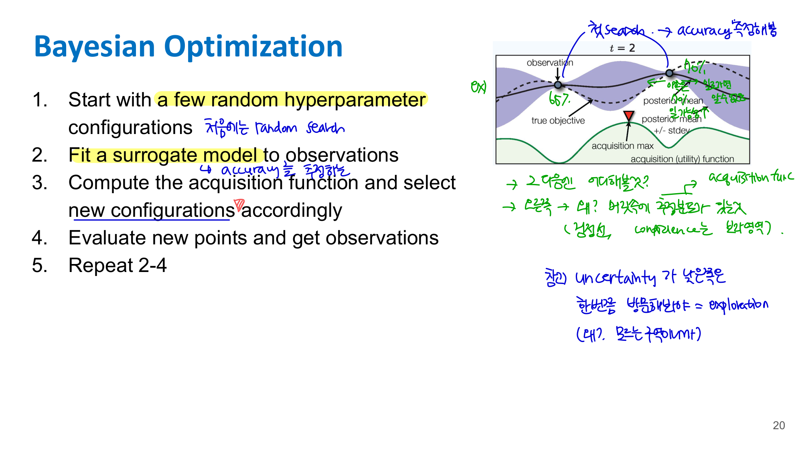
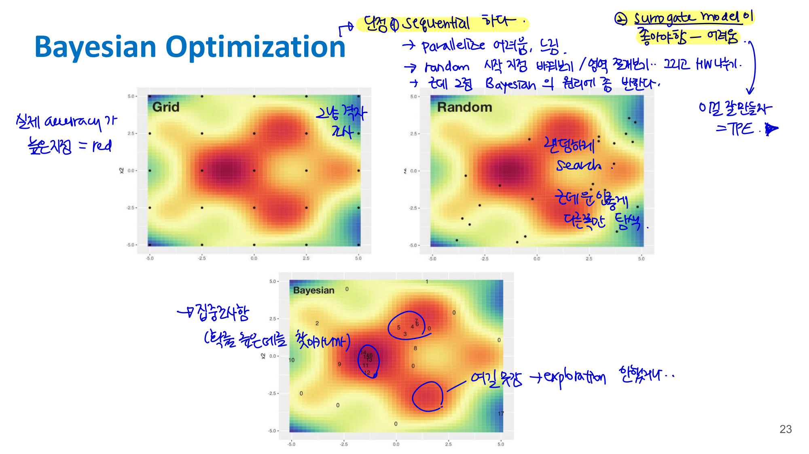
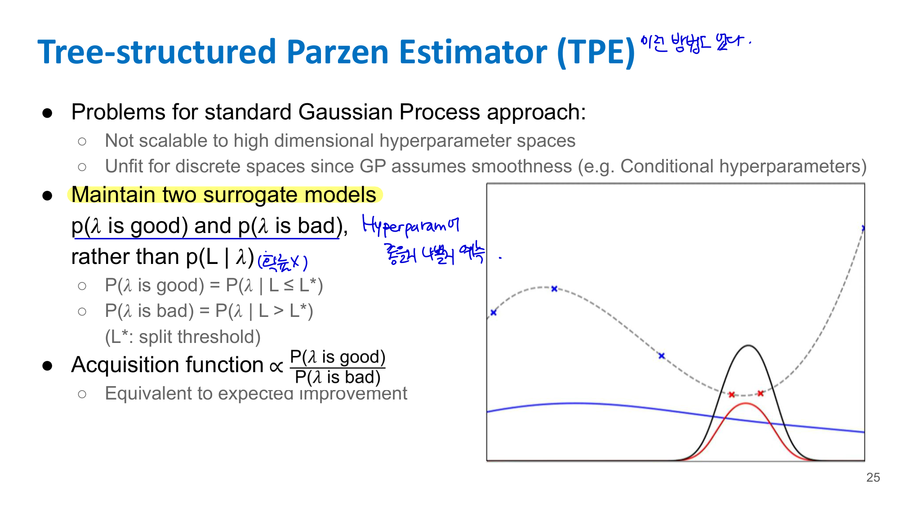
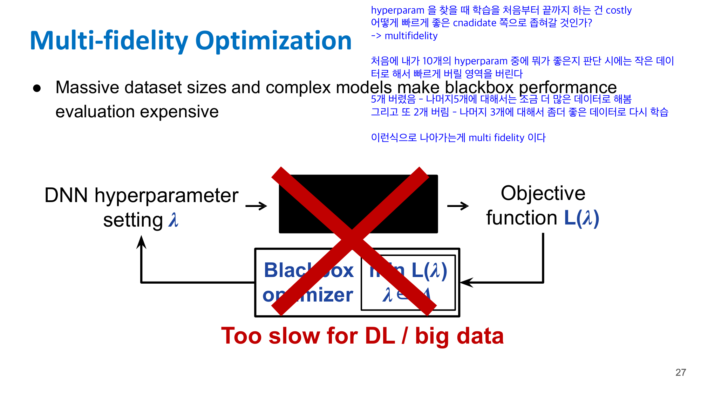
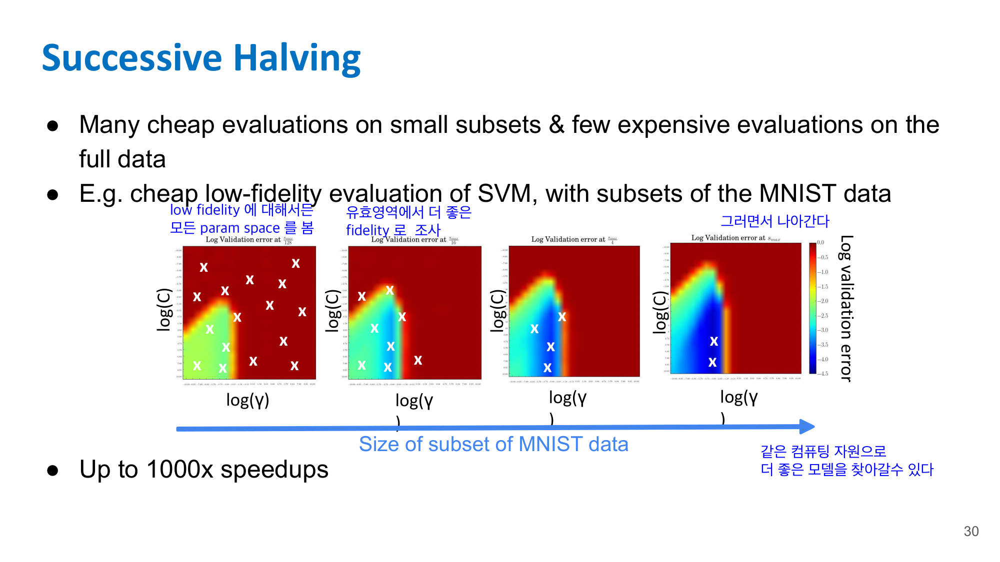
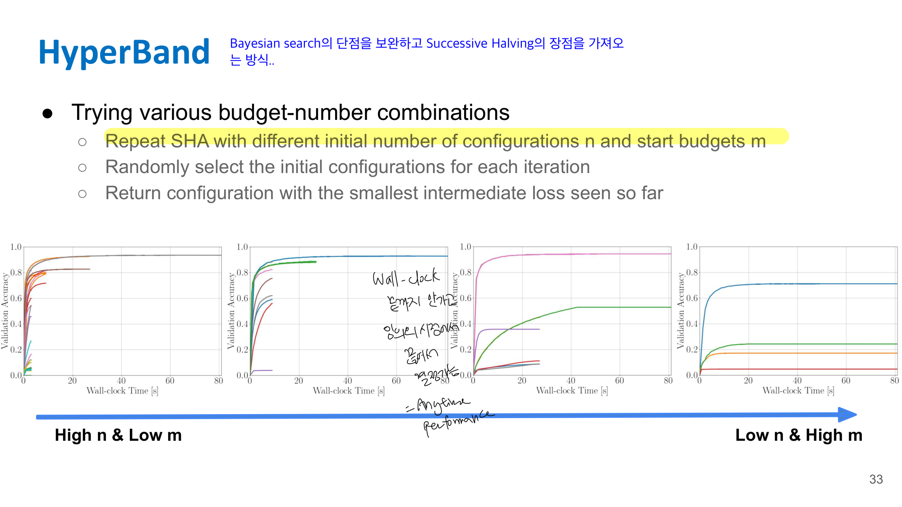
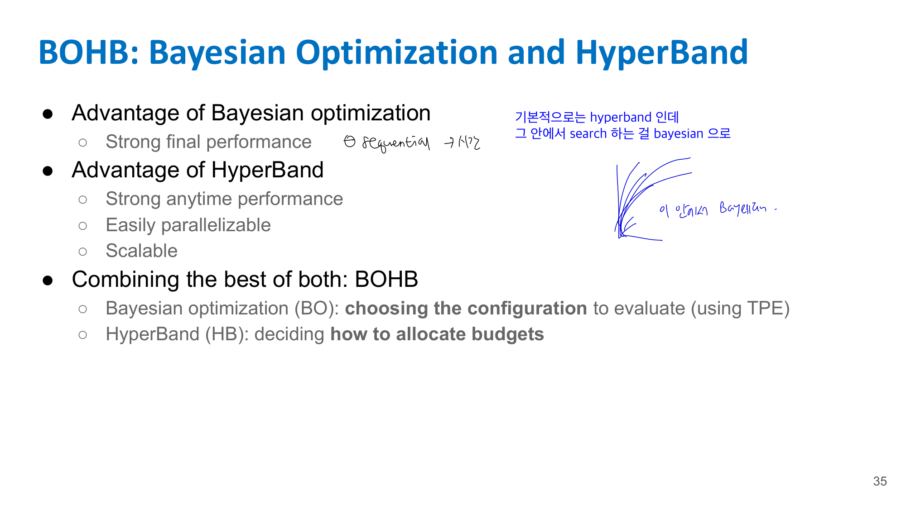

# 10. AutoML과 Hyperparameter Optimization, HPO

Lecture 9가 “architecture 자체를 어떻게 찾을까?”였다면, Lecture 10은 “모델/알고리즘/하이퍼파라미터 선택을 어떻게 자동화할까?”에 가깝다. 강의 목표도 traditional ML pipeline의 어려움과 여러 HPO 기법을 이해하는 것이다. 

## 10-1. Traditional ML Pipeline의 문제

일반적인 ML 모델 개발 과정은 반복적이고 오래 걸린다.

예를 들어:

* 데이터 전처리를 어떻게 할지
* feature를 어떻게 만들지
* 어떤 알고리즘을 쓸지
* hyperparameter를 어떻게 줄지
* 모델 구조를 어떻게 할지

이런 결정을 계속 반복해야 한다.

Lecture에서는 ML pipeline 설계의 어려움을 네 가지로 정리한다.

| 문제                    | 의미                                        |
| --------------------- | ----------------------------------------- |
| Complex Search Space  | 선택지가 너무 많음                                |
| Black-Box Problem     | 설정을 넣고 학습해보기 전까지 결과를 모름                   |
| Expensive Evaluations | 한 번 학습/평가하는 데 시간이 오래 걸림                   |
| Noise on Observations | 같은 설정도 데이터 split이나 randomness 때문에 결과가 흔들림 |

여기서 중요한 건 **black-box**라는 표현이야. 어떤 hyperparameter 설정 $\lambda$를 넣었을 때 loss가 어떻게 나올지는 직접 학습해보기 전까지 정확히 모른다.

## 10-2. Hyperparameter Optimization, HPO

HPO는 hyperparameter 설정 $\lambda$를 찾아서 validation loss를 최소화하는 문제다.



$$
\lambda^* \in \arg\min_{\lambda \in \Lambda} \mathcal{L}(A_\lambda, D_{\text{train}}, D_{\text{valid}})
$$

여기서:

* $\lambda$: hyperparameter 설정
* $\Lambda$: 가능한 hyperparameter search space
* $A_\lambda$: hyperparameter $\lambda$를 사용한 ML algorithm
* $D_{\text{train}}$: training data
* $D_{\text{valid}}$: validation data
* $\mathcal{L}$: validation loss

쉽게 말하면:

> train data로 학습했을 때 validation data에서 loss가 가장 낮아지는 hyperparameter를 찾는 것

이다.

여기서 주의할 점은 **validation data를 전처리 단계에서 미리 보면 안 된다**는 거야. 전처리나 feature engineering 과정에서 validation data의 통계를 써버리면 이미 validation set을 보고 모델링한 것이 되기 때문에 data leakage가 된다.

---

## 10-3. Hyperparameter의 종류

### 10-3-1. Continuous

연속값 hyperparameter.

```text
SVM의 regularization parameter C
Boosting의 shrinkage parameter λ
Learning rate
```

### 10-3-2. Integer

정수값 hyperparameter.

```text
Random Forest의 tree 개수
Boosting의 tree 개수
Neural network의 layer 수
```

### 10-3-3. Categorical

범주형 hyperparameter.

```text
Algorithm: SVM, RF, NN
SVM kernel: polynomial, RBF
Activation function: ReLU, Leaky ReLU
```

### 10-3-4. Conditional

다른 hyperparameter가 특정 값일 때만 의미가 있는 hyperparameter.

예를 들어 optimizer를 Adam으로 골랐을 때만 Adam의 second momentum parameter가 의미 있다.

```text
A = optimizer choice: Adam or SGD
B = Adam's second momentum parameter
B는 A = Adam일 때만 active
```
---

## 10-4. AutoML as HPO: CASH 문제



AutoML은 HPO를 더 확장한 문제로 볼 수 있다.

일반 HPO에서는 알고리즘 $A$가 고정되어 있고, 그 안의 hyperparameter $\lambda$만 찾는다.

하지만 AutoML에서는 **알고리즘 자체도 선택 대상**이다.

PPT에서는 이를 **CASH, Combined Algorithm Selection and Hyperparameter Optimization** 문제라고 부른다. 

즉,

$$
A^*, \lambda^* \in \arg\min_{A^{(i)} \in \mathcal{A},\ \lambda \in \Lambda^{(i)}}
\mathcal{L}(A_{\lambda}^{(i)}, D_{\text{train}}, D_{\text{valid}})
$$

여기서 중요한 점은 알고리즘을 고르면 그 알고리즘에 따라 hyperparameter space도 달라진다는 것이다.

예를 들어:

```text
SVM 선택 → C, kernel, gamma 등을 튜닝
Random Forest 선택 → tree 개수, max depth 등을 튜닝
Neural Network 선택 → learning rate, hidden size, dropout 등을 튜닝
```

그래서 AutoML은 “알고리즘 선택”이 top-level hyperparameter이고, 나머지 hyperparameter들이 그 선택에 conditional하게 붙는 HPO 문제라고 볼 수 있다.

---

## 10-5. Black-box Hyperparameter Optimization

HPO에서는 어떤 설정 $\lambda$를 넣었을 때 loss $L(\lambda)$가 어떻게 나올지 식으로 정확히 알 수 없다. 모델을 실제로 학습하고 평가해야 한다.

그래서 이를 black-box function으로 본다.

```text
DNN hyperparameter setting λ
→ black-box training/evaluation
→ objective function L(λ)
```

목표는:

$$
\min_{\lambda \in \Lambda} L(\lambda)
$$

이다.

문제는 이 black-box function 평가가 비싸다는 거야. Deep learning에서는 한 번 평가하려면 모델을 몇 epoch씩 학습해야 하니까 너무 오래 걸린다. 

---

## 10-6. Grid Search

Grid search는 각 hyperparameter 후보를 격자처럼 정해놓고 모든 조합을 시도하는 방식이다.

예를 들어:

```text
learning rate ∈ {0.1, 0.01, 0.001}
batch size ∈ {32, 64, 128}
dropout ∈ {0.2, 0.5}
```

이면 총 조합 수는:

$$
3 \times 3 \times 2 = 18
$$

개다.

장점은 단순하고 구현이 쉽다는 것.

단점은 hyperparameter dimension이 늘어나면 조합 수가 폭발한다.

PPT에서도 grid search는 필요한 sample 수가 exponential하게 증가한다고 설명한다. 

---

## 10-7. Random Search

Random search는 search space에서 무작위로 hyperparameter 설정을 뽑아 평가한다.

처음 보면 grid search보다 대충 하는 것 같지만, 실제로는 더 효율적일 수 있다.

이유는 모든 hyperparameter가 똑같이 중요한 게 아니기 때문이다.

예를 들어 성능에 중요한 건 learning rate 하나인데, 나머지 parameter는 별로 중요하지 않다고 해보자. Grid search는 중요하지 않은 축까지 규칙적으로 나누느라 많은 평가를 낭비한다. 반면 random search는 중요한 축에서 더 다양한 값을 볼 수 있다.



PPT에서도 random search가 unimportant dimension을 더 잘 처리한다고 설명하고, grid search는 useful evaluation이 적고 random search는 더 많은 useful evaluation을 얻는 그림이 나온다. 

---

## 10-8. Bayesian Optimization

Grid search와 random search의 한계는 **이전 관측 결과를 학습하지 않는다**는 것이다.

예를 들어 이미 몇 개 hyperparameter를 평가해서 어떤 영역이 좋아 보이는지 알게 됐다면, 다음에는 그 정보를 활용해서 더 좋은 후보를 골라야 한다.

Bayesian Optimization의 핵심은:

> 지금까지의 관측 결과를 바탕으로 promising region을 예측하고, 다음에 평가할 hyperparameter를 고르는 것

이다. 

Bayesian Optimization은 크게 두 가지를 사용한다.

### Surrogate Model

진짜 objective function $L(\lambda)$는 평가가 비싸다. 그래서 이를 근사하는 모델을 만든다.

$$
L(\lambda) \approx \hat{L}(\lambda)
$$

Surrogate model은 보통 다음 두 가지를 함께 예측한다.

* posterior mean $\hat{L}(\lambda)$
* uncertainty $\sigma(\lambda)$

즉, “이 지점의 loss가 어느 정도일 것 같다”와 “얼마나 불확실한가”를 같이 본다.

PPT에서는 Gaussian Process가 예시로 나온다. 

### Acquisition Function

Acquisition function은 다음에 어디를 평가할지 정하는 함수다.

여기서 중요한 trade-off가 있다.

| 전략           | 의미                     |
| ------------ | ---------------------- |
| Exploitation | 지금까지 좋다고 추정되는 영역을 더 조사 |
| Exploration  | 불확실성이 큰 영역을 조사         |

Bayesian Optimization은 이 둘을 균형 있게 고려한다.
---

## 10-8-1. Bayesian Optimization 절차

PPT의 절차는 다음과 같다. 



1. 몇 개의 random hyperparameter configuration으로 시작한다.
2. 관측 결과에 surrogate model을 fitting한다.
3. acquisition function을 계산해서 다음 후보를 선택한다.
4. 새 후보를 실제로 평가해서 observation을 얻는다.
5. 2~4를 반복한다.

즉, 처음에는 아무 정보가 없으니까 random search처럼 시작하지만, 점점 관측을 쌓으면서 search space에 대한 믿음, 즉 posterior를 업데이트한다.

---

## 10-8-2. Bayesian Optimization의 한계

PPT에서는 특히 Gaussian Process 기반 Bayesian Optimization의 문제를 말한다. 



1. **High-dimensional hyperparameter space에 잘 scale되지 않는다.**
2. **Discrete space나 conditional hyperparameter에 부적합하다.**

GP는 기본적으로 smooth한 연속 공간을 가정하는데, AutoML search space에는 categorical, conditional parameter가 많다.

예를 들어:

```text
optimizer = Adam이면 beta2가 의미 있음
optimizer = SGD이면 beta2는 의미 없음
```

이런 구조는 일반적인 GP로 다루기 어렵다.

---

## 10-9. TPE, Tree-structured Parzen Estimator

TPE는 Bayesian Optimization의 한 종류로 보면 된다. 하지만 일반적인 GP처럼 $p(L \mid \lambda)$를 모델링하지 않고, 좋은 설정과 나쁜 설정의 분포를 따로 모델링한다.



즉, 지금까지 평가한 hyperparameter들을 loss 기준으로 나눠서:

```text
좋았던 hyperparameter들의 분포
나빴던 hyperparameter들의 분포
```

를 각각 만든다.

그리고 “좋은 분포에서는 확률이 높고, 나쁜 분포에서는 확률이 낮은” 후보를 고른다.

-> AutoML에서 많이 쓰인다.

---

## 10-10. Multi-fidelity Optimization

Deep learning에서 hyperparameter 하나를 평가하려면 보통 전체 dataset으로 full training을 해야 한다. 이게 너무 비싸다.

Multi-fidelity optimization은 이 문제를 이렇게 해결한다.

> 처음부터 full budget으로 평가하지 말고, 작은 budget으로 대충 평가한 뒤 가능성 없는 후보를 빠르게 버리자.



예를 들어 10개의 hyperparameter 후보가 있으면:

```text
10개 후보를 작은 데이터 / 적은 epoch으로 빠르게 평가
→ 안 좋은 5개 버림
→ 남은 5개를 더 큰 데이터 / 더 많은 epoch으로 평가
→ 또 안 좋은 후보 버림
→ 최종 후보만 full budget으로 평가
```

이런 식이다.

핵심은:

> 많은 후보를 싸게 평가하고, 좋은 후보에만 많은 자원을 쓰는 것

이다.

두 가지 Fidelity control 방식이 있다
1. 데이터 셋을 조금부터 시작해서 데이터 크기를 늘린다
2. epoch을 작게 시작했다가 늘린다

---

## 10-11. Successive Halving

Successive Halving은 multi-fidelity optimization의 대표 방법이다.

PPT에서는 8개의 algorithm/configuration을 예로 들어 설명한다. 전체 budget의 $1/8$만 써서 모든 후보를 평가한 뒤, 절반을 버리고, 남은 후보에게 budget을 두 배로 준다. 



예를 들어 후보가 8개라면:

```text
Round 1:
8개 후보를 작은 budget으로 평가
→ 하위 4개 제거

Round 2:
남은 4개 후보를 2배 budget으로 평가
→ 하위 2개 제거

Round 3:
남은 2개 후보를 더 큰 budget으로 평가
→ 하위 1개 제거

Final:
마지막 1개 선택
```

그래서 이름이 Successive Halving이야. 매 round마다 후보를 절반씩 줄인다.

### Successive Halving의 한계

Successive Halving의 문제는 **초기 후보 수와 budget을 어떻게 정할지 어렵다**는 것이다. 

같은 총 budget이 있다고 할 때 두 선택지가 있다.

**선택 1: 후보를 많이 시도하고 각 후보에 작은 budget 부여**

장점: 다양한 후보를 넓게 탐색할 수 있다.

단점: 너무 적은 budget으로 평가하면 원래 좋은 후보가 초반에 나쁘게 보여서 prematurely terminated 될 수 있다.

**선택 2: 후보를 적게 시도하고 각 후보에 큰 budget 부여**

장점: 각 후보를 더 믿을 만하게 평가할 수 있다.

단점: 나쁜 후보에 너무 많은 resource를 낭비할 수 있고, 탐색 범위가 좁다.

즉, Successive Halving은 좋지만:

> 처음에 몇 개를 뽑고, 얼마만큼의 budget으로 시작할지 정하는 것 자체가 또 어려운 hyperparameter가 된다.

---

## 10-12. HyperBand

HyperBand는 Successive Halving의 이 한계를 해결하려고 나온 방법이다.

핵심은:

> 여러 가지 “후보 수 vs 초기 budget” 조합으로 Successive Halving을 반복해보자.



* 서로 다른 초기 후보 수 $n$과 시작 budget $m$으로 SHA를 반복
* 각 iteration에서 initial configurations를 random하게 선택
* 지금까지 본 intermediate loss 중 가장 작은 configuration을 반환

여러 개의 budget 전략를 해보고 좋은 걸 선택한다

HyperBand의 장점은 **anytime performance**가 좋다는 것이다.

Anytime performance란:

> 중간에 언제 멈춰도 꽤 괜찮은 답을 줄 수 있는 성능

이라고 보면 된다.

PPT에서도 HyperBand는 wall-clock time 기준으로 중간에 끊어도 좋은 후보를 얻을 수 있다는 취지로 설명된다.

---

## 10-13. BOHB: Bayesian Optimization + HyperBand

### Bayesian Optimization의 장점

* 최종 성능이 좋다.

### HyperBand의 장점

* strong anytime performance
* easily parallelizable
* scalable

즉, 같은 시간 안에 빠르게 괜찮은 후보를 찾는 데 강하다.

## 10-13-1. BOHB

BOHB는 말 그대로 Bayesian Optimization과 HyperBand를 결합한 방법이다.



* Bayesian Optimization, BO: 어떤 configuration을 평가할지 선택
* HyperBand, HB: budget을 어떻게 allocate할지 결정

즉,

```text
HyperBand가 budget allocation 담당
TPE 기반 Bayesian Optimization이 configuration selection 담당
```

이라고 보면 된다.

BOHB는 HyperBand의 random configuration selection을 TPE model-based search로 대체한다. 그리고 Successive Halving 과정에서 얻은 intermediate loss들을 TPE 업데이트에 사용하며, 더 높은 budget에서 얻은 결과를 더 우선시한다. 

그래서 BOHB는 두 장점을 동시에 노린다.

| 방법                    | 장점                                               |
| --------------------- | ------------------------------------------------ |
| Bayesian Optimization | final performance 좋음                             |
| HyperBand             | anytime performance 좋음, parallelizable, scalable |
| BOHB                  | 둘을 결합해서 anytime과 final performance 모두 개선         |

---

## 10-14. Lecture 10 핵심 비교표

| 방법                    | 핵심 아이디어                            | 장점                       | 단점                         |
| --------------------- | ---------------------------------- | ------------------------ | -------------------------- |
| Grid Search           | 격자 조합 전부 평가                        | 단순함                      | dimension 증가 시 폭발          |
| Random Search         | 무작위 후보 평가                          | 중요 parameter가 적을 때 효율적   | 이전 결과를 학습하지 않음             |
| Bayesian Optimization | surrogate + acquisition으로 다음 후보 선택 | 최종 성능 좋음                 | sequential, 고차원/조건부 공간 어려움 |
| TPE                   | good/bad hyperparameter 분포를 따로 모델링 | conditional space에 강함    | 여전히 모델링 품질에 의존             |
| Successive Halving    | 작은 budget으로 시작해 나쁜 후보 제거           | 자원 효율 좋음                 | 초기 후보 수/budget 선택 어려움      |
| HyperBand             | 여러 SHA bracket을 돌림                 | anytime performance 좋음   | 후보 선택은 random 기반           |
| BOHB                  | TPE + HyperBand                    | anytime + final 성능 모두 좋음 | 구현/구조가 더 복잡                |

---

## 10-15. 시험용 핵심 정리

Lecture 10에서 꼭 기억할 문장은 이거야.

**AutoML은 알고리즘 선택, 전처리, architecture, hyperparameter 선택을 자동화하는 것이고, 이를 HPO 또는 CASH 문제로 볼 수 있다.**

**HPO는 validation loss를 최소화하는 hyperparameter $\lambda^*$를 찾는 문제다.**

$$
\lambda^* \in \arg\min_{\lambda \in \Lambda} \mathcal{L}(A_\lambda, D_{\text{train}}, D_{\text{valid}})
$$

**Grid search는 모든 조합을 보지만 비싸고, random search는 중요한 dimension을 더 다양하게 탐색할 수 있다.**

**Bayesian Optimization은 이전 관측으로 surrogate model을 만들고 acquisition function으로 다음 후보를 고른다.**

**TPE는 좋은 hyperparameter 분포와 나쁜 hyperparameter 분포를 따로 모델링한다.**

**Multi-fidelity optimization은 작은 budget으로 많은 후보를 평가하고, 좋은 후보에만 더 큰 budget을 주는 방식이다.**

**Successive Halving은 후보를 절반씩 제거하고, HyperBand는 여러 budget 전략으로 Successive Halving을 반복한다.**

**BOHB는 TPE 기반 Bayesian Optimization으로 후보를 고르고, HyperBand로 budget을 배분해서 anytime performance와 final performance를 모두 노린다.**
