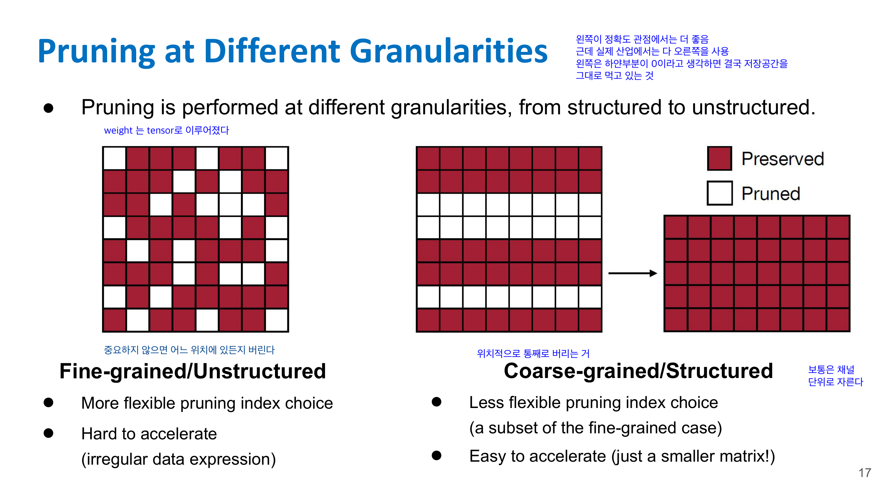
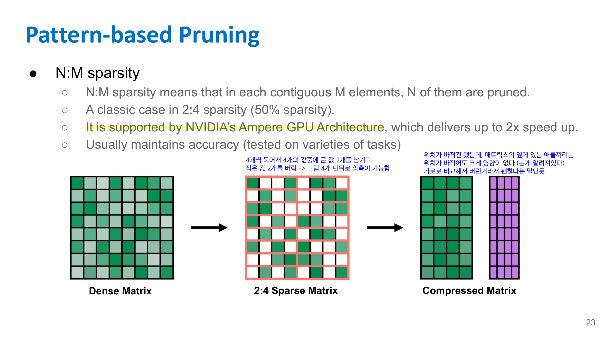
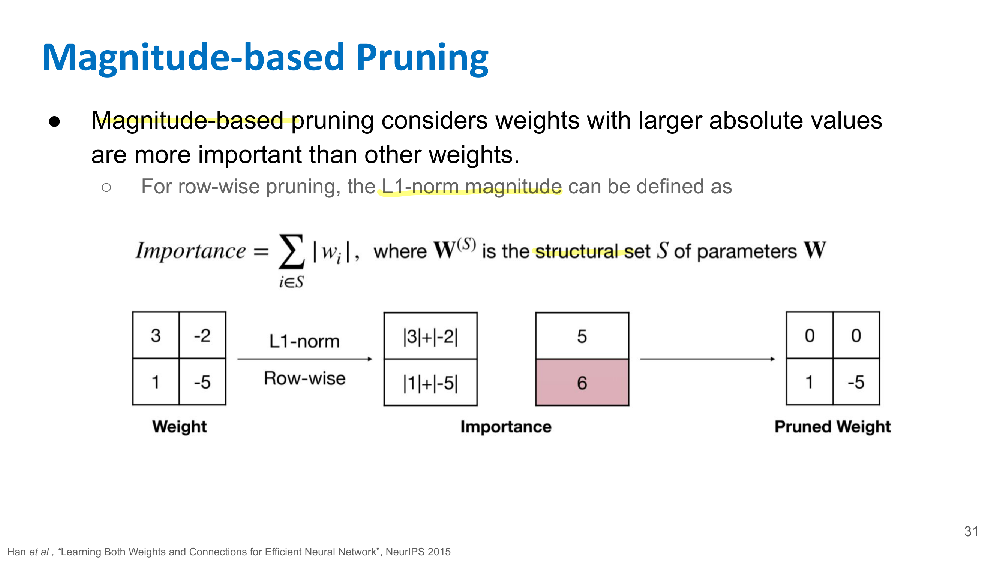
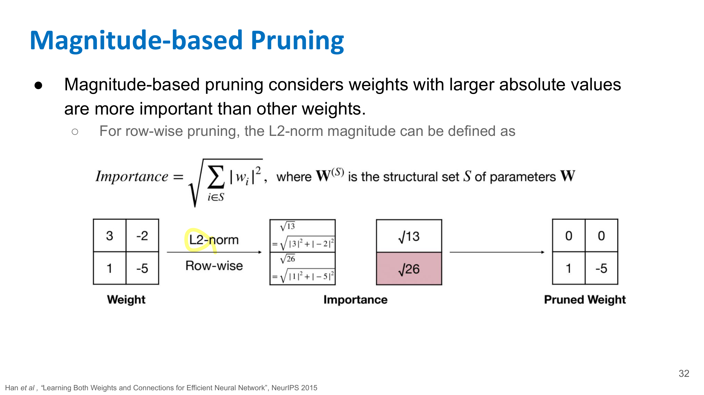
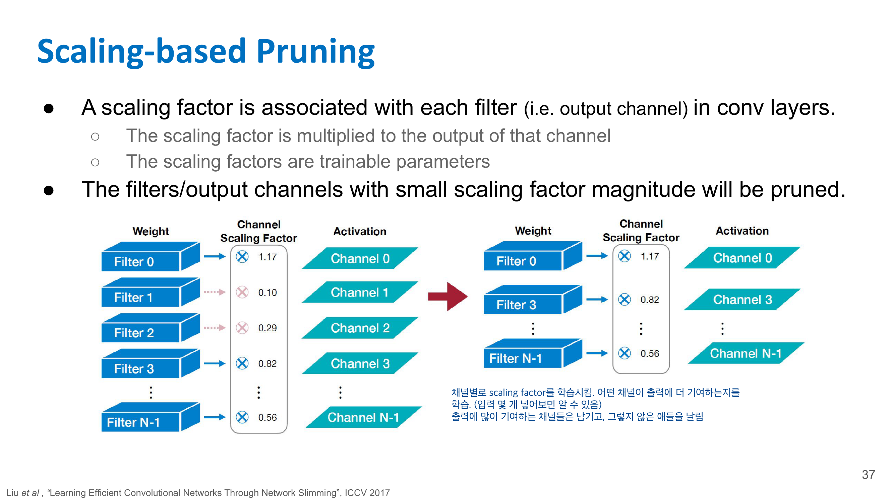
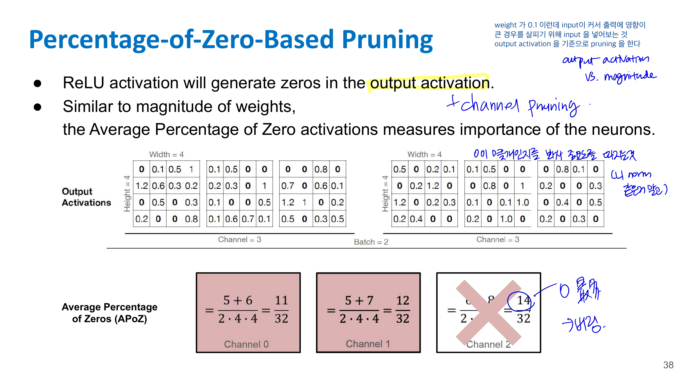

# 📚 02. Pruning

Lecture 2는 **Pruning (Part I)**, 즉 “신경망에서 필요 없는 weight나 neuron을 잘라서 모델을 작고 빠르게 만드는 방법”을 배우는 강의야. 핵심 목표는 **pruning의 개념**, **어떤 단위로 자를지**, **무엇을 기준으로 자를지**를 이해하는 거야. Lecture 2의 overview에서도 pruning을 통해 storage와 computation 요구량을 줄이고, fine-grained / pattern-based / channel-level pruning, magnitude-based / scaling-based pruning을 배운다고 정리돼 있어. 

---

## 2-1. Pruning이 왜 필요한가?

딥러닝 모델은 parameter가 많아.
parameter가 많으면 메모리를 많이 쓰고, 연산량도 많아져.

그런데 Lecture 2에서 강조하는 중요한 점은:

> 연산 자체보다 메모리 접근이 더 비쌀 수 있다.

즉 GPU나 CPU가 계산하는 것도 비용이지만, weight를 메모리에서 가져오는 것도 큰 비용이야.
그래서 weight 수를 줄이면 메모리 사용량도 줄고, 잘 구현되면 계산도 빨라질 수 있어.

Pruning은 이런 생각에서 출발해.

> “모델 안에 사실상 별로 중요하지 않은 weight나 neuron이 있지 않을까? 그걸 없애도 성능이 유지되지 않을까?”

---

## 2-2. Pruning의 기본 개념

Pruning은 신경망을 작게 만드는 방법이야.

쉽게 말하면:

> 학습된 neural network에서 중요하지 않은 연결이나 neuron을 제거하는 것

이야.

예를 들어 fully connected layer에서 모든 neuron이 서로 연결되어 있다면, pruning 후에는 일부 connection이 사라져서 sparse한 구조가 돼.

슬라이드에서는 pruning을 두 가지 관점으로 보여줘.

1. **Synapse pruning**
   weight connection을 제거하는 것
   즉, 특정 weight를 0으로 만드는 것

2. **Neuron pruning**
   neuron 자체를 제거하는 것
   해당 neuron과 연결된 weight들이 통째로 사라짐

---

## 3. Pruning 후에는 보통 fine-tuning을 한다

Pruning을 하면 당연히 모델 일부를 잘라냈으니까 성능이 떨어질 수 있어.

그래서 일반적인 흐름은:

$
\text{Train} \rightarrow \text{Prune} \rightarrow \text{Fine-tune}
$

이야.

처음에는 full model을 학습하고, 그다음 중요하지 않은 weight를 자르고, 마지막으로 남은 weight들을 다시 조금 학습해서 accuracy를 회복시키는 방식이야.

너가 과제에서 했던 pruning도 이 흐름이랑 거의 같아.
먼저 original model이 있고, weight 중요도를 기준으로 mask를 만들고, pruning 후 다시 몇 epoch fine-tuning해서 성능을 회복시키는 식이었지.

---

## 2-3. Pruning problem formulation

Pruning을 수식으로 보면 이런 문제야.

$
\min_{W_p} L(x; W_p)
$

subject to

$
|W_p|_0 \leq N
$

여기서:

* $W$: 원래 weight
* $W_p$: pruning된 weight
* $L$: loss function
* $|W_p|_0$: 0이 아닌 weight 개수
* $N$: 남기고 싶은 weight 개수

즉 의미는 이거야.

> weight 개수를 $N$개 이하로 제한하면서, loss가 최대한 작아지도록 pruning된 weight를 찾자.

쉽게 말해서:

> “적은 weight만 남기고도 성능이 좋은 모델을 찾자.”

---

## 2-4. Pruning에서 결정해야 하는 것들

Lecture 2에서는 pruning을 할 때 크게 세 가지를 결정해야 한다고 보면 돼.

첫째, **Pruning granularity**
어떤 단위로 자를 것인가?

둘째, **Pruning criterion**
무엇을 기준으로 자를 것인가?

셋째, **Pruning ratio**
얼마나 자를 것인가?

Lecture 2에서는 주로 앞의 두 개, 즉 **granularity**와 **criterion**을 다뤄.

---

## 2-5. Pruning Granularity: 어떤 단위로 자를 것인가?

Pruning granularity는 “weight를 어떤 모양으로 제거할 것인가?”야.

대표적으로 세 가지가 나와.

### 2-5-1. Fine-grained / Unstructured pruning

가장 자유롭게 weight 하나하나를 보고 자르는 방식이야.

예를 들어 weight matrix가 이렇게 있다고 하면:

$$
W =
\begin{bmatrix}
0.2 & -0.01 & 1.4 \\
0.03 & 0.8 & -0.02 \\
1.1 & 0.04 & -0.7
\end{bmatrix}
$$

작은 weight들을 0으로 만들어서:

$$
W_p =
\begin{bmatrix}
0.2 & 0 & 1.4 \\
0 & 0.8 & 0 \\
1.1 & 0 & -0.7
\end{bmatrix}
$$

이런 식으로 만드는 거야.

장점은 **성능을 잘 유지하면서 많이 자를 수 있다**는 거야.
왜냐하면 weight 하나하나를 매우 세밀하게 골라서 제거하니까.

단점은 **실제로 빨라지기 어렵다**는 거야.

왜냐하면 weight가 불규칙하게 듬성듬성 남아 있어서 hardware가 효율적으로 계산하기 어렵거든.
이걸 **unstructured sparsity**라고 해.

과제에서 global pruning으로 weight를 0으로 만드는 방식은 대부분 이쪽에 가까워.

---

### 2-5-2. Pattern-based pruning

Fine-grained pruning은 너무 불규칙해서 hardware acceleration이 어렵다.
그래서 어느 정도 정해진 pattern 안에서만 pruning하는 방식이 나와.

- N:M sparsity는 weight를 아무렇게나 자르는 게 아니라, **연속된 N개 weight 중 M개만 남기는 structured sparsity** 방식이야. 
- 예를 들어 **2:4 sparsity**는 4개 weight 묶음마다 중요한 2개만 남기고 나머지 2개는 0으로 만든다.
- 이렇게 하면 nonzero 값들을 메모리 왼쪽에 압축해서 저장하고, 위치 정보는 작은 metadata로 따로 저장할 수 있다.
- 장점은 unstructured pruning보다 하드웨어가 처리하기 쉬워서 실제 속도 향상으로 이어지기 좋다는 점이다.
- 다만 이 이득을 제대로 보려면 NVIDIA Tensor Core처럼 **M:N sparsity를 지원하는 하드웨어 구조**가 필요하다.

장점은 fine-grained보다 구조가 있어서 hardware가 조금 더 다루기 쉽다는 점이야.
단점은 완전히 자유롭게 자르는 것보다는 pruning 선택지가 줄어든다는 거야.

즉 중간 형태야.

> Fine-grained보다 규칙적이고, channel pruning보다는 세밀하다.

---

### 2-5-3. Channel-level pruning

Channel-level pruning은 아예 channel 단위로 제거하는 방식이야.

CNN에서 feature map이 여러 channel을 갖잖아.

예를 들어 어떤 layer의 출력이:

$
C \times H \times W
$

형태라면, 여기서 특정 channel 전체를 제거하는 거야.

예를 들어 64개의 output channel이 있으면 그중 20개를 제거해서 44개만 남기는 식이야.

장점은 **실제로 속도 향상이 잘 된다**는 거야.
왜냐하면 channel 자체가 줄어들면 다음 layer의 입력 channel 수도 줄어들고, matrix/tensor 크기가 실제로 작아지기 때문이야.

단점은 **성능 손실이 더 클 수 있다**는 거야.
weight 하나만 제거하는 게 아니라 channel 전체를 날리니까 정보 손실이 더 크지.

정리하면:

| 방식            | 자르는 단위             | 장점                          | 단점             |
| ------------- | ------------------ | --------------------------- | -------------- |
| Fine-grained  | weight 하나하나        | 성능 유지 좋음, sparsity 높게 가능    | 실제 가속 어려움      |
| Pattern-based | 정해진 sparse pattern | fine-grained보다 hardware 친화적 | 자유도 제한         |
| Channel-level | channel 전체         | 실제 속도 향상 쉬움                 | accuracy 손실 가능 |

---

## 2-6. Pruning Criterion: 무엇을 기준으로 자를 것인가?

이제 “어떤 weight/channel을 자를지”를 정해야 해.

Lecture 2에서는 대표적으로 **magnitude-based pruning**과 **scaling-based pruning**을 다뤄.

---

### 2-6-1. Magnitude-based pruning

가장 직관적인 방법이야.

> 절댓값이 작은 weight는 덜 중요할 것이다.

라고 가정하는 방식이야.

즉 weight (w)에 대해 (|w|)가 작으면 pruning한다.

예를 들어:

$
[0.9,\\ 0.01,\\ -0.8,\\ 0.03,\\ 1.2]
$

이 있으면 $|0.01|$, $|0.03|$ 같은 작은 weight를 제거하는 거야.

왜 이게 말이 되냐면, 어떤 weight가 거의 0에 가깝다면 input에 곱해져도 output에 주는 영향이 작을 가능성이 크기 때문이야.

예를 들어:

$
y = w x
$

에서 $w$가 0.001이면, $x$가 보통 크기일 때 $y$에 미치는 영향이 작겠지.

L2norm 으로도 magnitude 결정 가능

하지만 한계도 있어.

> weight가 작아도 input activation이 매우 크면 영향이 클 수 있다.

이 한계는 Lecture 4의 Wanda에서도 다시 중요하게 나와.

---

### 2-6-2. Taylor Expansion 

**1. Taylor Expansion Analysis**
weight 하나를 0으로 만들었을 때 loss가 얼마나 변하는지 $L(W_p) - L(W)$를 근사해서 본다.
즉, 단순히 weight 크기만 보는 게 아니라 이 weight를 없앴을 때 loss에 주는 영향을 보자는 접근이다.

**2. Second-order based Pruning**
Taylor expansion에서 2차 항, 즉 Hessian 정보까지 사용해서 loss 증가량을 더 정교하게 예측한다.
1차 gradient만 보는 것보다 정확할 수 있지만, Hessian 계산/저장이 비싸서 실제로는 구현 비용이 크다.

**3. Regression-based Pruning**
어떤 weight나 channel을 잘라낸 뒤에도 원래 layer output $Y$와 pruning 후 output $\hat{Y}$가 비슷하도록 맞추는 방식이다.
즉, “loss가 얼마나 늘까?”보다 이 layer의 출력이 원래와 얼마나 비슷한가를 기준으로 pruning한다.

정리하면, Taylor/Second-order는 loss 변화량을 예측하는 방식, Regression-based는 layer output 차이를 작게 유지하는 방식이라고 보면 돼.

---

### 2-6-3. Global pruning vs layer-wise pruning

Magnitude-based pruning을 할 때도 threshold를 어떻게 잡느냐에 따라 두 가지 방식이 있어.

### Layer-wise pruning

각 layer마다 따로 threshold를 잡는 방식이야.

예를 들어:

* conv1에서 작은 weight 30% 제거
* conv2에서 작은 weight 30% 제거
* fc에서 작은 weight 30% 제거

이렇게 layer별로 같은 비율을 자를 수 있어.

- 장점은 각 layer에 최소한 일정 비율의 weight가 남는다는 거야.
- 단점은 layer마다 중요도가 다른데 똑같이 자르면 비효율적일 수 있어.

### Global pruning

모델 전체 weight를 한 번에 모아서 threshold를 잡는 방식이야.

예를 들어 모델 전체 weight 중 가장 작은 90%를 제거하는 식이야.

- 장점은 덜 중요한 layer에서 더 많이 자르고, 중요한 layer는 덜 자를 수 있어.
- 단점은 어떤 layer가 너무 많이 잘릴 위험도 있어.

---

### **2-6-3. Scaling-based pruning**

Scaling-based pruning은 BatchNorm의 scaling factor 같은 값을 이용해서 channel 중요도를 판단하는 방식이야.

**Percentage-of-Zero-Based prunning** 으로 channel pruning을 할 수 있어.

- 채널별로 weight = 0 인 비율을 따져서 0이 많은 채널을 버림

이 방식은 channel-level pruning과 잘 연결돼.

예를 들어 CNN에서 각 channel마다 BatchNorm scale $\gamma$가 있다면, $|\gamma|$가 작은 channel을 제거하는 식이야.

---

## 2-7. Pruning의 효과와 주의점

Pruning을 잘하면 parameter 수를 크게 줄일 수 있어.
Lecture 2에서는 pruning이 parameter count를 90% 이상 줄일 수 있는 널리 쓰이는 기법이라고 설명해. 

하지만 중요한 점이 있어.

> parameter가 줄었다고 무조건 latency가 줄어드는 것은 아니다.

특히 fine-grained pruning처럼 weight가 불규칙하게 0이 되면, 이론상 FLOPs는 줄어도 실제 hardware에서는 빨라지지 않을 수 있어.

실제 속도 향상을 원하면 channel pruning처럼 구조적으로 줄어드는 방식이 더 유리해.

---

## 2-8. Lecture 2 핵심 정리

Lecture 2를 한 문장으로 정리하면:

> Pruning은 학습된 신경망에서 중요하지 않은 weight나 neuron을 제거해서 모델을 작게 만드는 기법이고, 이때 “어떤 단위로 자를지”와 “무엇을 기준으로 자를지”가 핵심이다.

시험/과제 관점에서 꼭 기억할 건 이거야.

| 개념                      | 핵심                                     |   |                |
| ----------------------- | -------------------------------------- | - | -------------- |
| Pruning                 | 필요 없는 weight/neuron 제거                 |   |                |
| 목적                      | storage 감소, computation 감소             |   |                |
| Fine-grained pruning    | weight 하나하나 제거, sparse하지만 가속 어려움       |   |                |
| Pattern-based pruning   | 정해진 pattern으로 제거                       |   |                |
| Channel-level pruning   | channel 전체 제거, 실제 속도 향상 쉬움             |   |                |
| Magnitude-based pruning | (                                      | w | ) 작은 weight 제거 |
| Scaling-based pruning   | BatchNorm scale (\gamma) 작은 channel 제거 |   |                |
| Fine-tuning             | pruning 후 성능 회복을 위해 재학습                |   |                |

특히 너 과제랑 연결해서 보면, 네가 했던 건 주로 **magnitude-based fine-grained pruning**이고, global threshold를 써서 전체 weight 중 작은 애들을 제거한 방식이라고 보면 돼.

