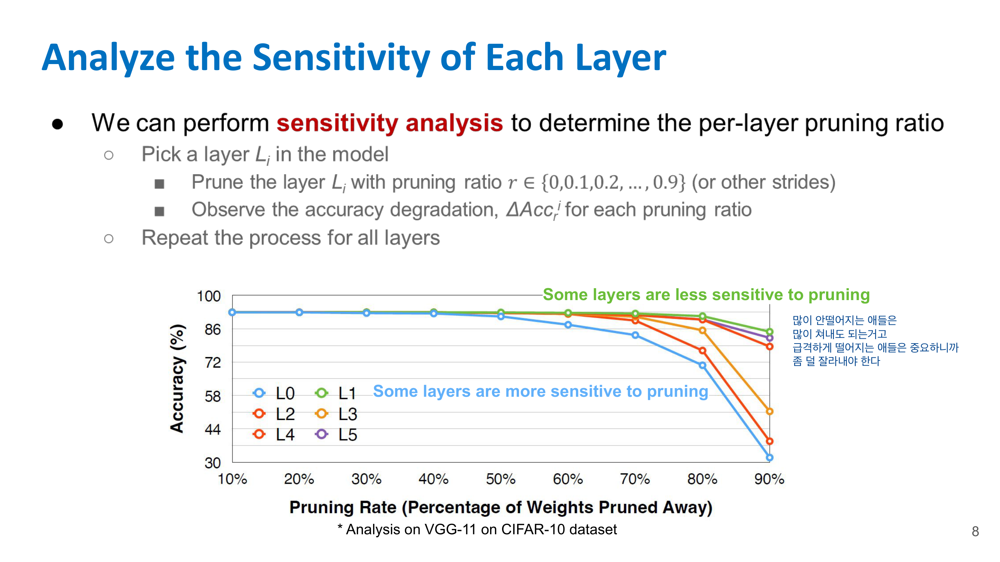
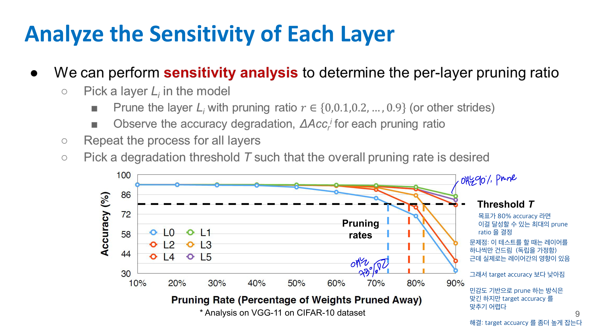
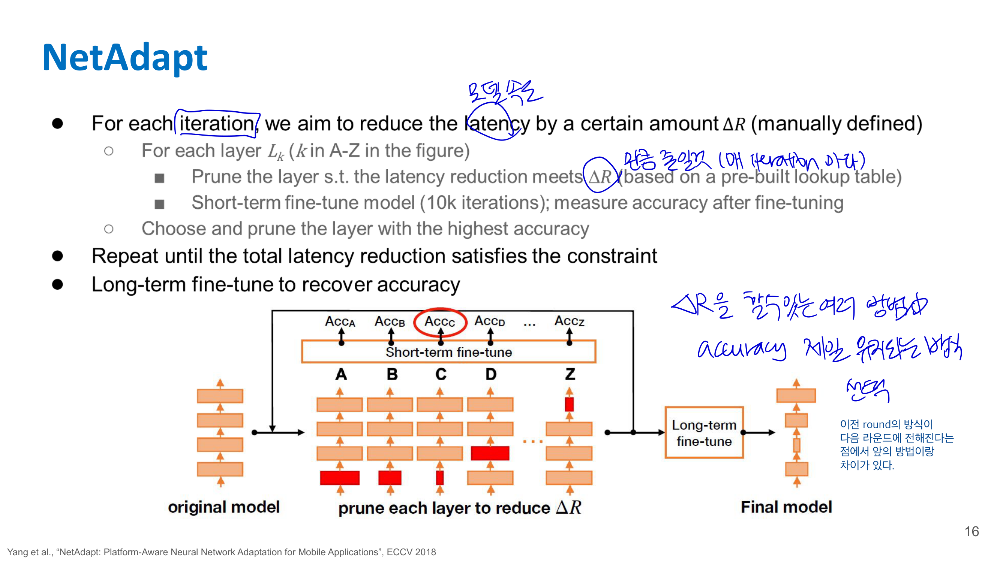

# 📚 03. Pruning (Part II)

Lecture 3는 **Pruning (Part II)**야.
Lecture 2에서 pruning의 기본 개념, granularity, criterion을 배웠다면, Lecture 3에서는 그다음 단계인 **얼마나 자를 것인가**, 그리고 **pruning 후 모델 성능을 어떻게 회복할 것인가**를 다뤄. 강의 목표도 “pruning ratio를 어떻게 선택하고, pruned neural network를 어떻게 fine-tune/train할지 논의하며, Lottery Ticket Hypothesis를 이해하는 것”이라고 되어 있어. 

---

## 03-3. Uniform pruning은 왜 별로인가?

가장 단순한 방법은 모든 layer를 똑같은 비율로 pruning하는 거야.

예를 들어 모든 layer에서 30%씩 자르는 방식.

$$
\text{Layer 1: 30\% pruning}
$$

$$
\text{Layer 2: 30\% pruning}
$$

$$
\text{Layer 3: 30\% pruning}
$$

이걸 **uniform pruning** 또는 **uniform shrinking**이라고 볼 수 있어.

하지만 문제는 layer마다 중요도가 다르다는 거야.

어떤 layer는 많이 잘라도 accuracy가 거의 안 떨어지고, 어떤 layer는 조금만 잘라도 accuracy가 크게 떨어질 수 있어.

그래서 Lecture 3에서는 **non-uniform pruning이 uniform shrinking보다 좋다**고 설명해. 즉 layer마다 pruning ratio를 다르게 주는 게 더 좋다는 뜻이야. 

---

## 03-4. Layer sensitivity analysis

그럼 layer마다 얼마나 자를지 어떻게 정할까?

Lecture 3의 핵심 방법이 **sensitivity analysis**야.

Sensitivity analysis는 말 그대로:

> 각 layer가 pruning에 얼마나 민감한지 실험해보는 것

이야.

방법은 이렇다.

1. 하나의 layer $L_i$를 고른다.
2. 그 layer만 pruning ratio를 바꿔가며 자른다.
3. 나머지 layer는 그대로 둔다.
4. accuracy가 얼마나 떨어지는지 본다.
5. 모든 layer에 대해 반복한다.

예를 들어 어떤 layer에 대해 pruning ratio를 이렇게 바꿔보는 거야.

$$
r \in {0.1, 0.2, 0.3, \dots, 0.9}
$$

그리고 각 ratio에서 accuracy를 측정해.

---

## 03-5. 그래프 해석법

Lecture 3의 VGG-11 / CIFAR-10 예시 그래프를 보면 pruning ratio가 커질수록 accuracy가 떨어지는 곡선이 나와. 그래프에서 x축은 **Pruning Rate**, y축은 **Accuracy**야. 

여기서 중요한 해석은 이거야.

### 덜 민감한 layer

어떤 layer는 pruning rate를 70%, 80%까지 올려도 accuracy가 별로 안 떨어져.

이런 layer는:

> 많이 잘라도 괜찮은 layer

야.

즉 pruning ratio를 크게 줘도 돼.

### 민감한 layer

반대로 어떤 layer는 pruning rate가 조금만 올라가도 accuracy가 급격히 떨어져.

이런 layer는:

> 중요한 layer
> 많이 자르면 안 되는 layer

야.

그래서 pruning ratio를 작게 줘야 해.

---

## 03-6. Target accuracy 기준으로 pruning ratio 정하기

예를 들어 목표 accuracy가 80%라고 해보자.

각 layer별 sensitivity curve를 보고, accuracy가 80% 이상 유지되는 최대 pruning ratio를 고를 수 있어.

예를 들어:

| Layer   | 80% accuracy 유지 가능한 최대 pruning ratio |
| ------- | ------------------------------------ |
| Layer 0 | 50%                                  |
| Layer 1 | 70%                                  |
| Layer 2 | 80%                                  |
| Layer 3 | 90%                                  |

그러면 layer별 pruning ratio를 다르게 설정할 수 있어.

$$
r_0 = 0.5,\quad r_1 = 0.7,\quad r_2 = 0.8,\quad r_3 = 0.9
$$

이게 **non-uniform pruning ratio selection**이야.

---

## 03-7. 그런데 sensitivity analysis의 한계

여기서 중요한 함정이 있어.

Sensitivity analysis는 보통 **한 번에 하나의 layer만 pruning**해서 accuracy drop을 본다.

즉 Layer 1을 실험할 때는 Layer 1만 자르고, 나머지는 그대로 둬.

하지만 실제 pruning에서는 여러 layer를 동시에 자르잖아.

그러면 layer들 사이에 interaction이 생겨.

예를 들어 Layer 1만 70% 잘랐을 때는 괜찮고, Layer 2만 80% 잘랐을 때도 괜찮았는데, 둘을 동시에 자르면 accuracy가 훨씬 더 크게 떨어질 수 있어.

그래서 Lecture 3에서는 이 방식이 완전히 optimal하지 않을 수 있다고 설명해. 이유는 **layer 간 interaction을 고려하지 않기 때문**이야. 

즉 정리하면:

> sensitivity analysis는 좋은 출발점이지만, 실제 최종 accuracy를 정확히 보장하지는 않는다.

그래서 실전에서는 target accuracy를 조금 높게 잡거나, pruning 후 fine-tuning을 반드시 해줘야 해.

---

## 03-8. Pruning 후 fine-tuning이 필요한 이유

Pruning은 weight를 0으로 만들거나 neuron/channel을 제거하는 작업이야.

그러면 모델 입장에서는 갑자기 구조가 바뀐 거야.
당연히 output이 변하고, loss가 증가할 수 있어.

그래서 pruning 후에는 보통 fine-tuning을 해.

흐름은 다음과 같아.

$$
\text{Train dense model}
\rightarrow
\text{Prune}
\rightarrow
\text{Fine-tune remaining weights}
$$

fine-tuning은 pruning으로 망가진 모델을 다시 적응시키는 과정이야.

쉽게 말하면:

> 잘려나간 weight 없이도 남은 weight들이 다시 역할을 나눠 갖게 만드는 과정

이야.

---

## 03-9. AutoML for Model Comparison
- 좋은 per-layer pruning ratio 를 어떻게 찾냐?
- trial and error
- 혹은 AutoML

### AMC
- 강화학습을 이용해서 최적의 layer 별 pruning ratio 를 찾는다

### NetAdapt
NetAdapt는 **전체 resource constraint**를 만족하도록 각 layer의 pruning ratio를 자동으로 찾는 방법이다. 여기서 resource는 latency, energy 같은 실제 시스템 비용을 의미한다. 

핵심은 한 번에 pruning ratio를 정하는 게 아니라 **iterative하게 조금씩 줄이는 것**이다.

각 iteration마다 목표 latency 감소량 $\Delta R$을 정하고, 각 layer를 하나씩 후보로 prune해 본다.

그다음 짧게 fine-tuning해서 accuracy가 가장 잘 유지되는 layer/pruning 선택지를 고른다.

이 과정을 전체 latency constraint를 만족할 때까지 반복한다.

마지막에는 long-term fine-tuning을 해서 pruning으로 떨어진 accuracy를 회복한다.

장점은 단순 FLOPs가 아니라 **실제 target platform의 latency**를 기준으로 pruning한다는 점이다.

또 iteration마다 모델이 하나씩 생기기 때문에, accuracy-latency tradeoff curve를 얻을 수 있다.

## 3-10. One-shot pruning vs Iterative pruning

Pruning을 한 번에 많이 할 수도 있고, 조금씩 반복해서 할 수도 있어.

### One-shot pruning

한 번에 목표 sparsity까지 자르는 방식이야.

예를 들어 바로 90% pruning.

$$
0% \rightarrow 90%
$$

장점은 빠르다는 거야.
단점은 accuracy가 크게 떨어질 수 있어.

### Iterative pruning

조금씩 자르고 fine-tuning하고, 또 자르고 fine-tuning하는 방식이야.

$$
0\% \rightarrow 30\%
\rightarrow \text{fine-tune}
\rightarrow 50\%
\rightarrow \text{fine-tune}
\rightarrow 70\%
\rightarrow \text{fine-tune}
$$

이 방식은 시간이 오래 걸리지만 성능을 더 잘 유지할 수 있어.

---

## 03-11. Cna we Train a Sparse Neural Network from Scratch?

- 큰 모델로 구조를 찾아야 해서 그렇다. 그리고서 pruning 하는게 좋다
- 처음부터 성능이 동일하지만 sparse 한 모델을 학습하는 건 아직 불가능

주의 fine tuning 후에도 pruning 된 weight 들은 0이 되어야 한다 (바꿔주던지..)

---

## 03-12. Lottery Ticket Hypothesis

Lecture 3의 또 다른 중요한 주제가 **Lottery Ticket Hypothesis**야.

핵심 주장은 이거야.

> 큰 neural network 안에는, 적절한 초기값을 가진 작은 subnetwork가 존재하고, 이 subnetwork만 학습해도 원래 큰 모델과 비슷한 성능을 낼 수 있다.

이 작은 subnetwork를 **winning ticket**이라고 불러.

복권 비유로 보면:

* 큰 모델 = 복권을 많이 산 상태
* 그 안에 운 좋게 좋은 초기값과 구조를 가진 작은 subnet이 있음
* 그 subnet이 winning ticket

즉 pruning 후 남은 작은 network가 단순히 “학습된 큰 모델의 일부”가 아니라, 처음부터 좋은 초기값을 갖고 있었다면 독립적으로도 잘 학습될 수 있다는 가설이야.

---

## 03-13. Lottery Ticket 실험 흐름

Lottery Ticket Hypothesis의 대표적인 실험 과정은 보통 이렇게 이해하면 돼.

1. Dense network를 random initialization으로 시작한다.
2. 모델을 학습한다.
3. magnitude pruning으로 중요한 weight만 남긴다.
4. 남은 mask를 저장한다.
5. weight 값을 학습 후 값이 아니라, 처음 random initialization 값으로 되돌린다.
6. 그 mask를 가진 sparse network를 다시 학습한다.
7. 이 작은 network가 dense model과 비슷한 성능을 내는지 확인한다.

중요한 포인트는 이거야.

> pruning된 구조만 중요한 게 아니라, 초기값도 중요하다.

즉 같은 sparse 구조라도 초기값이 다르면 성능이 달라질 수 있어.

핵심은 sparse architecture만 중요한 게 아니라, 그 sparse architecture가 가졌던 초기값도 중요하다는 거야. 예를 들어 같은 연결 구조만 남겨놓고 weight를 새로 랜덤 초기화하면 성능이 떨어질 수 있어. 즉 “어떤 연결을 남길지”와 “그 연결들이 처음에 어떤 값이었는지”가 같이 맞아야 잘 학습된다는 주장이지.

## 03-13. 시험/정리용 핵심 요약

| 개념                        | 핵심                                          |
| ------------------------- | ------------------------------------------- |
| Pruning ratio             | 각 layer에서 얼마나 자를지                           |
| Uniform pruning           | 모든 layer를 같은 비율로 자름                         |
| Non-uniform pruning       | layer별로 다른 비율로 자름                           |
| Sensitivity analysis      | layer 하나씩 pruning해 accuracy drop 확인         |
| Sensitive layer           | 조금만 잘라도 accuracy가 크게 떨어지는 layer             |
| Less sensitive layer      | 많이 잘라도 accuracy가 별로 안 떨어지는 layer            |
| Fine-tuning               | pruning 후 남은 weight를 다시 학습해 성능 회복           |
| Iterative pruning         | 조금씩 자르고 fine-tuning 반복                      |
| Lottery Ticket Hypothesis | 큰 모델 안에는 잘 학습되는 작은 winning subnetwork가 존재한다 |

---

한 문장으로 정리하면:

> Lecture 3는 pruning에서 “무엇을 자를까” 다음 단계인 “얼마나 자를까”와 “자른 뒤 어떻게 성능을 회복할까”를 다루며, layer별 sensitivity analysis와 fine-tuning, 그리고 Lottery Ticket Hypothesis가 핵심이다.

