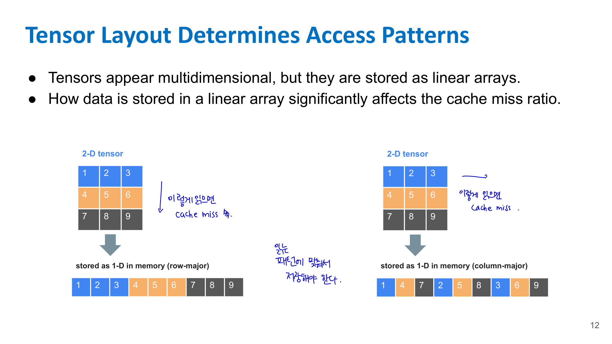
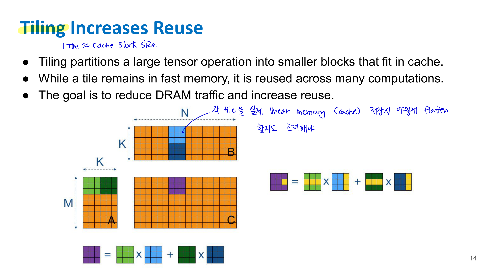
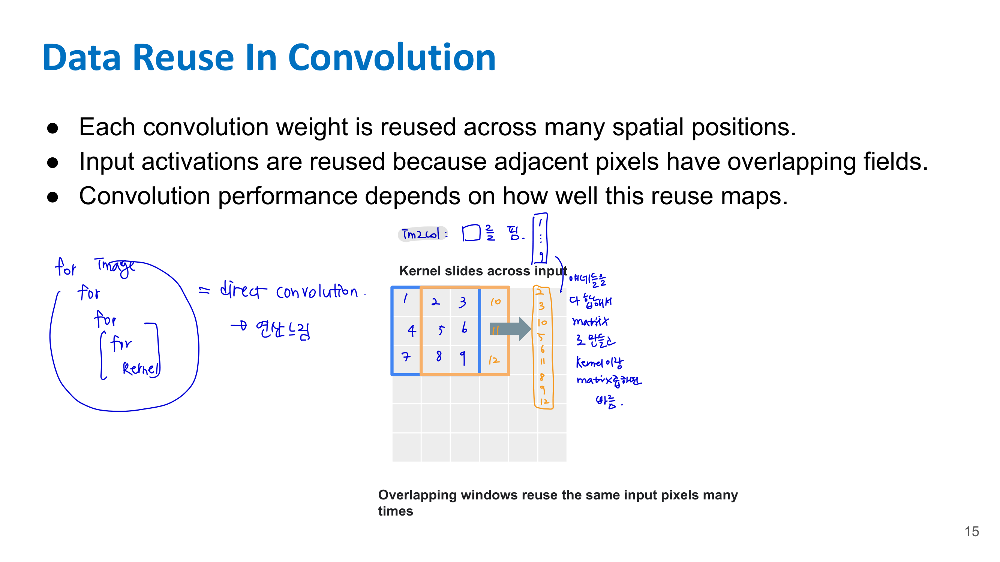
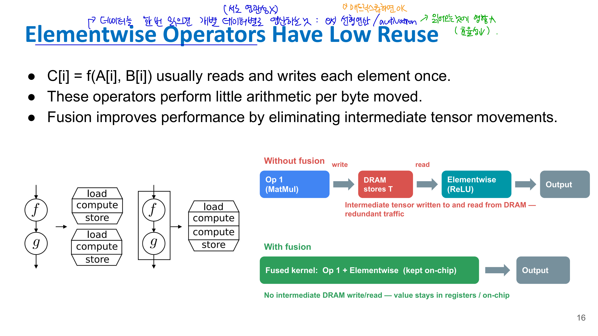
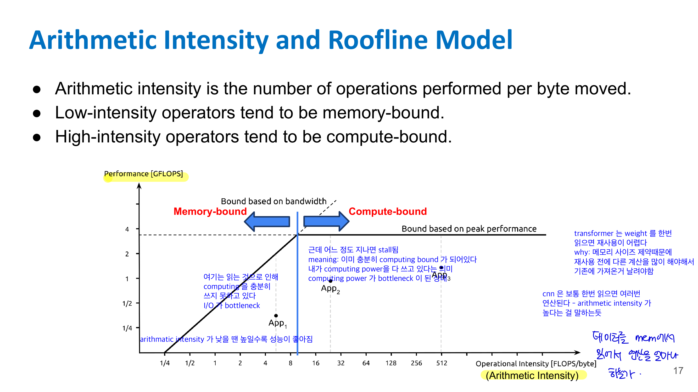
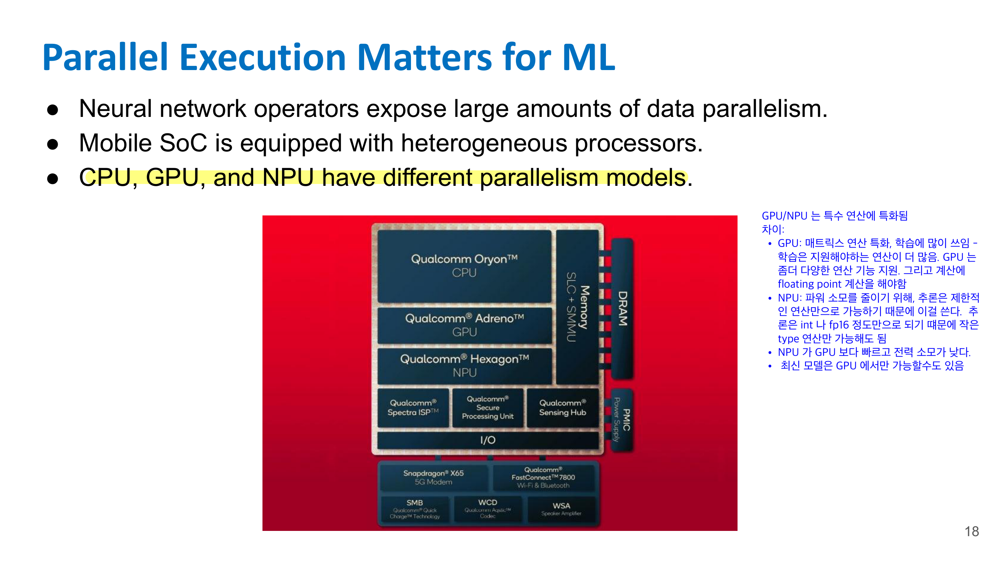
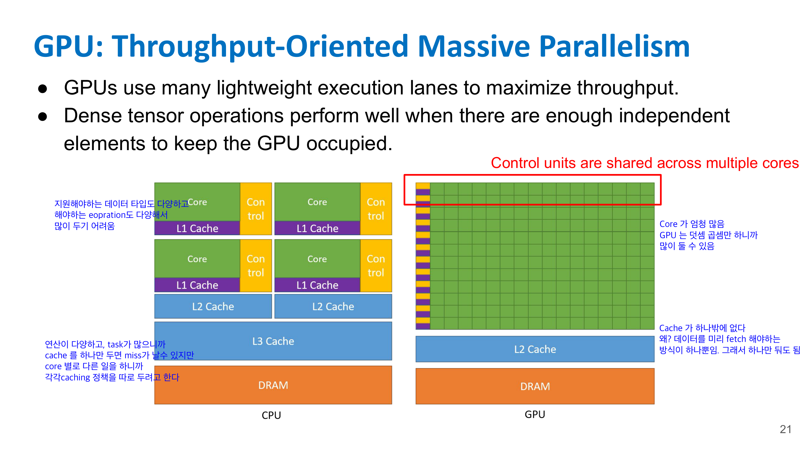
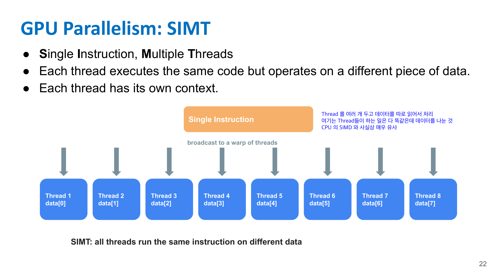
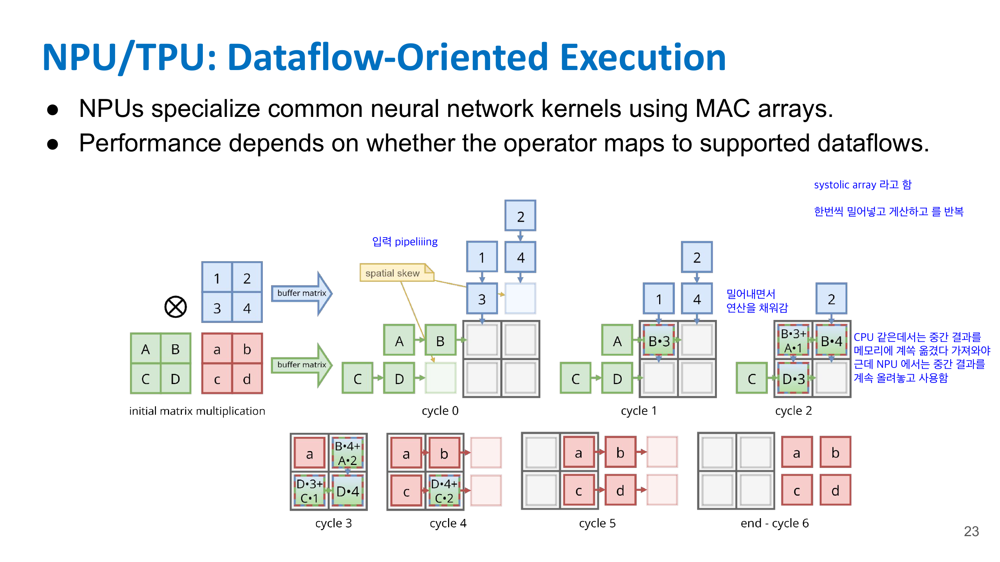

# 📚 11. Computer System Basics

 ML 모델을 빠르게 실행하려면 단순히 모델의 FLOPs만 줄이면 되는 게 아니라, **메모리 접근, 데이터 이동, cache locality, tensor layout, operator fusion, parallel execution model**까지 봐야 한다는 강의야. 

## 📌 11-1. FLOPs Are Not Latency

FLOPs는 floating point operation 수, 즉 연산량을 뜻한다. 예를 들어 matrix multiplication에서 곱셈과 덧셈이 몇 번 일어나는지를 세는 것이다.

하지만 실제 latency에는 다음이 포함된다.

* 데이터를 DRAM에서 cache로 가져오는 시간
* cache miss로 인한 stall
* tensor layout에 따른 비효율적인 memory access
* kernel launch overhead
* runtime scheduling overhead
* hardware가 해당 연산을 얼마나 잘 지원하는지

그래서 같은 FLOP 수를 가진 두 연산이라도, 하나는 빠르고 하나는 느릴 수 있다.

예를 들어 sequential access는 cache를 잘 쓰지만, random access나 strided access는 cache miss가 많이 나서 훨씬 느려질 수 있다. FLOPs는 똑같아도 memory access pattern이 다르면 latency가 달라진다.

---

## 📌11-2. Model Optimization != System Speedup

> **모델 수준 최적화가 항상 시스템 속도 향상을 의미하지는 않는다.**

예를 들어 pruning, quantization, distillation은 모델-level cost를 줄인다. 하지만 시스템 입장에서는 다음 문제가 생길 수 있다. 

## 📌 11-3. Computation Requires Moving Data

“ML operator에서는 tensor data를 이동하는 비용이 arithmetic보다 클 수 있다”고 설명한다. 

- Memory Hierarchy: Fast Memory is Small

- Cache와 Locality

    - Cache는 CPU/GPU 가까이에 있는 빠른 메모리다. DRAM에서 데이터를 가져오면, 보통 그 데이터 하나만 가져오는 게 아니라 주변 데이터까지 **cache line** 단위로 같이 가져온다.

    - 그래서 프로그램이 cache를 잘 쓰려면 locality가 좋아야 한다.

    - **Temporal Locality**: Temporal locality는 최근 사용한 데이터를 곧 다시 사용하는 성질이다.

    - **Spatial Locality**: Spatial locality는 근처 주소의 데이터를 함께 접근하는 성질이다.

- Cache Hit, Cache Miss, **Stall**: 
Cache miss 때 compute unit은 데이터를 기다려야 한다. 이 기다림이 **stall**이다.

### Access Pattern이 중요한 이유

데이터는 DRAM과 cache 사이를 cache-line-sized block 단위로 이동한다. 그래서 sequential access와 strided access의 차이가 크다.

> FLOPs가 작은 operator도 memory movement 때문에 runtime을 많이 잡아먹을 수 있다.

---

## 📌 11-4. Tensor Layout Determines Access Patterns

Tensor는 우리가 볼 때는 2D, 3D, 4D처럼 보이지만, 실제 memory에는 1D linear array로 저장된다.



- 위 경우 열 방향 접근은 빠르고, 행 방향 접근은 비효율적이다.
- tensor 저장 방식이 cache miss ratio에 큰 영향을 준다

---

## 📌 11-5. Naïve GEMM Wastes Locality

GEMM은 general matrix multiplication이야.

$$
A \cdot B = C
$$

크기를 쓰면 보통:

$$
A \in \mathbb{R}^{M \times K}
$$

$$
B \in \mathbb{R}^{K \times N}
$$

$$
C \in \mathbb{R}^{M \times N}
$$

이다.

각 원소는 다음처럼 계산된다.

$$
C_{ij} = \sum_{k=1}^{K} A_{ik}B_{kj}
$$

문제는 naive loop로 구현하면 memory locality가 나쁠 수 있다는 거야.

예를 들어 row-major layout에서 $B$를 column-wise로 읽으면, memory 상에서 연속적이지 않은 위치를 계속 접근한다. 그러면 cache miss가 많아진다.

Lecture에서는 simple loop order가 locality를 나쁘게 만들 수 있고, 같은 FLOP count라도 runtime이 크게 달라질 수 있다고 설명한다. 

즉,

> matrix multiplication은 수식상으로는 같아도, loop order와 layout에 따라 성능이 완전히 달라진다.

---

## 📌 11-6. Tiling Increases Reuse

Tiling은 큰 tensor 연산을 cache에 들어갈 수 있는 작은 block 단위로 나누는 방법이다. 



예를 들어 큰 matrix multiplication을 한 번에 하지 않고, 작은 tile들로 쪼갠다.

```text
큰 A, B, C
→ 작은 A tile, B tile, C tile
→ cache에 올려놓고 여러 번 재사용
```

목표는 이거야.

> DRAM에서 한 번 가져온 데이터를 cache/register에 있는 동안 최대한 많이 쓰자.

Tiling을 하면 $A$의 작은 block과 $B$의 작은 block을 cache에 올려두고, 그 block으로 $C$의 여러 값을 계산할 수 있다.

이렇게 하면 DRAM traffic이 줄고 reuse가 증가한다.

---

## 📌 11-7. Data Reuse in Convolution

Convolution은 reuse가 많은 연산이다.

### 11-7-1. Weight reuse

하나의 convolution kernel weight는 이미지의 여러 spatial position에 반복해서 사용된다.

예를 들어 $3 \times 3$ kernel 하나는 이미지 전체를 sliding하면서 여러 위치에 적용된다.

```text
same kernel weight → many output pixels
```

### 11-7-2. Input activation reuse

인접한 convolution window들은 input pixel을 공유한다.



예를 들어 $3 \times 3$ window가 한 칸 이동하면 대부분의 input pixel이 겹친다.

```text
window 1: pixels 1~9
window 2: pixels 2~10
```

그래서 input activation도 여러 번 재사용된다.

Lecture에서는 convolution performance가 이런 reuse를 hardware/cache에 얼마나 잘 mapping하느냐에 따라 달라진다고 설명한다. 

---

## 📌 11-8. Elementwise Operators Have Low Reuse

Elementwise operator는 보통 이런 식이다.

$$
C[i] = f(A[i], B[i])
$$

예를 들어 ReLU, add, multiply 같은 연산이다.

문제는 각 element를 보통 한 번 읽고 한 번 쓴다는 점이다.

```text
read A[i]
read B[i]
compute
write C[i]
```

계산량은 매우 작지만 memory movement는 필요하다. 그래서 arithmetic intensity가 낮다.



### Operator Fusion

이 문제를 해결하는 대표적인 방법이 **fusion**이다.

예를 들어 MatMul 후 ReLU를 한다고 해보자.

Fusion이 없으면:

```text
MatMul 결과 T를 DRAM에 write
→ ReLU가 T를 DRAM에서 read
→ output write
```

Fusion을 하면:

```text
MatMul 결과를 register/on-chip memory에 유지
→ 바로 ReLU 적용
→ 최종 output만 write
```

즉, 중간 tensor를 DRAM에 쓰고 다시 읽는 redundant traffic을 없앤다.

Lecture에서는 fusion이 intermediate tensor movement를 제거해서 elementwise operator 성능을 개선한다고 설명한다. 

---

## 📌 11-9. Arithmetic Intensity and Roofline Model

Arithmetic intensity는 **이동한 byte당 얼마나 많은 연산을 했는지**를 뜻한다.

$$
\text{Arithmetic Intensity} =
\frac{\text{Operations}}{\text{Bytes moved}}
$$



**Low arithmetic intensity**

- 데이터를 많이 옮기는데 연산은 적게 한다.
- 즉, compute unit은 충분히 빠른데 data가 늦게 와서 기다린다.

**High arithmetic intensity**

- 한 번 가져온 데이터로 연산을 많이 한다.
- 즉, memory보다 계산 자원 자체가 병목이다.

### Roofline Model

Roofline model은 성능을 두 구간으로 나눈다. 

```text
낮은 arithmetic intensity 영역: memory-bound
높은 arithmetic intensity 영역: compute-bound
```

memory-bound 영역에서는 arithmetic intensity를 높이면 성능이 올라간다. 하지만 어느 지점 이상에서는 peak compute performance에 도달해서 더 이상 성능이 증가하지 않는다.

즉,

> 데이터 재사용을 늘려 memory-bound에서 벗어나는 것이 중요하지만, compute-bound가 되면 그다음부터는 하드웨어 peak 연산 성능이 한계가 된다.

---

## 📌 11-10. Parallel Execution Matters for ML

Neural network operator는 data parallelism이 많다.

예를 들어 vector add, matrix multiplication, convolution은 서로 독립적인 output element를 병렬로 계산할 수 있다.

하지만 hardware마다 parallelism model이 다르다. Lecture에서는 mobile SoC에는 CPU, GPU, NPU 같은 heterogeneous processor가 있고, 각각 다른 parallelism model을 가진다고 설명한다. 



---

## 📌 11-11. CPU Parallelism: Threads and SIMD

CPU: Latency-Oriented General-Purpose Cores

CPU는 범용 processor다.

특징은 다음과 같다.

* 적은 수의 강력한 core
* low-latency execution에 최적화
* control flow, branch, irregular operator 처리에 강함
* preprocessing, scheduling, OS/runtime 작업에 적합
* SIMD와 thread scheduling이 ML 성능에 중요함

CPU는 크게 두 가지 방식으로 병렬성을 활용한다.

### 11-11-1. Threads

여러 core에서 서로 다른 thread를 실행한다.


예를 들어 배열을 4등분해서 core 4개가 각각 다른 chunk를 처리할 수 있다.

```text
Core 1 → data chunk 1
Core 2 → data chunk 2
Core 3 → data chunk 3
Core 4 → data chunk 4
```

이건 task parallelism 또는 multi-core parallelism에 가깝다.

### 11-11-2. SIMD

SIMD는 Single Instruction, Multiple Data다.

하나의 instruction으로 여러 data lane을 동시에 처리한다.

예를 들어 vector width가 4라면:

$$
C = A + B
$$

를 할 때,

```text
a0 + b0
a1 + b1
a2 + b2
a3 + b3
```

를 하나의 vector instruction으로 처리한다.

즉,

```text
1 instruction: VADD
→ 4 data elements processed
```

Lecture에서는 CPU가 “a few threads × SIMD lanes per core”를 결합한다고 설명한다. 

---

## 📌 11-12. GPU Parallelism: SIMT

GPU: Throughput-Oriented Massive Parallelism - throughput을 최대화하기 위한 processor다.



특징은 다음과 같다.

* 매우 많은 lightweight execution lane
* dense tensor operation에 강함
* 같은 연산을 많은 데이터에 반복 적용할 때 효율적
* control unit을 여러 core가 공유
* 복잡한 branch나 irregular access에는 약할 수 있음

Dense matrix multiplication, convolution처럼 독립적인 연산이 많으면 GPU를 꽉 채울 수 있다. 하지만 작업량이 작거나 branch가 많거나 memory access가 불규칙하면 GPU utilization이 떨어질 수 있다.

Lecture에서는 GPU가 many lightweight execution lanes를 사용해 throughput을 maximize하고, dense tensor operations가 충분한 independent element를 가질 때 잘 동작한다고 설명한다. 

### SIMT



GPU는 SIMT 방식을 사용한다.

SIMT는 Single Instruction, Multiple Threads다.

여러 thread가 같은 instruction을 실행하지만, 각 thread는 서로 다른 data를 처리한다.

```text
Thread 1 → data[0]
Thread 2 → data[1]
Thread 3 → data[2]
Thread 4 → data[3]
...
```

CPU의 SIMD와 비슷하게 “같은 연산을 여러 데이터에 적용한다”는 점은 같지만, GPU에서는 각 lane이 thread context를 가진다는 차이가 있다.

Lecture에서는 SIMT를 다음처럼 정리한다. 

* Single Instruction, Multiple Threads
* 각 thread는 같은 code를 실행
* 각 thread는 다른 data를 처리
* 각 thread는 자기 context를 가짐

---

## 📌 11-13. NPU/TPU: Dataflow-Oriented Execution

NPU나 TPU는 neural network 연산에 특화된 accelerator다.

특징은 다음과 같다.



* MAC array를 사용
* convolution/GEMM 같은 common NN kernel에 특화
* CPU/GPU보다 전력 효율이 좋을 수 있음
* 지원하는 operator/dataflow에 잘 맞아야 성능이 좋음

여기서 MAC은 multiply-accumulate다.

$$
a \times b + c
$$

를 반복적으로 수행하는 연산이다.

NPU/TPU에서는 systolic array 같은 구조를 사용한다. 데이터가 array 안으로 흘러가면서 각 processing element가 곱셈/덧셈을 수행한다.

중요한 점은 중간 결과를 매번 DRAM에 쓰고 다시 읽는 게 아니라, on-chip에서 흘려보내며 재사용한다는 것이다.

Lecture에서는 NPU/TPU가 common neural network kernels를 MAC arrays로 특화하고, performance는 operator가 supported dataflow에 잘 mapping되는지에 의존한다고 설명한다. 

---

## 📌 11-14. CPU, GPU, NPU 비교

| Processor | 핵심 방향                                   | 잘하는 것                                           | 약한 것                                                |
| --------- | --------------------------------------- | ----------------------------------------------- | --------------------------------------------------- |
| CPU       | latency-oriented general-purpose        | control flow, preprocessing, irregular ops      | massive dense tensor throughput                     |
| GPU       | throughput-oriented massive parallelism | dense GEMM, convolution, large batch tensor ops | branch, irregular memory access, 작은 workload        |
| NPU/TPU   | dataflow-oriented NN accelerator        | supported NN kernels, low power inference       | unsupported operator, dynamic/irregular computation |

즉, 같은 모델이라도 어떤 hardware에서 실행하느냐에 따라 최적화 방향이 달라진다.

---

## 📌 11-15. Lecture 11에서 이어지는 큰 메시지

Lecture 11은 뒤의 Efficient ML Systems, LLM serving, compiler 강의의 기초가 된다.

왜냐하면 이후에 나오는 여러 시스템 기법들이 결국 이 문제들을 해결하려는 것이기 때문이다.

예를 들어:

| 문제                     | 이후 기법과 연결                                       |
| ---------------------- | ----------------------------------------------- |
| data movement가 병목      | FlashAttention, operator fusion, tiling         |
| cache locality 중요      | tensor layout optimization, compiler scheduling |
| memory-bound operator  | quantization, fusion, batching                  |
| irregular sparsity가 느림 | structured pruning, M:N sparsity                |
| hardware마다 성능 다름       | hardware-aware NAS, compiler optimization       |
| GPU utilization 필요     | batching, parallel scheduling                   |

즉, 이 강의는 “왜 시스템을 알아야 ML이 빨라지는지”를 설명하는 기반이다.

## 📌 11-16. 시험용 핵심 문장

**FLOPs는 arithmetic work만 측정하고, 실제 latency는 data movement, cache behavior, memory bandwidth, runtime overhead까지 포함한다.**

**Memory hierarchy에서는 register가 가장 빠르지만 작고, DRAM은 크지만 느리다. 따라서 cache/locality/reuse가 중요하다.**

**Sequential access는 cache line을 잘 활용하지만, strided/random access는 cache miss를 증가시킨다.**

**Tensor는 multidimensional로 보이지만 실제 memory에는 1D linear array로 저장되므로 tensor layout이 access pattern과 성능을 결정한다.**

**Tiling은 큰 tensor 연산을 cache에 들어가는 block으로 나눠 DRAM traffic을 줄이고 data reuse를 늘리는 기법이다.**

**Elementwise operator는 계산량은 작지만 memory movement가 커서 memory-bound가 되기 쉽고, fusion으로 intermediate tensor movement를 줄일 수 있다.**

**Arithmetic intensity는 byte moved당 operation 수이며, 낮으면 memory-bound, 높으면 compute-bound가 된다.**

**CPU는 control flow와 irregular operator에 강하고, GPU는 dense tensor parallelism에 강하며, NPU/TPU는 supported neural network dataflow에 특화되어 있다.**


<script type="text/x-mathjax-config">
  MathJax.Hub.Config({
    tex2jax: {
      inlineMath: [['$','$'], ['\\(','\\)']],
      processEscapes: true
    },
    "HTML-CSS": { linebreaks: { automatic: true } }
  });
</script>
<script type="text/javascript" src="https://cdnjs.cloudflare.com/ajax/libs/mathjax/2.7.7/MathJax.js?config=TeX-AMS-MML_HTMLorMML"></script>


