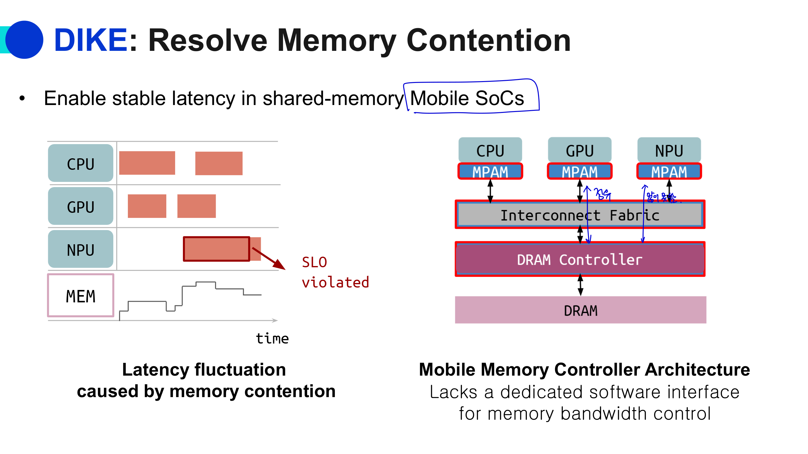
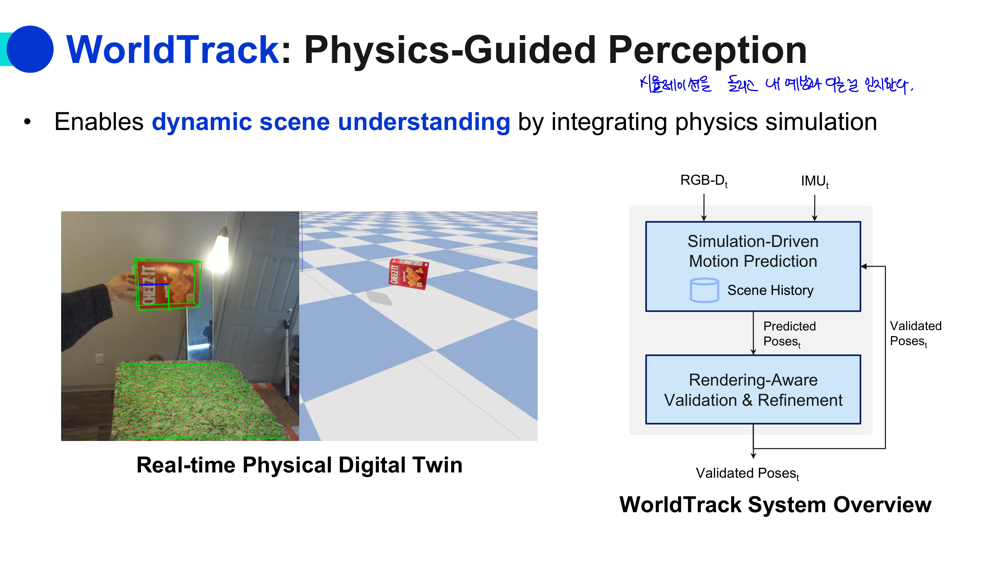
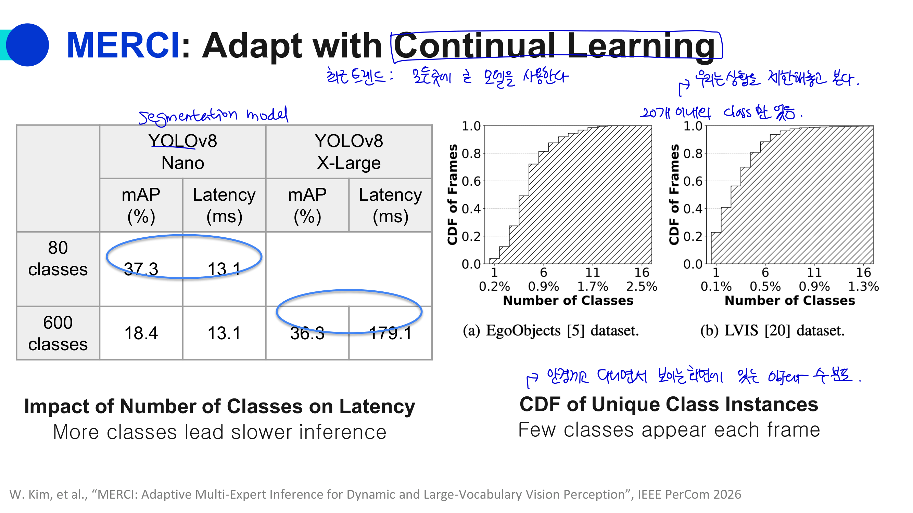
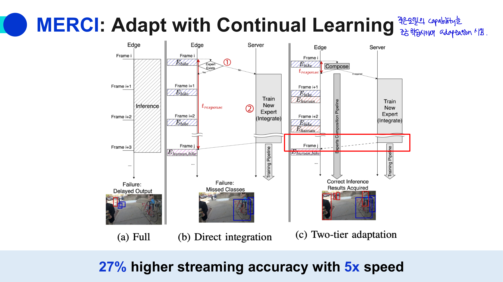
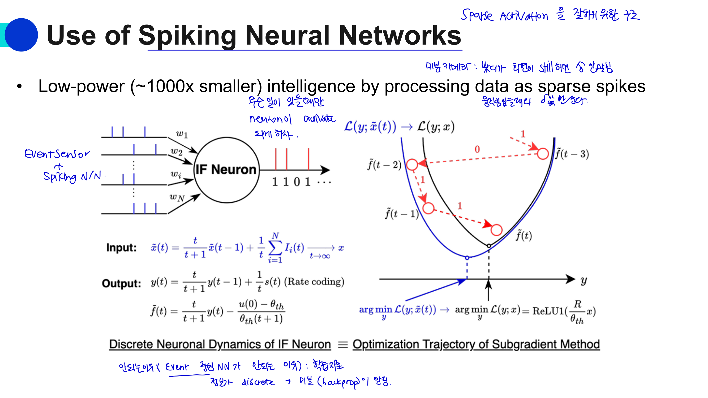
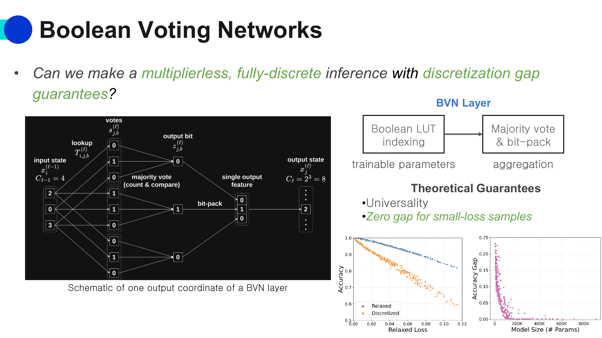

# 12. Efficient ML Systems: On-Device Approach

핵심은 **AI를 클라우드가 아니라 디바이스 안에서 직접 실행할 때의 기회, 한계, 그리고 이를 해결하기 위한 시스템 기법들**이야. 

## 12-1. 왜 On-Device AI가 중요한가?

최근 AI application은 점점 **edge 쪽에서 풍부한 sensor data**를 다룬다.

예를 들면:

* XR, eXtended Reality
* 자율주행
* Human Augmentation
* Interactive Agent
* Healthcare App
* Robotics App

이런 application들은 카메라, 마이크, IMU, physiological sensor, wireless signal 등에서 계속 데이터를 받는다. 강의에서는 edge에서 8K/3D video, audio array, multimodal sensor 같은 rich perceptual data가 생기고, 이를 CNN, Transformer, Diffusion 같은 high-capacity neural network가 처리한다고 설명한다. 

즉 문제는:

> 데이터는 디바이스 근처에서 계속 생기는데, 모델은 점점 커지고 무거워진다.

이거야.

---

## 12-2. Real-time Interaction 요구사항

On-device AI에서 중요한 이유는 **interactive application은 latency 요구사항이 매우 빡세기 때문**이야.

강의 예시는 다음과 같다. 

| Application        | 요구 latency | 이유                                  |
| ------------------ | ---------: | ----------------------------------- |
| Mixed Reality      |    약 30 ms | 반응이 느리면 cybersickness, 몰입감 저하       |
| Autonomous Driving |   약 100 ms | 40 km/h에서 1m마다 decision 필요          |
| Interactive Agent  |   약 150 ms | everyday question/request에 자연스럽게 응답 |

예를 들어 XR에서 사용자가 고개를 돌렸는데 virtual object가 늦게 따라오면 어지럽고 불편하다. 자율주행에서는 주변 상황 판단이 늦으면 안전 문제가 생긴다. Interactive agent도 답변이 너무 늦으면 사용성이 떨어진다.

그래서 on-device AI는 단순히 accuracy만 중요한 게 아니라:

$$
\text{Accuracy} + \text{Latency} + \text{Throughput} + \text{Power}
$$

를 동시에 봐야 한다.

---

## 12-3. XR을 자세히 보면

강의에서는 XR을 closer look으로 설명한다. XR에서는 한 가지 모델만 돌리는 게 아니라 여러 perception/generation task가 동시에 필요하다. 

대표적으로:

1. **Physical World Analysis**
   현실 공간을 분석한다. 예를 들어 물체 인식, pose estimation, depth understanding.

2. **Virtual Content Generation**
   가상 object, avatar, UI 등을 생성한다.

3. **Seamless Rendering**
   현실과 가상 object가 자연스럽게 섞이도록 rendering한다.

4. **User Interaction Analysis**
   손동작, 시선, 얼굴, gesture 등을 분석한다.

즉 XR은 하나의 image classification 문제라기보다, **센싱 → 이해 → 생성 → 렌더링 → interaction 분석**이 실시간으로 연결된 복합 pipeline이다.

---

## 12-4. Computational Requirement

Lecture 12에서는 on-device AI의 계산 요구사항을 매우 강하게 말한다.

> **Mobile device에서 neural network를 약 10 ms latency, 100 fps throughput 수준으로 실행해야 한다.** 

여기서 10 ms는 한 frame을 처리하는 데 허용되는 시간이 매우 작다는 뜻이고, 100 fps는 지속적으로 빠르게 처리해야 한다는 뜻이야.

이 요구사항은 두 가지 성격 때문에 생긴다.

### 12-4-1. Pervasiveness

AI가 특정 순간만 실행되는 게 아니라, 디바이스 주변의 여러 sensor data를 계속 처리해야 한다.

예:

```text
camera stream
microphone stream
IMU stream
wireless signal
physiological signal
```

### 12-4-2. Interactivity

사용자에게 바로 반응해야 한다.

예:

```text
사용자가 움직임
→ sensor data 발생
→ neural network inference
→ 화면/agent/action 변화
```

이 loop가 늦으면 사용자가 바로 느낀다.

---

## 12-5. 더 넓은 관점: Continuous and Real-time Pipelined Execution

강의 page 10에서는 on-device AI를 단순 “모델 하나 실행”이 아니라 **continuous pipeline**으로 본다. 

흐름은 다음과 같다.

```text
Sensing Devices
→ Sensing
→ Feature extraction / Preprocessing
→ Classification / Inference
→ Applications
```

예를 들어:

```text
Sound/Video
→ MFCC/SIFT, FFT, Norm
→ GMM, HMM, SVM, CNN/Transformer/Diffusion
→ Personal Agent, Healthcare App, Robotics App
```

중요한 점은 이 pipeline이 **한 번 실행되고 끝나는 게 아니라 continuous and real-time**으로 계속 돈다는 것이다.

즉 on-device AI 시스템은:

1. low-level signal을 계속 sensing하고
2. ML로 user behavior/context를 inference하고
3. proactive real-time service를 제공해야 한다.

이게 cloud batch inference랑 완전히 다른 점이다.

---

## 12-6. Core Tension

Lecture 12의 중간에 “Thoughts” slide가 나오는데, 이 강의의 핵심 긴장을 잘 정리한다. 

### Core tension

* Heavy perceptual data는 edge에서 생긴다.
* Strong compute capacity는 cloud에 있다.
* 그런데 interactive app은 high responsiveness를 요구한다.

즉:

```text
데이터 생성 위치: device / edge
강한 compute 위치: cloud / datacenter
필요한 반응 속도: 매우 빠름
```

이 세 가지가 서로 충돌한다.

### 가능한 접근

강의에서는 세 가지 방향을 말한다.

1. **Make edge devices more capable**
   디바이스 자체를 더 강하게 만든다.

2. **Move perceptual data fast enough to close the loop**
   데이터를 cloud로 충분히 빠르게 보내고 결과를 받는다.

3. **Develop ultra-fast intelligence models and algorithms**
   모델과 알고리즘 자체를 매우 빠르게 만든다.

Lecture 12는 이 중 특히 **on-device approach**, 즉 첫 번째와 세 번째에 가까운 방향을 다룬다.

---

## 12-7. On-Device vs Cloud Approaches

강의에서는 x축을 model complexity, y축을 data rate로 두고 on-device와 cloud-based application을 나눈다. 

### On-device에 적합한 경우

대체로:

```text
data rate가 높거나
latency가 매우 중요하거나
privacy가 민감하거나
model complexity가 비교적 감당 가능할 때
```

예:

* High Dynamic Range 처리
* Speech Recognition 일부
* 간단한 perception

### Cloud-based에 적합한 경우

대체로:

```text
model complexity가 매우 크고
data rate가 낮거나
latency가 상대적으로 덜 엄격할 때
```

예:

* Translation
* 일부 cloud service

### Non-trivial cases

문제가 되는 건 둘 다 큰 경우야.

```text
data rate도 높고 model complexity도 큼
```

예:

* AR Person Finding 1080p
* Human Augmentation 8K
* Virtual Office 3D Point Cloud
* Video Surveillance 720p

이런 경우는 device에서 처리하기도 어렵고, cloud로 보내기도 부담스럽다. 그래서 시스템 기법이 필요하다.

---

## 12-8. 숫자로 감 잡기: 7B 모델

강의에서는 7B 모델 inference를 예로 든다. 

가정:

* parameter당 1 byte
* 7B parameter
* model weight만 약 7GB
* end-to-end inference에는 약 14GB 필요

즉, 7B 모델 하나도 on-device에서는 꽤 부담이 크다.

하지만 7B 모델이 쓸모없는 건 아니다. 강의에서는 7B model이 다음에 유용할 수 있다고 한다.

* Vision perception
* Routine QnA
* Routing queries

여기서 routing query는 예를 들어:

```text
이 요청을 local model이 처리할까?
아니면 cloud로 보낼까?
```

를 결정하는 역할로 볼 수 있다.

---

## 12-9. On-Device AI: 10년 전

강의에서는 10년 전 on-device AI 예시로 **DeepMon**을 든다. DeepMon은 mobile GPU 기반 deep learning framework로 continuous vision application을 모바일에서 실행하려는 시도였다. 

이 slide의 의미는:

> On-device AI는 최근 갑자기 생긴 주제가 아니라, 예전부터 연구되어 왔고, 최근 hardware와 model 발전 때문에 다시 중요해지고 있다.

라고 보면 된다.

---

## 12-10. On-Device AI의 기회

Lecture 12는 on-device AI의 장점을 세 가지로 정리한다. 

### 12-10-1. On-device compute가 계속 발전

스마트폰은 이제 CPU만 있는 게 아니라 heterogeneous processor를 가진다.

```text
CPU
GPU
DSP
NPU / TPU
```

고급 device에는 neural accelerator도 들어간다. 그래서 예전보다 on-device inference가 훨씬 가능해졌다.

### 12-10-2. 더 안정적인 latency

Cloud offloading은 network delay에 영향을 많이 받는다. 특히 outdoor 환경에서는 network condition이 흔들릴 수 있다.

반면 on-device execution은 network 왕복이 없기 때문에 latency가 더 안정적이다.

### 12-10-3. Privacy concern이 적음

많은 autonomous application은 private space와 user behavior를 다룬다.

예:

```text
집 안 영상
사용자 행동 패턴
시선/gesture
health signal
```

이런 데이터를 cloud로 보내면 privacy 문제가 크다. On-device processing은 데이터를 기기 내부에서 처리하므로 privacy concern이 상대적으로 적다.

---

## 12-11. On-Device AI의 도전과제

하지만 on-device AI에는 큰 한계도 있다. 강의에서는 네 가지를 든다. 

### 12-11-1. Model/context size의 빠른 증가

LLM의 model/context size는 매우 빠르게 커지고 있다. 강의에서는 **LLM은 6개월마다 10배 규모로 증가**하는 흐름을 언급한다.

즉 device 성능도 좋아지지만, 모델 크기는 더 빠르게 커질 수 있다.

### 12-11-2. Power / Thermal Budget

모바일 디바이스는 보통 전력과 발열 제한이 크다.

강의에서는 on-device power budget을 약 **1–5W cap**으로 설명한다.

Cloud GPU가 수백~1000W급 전력을 쓸 수 있는 것과 비교하면 매우 작다.

### 12-11-3. Performance per Watt 증가가 느림

하드웨어 성능은 좋아지지만, 전력당 성능 향상은 workload 증가를 따라가지 못할 수 있다.

즉, 단순히 “칩이 발전하면 해결되겠지”라고 보기 어렵다.

### 12-11-4. Development / Deployment cost

모바일 환경은 device 종류가 다양하다.

```text
Android phone A
Android phone B
iPhone
watch
AR glasses
embedded board
```

각각 CPU/GPU/NPU 지원 operator, memory, driver, runtime이 다르다. 그래서 개발과 배포 비용이 크다.

---

## 12-12. Cloud Offloading과의 비교

Lecture 12는 on-device를 설명하면서 cloud offloading도 같이 비교한다.

### 12-12-1. Cloud Offloading의 장점

Cloud는 compute가 훨씬 강하다. 강의에서는 cloud가 mobile GPU보다 약 **20배 높은 computing power와 memory bandwidth**를 가질 수 있고, power/thermal constraint도 훨씬 적다고 설명한다. Cloud GPU는 약 1000W급 전력 사용도 가능하다. 

또 cloud는 proprietary model에 접근하기 쉽고, service provision이 편하며, deployment cost가 낮을 수 있다.

### 12-12-2. Cloud Offloading의 문제

하지만 cloud offloading에는 세 가지 문제가 있다. 

1. **Privacy concern**
   사용자 영상/음성/행동 데이터를 cloud로 보내야 한다.

2. **Offloading latency**
   네트워크 왕복 시간이 있고, LTE/5G 상태에 따라 latency가 흔들린다.

3. **Data size / Compression 문제**
   Full HD frame이나 8K video를 그대로 보내면 data rate가 너무 크다.
   JPEG 같은 압축을 하면 latency는 줄 수 있지만 accuracy가 떨어질 수 있다.

즉 cloud는 강하지만, interactive perception loop에서는 항상 정답이 아니다.

---

## 12-13. Band: Heterogeneous Processor 활용

Lecture 12 후반은 practical on-device AI를 가능하게 하는 연구 사례들을 소개한다. 첫 번째가 **Band**다.

Band의 목표는 모바일 SoC 안에 있는 heterogeneous processor들을 모두 활용하는 것이다. 

모바일 device에는 보통 다음 processor들이 있다.

```text
CPU
GPU
DSP
NPU
```

기존 연구들은 일부 processor만 지원하거나 multi-app/multi-DNN 지원이 제한적이었다. 강의 표에서는 MCDNN, DeepEye, NestDNN, DeepMon, PatDNN, DART, MASA, Heimdall, HERTI 등이 각각 CPU/GPU/DSP/NPU 지원이 불완전한 반면, Band는 multi-app/multi-DNN과 CPU/GPU/DSP/NPU를 모두 지원하는 것으로 나온다.

핵심은:

> 여러 DNN과 여러 application을 동시에 실행할 때, 어떤 operator를 어떤 processor에 배치할지 조정해서 throughput을 높이는 것

이다.

Band slide에서 중요한 내용은 **processor마다 지원하는 operator가 다르다**는 것이다. 

NPU가 convolution은 잘 지원하지만 transpose convolution이나 특정 pooling, 특정 activation은 지원하지 않을 수 있다.

그래서 실제 runtime에서는:

```text
NPU가 지원하는 연산 → NPU
NPU가 못 하는 연산 → GPU/CPU
```

처럼 배치해야 한다.

Band는 이런 heterogeneity를 활용해서 TensorFlow Lite 대비 최대 **5.04배 throughput**을 달성했다고 slide에 나온다. 

---

## 12-15. DIKE: Memory Contention 해결

두 번째 사례는 **DIKE**다.

DIKE는 shared-memory mobile SoC에서 stable latency를 제공하기 위한 시스템이다. 

모바일 SoC에서는 CPU, GPU, NPU가 모두 같은 DRAM을 공유한다.




문제는 여러 processor가 동시에 memory를 많이 쓰면 memory contention이 생긴다는 것이다.

**Memory Contention**

여러 processor가 동시에 DRAM bandwidth를 요구해서 서로 방해하는 상황이다.

예를 들어:

```text
GPU가 큰 DNN 실행 중
NPU도 inference 실행 중
CPU도 preprocessing 중
```

이면 DRAM 요청이 몰리고, 특정 DNN latency가 갑자기 늘어날 수 있다.

이런 latency fluctuation은 SLO, Service Level Objective를 깨뜨린다.

```text
원래 30ms 안에 끝나야 하는데
memory contention 때문에 50ms 걸림
→ SLO violation
```

DIKE는 이를 해결하기 위해 cross-processor memory contention을 bandwidth control로 완화한다. DNN compiler가 kernel feature와 여러 kernel version을 만들고, runtime scheduler가 slowdown model과 SLO를 보고 CPU/GPU/NPU에 kernel을 스케줄링하는 구조다. 

즉 DIKE의 핵심은:

> 연산을 빠르게 하는 것만이 아니라, shared memory bandwidth 경쟁을 제어해서 latency를 안정화하는 것

이다.

---

## 12-16. VLM in a FLASH: Flash storage를 활용한 VLM 지원

세 번째 사례는 **VLM in a FLASH**다. 

VLM, Vision-Language Model은 모델이 매우 크다. 그런데 on-device memory는 제한적이다.

강의 slide에서는 다음 구조가 나온다.


Flash storage는 용량은 크지만 bandwidth가 낮다. Compute memory는 빠르지만 용량이 작다.

예를 들어:

```text
Flash → Compute Memory: 약 10GB/s
Compute Memory → Processing Unit: 약 100GB/s
```

이면 bottleneck은 flash에서 compute memory로 weight/activation을 가져오는 I/O가 된다.

VLM in a FLASH는 sparsification을 단순히 “계산량 줄이기”가 아니라 **flash-friendly I/O scheduling problem**으로 바꾼다.

즉:

> 어떤 neuron/weight chunk를 언제 flash에서 읽어올지 잘 정해서, 큰 VLM을 작은 on-device memory에서도 효율적으로 실행하자.

성과로는:

* Jetson Orin Nano에서 평균 2.19배, 최대 4.65배 speedup
* Jetson Orin AGX에서 평균 2.89배, 최대 5.76배 speedup
* 비슷한 accuracy 유지

가 나온다. 

---

## 12-17. WorldTrack: Physics-Guided Perception

네 번째 사례는 **WorldTrack**이다. 

WorldTrack은 dynamic scene understanding을 위해 physics simulation을 perception에 결합한다.



기본 아이디어는:

> 단순히 현재 frame만 보고 object pose를 추정하는 게 아니라, 물리 시뮬레이션으로 다음 상태를 예측하고, rendering-aware validation으로 보정한다.

구조는 다음과 같다.

```text
RGB-D_t, IMU_t
→ Simulation-Driven Motion Prediction
→ Predicted Pose_t
→ Rendering-Aware Validation & Refinement
→ Validated Pose_t
```

여기서 scene history도 사용한다.

즉 object가 갑자기 사라지거나 가려지거나 빠르게 움직여도, 물리적으로 가능한 움직임을 이용해서 tracking을 안정화한다.

강의에서는 WorldTrack이 real-time object tracking에서 failure를 **50% 줄였다**고 설명한다. 특히 occlusion, complex movement, high latency 상황에서 baseline보다 안정적인 결과를 보인다. 

---

## 12-18. MERCI: Continual Learning / Adaptive Multi-Expert

다섯 번째 사례는 **MERCI**다. MERCI는 dynamic and large-vocabulary vision perception을 위한 adaptive multi-expert inference다. 



강의 slide의 핵심 문제는:

> class 수가 많아질수록 inference가 느려지고 accuracy도 나빠질 수 있다.

예를 들어 YOLOv8 Nano의 경우:

|     Classes |  mAP | Latency |
| ----------: | ---: | ------: |
|  80 classes | 37.3 | 13.1 ms |
| 600 classes | 18.4 | 13.1 ms |

YOLOv8 X-Large의 경우 600 classes에서 mAP는 36.3이지만 latency가 179.1 ms로 커진다. 

즉:

```text
작은 모델: 빠르지만 large vocabulary에서 정확도 낮음
큰 모델: 정확하지만 너무 느림
```

MERCI의 관찰은 현실 frame마다 실제로 등장하는 unique class 수는 적다는 것이다.

예를 들어 안경형 device로 보는 화면에서 전체 600 class가 매 순간 다 나오지는 않는다. 한 frame에는 몇 개 class만 등장한다.



그래서 MERCI는 상황에 맞는 expert를 사용하고, continual learning/adaptation으로 작은 모델의 capability를 점진적으로 맞춘다.

slide에는 FarfetchFusion baseline 대비:

> **27% higher streaming accuracy with 5x speed**

라고 나온다. 

핵심은:

> 모든 상황에 거대한 general model 하나를 쓰는 대신, 현재 환경/등장 class에 맞게 작은 expert들을 적응적으로 사용하자.

---

## 12-19. Spiking Neural Networks, SNN

다음은 **Spiking Neural Network** 사용이다. 

SNN의 핵심은 data를 dense activation으로 계속 처리하는 것이 아니라, **sparse spike event**로 처리하는 것이다.



일반 ANN에서는 매 layer마다 dense activation이 계산된다.

```text
많은 neuron이 매번 activation 계산
```

SNN에서는 event가 있을 때만 spike가 발생한다.

```text
변화/이벤트 발생
→ spike
→ 필요한 neuron만 반응
```

강의에서는 SNN을 “low-power, 약 1000배 작은 intelligence” 가능성으로 설명한다. Sparse spike를 이용하기 때문에, 이벤트가 없을 때는 연산을 많이 하지 않는다.

이건 event camera 같은 sensor와도 잘 맞는다. Event camera는 모든 frame을 계속 보내는 게 아니라, pixel 변화가 생길 때만 event를 보낸다.

다만 SNN은 학습이 어렵다. Spike가 discrete하기 때문에 backpropagation이 직접 적용되기 어렵고, ANN-to-SNN conversion 같은 방법이 연구된다.

---

## 12-20. Boolean Voting Networks, BVN

마지막 사례는 **Boolean Voting Networks**다. 



질문은 이거야.

> multiplier 없이, fully-discrete inference를 만들 수 있을까?

일반 neural network는 multiplication이 많다.

$$
y = Wx
$$

여기서 multiplication은 hardware cost가 크다. BVN은 이를 줄이기 위해 boolean LUT, majority vote, bit-pack 같은 discrete operation으로 inference를 구성하려는 접근이다.

slide의 BVN layer는 다음 구성 요소를 가진다.

* Boolean LUT indexing
* trainable parameters
* aggregation
* majority vote
* bit-pack

이 방식의 목표는:

```text
곱셈 없는 inference
fully discrete computation
hardware-friendly execution
```

이다.

또 slide에는 theoretical guarantees로:

* Universality
* Zero gap for small-loss samples

가 나온다.

즉 BVN은 단순히 heuristic compression이 아니라, discrete inference로도 표현력과 gap에 대한 이론적 보장을 목표로 한다.

---

## 12-21. Lecture 12 전체 구조 요약

Lecture 12는 다음 흐름으로 이해하면 된다.

```text
1. Edge에서 rich perceptual data가 계속 생김
2. Interactive app은 매우 낮은 latency를 요구함
3. Cloud는 강하지만 network/privacy/data-size 문제가 있음
4. On-device는 latency/privacy 장점이 있지만 power/memory/coverage 문제가 있음
5. 그래서 practical on-device AI를 위해 시스템 기법이 필요함
6. Band, DIKE, VLM in a FLASH, WorldTrack, MERCI, SNN, BVN 같은 접근이 등장함
```

즉 이 강의는 단순히 “모델을 작게 만들자”가 아니다.

> **On-device AI는 model compression만으로 해결되지 않고, heterogeneous processor scheduling, memory contention control, flash I/O scheduling, physics-guided perception, continual adaptation, sparse event processing, discrete inference까지 포함하는 시스템 문제다.**

---

## 12-22. Lecture 12 핵심 비교표

| 주제                    | 문제                                                  | 해결 아이디어                                           |
| --------------------- | --------------------------------------------------- | ------------------------------------------------- |
| Real-time interaction | latency 요구가 매우 작음                                   | on-device inference, ultra-fast models            |
| On-device AI          | power/memory/thermal 제한                             | heterogeneous processor, NPU, optimized runtime   |
| Cloud offloading      | network delay, privacy, huge data transfer          | 일부만 offload하거나 압축 필요                              |
| Band                  | processor마다 operator 지원 다름                          | CPU/GPU/DSP/NPU를 coordinated scheduling           |
| DIKE                  | CPU/GPU/NPU가 DRAM bandwidth 경쟁                      | memory bandwidth control로 stable latency          |
| VLM in a FLASH        | VLM이 compute memory에 다 안 들어감                        | flash-friendly neuron chunk I/O scheduling        |
| WorldTrack            | occlusion/complex motion/high latency에서 tracking 실패 | physics simulation + rendering validation         |
| MERCI                 | large-vocabulary vision이 느리고 어렵다                    | adaptive multi-expert + continual learning        |
| SNN                   | dense activation은 전력 소모 큼                           | sparse spike event 기반 저전력 inference               |
| BVN                   | multiplication이 비싸다                                 | boolean LUT + majority vote 기반 discrete inference |

---

## 12-23. 시험용 핵심 문장

**On-device AI가 중요한 이유는 edge에서 rich perceptual data가 생성되고, XR/자율주행/interactive agent처럼 latency에 민감한 application이 많기 때문이다.**

**On-device execution은 cloud offloading보다 latency가 안정적이고 privacy concern이 적지만, power/thermal budget, memory, processor heterogeneity, deployment cost 문제가 있다.**

**Cloud offloading은 강력한 compute와 쉬운 service provision이 장점이지만, network latency, privacy, data transfer/compression 문제가 있다.**

**Band는 CPU/GPU/DSP/NPU 같은 heterogeneous mobile processor를 모두 활용해 multi-DNN inference throughput을 높이는 시스템이다.**

**DIKE는 shared-memory mobile SoC에서 CPU/GPU/NPU 간 memory contention을 제어해 latency fluctuation과 SLO violation을 줄이는 접근이다.**

**VLM in a FLASH는 큰 VLM을 on-device에서 실행하기 위해 sparsification을 flash-friendly I/O scheduling 문제로 바꾸는 접근이다.**

**WorldTrack은 physics simulation과 rendering-aware validation을 결합해 real-time object tracking 실패를 줄인다.**

**MERCI는 매 frame에 등장하는 class가 적다는 점을 이용해 dynamic large-vocabulary perception을 adaptive multi-expert 방식으로 빠르게 처리한다.**

**SNN은 sparse spike event를 이용해 low-power inference를 목표로 하고, BVN은 multiplierless fully-discrete inference를 목표로 한다.**


<script type="text/x-mathjax-config">
  MathJax.Hub.Config({
    tex2jax: {
      inlineMath: [['$','$'], ['\\(','\\)']],
      processEscapes: true
    },
    "HTML-CSS": { linebreaks: { automatic: true } }
  });
</script>
<script type="text/javascript" src="https://cdnjs.cloudflare.com/ajax/libs/mathjax/2.7.7/MathJax.js?config=TeX-AMS-MML_HTMLorMML"></script>


