# 📚 13. Efficient ML Systems: Cloud Offloading Approach

핵심은 **edge device에서 모든 AI 연산을 직접 처리하지 않고, 일부 또는 전체를 cloud/edge server로 보내서 처리하는 collaborative inference 방법**이야. Lecture 12가 on-device approach였다면, Lecture 13은 그 반대편인 **cloud offloading approach**를 다룬다. 목표는 cloud offloading의 장단점을 이해하고, split inference, DNN-aware compression, network-compute joint scheduling, loss-tolerant inference 같은 대표 기법을 배우는 것이다. 

## 📌 13-1. Cloud Offloading의 장점

Cloud offloading은 device에서 data를 cloud/edge server로 보내고, server에서 inference를 수행한다.

```text
Device
→ network
→ cloud / edge server 
→ inference
→ result back to device
```

장점은:

* cloud가 훨씬 강력한 compute resource를 가짐
* high-performance network를 활용할 수 있음
* secure computing 기술 발전으로 privacy 문제를 완화할 가능성이 있음

---

## 📌 13-2. Cloud Offloading의 기회

Cloud offloading이 매력적인 이유는 세 가지다. 

### 13-2-1. Cloud compute가 훨씬 강력함

Cloud server는 mobile device보다 훨씬 큰 GPU, memory bandwidth, storage, power budget을 가진다.

Device에서는 발열과 배터리 때문에 heavy model을 오래 돌리기 어렵다. 반면 cloud는 power/thermal constraint가 훨씬 약하다.

### 13-2-2. Next-gen network

6G 이후 ultra-low latency, high bandwidth network가 가능해지면, device에서 cloud로 data를 보내고 inference 결과를 받는 시간이 줄어들 수 있다.

즉, cloud offloading이 실시간 application에도 현실적일 가능성이 커진다.

### 13-2-3. Privacy 기술 발전

Cloud offloading의 가장 큰 문제는 data privacy다. 그런데 다음 기술들이 발전하면서 privacy 문제를 줄일 가능성이 있다.

* Homomorphic encryption
* Trusted Execution Environment, TEE
* Intel SGX
* Arm TrustZone

다만 강의 필기에서도 암호화 연산이나 secure execution은 아직 비용과 실용성 문제가 있기 때문에 완전한 해결책은 아니라고 볼 수 있다.

---

## 📌 13-3. Cloud-Offloaded Inference의 challenge

Cloud offloading에는 큰 문제도 있다. Lecture 13은 세 가지 challenge를 보여준다. 

### A) Privacy concern

사용자들은 online data sharing에 민감하다.

예를 들어 wearable camera, AR glasses, smartphone camera에서 찍은 영상에는 얼굴, 위치, 행동, 사적인 공간이 포함될 수 있다. 이걸 cloud로 보내는 것은 privacy risk가 크다.

### B) Offloading latency와 accuracy

Full HD frame을 cloud로 보내서 face detection/recognition을 수행한다고 하자. Raw frame을 보내면 accuracy는 좋을 수 있지만 latency가 크다. JPEG로 압축하면 latency는 줄지만 accuracy가 떨어질 수 있다.

### C) Data size 증가와 non-trivial compression

edge application의 data는 점점 커진다.

예:

* Full HD
* 4K / 8K video
* 3D point cloud
* multi-camera stream

이런 data를 그대로 cloud로 보내면 bandwidth가 감당되지 않는다. 하지만 압축하면 DNN accuracy가 망가질 수 있다. 그래서 **DNN-aware compression**이 필요하다.

---

## 📌 13-4. 기존 연구들의 한계

기존 접근에는 두 가지 한계가 있다고 정리한다.

- Limited scale and accuracy
  - lightweight DNN execution에 치우친 연구들은 작은 모델을 쓰기 때문에 scale과 accuracy가 제한될 수 있다.
- Limited end-to-end latency guarantee
  - single-stage optimization에 치우친 연구들은 network, compute, compression, scheduling이 모두 얽힌 end-to-end latency를 충분히 보장하지 못할 수 있다.
  - 즉, 미래 workload에서는 단순히 “모델을 작게 하자” 또는 “network bitrate를 줄이자”만으로 부족하다.

---

## 📌 13-6. Collaborative Inference의 세 가지 기술 접근

### 1. Split inference approach

모델 inference를 device와 cloud가 나눠서 수행한다.

* Layer-aware split

  * NeuroSurgeon
  * SPINN
  * DynO
* Content-aware split

  * EagleEye

### 2. DNN-aware compression approach

cloud로 보낼 image/video를 DNN inference에 맞게 압축한다.

* Compression quality adaptation

  * Liu et al.
  * DDS
* Codec optimization

  * Grace
  * MPEG Video Coding for Machines

### 3. Leveraging statistical nature of DNNs

DNN의 특성, 예를 들어 temporal correlation, error resilience, recovery capability 등을 활용한다.

* Network-compute joint scheduling

  * ARMA
* Loss-tolerant inference

  * Logan

이제 각각을 자세히 보면 된다.

---

## 📌 13-7. Layer-aware Split Inference

Layer-aware split inference는 DNN의 앞부분은 device에서 실행하고, 어느 layer 이후의 intermediate feature를 cloud로 보내서 나머지 inference를 cloud에서 수행하는 방식이다. 

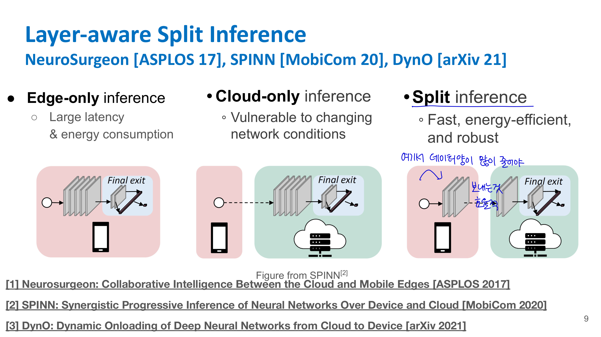

방법 세 가지: Edge-only inference, Cloud-only inference, Split-inference
### Edge-only inference

```text
Device에서 전체 DNN 실행
```

🟢 장점은 network가 필요 없다는 것.

🔴 단점은 device compute가 약하면 latency와 energy consumption이 크다.

### Cloud-only inference

```text
Raw input을 cloud로 보내고 cloud에서 전체 DNN 실행
```

🟢 장점은 cloud compute를 쓸 수 있다는 것.

🔴 단점은 network condition 변화에 취약하다. 특히 bandwidth가 낮거나 RTT가 크면 latency가 커진다.

### Split inference

```text
Device에서 앞부분 실행
→ intermediate feature 전송
→ cloud에서 뒷부분 실행
```

목표는 edge-only보다 빠르고 에너지 효율적이며, cloud-only보다 network condition 변화에 robust한 구조를 만드는 것이다.

중요한 조건은 **split point 이후에 보내는 feature map의 data size가 충분히 줄어야 한다**는 것이다. 앞부분을 device에서 계산했는데 intermediate feature가 raw image보다 더 크면 오히려 손해다.

---

### **13-7-1. NeuroSurgeon: Layer-wise Model Partitioning**

NeuroSurgeon은 layer-wise로 model partition point를 찾는 대표 방식이다. 

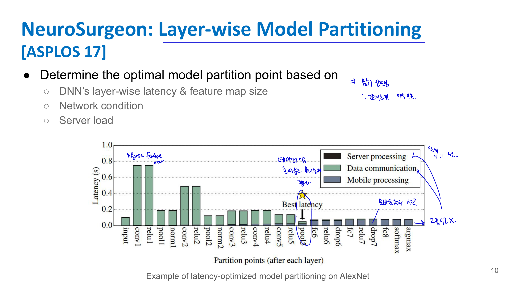

목표는:

> DNN을 어느 layer에서 잘라야 end-to-end latency가 최소가 되는가?

이다.

partition point는 다음 요소를 고려해서 정한다.

* 각 layer의 latency
* 각 layer output feature map size
* network condition
* server load

예를 들어 AlexNet을 생각해보면, 초반 layer의 feature map은 spatial size가 커서 전송량이 클 수 있다. 반면 어느 정도 convolution/pooling을 지나면 feature map 크기가 줄어든다. 이때 잘라서 보내면 communication cost가 줄어든다.

하지만 너무 뒤에서 자르면 device에서 계산해야 할 양이 많아진다. 그래서 최적점은 다음 trade-off로 결정된다.

```text
초반에서 split:
device compute 작음
하지만 communication data 큼

후반에서 split:
communication data 작음
하지만 device compute 큼
```

NeuroSurgeon은 network bandwidth와 server load가 바뀌면 partition point도 바꾸어 latency를 줄인다. page 11의 evaluation은 network bandwidth와 server load 변화에 대해 cloud-only보다 더 안정적인 latency를 보여주는 내용이다. 

---

### **13-7-2. SPINN: Progressive Inference with Early Exit**

SPINN은 split inference에 **early exit**을 결합한 방식이다. 

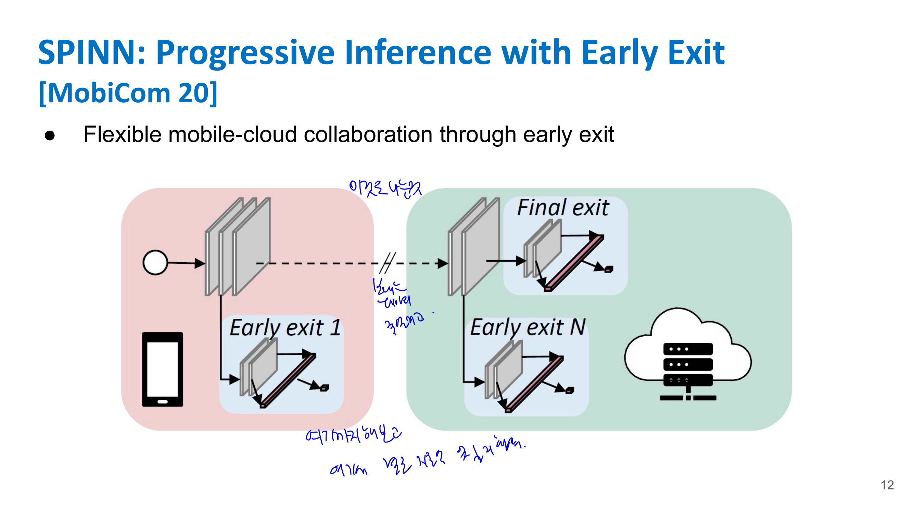

핵심은:

> confidence가 충분히 높으면 끝까지 가지 않고 중간에서 inference를 종료한다.

**Early exit 직관**

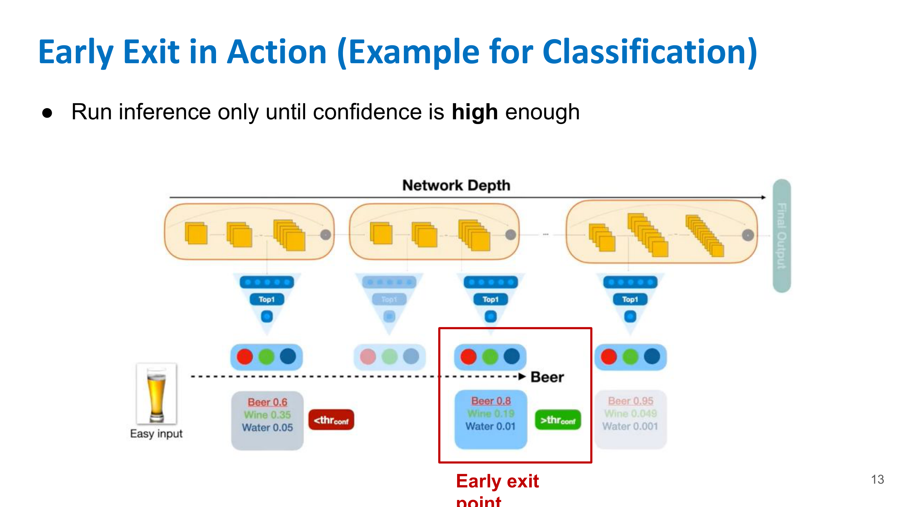

classification model을 생각해보자.

어떤 input은 쉬운 input이다. 예를 들어 맥주 사진이 너무 명확하면 shallow layer에서도 “beer”라고 높은 confidence로 판단할 수 있다.

이 경우 굳이 deep layer까지 갈 필요가 없다.

```text
쉬운 input:
초반 layer → confidence 높음 → early exit

어려운 input:
초반 layer → confidence 낮음 → 더 깊게 진행
```

SPINN은 mobile과 cloud 사이에서 여러 exit point를 두고, 상황에 따라 mobile에서 끝내거나 cloud로 보내서 추가 계산한다.

장점은:

* 쉬운 sample은 빠르게 처리
* 어려운 sample만 cloud compute 사용
* network bandwidth와 server load 변화에 더 flexible하게 대응

page 14의 evaluation은 SPINN이 network bandwidth와 server slowdown 변화에서 NeuroSurgeon, Edgent, on-device, server-only와 비교해 안정적인 throughput/latency를 보이는 내용이다. 

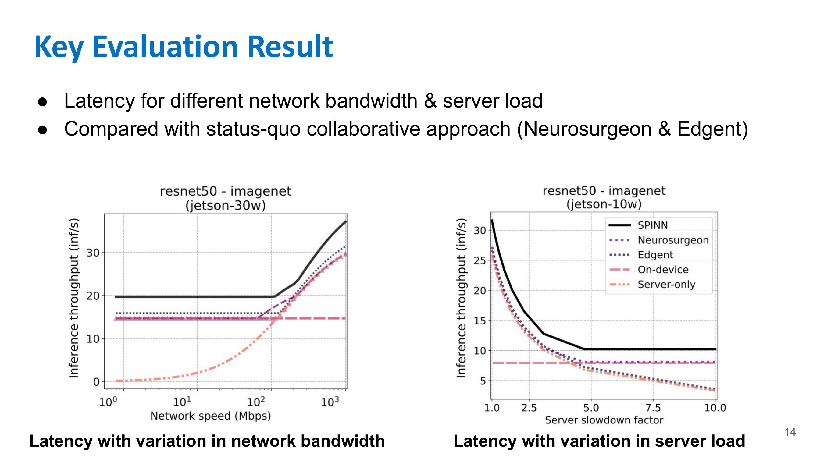

---

### **13-7-3. DynO: Split + Tensor Packing**

DynO는 split point뿐 아니라 **intermediate tensor를 어떻게 packing/quantization해서 보낼지**까지 같이 최적화한다. 

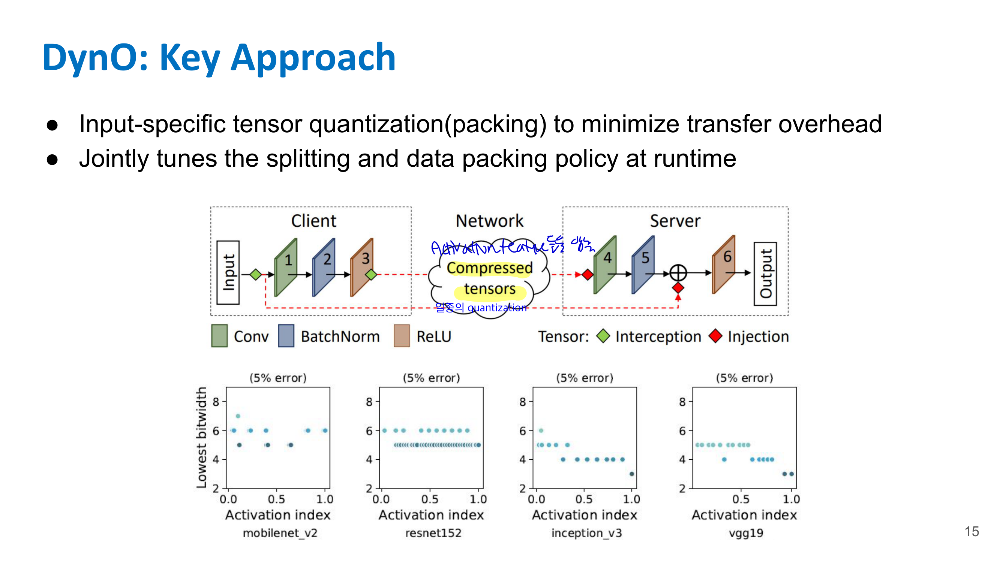

핵심은 두 가지다.

#### ☑️ Input-specific tensor quantization / packing

Intermediate activation tensor를 그대로 보내면 data size가 크다. 그래서 ** input별로 tensor를 압축/quantization해서 transfer overhead를 줄인다.**

즉:

```text
intermediate tensor
→ compressed / packed tensor
→ network transfer
→ server에서 unpack 후 나머지 inference
```

#### ☑️ Runtime joint tuning

DynO는 runtime에 다음을 함께 조절한다.

* split point
* data packing policy

왜 runtime이냐면 network condition, input 특성, model structure에 따라 최적 설정이 바뀌기 때문이다.

**예를 들어 3G 환경에서는 더 강하게 압축해야 할 수 있고, WiFi 환경에서는 덜 압축해도 된다.** page 16은 Inception-v3, ResNet-152, VGG19, MobileNet-v2를 Jetson Xavier AGX와 GTX 1080 Ti 환경에서 3G/4G/WiFi로 평가하는 setup을 보여준다. 

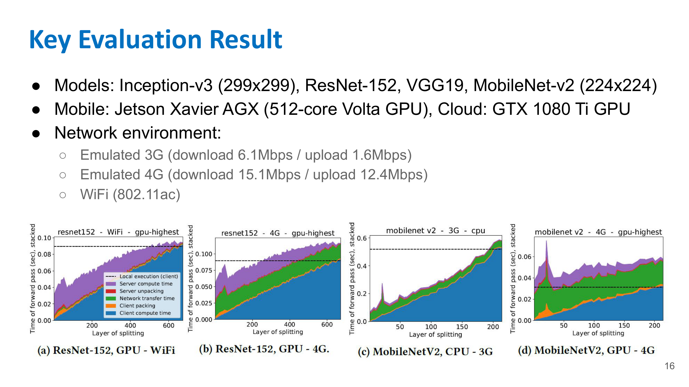

---

### **13-7-4. EagleEye: Content-Aware Split Inference**

EagleEye는 layer가 아니라 **content의 난이도**에 따라 device/cloud를 나누는 방식이다. target service는 AR person identification이다.


예를 들어 AR glasses를 쓰고 crowded urban space에서 사람을 식별한다고 하자. 한 장면에는 많은 얼굴이 있고, 각 얼굴의 조건이 다르다.

* 얼굴이 크고 정면이면 쉽다.
* 얼굴이 크지만 옆모습이면 어렵다.
* 얼굴이 작고 흐리면 더 어렵다.
* 아예 사람이 없거나 식별 불가능한 경우도 있다.

EagleEye는 모든 얼굴을 무조건 cloud로 보내거나, 모든 얼굴을 mobile에서 처리하지 않는다.

#### ☑️ Content-aware decision tree

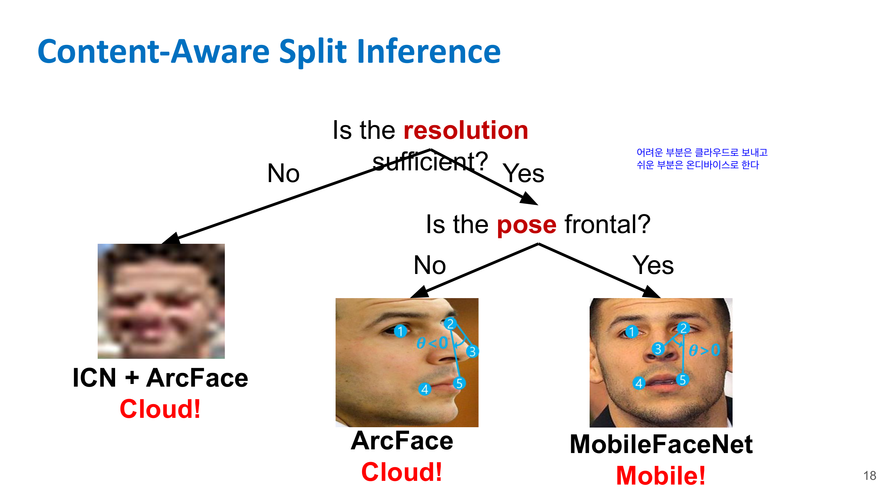

즉:

* 쉬운 경우: mobile에서 lightweight model 사용
* 어려운 경우: cloud에서 heavy model 사용
* 작은 얼굴: identity clarification + heavy recognition 사용

> 모든 data를 똑같이 처리하지 말고, content difficulty에 따라 device/cloud/model을 다르게 선택하자.

---

## 📌 13-8. DNN-aware Compression

이제 두 번째 큰 접근인 DNN-aware compression이다.

Cloud로 image/video를 보내야 하는데 raw data는 너무 크다. 그래서 압축이 필요하다.

하지만 일반 JPEG/H.264 같은 압축은 인간 시각에 맞춰 설계되어 있다. DNN이 중요하게 보는 정보와 인간이 중요하게 보는 정보는 다를 수 있다.

따라서 목표는:

> 사람 보기 좋은 압축이 아니라, DNN inference accuracy를 유지하는 압축을 하자.

---

### **13-8-1. Compression Quality Adaptation**

Compression quality adaptation은 video의 모든 영역을 같은 quality로 압축하지 않는다. 각 region을 다르게 압축한다. 

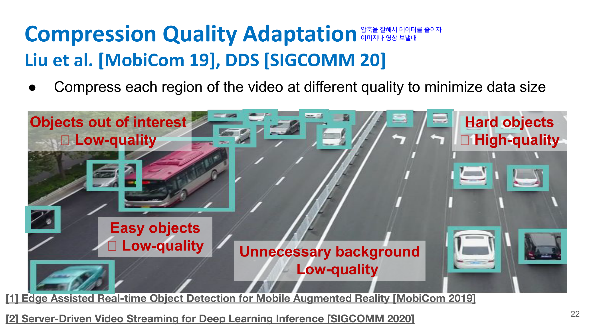

* Unnecessary background → low quality
* Easy objects → low quality
* Objects out of interest → low quality
* Hard objects → high quality

즉, DNN 결과에 중요한 영역, 특히 어려운 object가 있는 부분만 높은 quality로 유지하고, 나머지는 낮은 quality로 압축해서 data size를 줄인다.

#### ☑️ Predictive vs Reactive Adaptation

page 23에서는 compression quality adaptation을 두 가지로 나눈다. 

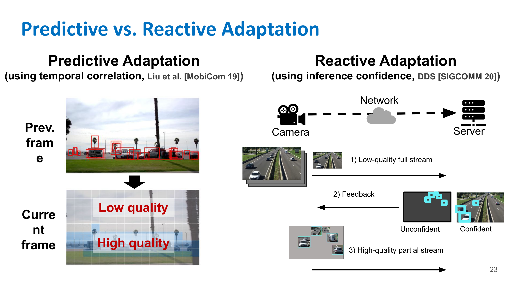

**A) Predictive Adaptation**

이전 frame과 현재 frame 사이의 temporal correlation을 이용한다.

```text
Previous frame 분석
→ 다음 frame에서 중요한 region 예측
→ 그 region은 high quality로 전송
→ 나머지는 low quality
```

예를 들어 자동차가 이전 frame에서 오른쪽으로 움직이고 있었다면, 다음 frame에서도 비슷한 위치에 있을 가능성이 높다. 그래서 미리 해당 region을 high quality로 압축한다.

Liu et al. 방식이 여기에 해당한다.

**B) Reactive Adaptation**

먼저 low-quality full stream을 보낸다. Cloud/server에서 inference를 해보고 confidence가 낮은 region만 feedback을 요청한다.

```text
1) Low-quality full stream 전송
2) Server inference
3) Unconfident region feedback
4) 해당 region만 high-quality partial stream 전송
```

DDS가 이런 방식이다.

장점은 실제 DNN confidence를 보고 필요한 부분만 다시 보내는 것이다. 단점은 feedback round가 추가될 수 있다.

---

## 📌 13-15. DNN-aware Codec: Grace

Grace는 codec parameter 자체를 DNN에 맞게 조정하는 접근이다. 

> Humans and DNNs have different sensitivity to frequency & color components.
> Human perception-oriented compression degrades DNN accuracy.

즉 인간 시각에 최적화된 압축은 DNN에 최적화된 압축이 아니다.

### 인간 시각과 DNN의 차이

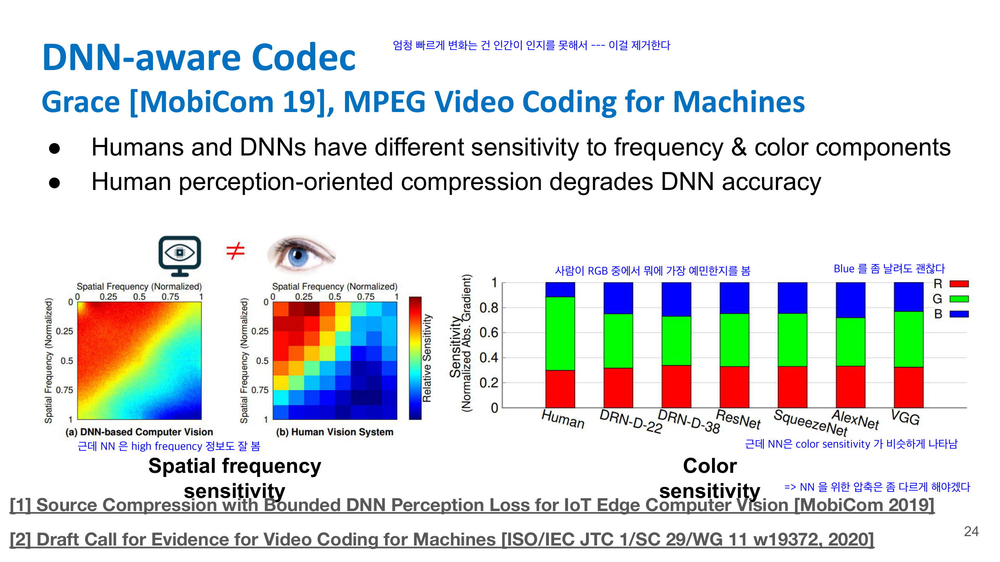

일반 image/video codec은 인간의 시각 특성을 이용한다.

예를 들어 인간은:

* certain color component에 덜 민감함
* 매우 높은 spatial frequency 변화에 덜 민감함

그래서 JPEG/H.264류 압축은 사람이 잘 못 느끼는 정보를 더 많이 제거한다.

하지만 DNN은 인간과 다르게 동작할 수 있다.

강의 필기에는 다음 내용이 있다.

* 사람은 RGB 중 특정 color에 더 민감하거나 덜 민감할 수 있음
* 예를 들어 blue 정보를 조금 날려도 사람이 잘 못 느낄 수 있음
* 그런데 NN은 color sensitivity가 비슷하게 나타날 수 있음
* NN은 high-frequency 정보도 중요하게 볼 수 있음

그래서 human perception-oriented compression이 DNN accuracy를 떨어뜨릴 수 있다.

### Grace의 방식

Grace는 offline과 online 단계로 나뉜다. 

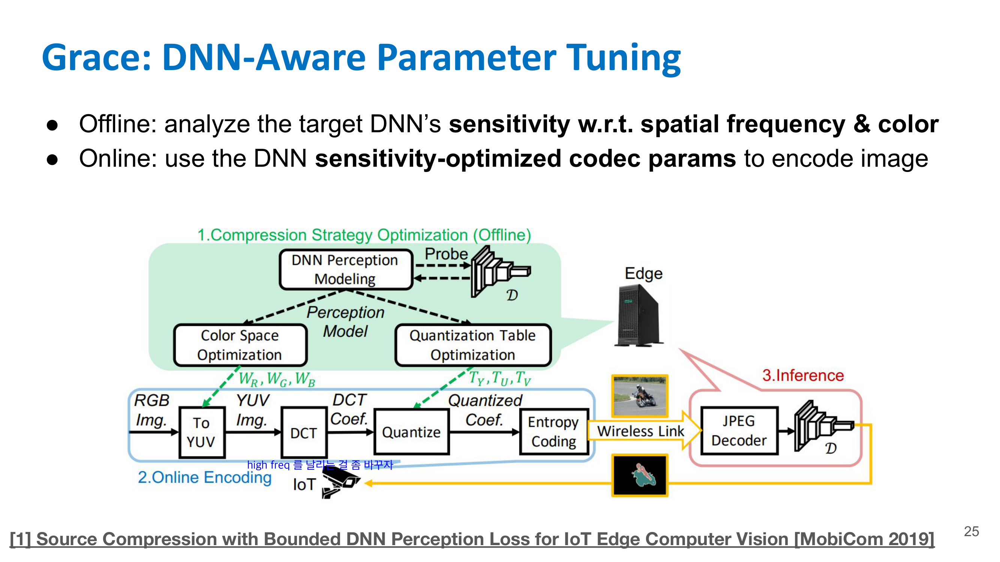

#### ☑️ Offline

target DNN이 spatial frequency와 color component에 얼마나 민감한지 분석한다.

```text
Target DNN
→ color sensitivity 분석
→ spatial frequency sensitivity 분석
→ codec parameter 결정
```

#### ☑️ Online

분석된 DNN sensitivity에 최적화된 codec parameter로 image를 encode한다.

즉, DNN이 중요하게 보는 frequency/color는 보존하고, 덜 중요한 성분을 더 많이 압축한다.

---

## 📌 13-16. Video Coding for Machines

Lecture 13은 Grace 다음에 **Video Coding for Machines**를 소개한다. 

이건 기존 video coding이 인간 시청자를 위한 것이었다면, 이제는 machine perception / intelligent analytics를 위한 video coding이 필요하다는 흐름이다.

요지는 비슷하게 사람 인식과 다르게 DNN 이 잘 이해할 수 있는 인코딩으로 변경한다

강의에서는 MPEG standard로도 논의 중인 흐름이라고 언급한다.

---

## 📌 13-17. MEC Model과 Offloading

후반부는 DNN의 statistical nature를 활용하는 접근으로 넘어간다.

먼저 **MEC, Multi-access Edge Computing** 모델이 나온다. 

MEC는 완전한 distant cloud가 아니라, base station이나 radio access network 근처의 edge server에서 compute를 제공하는 구조다.

---

## 📌 13-18. ARMA: Network-Compute Joint Scheduling

ARMA는 network와 compute를 따로 최적화하지 않고 **joint scheduling**하는 접근이다. 

강의 page 29의 예시는 video analytics다.

네트워크 bandwidth가 좋을 때는 frame을 더 높은 quality로 보낼 수 있고, 서버에서는 상대적으로 가벼운 model을 써도 accuracy가 유지될 수 있다.

반대로 network가 나쁘면 data를 많이 보낼 수 없다.

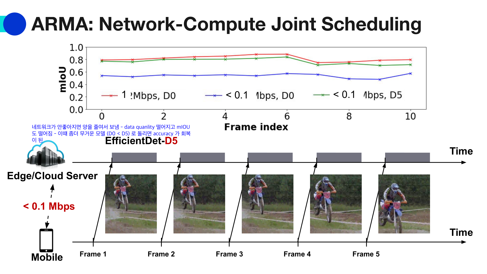

```text
network bandwidth 낮음
→ data quality 낮춤
→ mIoU / accuracy 하락 가능
```

이때 ARMA는 compute 쪽에서 더 heavy model을 사용해서 accuracy를 회복할 수 있다고 설명한다.

예를 들어:

```text
Bandwidth 좋음:
high-quality frame + EfficientDet-D0

Bandwidth 나쁨:
low-quality frame + EfficientDet-D5
```

D0보다 D5가 더 무거운 model이다. 즉, network에서 잃은 정보를 compute에서 더 강한 model로 어느 정도 보완하려는 것이다.

핵심은:

> network adaptation과 model selection을 따로 하지 말고, end-to-end latency와 accuracy를 함께 보고 data quality와 DNN model을 같이 선택하자.

---

## 📌 13-19. Logan: Loss Acceptance & Recovery

마지막 대표 기법은 Logan이다. Logan은 **loss-tolerant live video analytics system**이다. 

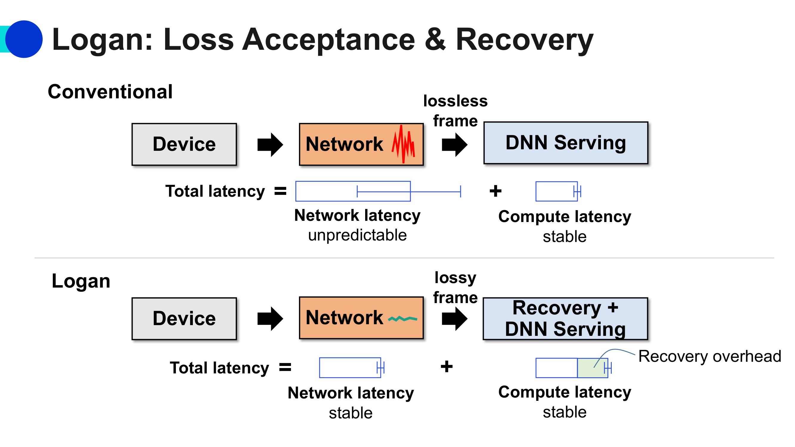

일반적으로 네트워크에서 packet loss가 발생하면 재전송을 한다. 하지만 live video analytics에서는 재전송을 기다리면 latency가 커진다.

Logan의 관점은:

> 일부 data loss를 받아들이고, DNN의 복원 능력과 inference robustness를 활용해서 end-to-end latency를 줄이자.

### Conventional 방식

```text
lossless frame 필요
→ packet loss 발생
→ 재전송
→ frame 완성 후 DNN serving
```

이 방식은 network latency가 unpredictable할 수 있다. packet 재전송 때문에 total latency가 흔들린다.

### Logan 방식

```text
lossy frame 허용
→ 일부 region 손실
→ recovery + DNN serving
```

Logan은 loss된 region을 inpainting DNN으로 복원하고, analytics DNN은 어느 정도 error-resilient하다는 점을 활용한다.

여기서 중요한 건 recovery overhead가 추가되더라도, 재전송으로 인한 큰 latency spike를 줄일 수 있다는 점이다.

---

## 📌 13-21. Lecture 13 전체 흐름 요약

Lecture 13은 다음 흐름으로 이해하면 된다.

```text
1. On-device는 privacy/latency 장점이 있지만 compute가 약함
2. Cloud offloading은 compute가 강하지만 network/privacy/data-size 문제가 있음
3. 그래서 device와 cloud가 협력하는 collaborative inference가 필요함
4. 첫 번째 방법: 모델을 나눠 실행하는 split inference
5. 두 번째 방법: DNN accuracy를 고려한 compression
6. 세 번째 방법: DNN의 통계적 특성과 error tolerance를 활용한 scheduling/recovery
```

즉, cloud offloading은 단순히 “이미지를 서버로 보내자”가 아니다.

> **어떤 data를, 어떤 quality로, 어느 시점에, 어떤 model로, device와 cloud 중 어디에서 처리할지 jointly 결정하는 시스템 문제**다.

---

## 📌 13-22. 핵심 기법 비교표 

| 기법                             | 핵심 문제                                        | 해결 아이디어                                                           |
| ------------------------------ | -------------------------------------------- | ----------------------------------------------------------------- |
| NeuroSurgeon                   | DNN을 어디서 잘라 device/cloud에 나눌까                | layer latency, feature size, network, server load로 split point 결정 |
| SPINN                          | 쉬운 input도 끝까지 계산하는 낭비                        | confidence 높으면 early exit                                         |
| DynO                           | intermediate tensor 전송량이 큼                   | input-specific tensor quantization/packing + split joint tuning   |
| EagleEye                       | 얼굴마다 난이도가 다름                                 | easy face는 mobile, difficult face는 cloud                          |
| Compression Quality Adaptation | video 전체를 high quality로 보내면 bandwidth 큼      | region별로 quality 다르게 압축                                           |
| Predictive Adaptation          | 중요한 region을 미리 예측해야 함                        | temporal correlation 이용                                           |
| Reactive Adaptation            | DNN이 어디서 실패했는지 알아야 함                         | low-quality stream 후 confidence feedback                          |
| Grace                          | human-oriented compression이 DNN accuracy를 깎음 | DNN frequency/color sensitivity 기반 codec tuning                   |
| Video Coding for Machines      | codec target이 사람 중심임                         | machine perception accuracy 중심 video coding                       |
| ARMA                           | network와 compute를 따로 최적화하면 e2e 성능 한계         | data quality와 DNN model을 jointly scheduling                       |
| Logan                          | packet loss 재전송이 latency spike 유발            | loss를 허용하고 inpainting/analytics DNN으로 복원 및 분석                     |

---

## 13-23. Lecture 12와 Lecture 13의 차이

Lecture 12와 헷갈릴 수 있어서 비교하면:

| 구분    | Lecture 12 On-Device                                    | Lecture 13 Cloud Offloading                             |
| ----- | ------------------------------------------------------- | ------------------------------------------------------- |
| 기본 방향 | device 안에서 처리                                           | cloud/edge server와 협력                                   |
| 장점    | privacy, stable latency, disconnected operation         | powerful compute, 큰 model 가능                            |
| 문제    | power, thermal, memory, heterogeneous hardware          | network latency, bandwidth, privacy, compression        |
| 대표 기법 | Band, DIKE, VLM in a FLASH, WorldTrack, MERCI, SNN, BVN | NeuroSurgeon, SPINN, DynO, EagleEye, Grace, ARMA, Logan |

Lecture 12가 “디바이스를 더 잘 쓰자”라면, Lecture 13은 “디바이스와 클라우드를 똑똑하게 나눠 쓰자”야.

---

## 13-24. 시험용 핵심 문장

**Cloud offloading은 device의 부족한 compute를 cloud/edge server의 강력한 compute로 보완하는 접근이지만, network latency, bandwidth, privacy, compression 문제가 있다.**

**Split inference는 DNN의 앞부분은 device에서, 뒷부분은 cloud에서 실행하는 방식이며, split point는 layer latency, feature map size, network condition, server load에 따라 결정된다.**

**NeuroSurgeon은 layer-wise latency와 feature map size를 고려해 최적 partition point를 찾는다.**

**SPINN은 early exit을 이용해 confidence가 충분한 쉬운 input은 중간에서 inference를 종료하고, 어려운 input만 더 깊게 처리한다.**

**DynO는 split point와 intermediate tensor quantization/packing policy를 runtime에 함께 조정해 transfer overhead를 줄인다.**

**EagleEye는 AR person identification에서 face resolution과 pose에 따라 mobile lightweight model 또는 cloud heavy model을 선택하는 content-aware split inference이다.**

**DNN-aware compression은 사람 눈에 좋은 압축이 아니라 DNN accuracy를 유지하는 압축을 목표로 한다.**

**Compression quality adaptation은 background/easy object는 low quality, hard object는 high quality로 보내 data size를 줄인다.**

**Grace는 target DNN의 spatial frequency와 color sensitivity를 분석해 DNN-aware codec parameter를 정한다.**

**ARMA는 network bandwidth가 낮아져 data quality가 떨어질 때 더 강한 DNN model을 사용하는 식으로 network와 compute를 jointly scheduling한다.**

**Logan은 packet loss 재전송을 기다리지 않고, 일부 손실을 허용한 뒤 inpainting DNN과 error-resilient analytics DNN으로 복원/분석해 live video analytics latency를 안정화한다.**


<script type="text/x-mathjax-config">
  MathJax.Hub.Config({
    tex2jax: {
      inlineMath: [['$','$'], ['\\(','\\)']],
      processEscapes: true
    },
    "HTML-CSS": { linebreaks: { automatic: true } }
  });
</script>
<script type="text/javascript" src="https://cdnjs.cloudflare.com/ajax/libs/mathjax/2.7.7/MathJax.js?config=TeX-AMS-MML_HTMLorMML"></script>


