# 14. System Techniques for LLMs

이번 강의의 핵심은 “LLM은 모델 자체보다도 serving system이 병목이 되는 경우가 많고, 특히 autoregressive decode, KV cache, batching/scheduling, memory movement를 어떻게 다루느냐가 성능을 결정한다”는 거야. 

## 📌 14-1. LLM Serving Basics

### 14-1.1 왜 LLM serving은 일반 NN inference와 다른가?

일반적인 CNN/MLP inference는 보통 입력 하나에 대해 forward pass 한 번을 수행하면 끝난다. 그런데 LLM, 특히 decoder-only GPT류 모델은 **autoregressive generation** 방식이다. 즉, 한 번에 답 전체를 생성하는 것이 아니라 토큰을 하나 만들고, 그 토큰을 다시 입력에 붙여 다음 토큰을 만든다.

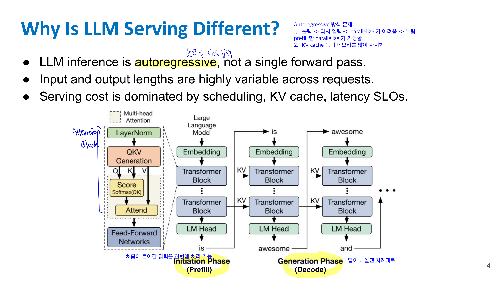

예를 들어 입력이

```text
I think
```

이면 모델이 다음 토큰 `this`를 만들고, 그 다음에는

```text
I think this
```

를 입력으로 다시 넣어서 다음 토큰을 만든다.

그래서 LLM inference는 크게 두 단계로 나뉜다.

### 14-1.2 Prefill phase와 Decode phase

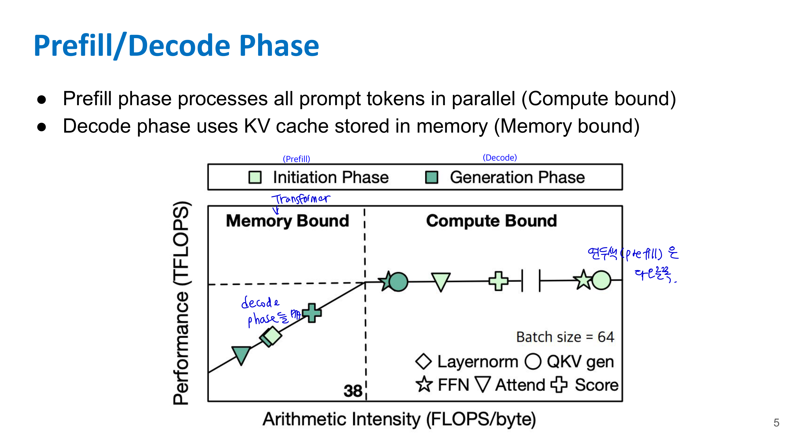

#### ☑️ Prefill phase

Prefill은 사용자가 넣은 prompt 전체를 한 번에 처리하는 단계다.

예를 들어 prompt가 1000 token이면, 이 1000개 token에 대한 attention 계산을 병렬로 수행해서 각 layer의 KV cache를 만든다.

특징은 다음과 같다.

* prompt token 전체를 병렬 처리할 수 있음
* GPU 연산량이 많음
* 상대적으로 **compute-bound**
* 첫 토큰을 만들기 전까지의 시간, 즉 TTFT에 큰 영향

슬라이드에서는 prefill phase가 prompt token 전체를 병렬 처리하며 compute-bound 성격을 가진다고 설명한다. 

#### ☑️ Decode phase

Decode는 output token을 하나씩 생성하는 단계다.

각 step에서 새 token 하나에 대한 query를 만들고, 이전 token들의 key/value는 KV cache에서 가져와 attention을 계산한다.

특징은 다음과 같다.

* token을 하나씩 생성하므로 병렬화가 어려움
* 이전 token들의 KV cache를 계속 읽어야 함
* 연산보다 memory access가 병목이 되기 쉬움
* 상대적으로 **memory-bound**
* TPOT/TBT에 큰 영향

슬라이드에서도 decode phase는 KV cache를 메모리에서 읽어 사용하기 때문에 memory-bound라고 정리한다. 

정리하면:

| 단계      | 하는 일                       | 병목            |
| ------- | -------------------------- | ------------- |
| Prefill | prompt 전체 처리, KV cache 생성  | compute-bound |
| Decode  | token 하나씩 생성, KV cache 재사용 | memory-bound  |

---

## 📌 14-2. Autoregressive Generation과 KV Cache

### 14-2.1 Autoregressive generation

Decoder-only LLM은 이전 출력 token을 다음 입력 sequence에 붙인다.

수식 느낌으로 보면

$y_t = f(x, y_1, y_2, \dots, y_{t-1})$

이다.

즉 $t$번째 token을 만들려면 이전까지 생성한 모든 token이 필요하다.

문제는 단순하게 구현하면 매 decode step마다 이전 token들의 key/value를 계속 다시 계산해야 한다는 것이다. 이러면 같은 token에 대한 K, V를 반복 계산하게 되어 너무 비효율적이다.

### 14-2.2 KV Cache

그래서 LLM serving에서는 **KV cache**를 사용한다.

Self-attention에서 각 token은 query, key, value를 만든다.

$Q = XW_Q$

$K = XW_K$

$V = XW_V$

새 token을 생성할 때 필요한 것은 현재 token의 query와 이전 모든 token의 key/value다. 이전 token들의 key/value는 이미 계산했으므로, 다시 계산하지 않고 저장해둔다. 이 저장 공간이 KV cache다.

슬라이드에서도 KV cache는 이전 token들의 key와 value를 저장하고, 이를 통해 LLM이 반복 계산 없이 attention을 수행할 수 있다고 설명한다. 대신 현재 query token만 계산하면 되지만, storage cost가 생긴다. 

즉 KV cache의 trade-off는 다음과 같다.

* 장점: 이전 token의 K, V를 다시 계산하지 않음
* 단점: sequence length, batch size, layer 수, head 수가 커질수록 메모리 사용량이 폭증함

### 14-2.3 KV cache 크기

KV cache 크기는 대략 다음 항목에 비례한다.

$B \times L \times H \times N \times D \times 2 \times \text{bytes}$

여기서

* $B$: batch size
* $L$: number of layers
* $H$: number of KV heads
* $N$: sequence length
* $D$: head dimension
* $2$: K와 V 두 개
* bytes: FP16이면 2 bytes

슬라이드에서는 Llama-2-70B 기준으로 MHA를 사용할 때 KV cache가 상당히 커진다고 설명한다. 예를 들어 $BS=1, N=4096$이면 약 10GB, $BS=16, N=4096$이면 약 160GB까지 필요할 수 있다고 나온다. 

중요한 점은 **긴 context + 큰 batch**에서는 KV cache가 model weight보다 더 커질 수 있다는 것이다.

---

## 📌 14-3. LLM Serving Metrics

LLM serving에서 중요한 metric은 단순 accuracy가 아니다. 시스템 관점에서는 latency와 throughput이 중요하다.

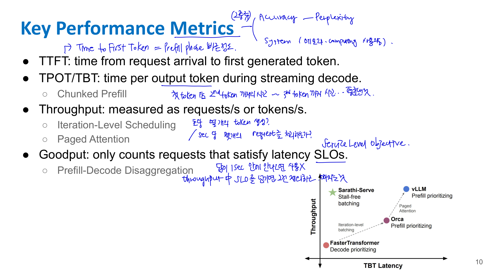

### 14-3.1 TTFT

**TTFT**는 Time To First Token이다.

사용자 request가 들어온 순간부터 첫 번째 output token이 생성될 때까지의 시간이다.

TTFT는 주로 prefill phase의 영향을 많이 받는다. prompt가 길면 prefill이 오래 걸리고, 첫 token이 늦게 나온다.

### 14-3.2 TPOT / TBT

**TPOT**는 Time Per Output Token, **TBT**는 Time Between Tokens이다.

첫 token 이후 streaming decode 중에 token 하나가 나오는 데 걸리는 시간이다.

사용자 입장에서는 답변이 “뚝뚝 끊겨서” 나오는지, 자연스럽게 streaming되는지가 여기에 달려 있다.

### 14-3.3 Throughput

Throughput은 초당 처리하는 request 수 또는 token 수다.

예를 들면

* requests/s
* tokens/s

로 측정할 수 있다.

많은 사용자 request를 동시에 처리하는 serving system에서는 throughput이 매우 중요하다.

### 14-3.4 Goodput

Goodput은 단순히 처리량만 보는 것이 아니라, **latency SLO를 만족한 request만 count**하는 metric이다.

예를 들어 throughput은 높지만 대부분 request가 latency constraint를 넘기면 사용자는 느리다고 느낀다. 그래서 serving system에서는 “많이 처리했는가”보다 “정해진 latency 안에 제대로 처리했는가”가 중요할 수 있다.

슬라이드에서도 TTFT, TPOT/TBT, throughput, goodput을 핵심 성능 지표로 정리한다. 

---

## 📌 14-4. Orca: Iteration-Level Scheduling

### 14-4.1 기존 request-level scheduling의 문제

일반적인 batch serving에서는 여러 request를 하나의 batch로 묶고, 그 batch 전체가 끝날 때까지 같이 처리한다.

문제는 LLM output length가 request마다 다르다는 것이다.

예를 들어 request A는 5 token만 생성하고 끝나는데, request B는 100 token을 생성해야 한다면, A는 빨리 끝났지만 batch 구조 때문에 GPU 자원이 비는 공간이 생긴다. 반대로 긴 request가 batch를 오래 붙잡아 새 request가 들어오기 어렵다.

이걸 **head-of-line blocking**이라고 볼 수 있다.

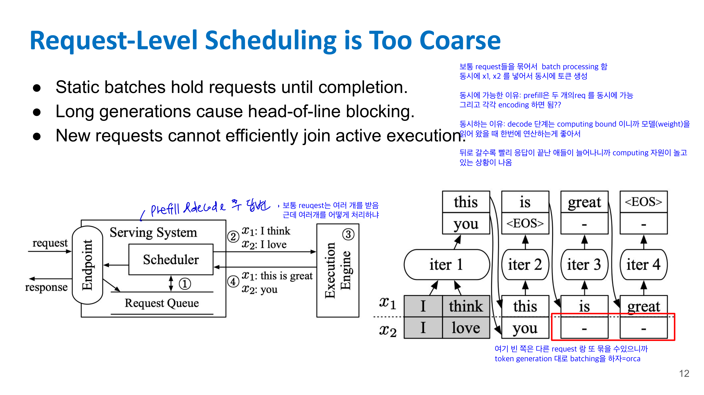

슬라이드에서는 static batch가 request를 completion까지 잡고 있고, 긴 generation이 head-of-line blocking을 만들며, 새 request가 active execution에 효율적으로 join하기 어렵다고 설명한다. 

### 14-4.2 Orca의 핵심: iteration-level scheduling

Orca는 request 단위가 아니라 **decode iteration 단위로 scheduling**한다.

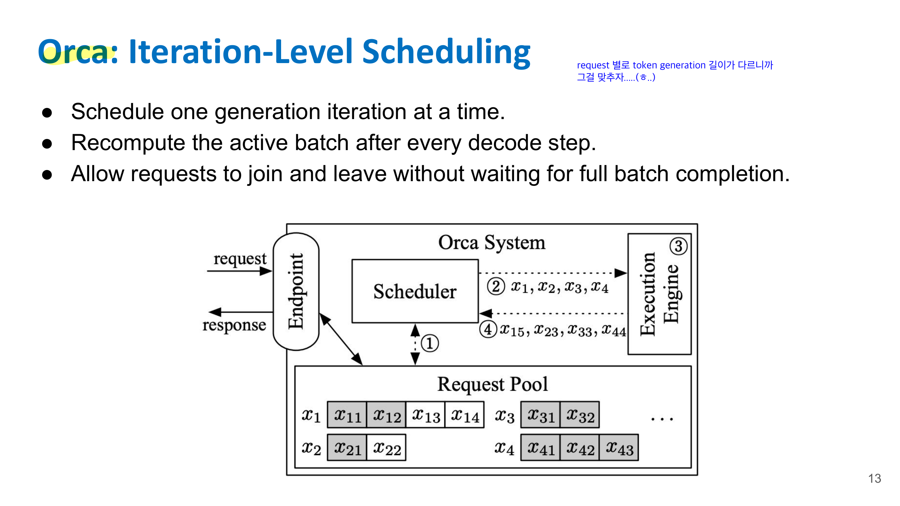

즉 한 token generation step이 끝날 때마다 active batch를 다시 구성한다.

원리는 다음과 같다.

1. 현재 살아있는 request들로 batch를 구성한다.
2. 각 request에 대해 token 하나씩 생성한다.
3. 어떤 request가 EOS를 만나 끝나면 batch에서 제거한다.
4. 새 request가 있으면 다음 iteration부터 batch에 넣는다.
5. 이 과정을 매 decode step마다 반복한다.

슬라이드에서는 Orca가 한 generation iteration씩 schedule하고, 매 decode step 이후 active batch를 재계산하며, request가 full batch completion을 기다리지 않고 join/leave할 수 있게 한다고 정리한다. 

### 14-4.3 왜 좋아지는가?

기존 request-level batching은 “같이 시작한 request는 같이 끝날 때까지 묶임”에 가깝다.

Orca는 “매 token step마다 다시 묶음”이다.

그래서

* 짧은 request가 끝나면 바로 빠짐
* 새 request가 중간에 들어올 수 있음
* GPU utilization이 좋아짐
* throughput이 증가함
* tail latency가 줄어듦

즉 Orca는 LLM의 autoregressive 특성에 맞춘 scheduling 기법이다.

---

## 📌 14-5. vLLM: PagedAttention

### 14-5.1 문제: KV cache memory fragmentation

LLM serving에서는 여러 request가 동시에 들어오고, 각 request의 input/output 길이가 다르다.

그런데 output length는 미리 정확히 알기 어렵다. 그래서 KV cache 공간을 미리 크게 잡아두면 낭비가 생긴다.

슬라이드에서는 pre-allocated KV cache가 여러 사용자 serving에서 자주 낭비되고, 그 원인으로 internal fragmentation, reservation, external fragmentation을 든다. 

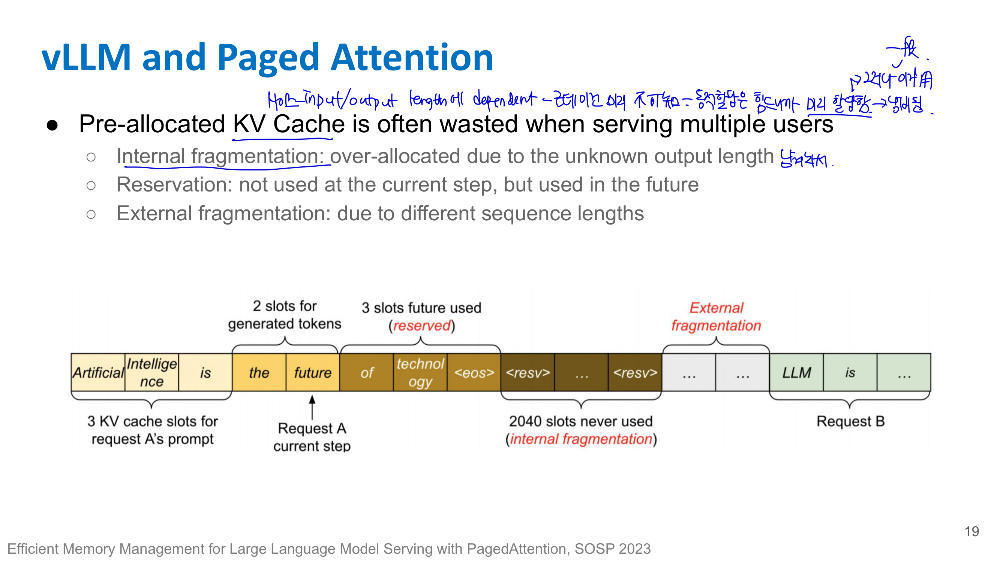

각각의 의미는 다음과 같다.

#### ☑️ Internal fragmentation

한 request를 위해 넉넉하게 KV cache 공간을 잡아뒀는데 실제로는 덜 쓰는 경우다.

예를 들어 2048 token까지 생성될 것으로 보고 공간을 잡았는데 200 token에서 끝나면 나머지가 낭비된다.

#### ☑️ Reservation

현재 step에서는 아직 쓰지 않지만, 미래에 쓸 수 있으니 예약해둔 공간이다.

즉 지금 당장 GPU memory에 잡혀 있지만 실제 계산에는 쓰이지 않는다.

#### ☑️ External fragmentation

request마다 sequence length가 달라서 메모리 공간이 조각조각 남는 현상이다.

전체 free memory는 충분한데 연속된 큰 공간이 없어 새 request를 넣기 어려울 수 있다.

### 14-5.2 vLLM의 아이디어: OS paging을 KV cache에 적용

vLLM의 PagedAttention은 운영체제의 virtual memory / paging 아이디어에서 영감을 받았다.

운영체제에서 process의 logical page가 physical memory의 아무 위치에나 배치될 수 있고, page table이 mapping을 관리하듯이, vLLM은 sequence의 logical KV block을 physical KV cache block에 mapping한다.

슬라이드에서도 vLLM은 OS의 virtual memory와 paging에서 영감을 받았고, 이 아이디어가 high-throughput, memory-efficient serving을 가능하게 한다고 설명한다. 

### 14-5.3 PagedAttention

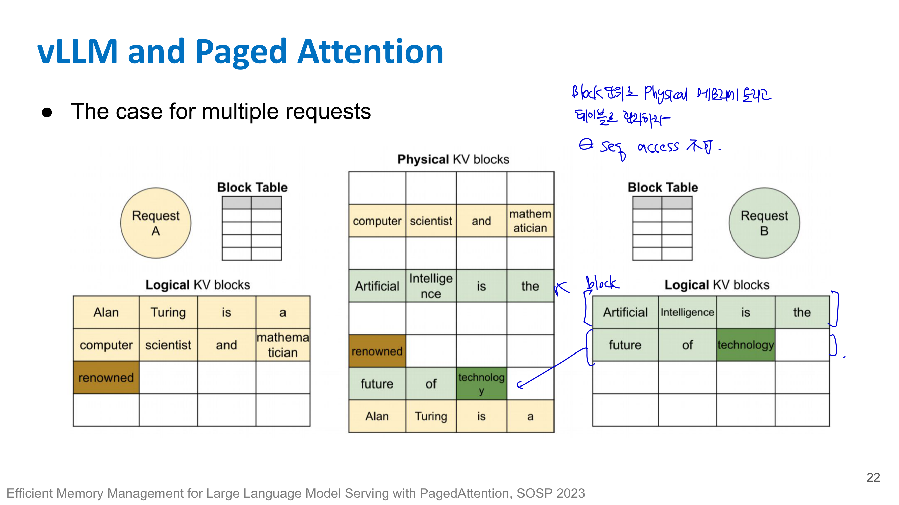

PagedAttention은 KV cache를 연속된 큰 배열로 잡지 않고, 작은 block 단위로 나눠 관리한다.

각 request는 logical KV block을 가진다. 이 logical block들은 실제 physical KV cache block에 흩어져 저장될 수 있다.

즉 logical sequence는 연속적이지만, physical memory에서는 non-contiguous하게 저장될 수 있다.

슬라이드에서도 PagedAttention은 KV-cache memory fragmentation을 해결하며, continuous keys/values를 non-contiguous memory에 저장할 수 있게 한다고 설명한다. 

### 14-5.4 장점

vLLM의 장점은 크게 두 가지다.

첫째, KV cache memory 낭비가 줄어든다. 필요한 만큼 block을 할당하고, 끝난 request의 block은 회수하면 된다.

둘째, prompt sharing이 가능하다. 같은 prompt prefix를 공유하는 여러 output을 sampling할 때, prefix 부분의 KV block을 중복 저장하지 않고 공유할 수 있다.

슬라이드에서도 dynamic block mapping이 parallel sampling에서 prompt sharing을 가능하게 한다고 설명한다. 

---

## 📌 14-6. Sarathi-Serve: Chunked Prefill

### 14-6.1 문제: 긴 prefill이 decode streaming을 방해함

긴 prompt가 들어오면 prefill 단계가 오래 걸린다.

Prefill은 compute-bound라 GPU를 크게 점유한다. 그런데 이미 decode 중인 다른 request들은 token을 일정한 간격으로 계속 내보내야 한다. 긴 prefill이 GPU를 오래 점유하면 decode request들의 다음 token 생성이 지연된다.

그러면 사용자 입장에서는 streaming이 멈칫거리고, 시스템 관점에서는 TPOT/TBT variance가 커진다.

슬라이드에서는 long prompt가 큰 prefill step으로 GPU execution을 점유하고, active decode stream의 token emission을 지연시키며, 그 증상이 높은 TPOT/TBT variance로 나타난다고 설명한다. 

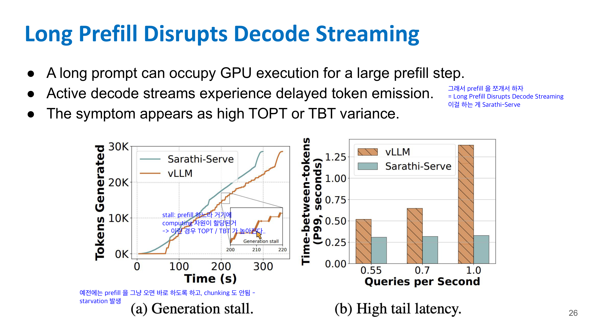

### 14-6.2 Sarathi-Serve의 핵심: chunked prefill

Sarathi-Serve는 긴 prefill을 한 번에 처리하지 않고 작은 chunk로 쪼갠다.

예를 들어 4096 token prompt를 한 번에 prefill하지 않고, 512 token씩 나눠 처리한다.

그리고 이 prefill chunk들을 decode iteration 사이사이에 끼워 넣는다.

슬라이드에서는 Sarathi-Serve가 long prefill을 smaller chunks로 나누고, prefill chunks와 decode iterations를 interleave하며, iteration-time variance를 줄인다고 정리한다. 


## 📌 14-7. DistServe: Prefill-Decode Disaggregation

### 14-7.1 문제: prefill과 decode의 성격이 다름

Prefill과 decode는 같은 LLM inference 안에 있지만 성격이 매우 다르다.

* Prefill: compute-bound
* Decode: memory-bound

따라서 두 단계를 같은 GPU worker에서 섞어서 처리하면 자원 사용 패턴이 충돌할 수 있다.

예를 들어 prefill은 큰 matrix multiplication으로 GPU compute를 많이 쓰고, decode는 KV cache read 때문에 memory bandwidth를 많이 쓴다. 둘을 같은 방식으로 scheduling하면 어느 쪽도 최적으로 처리하기 어렵다.

### 14-7.2 DistServe의 핵심

DistServe는 prefill과 decode를 분리해서 각각 다른 serving worker 또는 resource pool에서 처리한다.

즉

```text
Prefill worker: prompt 처리 + KV cache 생성
Decode worker: token-by-token generation
```

처럼 역할을 나눈다.

이렇게 하면 compute-bound인 prefill에는 compute에 적합한 배치/자원 정책을 적용하고, memory-bound인 decode에는 latency-sensitive streaming에 적합한 정책을 적용할 수 있다.

### 14-7.3 왜 goodput에 중요할까?

Serving system에서는 단순 throughput보다 latency SLO를 만족하는 goodput이 중요하다.

Prefill과 decode가 같은 queue에서 섞이면 긴 prefill이 decode latency를 망가뜨릴 수 있다. 반대로 decode가 너무 많이 끼어들면 prefill이 밀려 TTFT가 나빠질 수 있다.

DistServe는 두 단계를 분리해서 각각의 SLO를 따로 관리하려는 접근이다.

정리하면:

| 기법            | 해결하려는 문제                        |
| ------------- | ------------------------------- |
| Orca          | request-level batch의 비효율        |
| vLLM          | KV cache memory fragmentation   |
| Sarathi-Serve | 긴 prefill이 decode streaming 방해  |
| DistServe     | prefill과 decode의 resource 특성 차이 |

---

## 📌 14-8. Speculative Decoding

### 14-8.1 문제: decode는 token 하나씩 생성해서 느림

LLM decode는 autoregressive라 기본적으로 한 번에 token 하나씩 생성한다.

큰 target model이 매 token마다 forward pass를 해야 하므로 느리다. 특히 decode는 memory-bound라 GPU compute를 충분히 활용하지 못하는 경우가 많다.

### 14-8.2 핵심 아이디어

Speculative Decoding은 작은 draft model이 여러 token을 미리 추측하고, 큰 target model이 그 token들을 한 번에 검증하는 방식이다.

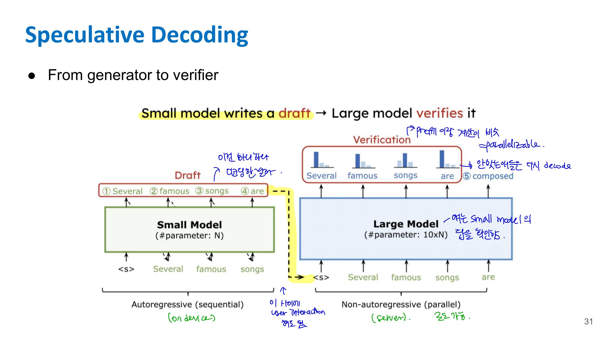

과정은 다음과 같다.

1. 작은 draft model이 다음 token 후보 여러 개를 빠르게 생성한다.
2. 큰 target model이 이 후보 token들을 병렬로 검증한다.
3. target model의 분포와 맞는 token은 accept한다.
4. 틀린 token이 나오면 reject하고 target model 기준으로 correction token을 생성한다.
5. accept된 token 수만큼 decode step을 건너뛴 효과가 난다.

### 14-8.3 왜 속도가 빨라지는가?

즉 target model을 매 token마다 호출하지 않고, 여러 token을 병렬로 검증하므로 더 빠르다.

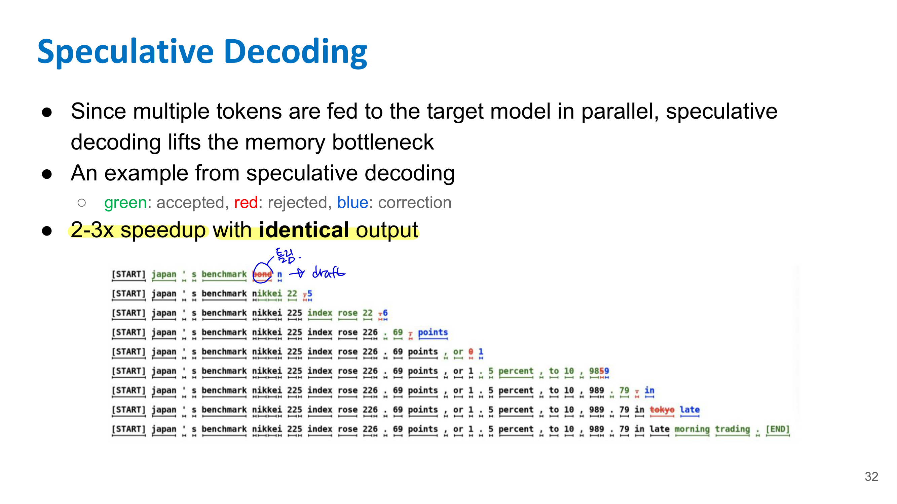

슬라이드에서는 speculative decoding이 여러 token을 target model에 병렬로 넣기 때문에 memory bottleneck을 완화하며, 출력은 동일하게 유지하면서 2~3배 speedup을 낼 수 있다고 설명한다. 

중요한 점은 speculative decoding이 approximate한 답을 내는 것이 아니라, 적절한 accept/reject rule을 사용하면 **target model과 동일한 output distribution**을 유지할 수 있다는 것이다.

---

## 📌 14-9. FlashAttention

### 14-9.1 기존 attention의 문제

Self-attention은 기본적으로 다음 계산을 한다.

$S = QK^T$

$P = \text{softmax}(S)$

$O = PV$

여기서 sequence length가 $N$이면 $S$와 $P$는 $N \times N$ 크기다.

문제는 $N$이 길어지면 attention matrix가 매우 커진다는 것이다.

예를 들어 $N=4096$이면 attention score matrix는 약 $4096 \times 4096$이다. 이 큰 matrix를 HBM에 쓰고 다시 읽으면 memory traffic이 매우 커진다.

### 14-9.2 FlashAttention의 핵심

FlashAttention은 큰 $N \times N$ attention matrix를 메모리에 materialize하지 않는다.

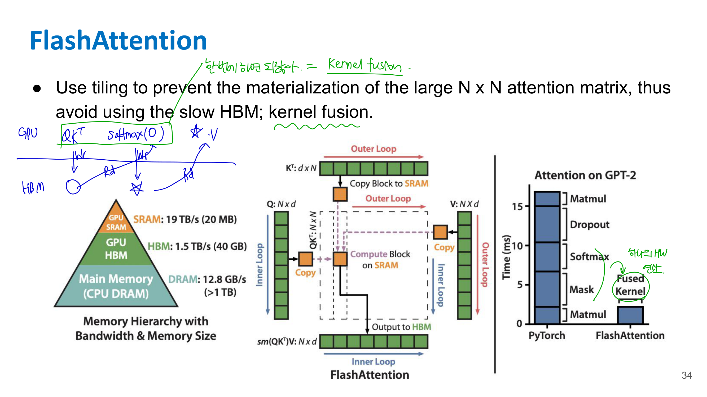

대신 Q, K, V를 tile 단위로 나눠서 SRAM/register 같은 빠른 on-chip memory에서 처리한다.

슬라이드에서도 FlashAttention은 tiling을 사용해 큰 $N \times N$ attention matrix materialization을 막고, 느린 HBM 사용을 피하며, kernel fusion을 사용한다고 설명한다. 

### 14-9.3 Tiling + Fusion

FlashAttention의 핵심은 두 가지다.

#### ☑️ Tiling

큰 attention 계산을 작은 block 단위로 나눈다.

각 tile이 SRAM에 올라와 있는 동안 최대한 재사용한다. 이렇게 하면 HBM read/write를 줄일 수 있다.

#### ☑️ Kernel fusion

기존에는

```text
QK^T 계산 → HBM 저장
softmax 계산 → HBM 저장
PV 계산 → HBM 저장
```

처럼 중간 결과를 메모리에 저장했다.

FlashAttention은 이를 하나의 fused kernel 안에서 처리한다.

```text
QK^T + softmax + PV를 block 단위로 한 번에 처리
```

그래서 중간 attention matrix를 HBM에 쓰지 않아도 된다.

슬라이드에서는 FlashAttention이 tiling과 operation fusion으로 kernel을 최적화한다고 정리한다. 

#### Online softmax

FlashAttention에서는 attention score matrix $S = QK^T$ 전체를 만들지 않고, block 단위로 계산하고 바로 버리고 싶어. 그런데 softmax는 row 전체의 max와 sum이 필요하니까 문제가 생겨.

block 단위로 계산을 하면서 softmax denominator 과 max 를 업데이트해서 한번에 다 HBM에 올리지 않아도 softmax 를 할 수 있다 뭐 그런거

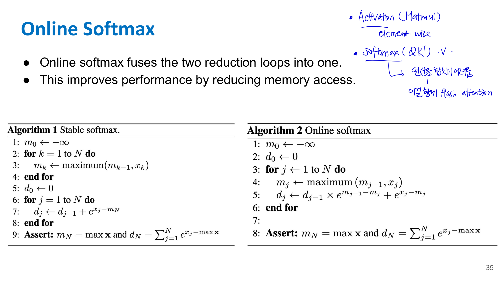

### 14-9.4 왜 중요한가?

LLM에서 long context를 다룰 때 attention은 메모리 사용량과 latency의 큰 원인이다.

FlashAttention은 FLOPs 자체를 크게 줄이는 기법이라기보다, **memory I/O를 줄여 실제 latency를 줄이는 기법**이다.

이건 Lecture 11에서 말한 “FLOPs가 줄어도 latency가 꼭 줄지는 않는다”와 연결된다. 실제 시스템에서는 arithmetic보다 memory movement가 더 큰 병목일 수 있기 때문이다.

---

## 📌 14-10. StreamingLLM

### 14-10.1 문제: LLM은 finite attention window로 학습됨

일반적인 LLM은 학습 시 정해진 context length 안에서 학습된다.

예를 들어 4K, 8K, 32K context window가 있다고 하자. 그런데 실제 streaming application에서는 입력이 무한히 길어질 수 있다.

예를 들어

* 긴 대화
* 실시간 회의 transcript
* streaming log 분석
* 장시간 agent interaction

같은 경우에는 모든 과거 token의 KV cache를 무한히 저장할 수 없다.

그래서 보통 sliding window를 사용한다. 최근 token들만 남기고 오래된 token의 KV cache는 버린다.

### 14-10.2 단순 sliding window의 문제

단순히 오래된 KV cache를 버리면 모델 성능이 갑자기 불안정해질 수 있다.

StreamingLLM의 관찰은 모델이 일부 초반 token에 강하게 attention하는 경향이 있다는 것이다. 이를 **attention sink**라고 한다.

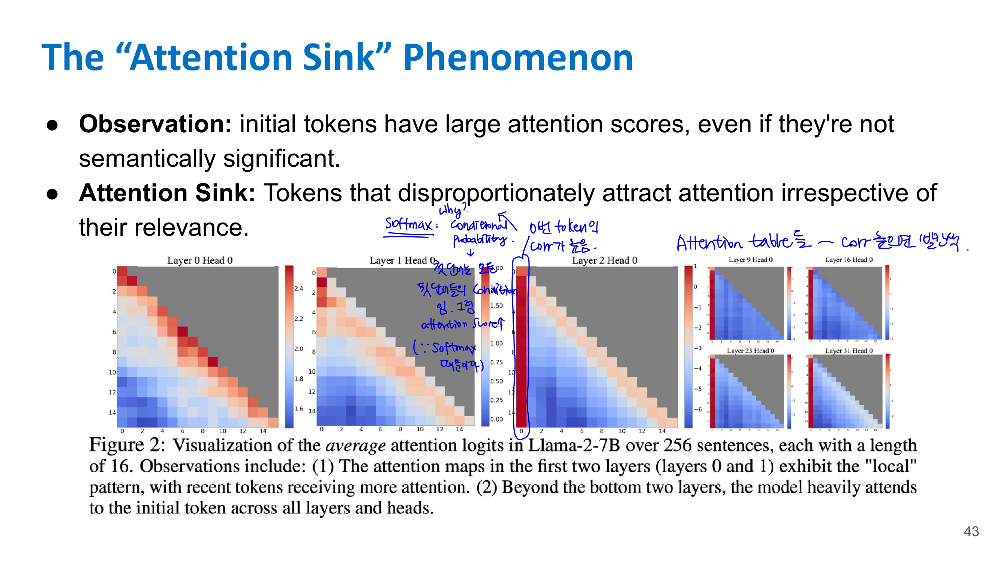

즉 초반 token들은 실제 의미상 중요하지 않더라도, attention distribution을 안정화하는 anchor처럼 작동할 수 있다.

### 14-10.3 StreamingLLM의 핵심

StreamingLLM은 두 종류의 KV cache를 유지한다.

1. attention sink token들의 KV
2. 최근 sliding window token들의 KV

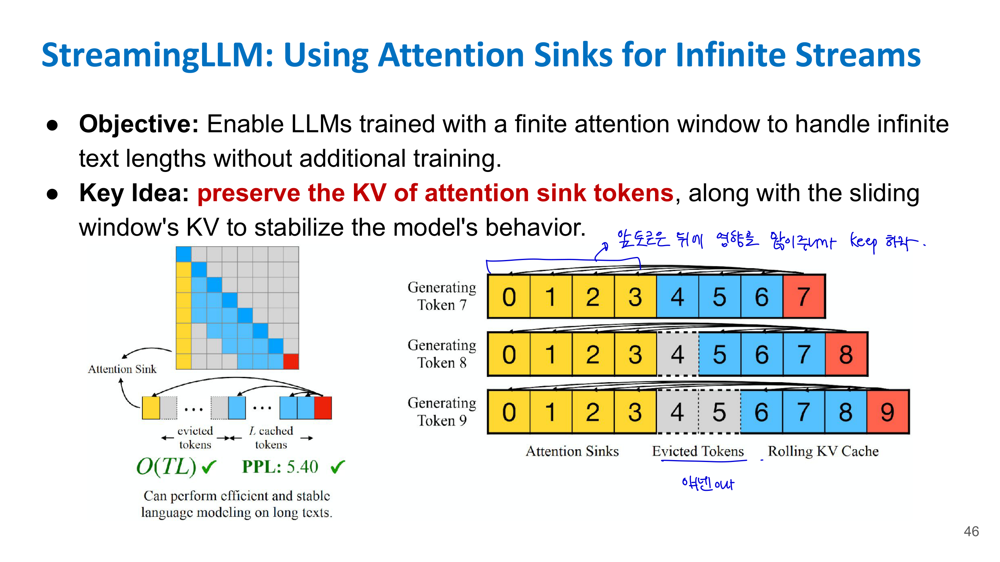

즉 오래된 모든 token을 저장하지는 않지만, 맨 앞쪽 몇 개 token은 계속 보존하고, 나머지는 최근 window만 유지한다.

슬라이드에서도 StreamingLLM의 목적은 finite attention window로 학습된 LLM이 추가 학습 없이 infinite text length를 처리하게 하는 것이고, 핵심 아이디어는 attention sink token의 KV와 sliding window의 KV를 함께 보존해 모델 behavior를 안정화하는 것이라고 설명한다. 

---

## 📌 14-11. 전체 기법 한 번에 비교

| 기법                    | 핵심 문제                         | 핵심 아이디어                                  | 주로 개선하는 것                       |
| --------------------- | ----------------------------- | ---------------------------------------- | ------------------------------- |
| KV Cache              | 이전 token K/V 반복 계산            | 이전 K/V 저장 후 재사용                          | decode 계산량 감소                   |
| Orca                  | request-level batching 비효율    | iteration마다 active batch 재구성             | throughput, GPU utilization     |
| vLLM / PagedAttention | KV cache fragmentation        | KV cache를 page/block 단위 관리               | memory efficiency, throughput   |
| Sarathi-Serve         | 긴 prefill이 decode 방해          | prefill을 chunk로 쪼개 decode와 interleave    | TBT variance, streaming latency |
| DistServe             | prefill/decode 특성 차이          | prefill worker와 decode worker 분리         | goodput, SLO 만족                 |
| Speculative Decoding  | token-by-token decode가 느림     | 작은 모델 draft + 큰 모델 parallel verify       | decode speed                    |
| FlashAttention        | attention matrix memory I/O 큼 | tiling + fusion으로 HBM traffic 감소         | attention latency, memory       |
| StreamingLLM          | infinite stream 처리 어려움        | attention sink KV + sliding window KV 유지 | long streaming stability        |

---

## 📌 14-12. 시험/과제 관점 핵심 포인트

### 14-꼭 알아야 하는 차이 1: Prefill vs Decode

Prefill은 prompt 전체를 병렬 처리하고 KV cache를 만든다. compute-bound 성격이 강하다.

Decode는 token을 하나씩 만들며, 이전 token들의 KV cache를 계속 읽는다. memory-bound 성격이 강하다.

이 차이 때문에 LLM serving에서는 단순히 GPU가 빠르다고 끝나는 게 아니라, scheduling과 memory management가 중요하다.

### 14-꼭 알아야 하는 차이 2: Throughput vs Goodput

Throughput은 많이 처리했는지를 본다.

Goodput은 latency SLO를 만족한 request만 본다.

LLM service에서는 사용자가 latency에 민감하기 때문에 goodput이 더 현실적인 성능 지표가 될 수 있다.

### 14-꼭 알아야 하는 차이 3: Orca vs vLLM

Orca는 scheduling 기법이다.

* request 단위가 아니라 iteration 단위로 batch를 구성한다.

vLLM은 memory management 기법이다.

* KV cache를 page/block 단위로 관리해서 fragmentation을 줄인다.

둘 다 LLM serving 효율을 높이지만, 해결하는 문제가 다르다.

### 14-꼭 알아야 하는 차이 4: Sarathi vs DistServe

Sarathi-Serve는 긴 prefill을 chunk로 쪼개 decode와 섞는다.

DistServe는 prefill과 decode를 아예 다른 resource pool로 분리한다.

즉 Sarathi는 “섞되 잘게 쪼개서 공정하게 섞자”에 가깝고, DistServe는 “성격이 다르니 분리해서 관리하자”에 가깝다.

### 14-꼭 알아야 하는 차이 5: FlashAttention vs PagedAttention

FlashAttention은 attention 계산 자체의 memory I/O를 줄이는 kernel-level optimization이다.

PagedAttention은 KV cache 저장/할당을 효율화하는 serving-level memory management다.

이름은 둘 다 Attention이지만, 다루는 레벨이 다르다.


<script type="text/x-mathjax-config">
  MathJax.Hub.Config({
    tex2jax: {
      inlineMath: [['$','$'], ['\\(','\\)']],
      processEscapes: true
    },
    "HTML-CSS": { linebreaks: { automatic: true } }
  });
</script>
<script type="text/javascript" src="https://cdnjs.cloudflare.com/ajax/libs/mathjax/2.7.7/MathJax.js?config=TeX-AMS-MML_HTMLorMML"></script>


