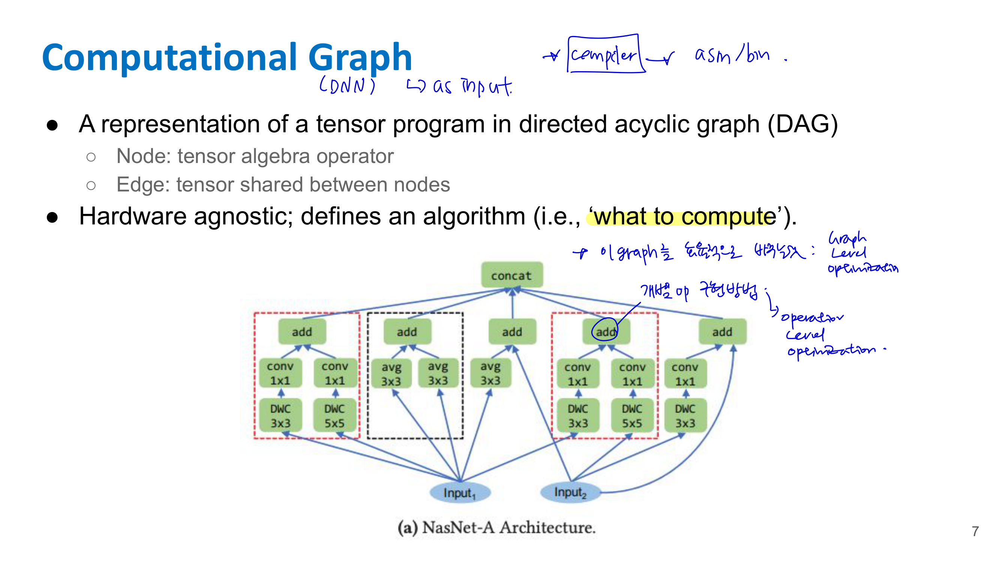
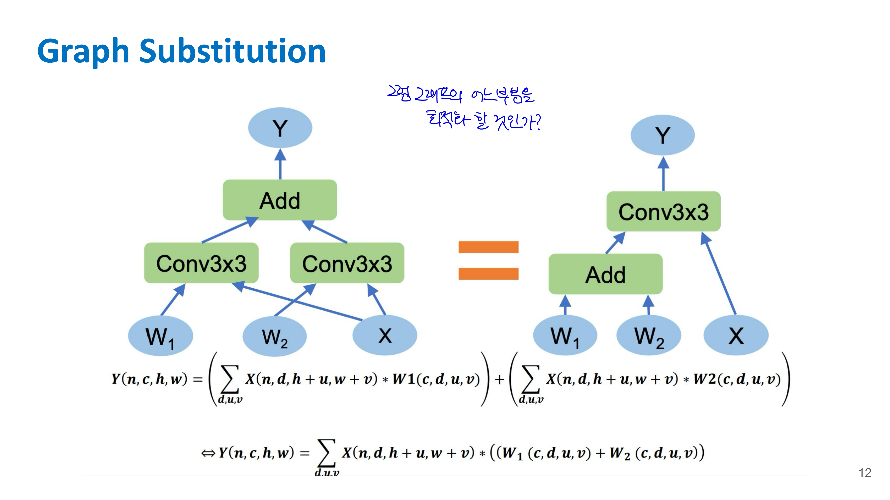
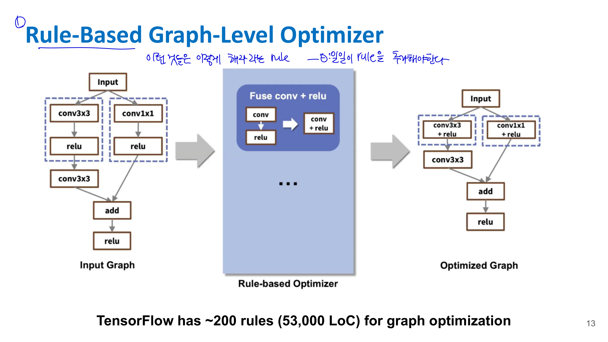
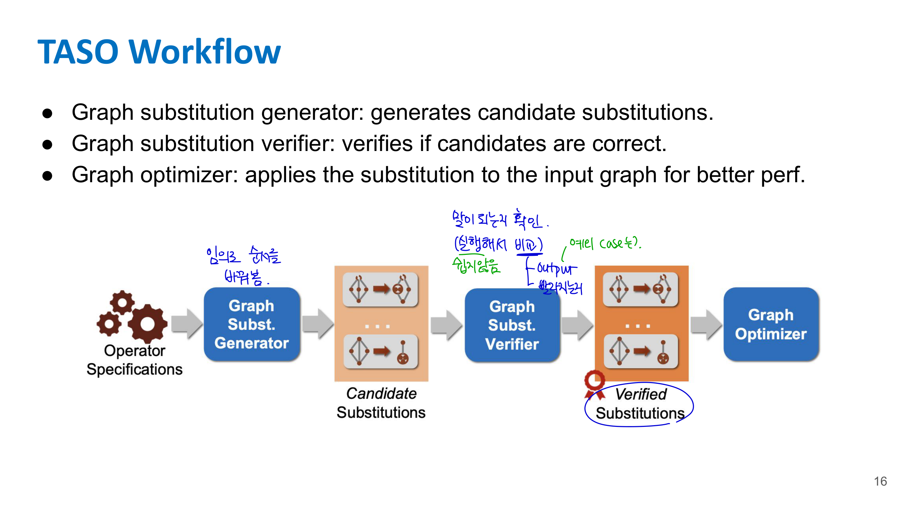
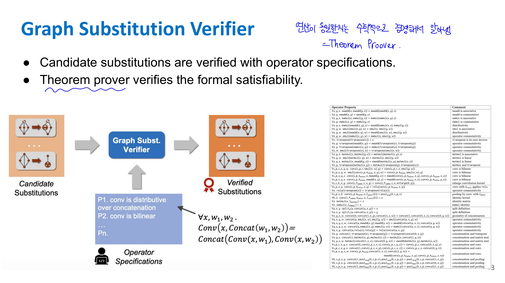
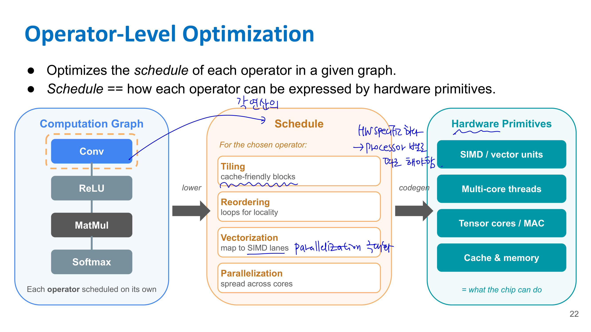
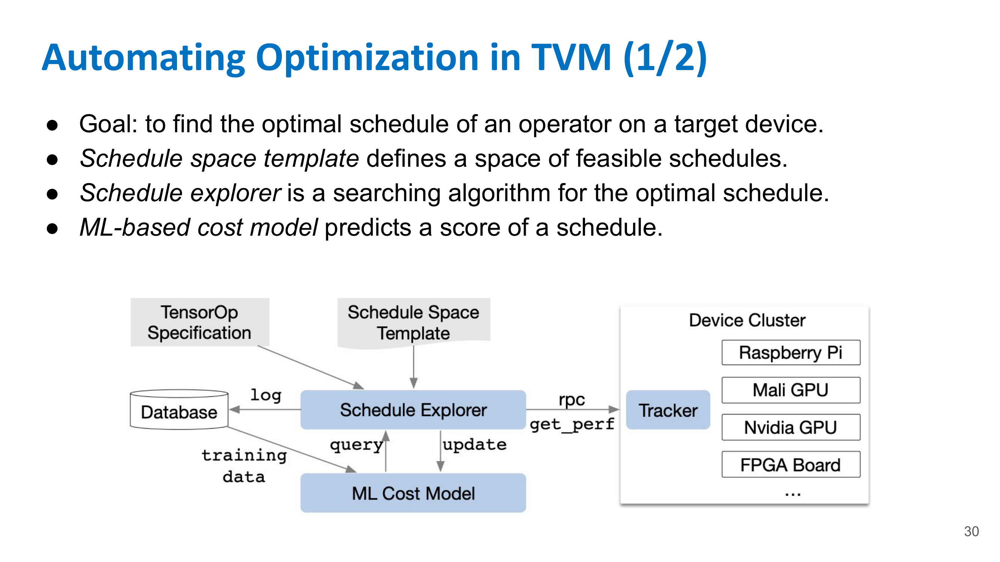

# 📚 15. Deep Learning Compilers

핵심은 **딥러닝 모델을 그냥 PyTorch/TensorFlow 코드 그대로 실행하는 게 아니라, 계산 그래프와 각 operator의 실행 방식을 컴파일러가 최적화해서 실제 하드웨어에서 더 빠르게 돌리게 한다**는 거야. 

## 📌 15.1. 왜 Deep Learning Compiler가 필요한가?

### 15.1.1 모델은 다양한 framework와 hardware에서 실행된다

현대 ML 시스템은 하나의 processor에서만 돌지 않는다.

예를 들어 모델은 다음과 같은 framework로 작성될 수 있다.

* TensorFlow
* PyTorch
* ONNX
* XLA
* TVM

그리고 실제 실행 hardware는 다음처럼 다양하다.

* CPU
* GPU
* NPU
* DSP
* mobile SoC
* edge accelerator

문제는 각 hardware가 잘하는 일이 다르다는 것이다. CPU는 control flow나 irregular operator에 강하고, GPU는 massive parallel matrix 연산에 강하고, NPU/DSP는 특정 tensor 연산에 최적화되어 있을 수 있다.

그래서 같은 모델이라도 hardware마다 최적 실행 방식이 다르다. 따라서 “모델을 어떻게 hardware-specific code로 바꿀 것인가”가 중요해진다.

---

## 📌 15.2. Compiler란 무엇인가?

일반적인 compiler는 **한 언어로 작성된 코드를 다른 언어 또는 실행 가능한 형태로 변환하는 프로그램**이다.

예를 들어 C/C++ 코드를 assembly 또는 machine code로 바꿔서 CPU가 실행할 수 있게 만든다.

일반 compiler 흐름은 대략 다음과 같다.

```text
Source Code
→ Intermediate Representation
→ Optimization
→ Machine Code / Executable
```

여기서 중요한 개념이 **IR**, 즉 Intermediate Representation이다.

IR은 source code와 target machine code 사이의 중간 표현이다. 컴파일러는 코드를 바로 hardware instruction으로 바꾸지 않고, 먼저 분석과 최적화가 쉬운 중간 형태로 바꾼다.

---

## 📌 15.3. Deep Learning Compiler란 무엇인가?

Deep Learning Compiler도 큰 틀에서는 compiler다. 다만 입력이 일반적인 C/Python 코드가 아니라 **tensor program** 또는 **computational graph**다.

대략적인 흐름은 다음과 같다.

```text
TensorFlow / PyTorch / ONNX model
→ DL compiler frontend
→ IR
→ Graph-level optimization
→ Operator-level optimization
→ Code generation
→ Runtime execution
```

여기서 DL compiler가 하는 일은 크게 두 가지로 나뉜다.

첫째, **graph-level optimization**이다.
모델 전체 계산 그래프를 보고 연산 순서나 그래프 구조를 바꾼다.

둘째, **operator-level optimization**이다.
Conv, MatMul, Softmax 같은 개별 operator를 hardware에서 어떻게 실행할지 최적화한다.

강의에서는 graph-level optimization의 예시로 **TASO**, operator-level optimization의 예시로 **TVM**을 다룬다. 

---

## 📌 15.4. Computational Graph

### 15.4.1 Computational graph란?

딥러닝 모델은 tensor 연산들의 연결로 표현할 수 있다. 이것을 **computational graph**라고 한다.



Computational graph는 DAG, 즉 directed acyclic graph로 표현된다.

* Node: tensor algebra operator
* Edge: tensor data flow
* Graph 전체: “무엇을 계산할 것인가”를 나타냄

예를 들어 다음과 같은 모델이 있다고 하자.

```text
Input → Conv → BatchNorm → ReLU → Conv → Add → ReLU
```

이것도 하나의 computational graph다.

Node는 `Conv`, `BatchNorm`, `ReLU`, `Add` 같은 연산이고, edge는 중간 tensor다.

### 15.4.2 Computational graph는 hardware-agnostic하다

Computational graph는 기본적으로 “무엇을 계산할지”만 나타낸다.

즉, 이 graph만 보면 GPU에서 실행할지, CPU에서 실행할지, NPU에서 실행할지는 아직 모른다.

예를 들어 `Conv2D`라는 node가 있다고 해도, 실제로 이걸 GPU에서 어떤 thread/block 구조로 돌릴지, memory tiling을 어떻게 할지, tensor core를 쓸지는 graph 자체에는 들어 있지 않다.

그래서 compiler는 다음 두 단계를 나눠 생각한다.

```text
Graph-level optimization: 무엇을 계산할지의 구조를 바꿈
Operator-level optimization: 각 연산을 어떻게 실행할지 정함
```

---

## 📌 15.5. Graph-Level Optimization

### 15.5.1 Graph-level optimization이란?

Graph-level optimization은 모델 전체 계산 그래프를 보고, **수학적으로 동일하지만 더 빠른 그래프**로 바꾸는 것이다.

예를 들어 다음과 같은 최적화가 가능하다.

```text
Conv → BatchNorm
```

을 하나의 Conv로 합칠 수 있다.

또는

```text
Conv → ReLU
```

를 하나의 fused operator로 바꿀 수 있다.

또는 ResNet block 안에서 연산 순서를 바꾸거나, 여러 conv를 합치거나, add/relu를 fuse할 수도 있다.

핵심은 **출력은 같게 유지하면서 latency 또는 memory movement를 줄이는 것**이다.

---

## 📌 15.6. Example: Conv2D와 BatchNorm Fusion

### 15.6.1 왜 Conv와 BatchNorm을 fuse할 수 있을까?

Conv layer는 보통 다음과 같다.

$$
Y = W * X + b
$$

BatchNorm은 inference 시점에서는 running mean과 running variance가 고정되어 있으므로 다음과 같은 affine transform이다.

$$
\text{BN}(Y) = \gamma \frac{Y - \mu}{\sqrt{\sigma^2 + \epsilon}} + \beta
$$

여기서 $\mu$, $\sigma^2$, $\gamma$, $\beta$는 inference 때 고정된 값이다.

따라서 Conv 결과 $Y$에 BN을 적용하면

$$
\text{BN}(W * X + b) = \gamma \frac{W * X + b - \mu}{\sqrt{\sigma^2 + \epsilon}} + \beta
$$

이 식은 다시 새로운 Conv처럼 쓸 수 있다.

새 weight는

$$
W' = \frac{\gamma}{\sqrt{\sigma^2 + \epsilon}} W
$$

새 bias는

$$
b' = \frac{\gamma}{\sqrt{\sigma^2 + \epsilon}}(b - \mu) + \beta
$$

그러면 원래

```text
Conv → BatchNorm
```

이었던 것을

```text
Conv'
```

하나로 바꿀 수 있다.

### 15.6.2 왜 빨라지는가?

원래는 Conv output tensor를 만들고, 그 tensor를 다시 읽어서 BatchNorm을 수행해야 한다.

```text
Conv output 저장
→ 다시 읽기
→ BatchNorm
→ 저장
```

하지만 fusion하면 중간 tensor를 저장하고 다시 읽는 과정이 사라진다.

```text
Conv' 한 번
```

즉, 연산 node 수가 줄고, memory traffic도 줄어든다.

Lecture 11에서 배운 것처럼 deep learning inference에서는 arithmetic 자체보다 memory movement가 큰 병목일 수 있다. 그래서 이런 fusion은 실제 latency를 줄이는 데 중요하다.

---

## 📌 15.7. Graph Substitution

### 15.7.1 Graph substitution이란?



Graph substitution은 graph의 일부 pattern을 다른 pattern으로 바꾸는 것이다.

예를 들어

```text
Conv → BatchNorm
```

을

```text
Conv'
```

로 바꾸는 것도 graph substitution이다.

또는

```text
MatMul → Add → ReLU
```

를

```text
FusedMatMulAddReLU
```

로 바꿀 수도 있다.

중요한 조건은 두 graph가 **semantic equivalence**, 즉 같은 입력에 대해 같은 출력을 내야 한다는 것이다.

### 15.7.2 Rule-based optimizer

초기 graph-level optimizer는 사람이 직접 rule을 만들었다.



예를 들면 다음과 같은 rule이다.

```text
Conv + BatchNorm can be fused into Conv
```

또는

```text
Add + ReLU can be fused
```

슬라이드에서는 TensorFlow가 graph optimization을 위해 약 200개의 rule, 약 53,000 LoC를 갖고 있다고 설명한다. 

이 방식의 문제는 사람이 일일이 rule을 작성해야 한다는 것이다.

---

## 📌 15.8. Rule-Based Optimization의 한계

Rule-based graph optimization에는 세 가지 한계가 있다.

### 15.8.1 Robustness 문제

전문가가 만든 heuristic이 모든 DNN과 모든 hardware에 잘 맞지는 않는다.

어떤 graph substitution은 V100 GPU에서는 빠를 수 있지만, K80 GPU에서는 느릴 수 있다. 실제로 강의 슬라이드의 ResNet graph optimization 예시에서도 최종 graph가 V100에서는 30% faster였지만 K80에서는 10% slower였다는 내용이 나온다. 즉, 최적화가 hardware-dependent하다. 

### 15.8.2 Scalability 문제

새로운 operator나 새로운 graph structure가 나오면 rule을 또 추가해야 한다.

요즘 모델은 CNN, Transformer, Diffusion, GNN 등 구조가 계속 다양해진다. 사람이 모든 경우의 rule을 손으로 관리하기 어렵다.

### 15.8.3 Performance 문제

사람이 만든 rule은 obvious한 최적화는 잘 잡지만, 특정 model/hardware에서만 유효한 subtle optimization은 놓칠 수 있다.

즉, “사람이 생각하기 쉬운 최적화”와 “실제로 hardware에서 가장 빠른 최적화”가 항상 같지 않다.

---

## 📌 15.9. TASO: Tensor Algebra SuperOptimizer

### 15.9.1 TASO의 핵심 아이디어

TASO는 graph-level optimization을 자동화하는 시스템이다.

기존 rule-based optimizer는 사람이 graph substitution rule을 직접 작성했다. TASO는 이를 자동으로 한다.

핵심 아이디어는 다음과 같다.

```text
수동 graph optimization rule 작성
→ 자동 graph substitution 생성
→ correctness verification
→ cost-based graph optimization
```

슬라이드에서는 TASO가 manually-designed graph optimization을 자동 생성 및 검증된 graph substitution으로 대체한다고 설명한다. 또한 TensorFlow의 수동 최적화가 53,000 LoC인 반면 TASO는 약 1,400 LoC로 더 적은 engineering effort를 요구하고, 기존 optimizer보다 최대 3배 성능 향상을 보이며, 모든 generated substitution을 formal verification한다고 설명한다. 

---

## 📌 15.10. TASO Workflow

TASO workflow는 세 단계다.

```text
Graph Substitution Generator
→ Graph Substitution Verifier
→ Graph Optimizer
```



⛔️ 세세하게 원리를 파악하진 않아도 되고, 그냥 이런 구조다 정도 이해하면 될듯

### 15.10.1 Graph Substitution Generator

Generator는 가능한 작은 graph들을 많이 만들어본다.

예를 들어 사용할 수 있는 operator가 다음과 같다고 하자.

```text
MatMul, Add, ReLU, Transpose, Conv
```

TASO는 고정된 크기 이하의 가능한 graph들을 enumerate한다.

그리고 random input tensor를 넣어 output fingerprint를 계산한다.

두 graph가 같은 fingerprint를 내면, 이 둘은 같은 계산을 하는 후보일 수 있다.

즉,

```text
Graph A(input) ≈ Graph B(input)
```

이면

```text
Graph A ↔ Graph B
```

를 substitution candidate로 둔다.

하지만 random input에서 같다고 해서 항상 같은 함수라는 보장은 없다. 그래서 다음 단계에서 verification이 필요하다.

### 15.10.2 Graph Substitution Verifier

Verifier는 candidate substitution이 정말로 수학적으로 맞는지 검증한다.



즉, 단순히 몇 개 random input에서 결과가 같다는 수준이 아니라, operator specification을 이용해 formal하게 correctness를 확인한다.

슬라이드에서는 theorem prover를 사용해 candidate substitution의 formal satisfiability를 검증한다고 설명한다. 

핵심은 다음이다.

```text
Generator: 이거 같은 것 같은데?
Verifier: 진짜 모든 입력에 대해 같은지 증명하자
```

### 15.10.3 Graph Optimizer

검증된 substitution rule들이 있으면, 이제 실제 DNN graph에 적용해야 한다.

그런데 가능한 substitution이 많으면 어떤 것을 적용해야 가장 빠를지 선택해야 한다.

TASO는 cost model을 사용한다.

Cost model은 각 operator의 hardware cost를 측정하고, graph 전체 cost를 개별 operator cost의 합으로 추정한다.

그 후 cost-based backtracking search를 통해 더 낮은 cost의 graph를 찾는다.

---

## 📌 15.11. TASO 정리

TASO는 다음을 해결한다.

| 기존 rule-based optimizer 문제 | TASO의 해결                            |
| -------------------------- | ----------------------------------- |
| 사람이 rule을 직접 만들어야 함        | substitution 자동 생성                  |
| rule correctness가 복잡함      | theorem prover로 formal verification |
| hardware마다 최적 graph가 다름    | hardware cost model 기반 선택           |
| subtle optimization을 놓침    | 가능한 작은 graph substitution을 자동 탐색    |

즉 TASO는 **graph-level superoptimizer**다.
여기서 superoptimizer라는 말은 “사람이 정한 몇 개 rule만 쓰는 것이 아니라, 가능한 equivalent graph들을 탐색해서 더 빠른 graph를 찾는다”는 의미로 보면 된다.

---

## 📌 15.12. Operator-Level Optimization

### 15.12.1 Graph-level optimization과 operator-level optimization의 차이

Graph-level optimization은 graph 구조를 바꾼다.

예를 들어

```text
Conv → BatchNorm → ReLU
```

를

```text
FusedConvBNReLU
```

로 바꾸는 것이다.

반면 operator-level optimization은 개별 operator 자체를 hardware에서 어떻게 실행할지를 정한다.



예를 들어 `Conv2D` 하나를 실행할 때도 선택할 것이 많다.

* loop 순서를 어떻게 할지
* tile size를 어떻게 할지
* vectorization을 할지
* parallelization을 어떻게 할지
* tensor core를 쓸지
* cache를 어떻게 활용할지
* memory layout을 어떻게 할지

슬라이드에서는 operator-level optimization을 “given graph의 각 operator schedule을 최적화하는 것”이라고 설명하고, schedule은 각 operator가 hardware primitive로 어떻게 표현되는지를 뜻한다고 정리한다. 

---

## 📌 15.13. Schedule이란?

### 15.13.1 Schedule의 의미

Schedule은 “무엇을 계산할지”가 아니라 “어떻게 계산할지”다.

🔎 아래는 참고만 하기

<div style="margin-left: 20px;">

예를 들어 matrix multiplication은 수학적으로 다음과 같다.

$$
C_{ij} = \sum_k A_{ik}B_{kj}
$$

이 계산 자체는 algorithm이다.

하지만 실제 구현은 다양하다.

#### ☑️.단순 구현

```python
for i in range(M):
    for j in range(N):
        for k in range(K):
            C[i][j] += A[i][k] * B[k][j]
```

#### ☑️ loop order 변경

```python
for i in range(M):
    for k in range(K):
        for j in range(N):
            C[i][j] += A[i][k] * B[k][j]
```

#### ☑️ tiling 적용

```python
for ii in range(0, M, tile_m):
    for jj in range(0, N, tile_n):
        for kk in range(0, K, tile_k):
            compute_tile(...)
```

수학적으로는 같은 $C = AB$지만, cache locality와 parallelism이 달라서 속도가 크게 달라진다.

이런 “실행 방식”이 schedule이다.

### Schedule 방식들:

**Tiling**

Tiling은 큰 tensor computation을 작은 block으로 나누는 것이다.

예를 들어 matrix multiplication에서 전체 matrix를 한 번에 처리하지 않고, 작은 tile을 cache나 shared memory에 올려 재사용한다.

이렇게 하면 DRAM 접근을 줄이고 cache locality를 높일 수 있다.

Lecture 11에서 배운 temporal locality, spatial locality와 연결된다.

**Reordering**

Loop reordering은 loop 순서를 바꿔 memory access pattern을 개선하는 것이다.

예를 들어 row-major memory layout에서는 연속된 column 방향 접근보다 row 방향 접근이 더 cache-friendly할 수 있다.

같은 연산이라도 loop 순서를 어떻게 잡느냐에 따라 cache miss가 크게 달라진다.

**Vectorization**

Vectorization은 SIMD lane을 활용해 여러 element를 한 instruction으로 처리하는 것이다.

예를 들어 CPU에서 scalar 연산을 하나씩 하는 대신, AVX 같은 SIMD instruction으로 여러 float를 동시에 계산할 수 있다.

**Parallelization**

Parallelization은 여러 core/thread에 일을 분산하는 것이다.

GPU에서는 thread block, warp, thread 단위로 mapping하고, CPU에서는 multi-core thread scheduling을 사용한다.

즉 operator-level optimization은 단순히 “연산 수를 줄이는 것”이 아니라, hardware의 실행 primitive에 맞춰 코드를 바꾸는 일이다.

</div>

---

## 📌 15.15. TVM: End-to-End Optimizing Compiler for DL

### 15.15.1 TVM이 하는 일

TVM(Tensor Virutal Machine) 은 

> PyTorch / TensorFlow 모델을 받아서 “이 모델을 CPU, GPU, NPU에서 어떻게 돌리면 제일 빠를까?”를 고민한 뒤 하드웨어에 맞는 빠른 실행 코드로 바꿔주는 도구

---

## 📌 15.16. TVM Lowering Pipeline

### 15.16.1 Front-end

Front-end는 PyTorch, TensorFlow 같은 framework의 모델을 TVM의 high-level IR로 변환한다.

예를 들어 PyTorch 모델이 이런 구조라고 하자.

```text
Input → Conv → ReLU → Conv → Add
```

TVM은 이걸 자기 내부에서 다루기 좋은 계산 그래프로 바꾼다.

### 15.16.2 Middle-end

Middle-end에서는 TVM Relay IR을 더 low-level한 TIR로 낮춘다.

TIR은 tensor computation의 loop, buffer, memory access 등을 더 명시적으로 표현한다.

예를 들어 elementwise multiplication도 TIR에서는 다음과 같은 loop 형태로 표현될 수 있다.

```python
for i in range(m):
    for j in range(n):
        C[i, j] = A[i, j] * B[i, j]
```

이 단계에서 자동 (Schedule) 최적화가 수행된다.
- oop 순서를 어떻게 할까?
- tile 크기를 얼마로 할까?
- GPU thread에 어떻게 나눠줄까?
- cache/shared memory를 어떻게 쓸까?
- tensor core를 쓸 수 있을까?

### 15.16.3 Back-end

Back-end는 최종 executable code를 생성한다.

Target이 CPU면 LLVM code를 만들 수 있고, GPU면 CUDA 또는 GPU kernel code를 만들 수 있다.

---

## 📌 15.17. TVM에서 자동 최적화



### 15.17.1 목표

TVM의 자동 최적화 목표는 target device에서 operator의 optimal schedule을 찾는 것이다.

예를 들어 Conv2D 하나에도 가능한 schedule이 매우 많다.

* tile size를 $8 \times 8$로 할지, $16 \times 16$으로 할지
* loop order를 어떻게 할지
* vectorize할지
* unroll할지
* parallel thread 개수를 어떻게 둘지

이 조합은 매우 크기 때문에 사람이 일일이 고르기 어렵다.

### 15.17.2 Schedule space template

Schedule space template은 가능한 schedule들의 공간을 정의한다.

예를 들어 Conv2D에 대해

```text
tile_h ∈ {4, 8, 16}
tile_w ∈ {4, 8, 16}
unroll ∈ {true, false}
vectorize ∈ {true, false}
```

같은 식으로 가능한 후보 공간을 만든다.

### 15.17.3 Schedule explorer

Schedule explorer는 이 schedule space에서 좋은 schedule을 찾는 search algorithm이다.

단순하게는 random search도 가능하고, 더 똑똑하게는 cost model을 이용해 성능이 좋아 보이는 schedule을 우선 탐색할 수 있다.

### 15.17.4 ML-based cost model

각 schedule을 실제 hardware에서 모두 실행해보면 시간이 너무 오래 걸린다.

그래서 TVM은 schedule의 feature를 추출하고, ML-based cost model로 성능 점수를 예측한다.

슬라이드에서는 XGBoost, TreeRNN 같은 다양한 cost model과 search algorithm을 사용할 수 있다고 설명한다. 

정리하면 TVM 자동 최적화는 다음 흐름이다.

```text
Schedule 후보 생성
→ schedule feature 추출
→ ML cost model로 성능 예측
→ promising schedule 측정
→ cost model 업데이트
→ 최적 schedule 선택
```

이 구조는 NAS나 HPO와도 비슷하다. 다만 여기서는 neural architecture가 아니라 **operator schedule**을 탐색한다는 점이 다르다.

---

## 📌 15.18. TVM Tuning Result

같은 Conv2D라도 target hardware가 ARM CPU인지, NVIDIA GPU인지, mobile NPU인지에 따라 최적 schedule이 다르다.

그래서 TVM은 hardware-specific tuning이 중요하다.

---

## 📌 15.19. PyTorch Compiler

### 15.19.1 PyTorch는 원래 eager execution framework였다

PyTorch는 원래 eager execution 중심이었다.

Eager execution은 코드를 한 줄 실행하면 바로 그 연산이 실행되는 방식이다.

Eager mode에서는 `x + 1`을 이미 실행해서 intermediate tensor `y`를 만들고, 그 다음 `relu`를 실행한다. 이러면 중간 tensor memory traffic이 발생한다.

### 15.19.2 PyTorch 2.x의 torch.compile

PyTorch 2.x에서는 `torch.compile`이 도입되었다.

이제 PyTorch는 eager framework이면서도, 내부적으로 compiler stack을 통해 Python-level tensor program을 optimized kernel로 낮출 수 있다.

사용자는 대략 이렇게 쓸 수 있다.

```python
compiled_model = torch.compile(model)
```

그러면 PyTorch가 모델 실행을 추적하고, graph를 만들고, 최적화하고, 더 빠른 kernel로 실행한다.

즉 이제는 “PyTorch code를 그대로 한 줄씩 실행”하는 것뿐만 아니라, PyTorch code를 분석해서 더 좋은 실행 계획으로 바꿀 수 있다.

---

## 📌 15.21. OpenAI Triton

Triton은 GPU programming을 위한 Python-like programming language다.

CUDA를 직접 쓰지 않아도 GPU kernel을 작성할 수 있게 해준다.

슬라이드에서는 Triton을 Python-like GPU programming language라고 설명하고, single-threaded program에 대한 automatic parallelization과 autotuning도 가능하다고 정리한다. 

---

## 📌 15.23. Lecture 15 핵심 개념 비교

### 15.23.1 Graph-level vs Operator-level

| 구분     | Graph-level optimization           | Operator-level optimization            |
| ------ | ---------------------------------- | -------------------------------------- |
| 보는 단위  | 모델 전체 graph                        | 개별 operator                            |
| 질문     | 어떤 graph 구조가 더 빠른가?                | 이 operator를 hardware에서 어떻게 돌릴까?        |
| 예시     | Conv+BN fusion, graph substitution | tiling, loop reorder, vectorization    |
| 대표 시스템 | TASO                               | TVM                                    |
| 핵심 병목  | 불필요한 node, intermediate tensor     | cache miss, parallelism, memory layout |

### 15.23.2 TASO vs TVM

| 구분      | TASO                                   | TVM                                 |
| ------- | -------------------------------------- | ----------------------------------- |
| 최적화 레벨  | Graph-level                            | Operator-level 중심                   |
| 핵심 아이디어 | equivalent graph substitution 자동 생성/검증 | target hardware에 맞는 schedule 탐색     |
| 사용하는 모델 | cost model로 graph cost 추정              | ML-based cost model로 schedule 성능 예측 |
| 목표      | 같은 계산을 더 빠른 graph로 변환                  | 같은 operator를 더 빠른 kernel로 구현        |

### 15.23.3 PyTorch Compiler와 TVM의 관계

PyTorch compiler는 PyTorch ecosystem 안에서 모델을 compile하는 방향이고, TVM은 framework-agnostic하게 여러 frontend와 hardware target을 지원하는 end-to-end optimizing compiler로 볼 수 있다.

둘 다 최종 목표는 같다.

```text
사용자가 작성한 high-level tensor program
→ hardware에서 빠르게 실행되는 low-level code
```

---

## 📌 15.24. 전체 흐름을 하나로 연결하면

딥러닝 모델이 있다고 하자.

```python
model = MyModel()
```

사용자는 이 모델을 PyTorch로 작성한다.

그런데 실제로 이 모델이 GPU에서 실행될 때는 단순히 Python 코드 그대로 돌면 비효율적일 수 있다.

그래서 compiler는 먼저 모델을 graph로 본다.

```text
Input → Conv → BN → ReLU → Conv → Add → ReLU
```

Graph-level optimizer는 이걸 바꾼다.

```text
Input → FusedConvBNReLU → Conv → FusedAddReLU
```

그 다음 operator-level optimizer는 각 fused operator를 hardware에 맞게 낮춘다.

```text
FusedConvBNReLU
→ tiling
→ vectorization
→ tensorization
→ parallelization
→ GPU kernel
```

마지막으로 runtime에서 이 kernel을 실행한다.

즉 Deep Learning Compiler는 다음 두 질문에 답한다.

```text
1. 계산 그래프 자체를 어떻게 바꾸면 더 빠를까?
2. 각 연산을 실제 hardware에서 어떻게 실행하면 더 빠를까?
```

---

## 📌 15.25. 시험/과제 관점에서 꼭 기억할 것

### 15.25.1 Deep Learning Compiler의 정의

Deep Learning Compiler는 PyTorch/TensorFlow/ONNX 같은 high-level model representation을 받아서, graph-level optimization과 operator-level optimization을 거쳐 target hardware에서 빠르게 실행되는 code로 바꾸는 시스템이다.

### 15.25.2 Computational graph

Computational graph는 tensor program의 DAG 표현이다.

* node: operator
* edge: tensor
* hardware-agnostic
* “what to compute”를 정의함

### 15.25.3 Graph-level optimization

Graph-level optimization은 같은 출력을 유지하면서 graph 구조를 바꾸는 것이다.

대표 예시는 Conv + BatchNorm fusion이다.

### 15.25.4 Rule-based optimization의 한계

Rule-based optimizer는 사람이 직접 rule을 작성해야 하므로 다음 문제가 있다.

* robustness 부족
* scalability 부족
* subtle optimization 놓침

### 15.25.5 TASO

TASO는 Tensor Algebra SuperOptimizer다.

핵심 workflow는 다음과 같다.

```text
candidate substitution 생성
→ correctness verification
→ cost-based graph optimization
```

TASO는 graph substitution을 자동 생성하고 formal verification을 통해 correctness를 확인한다.

### 15.25.6 Operator-level optimization

Operator-level optimization은 개별 operator의 schedule을 최적화하는 것이다.

Schedule은 “어떻게 계산할지”를 의미한다.

예시:

* tiling
* loop reordering
* vectorization
* parallelization
* tensorization

### 15.25.7 TVM

TVM은 end-to-end optimizing compiler for deep learning이다.

흐름은 다음과 같다.

```text
Framework model
→ Relay IR
→ TIR
→ schedule optimization
→ code generation
```

TVM은 schedule space를 탐색하고, ML-based cost model을 사용해 좋은 schedule을 찾는다.

### 15.25.8 PyTorch Compiler

PyTorch는 원래 eager execution framework였지만, PyTorch 2.x부터 `torch.compile`을 통해 compiler stack을 제공한다.

즉 Python-level tensor program을 optimized kernel로 낮춘다.

### 15.25.9 Triton

Triton은 Python-like GPU programming language다.

효율적인 PyTorch operator가 없을 때 custom GPU kernel을 작성하는 데 유용하고, FlashAttention-like kernel도 구현할 수 있다.

---

## 📌 15.26. 한 줄 요약

Lecture 15는 **딥러닝 모델을 빠르게 실행하기 위해 computational graph를 최적화하는 TASO, 개별 operator schedule을 hardware에 맞게 최적화하는 TVM, 그리고 PyTorch 2.x의 compiler stack과 Triton custom kernel까지 다루는 강의**다. 핵심은 “모델 구조만 줄이는 것이 아니라, 같은 모델도 compiler가 graph와 kernel을 어떻게 바꾸느냐에 따라 실제 latency가 크게 달라진다”는 것이다.


<script type="text/x-mathjax-config">
  MathJax.Hub.Config({
    tex2jax: {
      inlineMath: [['$','$'], ['\\(','\\)']],
      processEscapes: true
    },
    "HTML-CSS": { linebreaks: { automatic: true } }
  });
</script>
<script type="text/javascript" src="https://cdnjs.cloudflare.com/ajax/libs/mathjax/2.7.7/MathJax.js?config=TeX-AMS-MML_HTMLorMML"></script>


